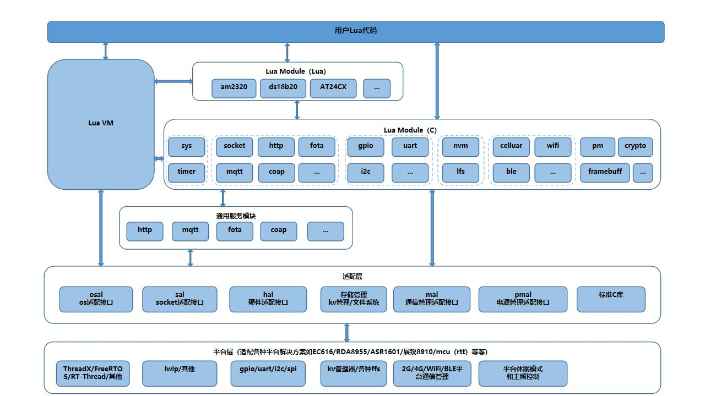

<p align="center"><a href="#" target="_blank" rel="noopener noreferrer"></a></p>

[](https://gitee.com/openLuat/LuatOS/stargazers)
[](https://gitee.com/openLuat/LuatOS/members)
[](/LICENSE)

[](https://nightly.link/openLuat/LuatOS/workflows/air101/master)
[](https://nightly.link/openLuat/LuatOS/workflows/air105/master)
[](https://nightly.link/openLuat/LuatOS/workflows/esp32-idf5/master)
[](https://nightly.link/openLuat/LuatOS/workflows/win32/master)
[](https://nightly.link/openLuat/LuatOS/workflows/linux/master)


LuatOS-SoC是一款实时操作系统,用户编写Lua代码就可完成各种功能, 仅需极少的内存和Flash空间

1. 基于Lua 5.3.x脚本编程,无需编译,把Lua文本文件下载到设备即可完成开发
2. 低内存需求, 最低32kb ram, 96kb flash空间
3. 硬件抽象层兼容M3/armv7/risc-v/win32/posix等等,具有强大的扩展性
4. 可测试,可模拟,可裁剪,可扩展, 提供高效的开发效率
5. 基于合宙深耕的Lua-Task编程模型,实现异步/同步无缝切换

----------------------------------------------------------------------------------

## 代码示例节选

做一个灯神(点亮并闪烁一个LED灯)

```lua
local sys = require("sys")

-- 把GPIO19设置为输出模式,上拉,初始电平为低电平(0代表低电平,1代表高电平)
local netled = gpio.setup(19, 0, gpio.PULLUP)

sys.taskInit(function() --(LuaTask的task模式,对应协程)
    while 1 do
        netled(1) -- 输出高电平
        sys.wait(500) -- 等待500ms(LuaTask异步休眠)
        netled(0) -- 输出低电平
        sys.wait(500) -- 等待500ms(LuaTask异步休眠)
    end
end)

-- 主循环, 必须加
sys.run()
```

## 如何使用LuatOS-SoC

1. 首先, 购买开发板([Air101](https://luat.taobao.com/))
2. 然后, 下载[固件包](https://gitee.com/openLuat/LuatOS/releases),按压缩包里的文档进行刷机
3. 开始愉快地玩耍(或者放着积灰...)

**QQ群: 1061642968** 

 

----------------------------------------------------------------------------------
## 资源

* [Air101资料汇总](https://luatos.com/t/air101) 合宙Air101, 4mm*4mm的MCU
* [Air103资料汇总](https://luatos.com/t/air103) 合宙Air103, 6mm*6mm的MCU
* [LuatOS-SoC官网](https://www.luatos.com/) 官网及IoT平台
* [wiki](https://wiki.luatos.com) 知识库,有你想要的文档
* [Lua API文档](https://wiki.luatos.com)) LuatOS的Lua API文档
* [预编译固件](https://github.com/openLuat/LuatOS/releases) 固件,示例,文档,都会一起发布
* [Lua 5.3中文手册](https://www.runoob.com/manual/lua53doc/) 官方手册的中文版
* [合宙官网](http://www.openluat.com) 一家有理想的物联网公司
* [合宙商城](http://mall.m.openluat.com) 合宙官方商城(微信)
* [合宙商城](http://luat.taobao.com) 合宙官方商城(淘宝)
* [联盛德W600/合宙Air640W专属说明](bsp/air640w/README.md) wifi模块,便宜,耐操
* [合宙Air302专属说明](bsp/air302/README.md) NB-IOT模块,二次开发的首选
* [如何编译-Wifi固件](bsp/air640w/userdoc/how_to_build.md) 自行编译wifi模块
* [如何编译-NBIOT固件](bsp/air302/userdoc/build_from_sdk.md) 自行编译nbiot模块
* [收发16进制数据](http://doc.openluat.com/article/583/0) 二进制数据随意收发
* [luat训练营直播回放汇总贴子(第一期)](https://yajs666.gitee.io/2021/02/03/luat%E8%AE%AD%E7%BB%83%E8%90%A5/)
* [Kicad封装库](https://gitee.com/openLuat/kicad-symbols-libraries)

----------------------------------------------------------------------------------

## 使用到的开源项目

* [lua](https://www.lua.org/) Lua官网
* [rt-thread](https://github.com/RT-Thread/rt-thread) 国产rtos, 非常好用
* [rtt-ds18b20](https://github.com/willianchanlovegithub/ds18b20) 在RT-Thread环境下读取ds18b20
* [LuaTask](https://github.com/openLuat/Luat_2G_RDA_8955) 合宙LuaTask
* [iRTU](https://github.com/hotdll/iRTU) 基于Luat的DTU, 稀饭大神
* [airkissOpen](https://github.com/heyuanjie87/airkissOpen) 参考其实现思路
* [minmea](https://github.com/kosma/minmea) 解析nmea
* [u8g2_wqy](https://github.com/larryli/u8g2_wqy) u8g2的中文字体
* [printf](https://github.com/mpaland/printf) A printf / sprintf Implementation for Embedded Systems
* [YMODEM for Python](https://github.com/alexwoo1900/ymodem) YMODEM 用于下载脚本
* [elua](http://www.eluaproject.net/) eLua 虽然已经停更多年,但精神犹在
* [FlashDB](https://gitee.com/Armink/FlashDB) 一款支持 KV 数据和时序数据的超轻量级数据库
* [cJSON](https://github.com/DaveGamble/cJSON) Ultralightweight JSON parser in ANSI C
* [coremark](https://github.com/eembc/coremark) MCU性能测试(跑分)

## 免费服务

* [NetLab https://netlab.luatos.com/](https://netlab.luatos.com/) 支持普通TCP/UDP/加密TCP, 透传调试,公网IP, HEX值收发, Tab式多客户端
* [DevLog udp://devlog.luatos.com:9072](#) 设备日志记录,格式兼容errDump.lua 查看日志请登录LuatOS官网
* [JT808服务 tcp://jt808.luatos.com:8868](#) JT808-2013协议, 查看轨迹请登录LuatOS官网
* [SoC固件云编译](https://www.luatos.com) 使用ERP账号(手机号)登录,默认密码888888

## 更多项目

* [iRTU](https://gitee.com/hotdll/iRTU) 开源DTU/RTU解决方案
* [Luat_Lua_Air724U](https://gitee.com/openLuat/Luat_Lua_Air724U) 市面上最畅销的4G Cat.1模块的Luat固件
* [llcom](https://github.com/chenxuuu/llcom) 可运行lua脚本的高自由度串口调试工具
* [irtu-gps](https://gitee.com/wendal/irtu-gps) 基于iRTU项目,实现GPS数据的接收和展示
* [luatos-boards](https://gitee.com/openLuat/luatos-broads) LuatOS系列开发板和扩展板
* [LuatOS系列小程序](https://gitee.com/openLuat/luatos-miniapps)


## 总体架构



## 授权协议

[MIT License](LICENSE)
