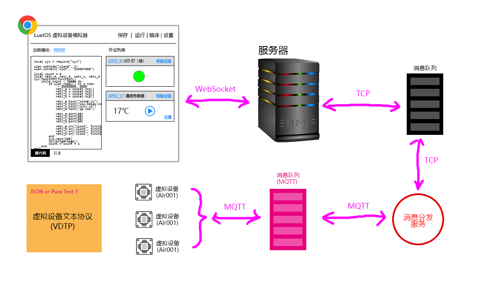
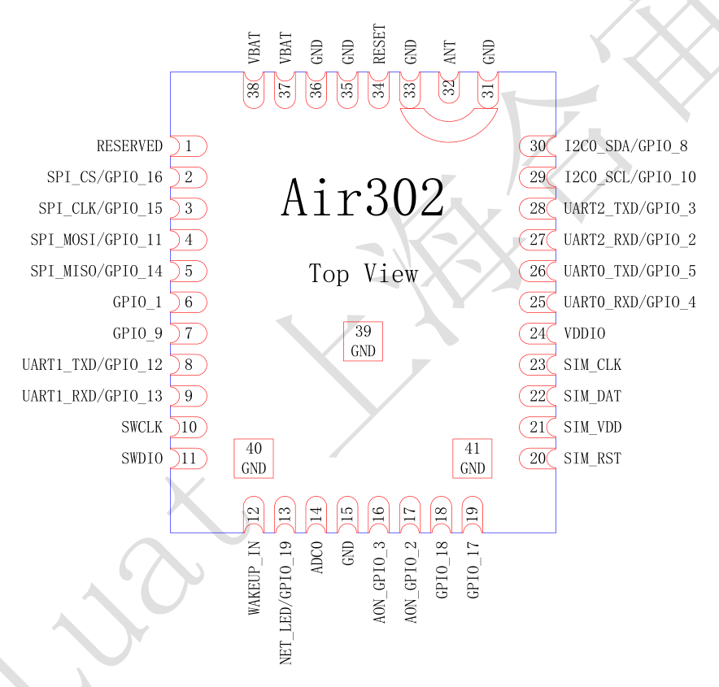

# 虚拟设备文本协议概述



通过本协议，虚拟设备与虚拟外设可以互相传送如下信息：

1. 虚拟设备的系统设置，包括：
   - 芯片类型
   - 各个管脚设置
   - Lua 源文件
2. 每个管脚的输入输出信息
3. 日志输出流
4. 开关机或者重启指令

通过本协议，希望达到如下效果：

1. 提供一个 B/S 架构虚拟设备运行系统
2. 在图形界面上直接输入 Lua 脚本，并可运行
3. 可以直接查看日志
4. 图形界面提供常用外设，譬如三色灯，温度传感器的模拟, 并可与虚拟设备协同工作
5. 如果在本系统运行正常的脚本，可直接烧录在对应硬件上，并正常工作
6. 本系统提供编译打包命令，可以直接将 Lua 脚本制作成 `bin` 文件让用户下载

# 逻辑结构

```bash
# 一个设备，两个管道（主题）
/vdev/$id/input     # 向虚拟模块输入（模块端订阅）
/vdev/$id/output    # 从虚拟模块流出（外设端订阅）
```

## 系统定义



```bash
# 本消息的管道模式
#  0 - 从虚拟模块输出(output)
#  1 - 向虚拟模块输入(input)
mode : 1
# 本消息的内容类型
#  0 - 系统定义
#  1 - 输入输出
#  2 - 日志
type : 1
#---------------------------------------------
# 设备实例唯一 ID
id: "a4d..aq",
#---------------------------------------------
# 模块型号
mcu: "Air302"
#---------------------------------------------
# 管脚设置
# GPIO: 输入|输出|中断|防抖中断
# SPI_XXX: 开/关
pins: [{
  type        : [RESERVED],
  index       : 1
}, {
  type        : [SPI_CS, GPIO],  # 管脚的电气特性
  number      : [1, 16],         # 管脚的电气编号
  index       : 2,               # 管脚的下标(1base)
  state       : 0,     # 不同的 type 理解不同，譬如GPIO的（中断/输入输出）三种状态
  value       : 0      # 寄存器值
}, {
  type        : [SPI_CLK, GPIO],
  number      : [1, 16],
  index       : 3,
  state       : 0,
  value       : 0
}]
```

## 输入输出

```bash
# 本消息的管道模式
#  0 - OUTUT : 从虚拟模块输出
#  1 - INPUT : 向虚拟模块输入
mode : 1
# 本消息的内容类型
#  0 - sys : 系统定义
#  1 - pin : 输入输出
#  2 - log : 日志
type : 1
#---------------------------------------------
# 设备实例唯一 ID
id: "a4d..aq"
#---------------------------------------------
# 各个管脚的值，其中对于 value 段，有下面的约定：
#  - 数字脚： 0 或者 1
#  - 模拟脚:  0 ~ 1 的浮点数
# !只有输出是，数组长度才有可能超过1
# !输入时，只有第一个数字是有效的
pins : [{
  type        : GPIO,            # 管脚的电气特性
  number      : 1,               # 管脚的电气编号
  index       : 2,               # 管脚的下标(1base)
  value       : [12,23,45,0]     # 寄存器值
}]
```


## 日志

```bash
# 本消息的管道模式
#  0 - 从虚拟模块输出(output)
#  1 - 向虚拟模块输入(input)
mode : 1
# 本消息的内容类型
#  0 - 系统定义
#  1 - 输入输出
#  2 - 日志
type : 2
#---------------------------------------------
# 设备实例唯一 ID
id: "a4d..aq"
# 日志级别
# 0 - ERROR
# 1 - WARN
# 2 - INFO
# 3 - DEBUG
leval: 2
# 日志内容
text: "xxxxx"
```

# 封装结构

## 纯文本封装结构

```bash
# 文本结构，采用 # 作为注释行
# 空行也是要被无视的
#---------------------------------------
# 首行（非注释和空白的第一行）
#  @$mode:$type:$id
#  @(INPUT|OUTPUT):[sys|pin|log]:4d..aq
@INPUT:pin:4d..aq
#---------------------------------------
# 系统定义 (type==0)
@MCU=Air302
# 多行文本，其中每行的结构为：
# ${pin.index}:${pin.type}_${pin.number}(${pin.state}):${pin.value}
# 即，值部分是半角逗号分隔的数字列表
@PINS:
2:GPIO_1(0):0,1,0,1,0
# 遇到流结尾或者第一个注释行，表示结束
#---------------------------------------
# 输入输出 (type==1)
# 多行文本，其中每行的结构为：
# ${pin.index}:${pin.type}_${pin.number}:${pin.value}
# 即，值部分是半角逗号分隔的数字列表
@PINS:
2:GPIO_1:0,1,0,1,0
# 遇到流结尾或者第一个注释行，表示结束
#---------------------------------------
# 日志(type==2)
@DEBUG:
xxxxxxxxxxxxx
# 遇到流结尾或者第一个注释行，表示结束
```

## JSON 封装结构

```bash
# 这个就不解释了，和逻辑结构一致即可
```

## MCU模拟单元封装结构

虚拟设备管理程序会从消息队列里分析出指令，并形成一个配置文件。
这个配置文件必须非常好被`C`解析，虚拟模块作为一个服务器系统进程启动后，
会加载这个配置文件，以便了解自己的模拟行为细节。

```js
/* 这个等 @Wendal 填充 */
```