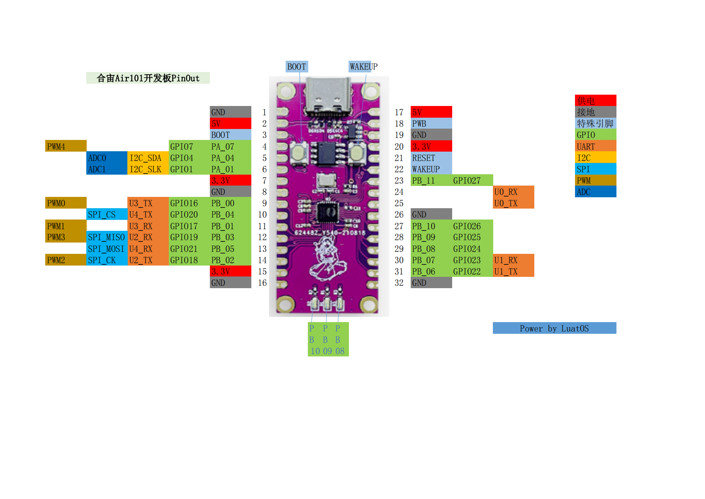

# Air101@LuatOS

## Air101是什么?

合宙Air101是一款QFN32 封装，4mm x 4mm 大小的mcu

## LuatOS为它提供哪些功能

* 基于Lua 5.3.6, 提供95%的原生库支持
* 适配LuaTask,提供极为友好的`sys.lua`
* 文件系统大小112kb,格式littlefs 2.1
* `gpio` GPIO管脚控制功能(映射表后面有提供)
* `uart` 串口输入输出功能,支持uart0(芯片日志/调试/刷机)/uart1~4(用户可用)
* `i2c` iic总线master功能,并自带多种温湿度传感器驱动
* `disp` 基于i2c的显示屏支持,例如SSD1306
* `eink` 支持多款墨水屏
* `lcd` 支持多款彩色SPI屏
* `lvgl` 支持全部LVGL原生组件和动画效果,并内嵌中文字体
* `zbuff` 像C语言一样操作内存字节数组,高效可靠
* `json` lua对象与json字符串的双向转换
* `log` 简洁的日志功能
* `wdt` 硬件看门狗,安全保护
* `pwm` 多个PWM输出管脚,存在复用关系
* `adc` 2个adc通道外部电平检测,一个内部温度检测
* `sensor` 单总线驱动,默认支持DS18B20
* `pm` 功耗管理,可进入低功耗模式并定时唤醒
* `hwtimer` 硬件定时器(开发中)
* `rtc` 实时时钟(开发中)

LuatOS大QQ群: 1061642968

## 管脚映射表

| GPIO编号 | 命名 | 默认功能及扩展功能       |
| -------- | ---- | ---------------------- |
| 0        | PA0  | BOOT                   |
| 1        | PA1  | I2C_SCL/ADC0           |
| 4        | PA4  | I2C_SDA/ADC1           |
| 7        | PA7  | GPIO/PWM4              |
| 16       | PB0  | GPIO/PWM0/UART3_TX     |
| 17       | PB1  | GPIO/PWM1/UART3_RX     |
| 18       | PB2  | SPI_SCK/PWM2/UART2_TX  |
| 19       | PB3  | SPI_MISO/PWM3/UART2_RX |
| 20       | PB4  | SPI_CS/UART4_TX        |
| 21       | PB5  | SPI_MOSI/UART4_RX      |
| 22       | PB6  | UART1_TX               |
| 23       | PB7  | UART1_RX               |
| 24       | PB8  | GPIO                   |
| 25       | PB9  | GPIO                   |
| 26       | PB10 | GPIO                   |
| 27       | PB11 | GPIO                   |
| 35       | PB19 | UART0_TX               |
| 36       | PB20 | UART0_RX               |

开机时仅配置了`BOOT`和`UART0_TX/RX`, 其他数字脚均为GPIO脚, 状态为输入高阻.

### ADC

| ADC编号（LuatOS） | 功能         |
| ----------------- | ------------ |
| 0                 | 模块ADC0-PA1 |
| 1                 | 模块ADC1-PA4 |
| 3                 | CPU温度(*可能变更)|

## 刷机工具

使用Luatools下载, 版本 2.1.28 以上, 越新越好

## 模块购买

手机访问: m.openluat.com

## 开发板PinOut

