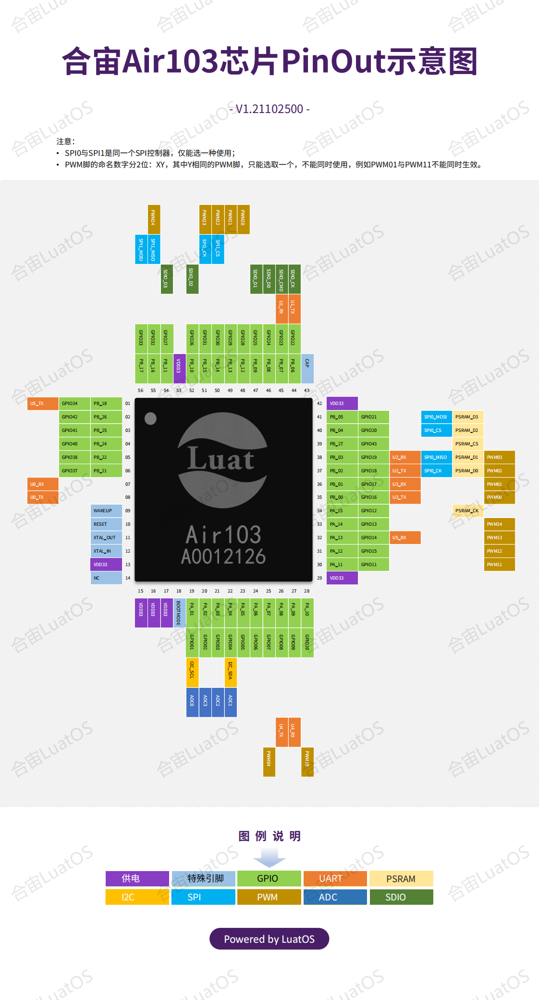

# Air103@LuatOS

## Air103是什么?

合宙Air103是一款QFN56 封装，6mm x 6mm 大小的mcu, 与Air101内核一样, Flash减半.

## LuatOS为它提供哪些功能

* 基于Lua 5.3.6, 提供95%的原生库支持
* 适配LuaTask,提供极为友好的`sys.lua`
* 文件系统大小112kb,格式littlefs 2.1,将来会扩大.
* Flash 总大小1M

LuatOS大QQ群: 1061642968

## 管脚映射表

请查阅硬件设计手机

开机时仅配置了`BOOT`和`UART0_TX/RX`, 其他数字脚均为GPIO脚, 状态为输入高阻.

## 刷机工具

使用Luatools下载, 版本 2.1.35 以上, 越新越好

## 模块购买

手机访问: mall.m.openluat.com

## 芯片PinOut

