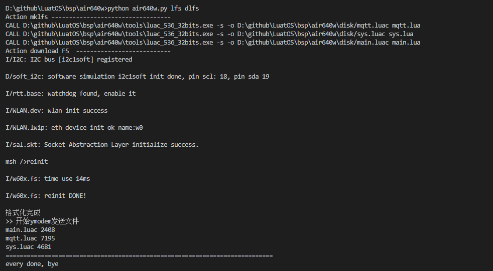

# Air640W刷机

当前的刷机流程分2部分, 刷底层和刷脚本

请把固件压缩包解压到一个目录, 不要中文目录, 不要有特殊字符, 不要有空格

## 刷底层

1. 在win7以上的系统, 双击打开`tools/LuatOS_Air640W_刷底层.exe` 
2. 选好FLS底层固件
3. 选好串口COM
4. 点击下载后
5. 短按模块上的复位键
6. 等待刷机完成

刷机完成后, 要手动复位设备, 才能正常使用

## 刷脚本

### 安装python支持

1. 安装python 3.7+ 可以到 https://gitee.com/openLuat/LuatOS/attach_files 下载, 安装是请选中"Add to PATH"
2. 进入命令行, 执行 `pip3 install -i https://pypi.tuna.tsinghua.edu.cn/simple pyserial`

### 开始刷脚本

1. 修改local.ini里面的COM_PORT,对应开发板的COM号
2. 命令行下, 进入固件压缩包解压后的目录, 执行 `python air640w.py lfs dlfs`
3. 等待片刻, 将打包user和lib目录下的文件, 编译后, 通过ymodem协议发送到设备去

