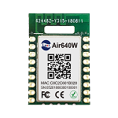

# W600@LuatOS

## W600是什么?

联盛德W600的一款Wifi模块, 代表产品是合宙Air640W

* [W600芯片信息](http://www.winnermicro.com/html/1/156/158/497.html)
* [合宙Air640W产品页面](http://www.openluat.com/Product/wifi/Air640W.html)

## LuatOS为它提供哪些功能

* 160kb的系统内存, 可用内存约70kb
* 64kb的Lua专属内存,可用内存约40kb
* 文件系统大小32kb
* 基于Lua 5.3.5, 提供95%的原生库支持
* 适配LuaTask,提供极为友好的`sys.lua`
* `gpio`库提供GPIO管脚控制功能(映射表后面有提供)
* `uart`库提供串口输入输出功能,支持uart0(调试/刷机), uart1(用户可用)
* `i2c`库提供iic总线master功能, 管脚编号18/19,对应PB13/PB14
* `disp`库提供基于i2c的显示屏支持,当前支持SSD1306
* `sensor`库提供传感器相关支持,当前支持ds18b20的读取
* `wlan`库提供与wifi相关的支持,支持`airkiss`配网
* `json`库,提供lua对象与json字符串的双向转换
* `socket`库,提供异步Socket接口,用于与服务器的通信
* `log`库提供简洁的日志功能

## 管脚映射表

管脚编号对应w600芯片的管脚编号, 也对应`gpio`库所使用的pin值

管脚编号|命名|默认功能|
-------|----|-------|
13     |PA_00| BOOT |
14     |PA_01| GPIO |
15     |PA_04| UART0_TX |
17     |PA_05| UATT0_RX |
18     |PB_13| I2C_SCL |
19     |PB_14| I2C_SDA |
20     |PB_15| GPIO |
21     |PB_16| GPIO |
22     |PB_17| GPIO |
23     |PB_18| GPIO |
26     |PB_06| GPIO |
27     |PB_07| GPIO |
28     |PB_08| GPIO |
29     |PB_09| GPIO |
30     |PB_10| GPIO |
31     |PB_11| UART1_RX |
32     |PB_12| UART1_TX |

除`BOOT`和`UART0_TX/RX`外, 其他脚均可作为IO脚使用.

## 刷机工具

请加QQ群(1061642968)获取

固件下载: [下载](https://github.com/openLuat/LuatOS/releases)

## 模块购买

1. 飞思创 https://item.taobao.com/item.htm?id=587923556178
