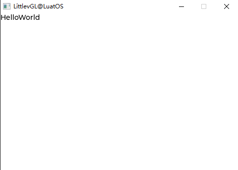
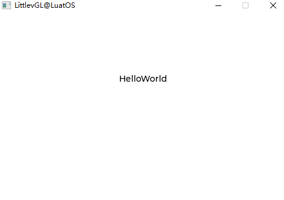
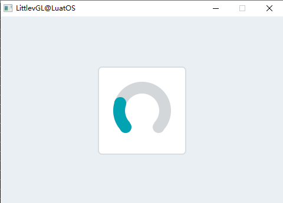
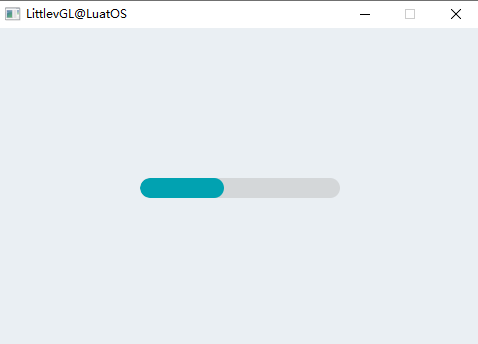
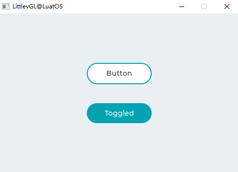

# LVGL for LuatOS 手册

[toc]

# 简介

## 为何是LVGL

LVGL是一个开源的图形库，它提供了创建嵌入式GUI所需的一切，具有易于使用的图形元素、漂亮的视觉效果和低内存占用。

**LVGL特点：**

- 强大的[构建基块](https://docs.lvgl.io/master/widgets/index.html)：按钮、图表、列表、滑块、图像等
- 高级图形引擎：动画、抗锯齿、不透明、平滑滚动、混合模式等
- 支持[各种输入设备](https://docs.lvgl.io/master/overview/indev.html)：触摸屏、鼠标、键盘、编码器、按钮等
- 支持[多个显示器](https://docs.lvgl.io/master/overview/display.html)
- 硬件独立，可与任何微控制器和显示器一起使用
- 可扩展，可在小内存下操作（64 kB 闪存，16 kB RAM）
- 具有 UTF-8 处理、CJK、双向和阿拉伯语脚本支持的多语言支持
- 通过类似[CSS样式的](https://docs.lvgl.io/master/overview/style.html)完全可自定义的图形元素
- 支持操作系统、外部内存和 GPU，但不是必需的
- 即使单[帧缓冲区](https://docs.lvgl.io/master/porting/display.html)也具有平滑渲染
- 用 C 书写，与C++兼容
- 无需嵌入式硬件即可在 PC 上开发[模拟器](https://docs.lvgl.io/master/get-started/pc-simulator.html)
- 100+ 简单[示例](https://github.com/lvgl/lvgl/tree/master/examples)
- 在线和 PDF 中[的文件](http://docs.lvgl.io/)和 API 参考

LVGL官方支持C语言和MicroPython两种语言开发，LuatOS-Soc使用7.11版本的LVGL源码为基础制作了lua版本的LVGL，使您在使用LuatOS-Soc为您带来快速开发体验的同事，也能快速，高效的开发出漂亮的图形界面。

## 设备要求

基本上，大部分控制器（需要能够驱动显示屏）都适合运行 LVGL。最低要求是：

|  | 最小                         | 推荐     |
| :--: | :--------------------------: | :------: |
| 架构: | 16、32或64位微控制器或处理器           ||
| 时钟频率: | \> 16 MHz                    | > 48 MHz |
| Flash/ROM: | > 64 kB                      | \> 180 kB |
| RAM: | \> 16 kB | \> 48 kB |
| 显示缓冲区: | \> 1 ×水平分辨率像素 | \> 1/10屏幕辨率像素 |
| 编译器: | C99 或更新           ||

***注意：内存使用情况可能会因架构、编译器和构建选项有所差异。***

## 寻求帮助

在使用LVGL中如遇到问题可在[Issues](https://gitee.com/openLuat/LuatOS/issues)，[合宙社区](https://doc.openluat.com/home)以及[LVGL官方论坛](https://forum.lvgl.io/)上进行提问，也可进行bug反馈或向我们提建议，我们会及时做出回复。

# LVGL基础

## 写个HelloWorld

程序员学习语言的第一堂课就是HelloWorld，这里也使用显示HelloWorld的示例程序来让您直观的感受到它的方便：

```lua
lvgl.init(480,320)--lvgl初始化
local label = lvgl.label_create(nil, nil)--创建标签label
lvgl.label_set_text(label, "HelloWorld")--设置标签内容
lvgl.scr_load(label)--加载标签
```

运行效果：




是不是很简单？并且和c很像对吧？下面我们就说一下LuatOS版本的LVGL接口与C版本的区别

## LuatOS版本的LVGL接口

lua版本的lvgl已经做了大部分接口，并会不断地完善后续接口，总体来说，只要将原接口开头的LV_替换成lvgl.即可，但也有特例，比如不支持init方式创建组件，使用create来创建，还有字体设置以及lvgl符号等也有一些区别

## 常用概念


## 布局

lvgl布局要有图层概念，这就引入了父对象子对象以及前后台概念

## 事件模型

LVGL中可使用事件来进行进行交互。

## 样式

*样式*用于设置对象的外观。

# LVGL组件

## 速览

## 基础对象

lvgl首先要有对象(obj)的概念，也叫组件(WIDGETS)，即按钮，标签，图像，列表，图表或文本区域等等，他们有统一的基本属性:

- Position (位置)
- Size (尺寸)
- Parent (父母)
- Drag enable (拖动启用)
- Click enable (单击启用)
- position (位置)
- ...

我们可以通过`lvgl.obj_set_xxx`设置对象的xxx属性，通过`lvgl.obj_get_xxx`来获取xxx属性

下面我们通过代码直观的理解,以刚才的HelloWorld为例，我们在上面添加`lvgl.obj_set_pos`来设置位置，`lvgl.obj_set_size`来设置大小，`lvgl.obj_set_size`来设置大小，`lvgl.obj_set_click`来设置是否可以点击：

```lua
local label = lvgl.label_create(nil, nil)
lvgl.label_set_text(label, "HelloWorld")
lvgl.obj_set_pos(label, 200, 100);
lvgl.obj_set_size(label, 480, 172);
lvgl.obj_set_click(label, false);
lvgl.scr_load(label)
```

运行效果：



在面向对象的思想中，可以做到继承，这样可以减少代码重复。


## 圆弧

### 概述

弧由背景弧和前景弧组成。两者都可以具有起始角度和终止角度以及厚度。

### 零件和样式

弧的主要部分称为 `lvgl.ARC_PART_MAIN` 。它使用典型的背景样式属性绘制背景，并使用线型属性绘制圆弧。圆弧的大小和位置将遵守填充样式的属性。

`lvgl.ARC_PART_INDIC` 是虚拟零件，它使用线型属性绘制另一个弧。它的填充值是相对于背景弧线解释的。指示器圆弧的半径将根据最大填充值进行修改。

`lvgl.ARC_PART_KNOB` 是虚拟零件，它绘制在弧形指示器的末端。它使用所有背景属性和填充值。使用零填充时，旋钮的大小与指示器的宽度相同。较大的填充使其较大，较小的填充使其较小。

### 用法

#### 角度

要设置背景角度，请使用 `lvgl.arc_set_bg_angles(arc, start_angle, end_angle)` 函数或 `lvgl.arc_set_bg_start/end_angle(arc, start_angle)` 。零度位于对象的右中间(3点钟)，并且度沿顺时针方向增加。角度应在[0; 360]范围内。

同样， `lvgl.arc_set_angles(arc, start_angle, end_angle)` 函数或 `lvgl.arc_set_start/end_angle(arc, start_angle)` 函数设置指示器弧的角度。

#### 回转

可以使用 `lvgl.arc_set_rotation(arc, deg)` 添加到0度位置的偏移量。

#### 范围和值

除了手动设置角度外，弧还可以具有范围和值。要设置范围，请使用 `lvgl.arc_set_range(arc, min, max)` ，并设置一个值，请使用 `lvgl.arc_set_value(arc, value)` 。使用范围和值，指示器的角度将在背景角度之间映射。

**注意**，设置角度和值是独立的。应该使用值和角度设置。两者混合可能会导致意外的效果。

#### 类型

弧可以具有不同的“类型”。它们用 `lvgl.arc_set_type` 设置。存在以下类型：

- `lvgl.ARC_TYPE_NORMAL` 指示器弧顺时针绘制（最小电流）
- `lvgl.ARC_TYPE_REVERSE` 指示器弧沿逆时针方向绘制（最大电流）
- `lvgl.ARC_TYPE_SYMMETRIC` 从中间点绘制到当前值的指示弧。

### 事件

除 [通用事件]() 外，弧还发送以下特殊事件：

- `lvgl.EVENT_VALUE_CHANGED` 在按下/拖动弧以设置新值时发送。

了解有关 [事件]() 的更多信息。

### 按键

对象类型不处理任何输入按键。

进一步了解 [按键]() 。

### 范例

#### 简单弧



上述效果的示例代码：

```lua
    local arc = lvgl.arc_create(lvgl.scr_act(), nil)
    lvgl.arc_set_end_angle(arc, 200)
    lvgl.obj_set_size(arc, 150, 150)
    lvgl.obj_align(arc, nil, lvgl.ALIGN_CENTER, 0, 0)
```

### 相关API

#### 函数

```lua
lvgl.arc_create( par，copy)
功能：创建弧对象
返回：指向创建的弧的指针
形参:
par：指向对象的指针，它将是新弧的父对象
copy：指向弧对象的指针，如果不为NULL，则将从其复制新对象

lvgl.arc_set_start_angle( arc，start)
功能：设置圆弧的起始角度。0度：右，90底等。
形参:
arc：指向弧对象的指针
start：起始角度

lvgl.arc_set_end_angle( arc，end ）
功能：设置圆弧的起始角度。0度：右，90底等。
形参:
arc：指向弧对象的指针
end：结束角度

lvgl.arc_set_angles( arc，start，end)
功能：设置开始和结束角度
形参:
arc：指向弧对象的指针
start：起始角度
end：结束角度

lvgl.arc_set_bg_start_angle( arc，start)
功能：设置弧形背景的起始角度。0度：右，90底等。
形参:
arc：指向弧对象的指针
start：起始角度

lvgl.arc_set_bg_end_angle( arc，end)
功能：设置弧形背景的起始角度。0度：右，90底等。
形参:
arc：指向弧对象的指针
end：结束角度

lvgl.arc_set_bg_angles( arc，start，end)
功能：设置弧形背景的开始和结束角度
形参:
arc：指向弧对象的指针
start：起始角度
end：结束角度

lvgl.arc_set_rotation( arc，rotation_angle)
功能：设置整个圆弧的旋转
形参:
arc：指向弧对象的指针
rotation_angle：旋转角度

lvgl.arc_set_type( arc，type)
功能：设置圆弧的类型。
形参:
arc：指向弧对象的指针
type：圆弧型

lvgl.arc_set_value( arc，value)
功能：在圆弧上设置一个新值
形参:
arc：指向弧对象的指针
value：新价值

lvgl.arc_set_range(arc，min，max)
功能：设置圆弧的最小值和最大值
形参:
arc：指向弧对象的指针
min：最小值
max：最大值

lvgl.arc_set_chg_rate(arc，threshold)
功能：设置圆弧旋钮增量位置的阈值。
形参
arc：指向弧对象的指针
threshold：增量阈值

lvgl.arc_set_adjustable(arc，adjustable)
功能：设置圆弧是否可调。
形参:
arc：指向弧对象的指针
adjustable：圆弧是否具有可以拖动的旋钮

lvgl.arc_get_angle_start(arc)
功能：获取圆弧的起始角度。
返回:起始角度[0..360]
形参:
arc：指向弧对象的指针

lvgl.arc_get_angle_end(arc)
功能：获取圆弧的末端角度。
返回:端角[0..360]
形参:
arc：指向弧对象的指针

lvgl.arc_get_bg_angle_start(arc)
功能：获取弧形背景的起始角度。
返回:起始角度[0..360]
形参:
arc：指向弧对象的指针

lvgl.arc_get_bg_angle_end(arc)
功能：获取弧形背景的终止角度。
返回:端角[0..360]
形参:
arc：指向弧对象的指针

lvgl.arc_type_t lv_arc_get_type(arc)
功能：获取圆弧是否为类型。
返回:弧形类型
形参:
arc：指向弧对象的指针

lvgl.arc_get_value(arc)
功能：获取圆弧的值
返回：弧的值
形参
arc：指向弧对象的指针

lvgl.arc_get_min_value(arc)
功能：获得圆弧的最小值
返回：圆弧的最小值
形参:
arc：指向弧对象的指针

lvgl.arc_get_max_value(arc)
功能：获取圆弧的最大值
返回：弧的最大值
形参:
arc：指向弧对象的指针

lvgl.arc_is_dragged(arc)
功能：给出弧线是否被拖动
返回:true：拖动进行中,false：未拖动
形参:
arc：指向弧对象的指针

lvgl.arc_get_adjustable(arc)
功能：获取圆弧是否可调。
返回:圆弧是否具有可以拖动的旋钮
形参:
arc：指向弧对象的指针
```


## 进度条

### 概述

条对象上有一个背景和一个指示器。指示器的宽度根据条的当前值进行设置。

如果对象的宽度小于其高度，则可以创建垂直条。

不仅可以结束，还可以设置条的起始值，从而改变指示器的起始位置。

### 零件和样式

进度条的主要部分称为 `lvgl.BAR_PART_BG` ，它使用典型的背景样式属性。

`lvgl.BAR_PART_INDIC` 是一个虚拟部件，还使用了所有典型的背景属性。默认情况下，指示器的最大尺寸与背景的尺寸相同，但是在其中设置正的填充值 `lvgl.BAR_PART_BG` 将使指示器变小。（负值会使它变大）如果在指标上使用了值样式属性，则将根据指标的当前大小来计算对齐方式。例如，中心对齐的值始终显示在指示器的中间，而不管其当前大小如何。

### 用法

#### 值和范围

可以通过 `lvgl.bar_set_value(bar, new_value, lvgl.ANIM_ON/OFF)` 设置新值。该值以一个范围（最小值和最大值）解释，可以使用 `lvgl.bar_set_range(bar, min, max)` 进行修改。默认范围是 1..100。

`lvgl.bar_set_value` 中的新值可以根据最后一个参数 `(lvgl.ANIM_ON/OFF)` 设置是否带有动画。动画的时间可以通过 `lvgl.bar_set_anim_time(bar, 100)` 进行调整。时间以毫秒为单位。

也可以使用 `lvgl.bar_set_start_value(bar, new_value, lvgl.ANIM_ON/OFF)` 设置进度条的起始值

#### 模式

如果已通过 `lvgl.bar_set_type(bar, lvgl.BAR_TYPE_SYMMETRICAL)` 启用，则条形可以对称地绘制为零（从零开始，从左至右绘制）。

### 事件

仅 [通用事件]() 是按对象类型发送的。

了解有关`事件`_ 的更多信息。

### 按键

对象类型不处理任何输入按键。

进一步了解 [按键]() 。

### 范例

#### 简单的进度条

*进度条简单演示*



上述效果的示例代码：

```lua
    local bar1 = lvgl.bar_create(lvgl.scr_act(), nil);
    lvgl.obj_set_size(bar1, 200, 20);
    lvgl.obj_align(bar1, nil, lvgl.ALIGN_CENTER, 0, 0);
    lvgl.bar_set_anim_time(bar1, 2000);
    lvgl.bar_set_value(bar1, 100, lvgl.ANIM_ON);
```


## 按钮

### 概述

按钮是简单的矩形对象。它们源自容器，因此也可以提供布局和配合。此外，可以启用它以在单击时自动进入检查状态。

### 零件和样式

这些按钮仅具有一种主要样式，称为 `lvgl.BTN_PART_MAIN` ，并且可以使用以下组中的所有属性：

- 背景(background)
- 边界(border)
- 边框(outline)
- 阴影(shadow)
- 数值(value)
- 模式(pattern)
- 过渡(transitions)

启用布局或适合时，它还将使用padding属性。

### 用法

为了简化按钮的使用，可以使用 `lvgl.btn_get_state(btn)` 来获取按钮的状态。它返回以下值之一：

- **lvgl.BTN_STATE_RELEASED** 松开
- **lvgl.BTN_STATE_PRESSED** 被点击
- **lvgl.BTN_STATE_CHECKED_RELEASED** 点击后松开
- **lvgl.BTN_STATE_CHECKED_PRESSED** 重复点击
- **lvgl.BTN_STATE_DISABLED** 禁用
- **lvgl.BTN_STATE_CHECKED_DISABLED**

使用 `lvgl.btn_set_state(btn, lvgl.BTN_STATE_...)` 可以手动更改按钮状态。

如果需要状态的更精确描述（例如，重点突出），则可以使用常规 `lvgl.obj_get_state(btn)` 。

### 可检查

可以使用 `lvgl.btn_set_checkable(btn, true)` 将按钮配置为切换按钮。在这种情况下，单击时，按钮将自动进入 `lvgl.STATE_CHECKED` 状态，或再次单击时返回到lvgl.STATE_CHECKED状态。

### 布局和适配

与容器类似，按钮也具有布局和适合属性。

- `lvgl.btn_set_layout(btn, lvgl.LAYOUT_...)` 设置布局。默认值为 `lvgl.LAYOUT_CENTER` 。因此，如果添加标签，则标签将自动与中间对齐，并且无法通过 `lvgl.obj_set_pos()` 移动。您可以使用 `lvgl.btn_set_layout(btn, lvgl.LAYOUT_OFF)` 禁用布局。
- `lvgl.btn_set_fit/fit2/fit4(btn, lvgl.FIT_..)` 允许根据子代，父代和适合类型自动设置按钮的宽度和/或高度。

### 事件

除了 [通用事件](http://lvgl.100ask.net/documentation/03_overview/03_events.html#id2) 外，按钮还发送以下特殊事件：

- **lvgl.EVENT_VALUE_CHANGED**-切换按钮时发送。

了解有关 [事件](http://lvgl.100ask.net/documentation/03_overview/03_events.html) 的更多信息。

### 按键

以下按键由按钮处理：

- **lvgl.KEY_RIGHT/UP**-如果启用了切换，则进入切换状态。
- **lvgl.KEY_LEFT/DOWN**-如果启用了切换，则进入非切换状态。

请注意， `lvgl.KEY_ENTER` 的状态已转换为 `lvgl.EVENT_PRESSED/PRESSING/RELEASED` 等。

进一步了解 [按键](http://lvgl.100ask.net/documentation/03_overview/05_indev.html) 。

### 范例

#### 简单的按钮

*创建两个简单的按钮*



上述效果的示例代码：

```lua
    local function event_handler(obj, event)
            if(event == lvgl.EVENT_CLICKED) then
                    print("Clicked\n");
            elseif(event == lvgl.EVENT_VALUE_CHANGED) then
                    print("Toggled\n");
            end
    end
    
    local label
    local btn1 = lvgl.btn_create(lvgl.scr_act(), nil)
    lvgl.obj_set_event_cb(btn1, event_handler)
    lvgl.obj_align(btn1, nil, lvgl.ALIGN_CENTER, 0, -40)

    label = lvgl.label_create(btn1, nil)
    lvgl.label_set_text(label, "Button")

    local btn2 = lvgl.btn_create(lvgl.scr_act(), nil)
    lvgl.obj_set_event_cb(btn2, event_handler)
    lvgl.obj_align(btn2, nil, lvgl.ALIGN_CENTER, 0, 40)
    lvgl.btn_set_checkable(btn2, true)
    lvgl.btn_toggle(btn2)
    lvgl.btn_set_fit2(btn2, lvgl.FIT_NONE, lvgl.FIT_TIGHT)

    label = lvgl.label_create(btn2, nil)
    lvgl.label_set_text(label, "Toggled")
```


## 按钮矩阵


## 日历

## 画布

## 复选框

## 图表

## 容器

## 颜色选择器

## 下拉列表

## 仪表

## 图片

## 图片按钮

## 键盘

## 标签

## LED

## 线

## 列表

## 线表

## 消息框

## 对象掩盖

## 页面

## 滚轮

## 滑块

## 旋转器

## 微调器

## 开关

## 表格

## 标签视图

## 文本视图

## 平铺视图

## 窗口

# LVGL进阶

## 动画

## 主题

## 文件系统

## 输入设备

## 字体


## 显示设备

# 注意事项

