# LVGL for LuatOS 手册

[toc]

# 简介

## 为何是LVGL

LVGL是一个开源的图形库，它提供了创建嵌入式GUI所需的一切，具有易于使用的图形元素、漂亮的视觉效果和低内存占用。

**LVGL特点：**

- 强大的[构建基块](https://docs.lvgl.io/master/widgets/index.html)：按钮、图表、列表、滑块、图像等
- 高级图形引擎：动画、抗锯齿、不透明、平滑滚动、混合模式等
- 支持[各种输入设备](https://docs.lvgl.io/master/overview/indev.html)：触摸屏、鼠标、键盘、编码器、按钮等
- 支持[多个显示器](https://docs.lvgl.io/master/overview/display.html)
- 硬件独立，可与任何微控制器和显示器一起使用
- 可扩展，可在小内存下操作（64 kB 闪存，16 kB RAM）
- 具有 UTF-8 处理、CJK、双向和阿拉伯语脚本支持的多语言支持
- 通过类似[CSS样式的](https://docs.lvgl.io/master/overview/style.html)完全可自定义的图形元素
- 支持操作系统、外部内存和 GPU，但不是必需的
- 即使单[帧缓冲区](https://docs.lvgl.io/master/porting/display.html)也具有平滑渲染
- 用 C 书写，与C++兼容
- 无需嵌入式硬件即可在 PC 上开发[模拟器](https://docs.lvgl.io/master/get-started/pc-simulator.html)
- 100+ 简单[示例](https://github.com/lvgl/lvgl/tree/master/examples)
- 在线和 PDF 中[的文件](http://docs.lvgl.io/)和 API 参考

LVGL官方支持C语言和MicroPython两种语言开发，LuatOS-Soc使用7.11版本的LVGL源码为基础制作了lua版本的LVGL，使您在使用LuatOS-Soc为您带来快速开发体验的同事，也能快速，高效的开发出漂亮的图形界面。

## 设备要求

基本上，大部分控制器（需要能够驱动显示屏）都适合运行 LVGL。最低要求是：

|  | 最小                         | 推荐     |
| :--: | :--------------------------: | :------: |
| 架构: | 16、32或64位微控制器或处理器           ||
| 时钟频率: | \> 16 MHz                    | > 48 MHz |
| Flash/ROM: | > 64 kB                      | \> 180 kB |
| RAM: | \> 16 kB | \> 48 kB |
| 显示缓冲区: | \> 1 ×水平分辨率像素 | \> 1/10屏幕辨率像素 |
| 编译器: | C99 或更新           ||

***注意：内存使用情况可能会因架构、编译器和构建选项有所差异。***

## 寻求帮助

在使用LVGL中如遇到问题可在[Issues](https://gitee.com/openLuat/LuatOS/issues)，[合宙社区](https://doc.openluat.com/home)以及[LVGL官方论坛](https://forum.lvgl.io/)上进行提问，也可进行bug反馈或向我们提建议，我们会及时做出回复。

# LVGL基础

## 写个HelloWorld

程序员学习语言的第一堂课就是HelloWorld，这里也使用显示HelloWorld的示例程序来让您直观的感受到它的方便：

```lua
lvgl.init(480,320)--lvgl初始化
local label = lvgl.label_create(nil, nil)--创建标签label
lvgl.label_set_text(label, "HelloWorld")--设置标签内容
lvgl.scr_load(label)--加载标签
```

运行效果：


是不是很简单？并且和c很像对吧？下面我们就说一下LuatOS版本的LVGL接口与C版本的区别

## LuatOS版本的LVGL接口

lua版本的lvgl已经做了大部分接口，并会不断地完善后续接口，总体来说，只要将原接口开头的lvgl.替换成lvgl.即可，但也有特例，比如不支持init方式创建组件，使用create来创建，还有字体设置以及lvgl符号等也有一些区别

## 常用概念


## 布局

lvgl布局要有图层概念，这就引入了父对象子对象以及前后台概念

## 事件模型

LVGL中可使用事件来进行进行交互。

## 样式

*样式*用于设置对象的外观。

# LVGL组件

## 速览
基础对象(obj) 圆弧(arc) 进度条(bar) 按钮(btn) 按钮矩阵(btnmatrix) 日历(calendar) 画布(canvas) 复选框(cb) 图表(chart) 容器(cont) 颜色选择器(cpicker) 下拉列表(dropdown) 仪表(gauge) 图片(img) 图片按钮(imgbtn) 键盘(keyboard) 标签(label) LED(led) 线(line) 列表(list) 仪表(lmeter) 消息框(msdbox) 对象蒙版(objmask) 页面(page) 滚筒(roller) 滑杆(slider) 数字调整框(spinbox) 旋转器(spinner) 开关(switch) 表格(table) 页签(tabview) 文本框(textarea) 平铺视图(tileview) 窗口(win) 

## 基础对象(obj)

lvgl首先要有对象(obj)的概念，也叫组件(WIDGETS)，即按钮，标签，图像，列表，图表或文本区域等等，他们有统一的基本属性:

- Position (位置)
- Size (尺寸)
- Parent (父母)
- Drag enable (拖动启用)
- Click enable (单击启用)
- position (位置)
- ...

我们可以通过`lvgl.obj_set_xxx`设置对象的xxx属性，通过`lvgl.obj_get_xxx`来获取xxx属性

下面我们通过代码直观的理解,以刚才的HelloWorld为例，我们在上面添加`lvgl.obj_set_pos`来设置位置，`lvgl.obj_set_size`来设置大小，`lvgl.obj_set_size`来设置大小，`lvgl.obj_set_click`来设置是否可以点击：

```lua
local label = lvgl.label_create(nil, nil)
lvgl.label_set_text(label, "HelloWorld")
lvgl.obj_set_pos(label, 200, 100);
lvgl.obj_set_size(label, 480, 172);
lvgl.obj_set_click(label, false);
lvgl.scr_load(label)
```

运行效果：


在面向对象的思想中，可以做到继承，这样可以减少代码重复。


## 圆弧(arc)

### 概述

弧由背景弧和前景弧组成。两者都可以具有起始角度和终止角度以及厚度。

### 零件和样式

弧的主要部分称为 `lvgl.ARC_PART_MAIN` 。它使用典型的背景样式属性绘制背景，并使用线型属性绘制圆弧。圆弧的大小和位置将遵守填充样式的属性。

`lvgl.ARC_PART_INDIC` 是虚拟零件，它使用线型属性绘制另一个弧。它的填充值是相对于背景弧线解释的。指示器圆弧的半径将根据最大填充值进行修改。

`lvgl.ARC_PART_KNOB` 是虚拟零件，它绘制在弧形指示器的末端。它使用所有背景属性和填充值。使用零填充时，旋钮的大小与指示器的宽度相同。较大的填充使其较大，较小的填充使其较小。

### 用法

#### 角度

要设置背景角度，请使用 `lvgl.arc_set_bg_angles(arc, start_angle, end_angle)` 函数或 `lvgl.arc_set_bg_start/end_angle(arc, start_angle)` 。零度位于对象的右中间(3点钟)，并且度沿顺时针方向增加。角度应在[0; 360]范围内。

同样， `lvgl.arc_set_angles(arc, start_angle, end_angle)` 函数或 `lvgl.arc_set_start/end_angle(arc, start_angle)` 函数设置指示器弧的角度。

#### 回转

可以使用 `lvgl.arc_set_rotation(arc, deg)` 添加到0度位置的偏移量。

#### 范围和值

除了手动设置角度外，弧还可以具有范围和值。要设置范围，请使用 `lvgl.arc_set_range(arc, min, max)` ，并设置一个值，请使用 `lvgl.arc_set_value(arc, value)` 。使用范围和值，指示器的角度将在背景角度之间映射。

**注意**，设置角度和值是独立的。应该使用值和角度设置。两者混合可能会导致意外的效果。

#### 类型

弧可以具有不同的“类型”。它们用 `lvgl.arc_set_type` 设置。存在以下类型：

- `lvgl.ARC_TYPE_NORMAL` 指示器弧顺时针绘制（最小电流）
- `lvgl.ARC_TYPE_REVERSE` 指示器弧沿逆时针方向绘制（最大电流）
- `lvgl.ARC_TYPE_SYMMETRIC` 从中间点绘制到当前值的指示弧。

### 事件

除 [通用事件]() 外，弧还发送以下特殊事件：

- `lvgl.EVENT_VALUE_CHANGED` 在按下/拖动弧以设置新值时发送。

了解有关 [事件]() 的更多信息。

### 按键

对象类型不处理任何输入按键。

进一步了解 [按键]() 。

### 范例

#### 简单弧


上述效果的示例代码：

```lua
    local arc = lvgl.arc_create(lvgl.scr_act(), nil)
    lvgl.arc_set_end_angle(arc, 200)
    lvgl.obj_set_size(arc, 150, 150)
    lvgl.obj_align(arc, nil, lvgl.ALIGN_CENTER, 0, 0)
```

### 相关API

#### 函数

```lua
lvgl.arc_create( par，copy)
功能：创建弧对象
返回：指向创建的弧的指针
形参:
par：指向对象的指针，它将是新弧的父对象
copy：指向弧对象的指针，如果不为NULL，则将从其复制新对象

lvgl.arc_set_start_angle( arc，start)
功能：设置圆弧的起始角度。0度：右，90底等。
形参:
arc：指向弧对象的指针
start：起始角度

lvgl.arc_set_end_angle( arc，end ）
功能：设置圆弧的起始角度。0度：右，90底等。
形参:
arc：指向弧对象的指针
end：结束角度

lvgl.arc_set_angles( arc，start，end)
功能：设置开始和结束角度
形参:
arc：指向弧对象的指针
start：起始角度
end：结束角度

lvgl.arc_set_bg_start_angle( arc，start)
功能：设置弧形背景的起始角度。0度：右，90底等。
形参:
arc：指向弧对象的指针
start：起始角度

lvgl.arc_set_bg_end_angle( arc，end)
功能：设置弧形背景的起始角度。0度：右，90底等。
形参:
arc：指向弧对象的指针
end：结束角度

lvgl.arc_set_bg_angles( arc，start，end)
功能：设置弧形背景的开始和结束角度
形参:
arc：指向弧对象的指针
start：起始角度
end：结束角度

lvgl.arc_set_rotation( arc，rotation_angle)
功能：设置整个圆弧的旋转
形参:
arc：指向弧对象的指针
rotation_angle：旋转角度

lvgl.arc_set_type( arc，type)
功能：设置圆弧的类型。
形参:
arc：指向弧对象的指针
type：圆弧型

lvgl.arc_set_value( arc，value)
功能：在圆弧上设置一个新值
形参:
arc：指向弧对象的指针
value：新价值

lvgl.arc_set_range(arc，min，max)
功能：设置圆弧的最小值和最大值
形参:
arc：指向弧对象的指针
min：最小值
max：最大值

lvgl.arc_set_chg_rate(arc，threshold)
功能：设置圆弧旋钮增量位置的阈值。
形参
arc：指向弧对象的指针
threshold：增量阈值

lvgl.arc_set_adjustable(arc，adjustable)
功能：设置圆弧是否可调。
形参:
arc：指向弧对象的指针
adjustable：圆弧是否具有可以拖动的旋钮

lvgl.arc_get_angle_start(arc)
功能：获取圆弧的起始角度。
返回:起始角度[0..360]
形参:
arc：指向弧对象的指针

lvgl.arc_get_angle_end(arc)
功能：获取圆弧的末端角度。
返回:端角[0..360]
形参:
arc：指向弧对象的指针

lvgl.arc_get_bg_angle_start(arc)
功能：获取弧形背景的起始角度。
返回:起始角度[0..360]
形参:
arc：指向弧对象的指针

lvgl.arc_get_bg_angle_end(arc)
功能：获取弧形背景的终止角度。
返回:端角[0..360]
形参:
arc：指向弧对象的指针

lvgl.arc_type_t lvgl.arc_get_type(arc)
功能：获取圆弧是否为类型。
返回:弧形类型
形参:
arc：指向弧对象的指针

lvgl.arc_get_value(arc)
功能：获取圆弧的值
返回：弧的值
形参
arc：指向弧对象的指针

lvgl.arc_get_min_value(arc)
功能：获得圆弧的最小值
返回：圆弧的最小值
形参:
arc：指向弧对象的指针

lvgl.arc_get_max_value(arc)
功能：获取圆弧的最大值
返回：弧的最大值
形参:
arc：指向弧对象的指针

lvgl.arc_is_dragged(arc)
功能：给出弧线是否被拖动
返回:true：拖动进行中,false：未拖动
形参:
arc：指向弧对象的指针

lvgl.arc_get_adjustable(arc)
功能：获取圆弧是否可调。
返回:圆弧是否具有可以拖动的旋钮
形参:
arc：指向弧对象的指针
```


## 进度条(bar)

### 概述

条对象上有一个背景和一个指示器。指示器的宽度根据条的当前值进行设置。

如果对象的宽度小于其高度，则可以创建垂直条。

不仅可以结束，还可以设置条的起始值，从而改变指示器的起始位置。

### 零件和样式

进度条的主要部分称为 `lvgl.BAR_PART_BG` ，它使用典型的背景样式属性。

`lvgl.BAR_PART_INDIC` 是一个虚拟部件，还使用了所有典型的背景属性。默认情况下，指示器的最大尺寸与背景的尺寸相同，但是在其中设置正的填充值 `lvgl.BAR_PART_BG` 将使指示器变小。（负值会使它变大）如果在指标上使用了值样式属性，则将根据指标的当前大小来计算对齐方式。例如，中心对齐的值始终显示在指示器的中间，而不管其当前大小如何。

### 用法

#### 值和范围

可以通过 `lvgl.bar_set_value(bar, new_value, lvgl.ANIM_ON/OFF)` 设置新值。该值以一个范围（最小值和最大值）解释，可以使用 `lvgl.bar_set_range(bar, min, max)` 进行修改。默认范围是 1..100。

`lvgl.bar_set_value` 中的新值可以根据最后一个参数 `(lvgl.ANIM_ON/OFF)` 设置是否带有动画。动画的时间可以通过 `lvgl.bar_set_anim_time(bar, 100)` 进行调整。时间以毫秒为单位。

也可以使用 `lvgl.bar_set_start_value(bar, new_value, lvgl.ANIM_ON/OFF)` 设置进度条的起始值

#### 模式

如果已通过 `lvgl.bar_set_type(bar, lvgl.BAR_TYPE_SYMMETRICAL)` 启用，则条形可以对称地绘制为零（从零开始，从左至右绘制）。

### 事件

仅 [通用事件]() 是按对象类型发送的。

了解有关`事件`_ 的更多信息。

### 按键

对象类型不处理任何输入按键。

进一步了解 [按键]() 。

### 范例

#### 简单的进度条

*进度条简单演示*


上述效果的示例代码：

```lua
    local bar1 = lvgl.bar_create(lvgl.scr_act(), nil);
    lvgl.obj_set_size(bar1, 200, 20);
    lvgl.obj_align(bar1, nil, lvgl.ALIGN_CENTER, 0, 0);
    lvgl.bar_set_anim_time(bar1, 2000);
    lvgl.bar_set_value(bar1, 100, lvgl.ANIM_ON);
```


## 按钮(btn)

### 概述

按钮是简单的矩形对象。它们源自容器，因此也可以提供布局和配合。此外，可以启用它以在单击时自动进入检查状态。

### 零件和样式

这些按钮仅具有一种主要样式，称为 `lvgl.BTN_PART_MAIN` ，并且可以使用以下组中的所有属性：

- 背景(background)
- 边界(border)
- 边框(outline)
- 阴影(shadow)
- 数值(value)
- 模式(pattern)
- 过渡(transitions)

启用布局或适合时，它还将使用padding属性。

### 用法

为了简化按钮的使用，可以使用 `lvgl.btn_get_state(btn)` 来获取按钮的状态。它返回以下值之一：

- **lvgl.BTN_STATE_RELEASED** 松开
- **lvgl.BTN_STATE_PRESSED** 被点击
- **lvgl.BTN_STATE_CHECKED_RELEASED** 点击后松开
- **lvgl.BTN_STATE_CHECKED_PRESSED** 重复点击
- **lvgl.BTN_STATE_DISABLED** 禁用
- **lvgl.BTN_STATE_CHECKED_DISABLED**

使用 `lvgl.btn_set_state(btn, lvgl.BTN_STATE_...)` 可以手动更改按钮状态。

如果需要状态的更精确描述（例如，重点突出），则可以使用常规 `lvgl.obj_get_state(btn)` 。

### 可检查

可以使用 `lvgl.btn_set_checkable(btn, true)` 将按钮配置为切换按钮。在这种情况下，单击时，按钮将自动进入 `lvgl.STATE_CHECKED` 状态，或再次单击时返回到lvgl.STATE_CHECKED状态。

### 布局和适配

与容器类似，按钮也具有布局和适合属性。

- `lvgl.btn_set_layout(btn, lvgl.LAYOUT_...)` 设置布局。默认值为 `lvgl.LAYOUT_CENTER` 。因此，如果添加标签，则标签将自动与中间对齐，并且无法通过 `lvgl.obj_set_pos()` 移动。您可以使用 `lvgl.btn_set_layout(btn, lvgl.LAYOUT_OFF)` 禁用布局。
- `lvgl.btn_set_fit/fit2/fit4(btn, lvgl.FIT_..)` 允许根据子代，父代和适合类型自动设置按钮的宽度和/或高度。

### 事件

除了 [通用事件](http://lvgl.100ask.net/documentation/03_overview/03_events.html#id2) 外，按钮还发送以下特殊事件：

- **lvgl.EVENT_VALUE_CHANGED**-切换按钮时发送。

了解有关 [事件](http://lvgl.100ask.net/documentation/03_overview/03_events.html) 的更多信息。

### 按键

以下按键由按钮处理：

- **lvgl.KEY_RIGHT/UP**-如果启用了切换，则进入切换状态。
- **lvgl.KEY_LEFT/DOWN**-如果启用了切换，则进入非切换状态。

请注意， `lvgl.KEY_ENTER` 的状态已转换为 `lvgl.EVENT_PRESSED/PRESSING/RELEASED` 等。

进一步了解 [按键](http://lvgl.100ask.net/documentation/03_overview/05_indev.html) 。

### 范例

#### 简单的按钮

*创建两个简单的按钮*


上述效果的示例代码：

```lua
    local function event_handler(obj, event)
            if(event == lvgl.EVENT_CLICKED) then
                    print("Clicked\n");
            elseif(event == lvgl.EVENT_VALUE_CHANGED) then
                    print("Toggled\n");
            end
    end
    
    local label
    local btn1 = lvgl.btn_create(lvgl.scr_act(), nil)
    lvgl.obj_set_event_cb(btn1, event_handler)
    lvgl.obj_align(btn1, nil, lvgl.ALIGN_CENTER, 0, -40)

    label = lvgl.label_create(btn1, nil)
    lvgl.label_set_text(label, "Button")

    local btn2 = lvgl.btn_create(lvgl.scr_act(), nil)
    lvgl.obj_set_event_cb(btn2, event_handler)
    lvgl.obj_align(btn2, nil, lvgl.ALIGN_CENTER, 0, 40)
    lvgl.btn_set_checkable(btn2, true)
    lvgl.btn_toggle(btn2)
    lvgl.btn_set_fit2(btn2, lvgl.FIT_NONE, lvgl.FIT_TIGHT)

    label = lvgl.label_create(btn2, nil)
    lvgl.label_set_text(label, "Toggled")
```


## 按钮矩阵(btnmatrix)

### 概述

按钮矩阵对象可以在行和列中显示**多个按钮**。

想要使用按钮矩阵而不是容器和单个按钮对象的主要原因是：

- 按钮矩阵更易于用于基于网格的按钮布局。
- 按钮矩阵每个按钮消耗的内存要少得多。

### 零件和样式

按钮矩阵的主要部分称为`lvgl.BTNMATRIX_PART_BG`。它使用典型的背景样式属性绘制背景。

`lvgl.BTNMATRIX_PART_BTN`是虚拟部分，指的是按键矩阵上的按键。它还使用所有典型的背景属性。

来自背景的顶部/底部/左侧/右侧填充值用于在两侧保留一些空间。内部填充应用于按钮之间。

### 用法

#### 按钮的文字

每个按钮上都有一个文字。要指定它们，需要使用称为*map*的描述符字符串数组。可以使用`lvgl.btnmatrix_set_map(btnm, my_map)`设置地图。地图的声明应如下`local map = {"btn1", "btn2", "btn3", ""}`。请注意，**最后一个元素必须是空字符串**！

`"\n"`在地图中使用以**换行**。例如。每行按钮的宽度都会自动计算。例如:`{"btn1", "btn2", "\n", "btn3", ""}`，每行按钮的宽度自动计算。

#### 控制按钮

可以使用 `lvgl.btnmatrix_set_btn_width(btnm, btn_id, width)` 相对于同一行中的另一个按钮设置按钮宽度。例如。在带有两个按钮的行中：btnA，width = 1和btnB，width = 2，btnA将具有33％的宽度，btnB将具有66％的宽度。这类似于 `flex-grow` 属性在CSS中的工作方式。

除了宽度，每个按钮都可以使用以下参数进行自定义：

- **lvgl.BTNMATRIX_CTRL_HIDDEN** - 将按钮设为隐藏（隐藏的按钮仍会占用布局中的空间，它们只是不可见或不可单击）
- **lvgl.BTNMATRIX_CTRL_NO_REPEAT** - 长按按钮时禁用重复
- **lvgl.BTNMATRIX_CTRL_DISABLED** - 禁用按钮
- **lvgl.BTNMATRIX_CTRL_CHECKABLE** - 启用按钮切换
- **lvgl.BTNMATRIX_CTRL_CHECK_STATE** - 设置切换状态
- **lvgl.BTNMATRIX_CTRL_CLICK_TRIG** - 如果为0，则按钮将在按下时作出反应；如果为1，则将在释放时作出反应

设置或清除按钮的控件属性，分别使用 `lvgl.btnmatrix_set_btn_ctrl(btnm, btn_id, lvgl.BTNM_CTRL_...)` 和 `lvgl.btnmatrix_clear_btn_ctrl(btnm, btn_id, lvgl.BTNM_CTRL_...)` 。可以对更多 `lvgl.BTNM_CTRL _...` 值进行排序

为按钮矩阵的所有按钮设置/清除相同的控件属性，使用 `lvgl.btnmatrix_set_btn_ctrl_all(btnm, btn_id, lvgl.BTNM_CTRL_...)` 和 `lvgl.btnmatrix_clear_btn_ctrl_all(btnm, btn_id, lvgl.BTNM_CTRL_...)` 。

设置按钮矩阵的控制映射（类似于文本映射），请使用 `lvgl.btnmatrix_set_ctrl_map(btnm, ctrl_map)` 。 `ctrl_map` 的元素应类似于 `ctrl_map[0] = width | lvgl.BTNM_CTRL_NO_REPEAT | lvgl.BTNM_CTRL_TGL_ENABLE` 。元素的数量应等于按钮的数量（不包括换行符）。

#### 一次检查

可以通过 `lvgl.btnmatrix_set_one_check(btnm, true)` 启用 “一次检查” 功能，以仅一次检查（切换）一个按钮。

#### 重新着色

可以对标签上的文本重新着色，类似于Label对象的重新着色功能。要启用它，请使用 `lvgl.btnmatrix_set_recolor(btnm, true)` 。之后，带有 `＃FF0000` 红色＃文本的按钮将变为红色。

#### 对齐按钮的文字

要对齐按钮上的文本，请使用 `lvgl.btnmatrix_set_align(roller, lvgl.LABEL_ALIGN_LEFT/CENTER/RIGHT)` 。按钮矩阵中的所有文本项都将符合设置后的对齐属性。

#### 注意事项

Button矩阵对象的权重非常轻，因为按钮不是在虚拟飞行中绘制的。这样，一个按钮仅使用8个额外的字节，而不是普通 [Button对象](http://lvgl.100ask.net/documentation/04_widgets/04_btn.html) 的〜100-150字节大小（加上其容器的大小和每个按钮的标签）。

此设置的缺点是，将各个按钮的样式设置为与其他按钮不同的功能受到限制（除了切换功能之外）。如果您需要该功能，则使用单个按钮很有可能是一种更好的方法。

### 事件

除了 [通用事件](http://lvgl.100ask.net/documentation/03_overview/03_events.html#id2) 之外，按钮矩阵还发送以下特殊事件：

- **lvgl.EVENT_VALUE_CHANGED** - 在按下/释放按钮时或在长按之后重复时发送。事件数据设置为按下/释放按钮的ID。

了解有关 [事件](http://lvgl.100ask.net/documentation/03_overview/03_events.html) 的更多信息。

### 按钮

以下按键由按钮处理：

- **lvgl.KEY_RIGHT/UP/LEFT/RIGHT** - 在按钮之间导航以选择一个
- **lvgl.KEY_ENTER** - 按下/释放所选按钮

进一步了解 [按键](http://lvgl.100ask.net/documentation/03_overview/05_indev.html) 。

### 范例

#### 简单按钮矩阵

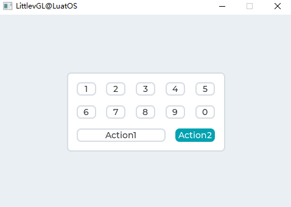

上述效果的示例代码：

```lua
local function event_handler(obj, event)
    if(event == lvgl.EVENT_VALUE_CHANGED) then
            local txt = lvgl.btnmatrix_get_active_btn_text(obj)
            print(string.format("%s was pressed\n", txt))
    end
end

function btnmatrix_demo.demo()
    local btnm_map = {"1", "2", "3", "4", "5", "\n",
                    "6", "7", "8", "9", "0", "\n",
                    "Action1", "Action2",""}

    local btnm1 = lvgl.btnmatrix_create(lvgl.scr_act(), nil)
    lvgl.btnmatrix_set_map(btnm1, btnm_map)
    lvgl.btnmatrix_set_btn_width(btnm1, 10, 2)        --Make "Action1" twice as wide as "Action2"
    lvgl.btnmatrix_set_btn_ctrl(btnm1, 10, lvgl.BTNMATRIX_CTRL_CHECKABLE)
    lvgl.btnmatrix_set_btn_ctrl(btnm1, 11, lvgl.BTNMATRIX_CTRL_CHECK_STATE)
    lvgl.obj_align(btnm1, nil, lvgl.ALIGN_CENTER, 0, 0)
    lvgl.obj_set_event_cb(btnm1, event_handler)
end

```


## 日历(calendar)

### 概述

Calendar对象是经典的日历，可以：

- 突出显示当天
- 突出显示任何用户定义的日期
- 显示日期名称
- 单击按钮进入下一个/上一个月
- 突出显示点击的日子

### 零件和样式

日历的主要部分称为 `lvgl.CALENDAR_PART_BG` 。它使用典型的背景样式属性绘制背景。

除以下虚拟部分外：

- `lvgl.CALENDAR_PART_HEADER` 显示当前年和月名称的上部区域。它还具有用于移动下一个/上个月的按钮。它使用典型的背景属性以及填充来调整其大小和边距，以设置距日历顶部的距离和日历下方的日期。
- `lvgl.CALENDAR_PART_DAY_NAMES` 在标题下方显示日期名称。它使用文本样式属性填充来与背景（左，右），标题（上）和日期（下）保持一定距离。
- `lvgl.CALENDAR_PART_DATES` 显示从1..28 / 29/30/31开始的日期数字（取决于当月）。根据本部分中定义的状态来绘制状态的不同“状态”：
  - 正常日期：以 `lvgl.STATE_DEFAULT` 样式绘制
  - 按日期范围：以 `lvgl.STATE_PRESSED` 样式绘制
  - 今天：以 `lvgl.STATE_FOCUSED` 样式绘制
  - 高亮显示的日期：以 `lvgl.STATE_CHECKED` 样式绘制

### 用法

#### 概述

要在日历中设置和获取日期，使用 `lvgl.calendar_date_t` 类型，该类型是具有 `年` ， `月` 和 `日` 字段的结构。

#### 当前日期

要设置当前日期（今天），请使用 `lvgl.calendar_set_today_date(calendar, today_date)` 函数。

#### 显示日期

要设置显示日期，请使用 `lvgl.calendar_set_shown_date(calendar, &shown_date)` ;

#### 高亮日期

高亮显示的日期列表应存储在由 `lvgl.calendar_set_highlighted_dates(calendar, highlighted_dates)` 加载的 `lvgl.calendar_date_t` 数组中。

仅将保存数组指针，因此数组应为静态或全局变量。

#### 日期名称

可以使用 `lvgl.calendar_set_day_names(calendar, day_names)` 来调整日期的名称，其中 `day_names` 类似于 `local day_names = {"Su", "Mo", ...};`

#### 月份名称

与 `day_names` 相似，可以使用 `lvgl.calendar_set_month_names(calendar, month_names_array)` 设置月份名称。

### 事件

除了 [通用事件](http://lvgl.100ask.net/documentation/03_overview/03_events.html#id2) 外，日历还会发送以下特殊事件：当当前月份更改时，还会发送 **lvgl.EVENT_VALUE_CHANGED** 。

在与输入设备相关的事件中， `lvgl.calendar_get_pressed_date(calendar)` 指示当前正在按下的日期，如果没有按下任何日期，则返回 `nil` 。

### 按钮

对象类型不处理任何按钮。

### 范例

#### 简单日历示例

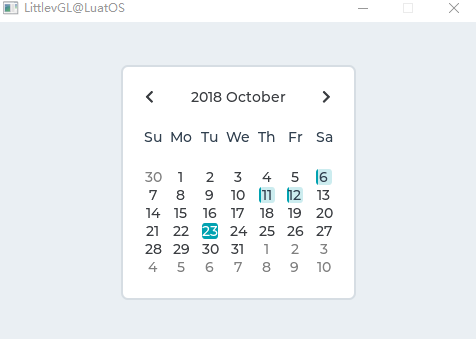

上述效果的示例代码：

```lua
local function event_handler(obj, event)
    if(event == lvgl.EVENT_VALUE_CHANGED) then
            local date = lvgl.calendar_get_pressed_date(obj);
    end
end

	local calendar = lvgl.calendar_create(lvgl.scr_act(), nil);
    lvgl.obj_set_size(calendar, 235, 235);
    lvgl.obj_align(calendar, nil, lvgl.ALIGN_CENTER, 0, 0);
    lvgl.obj_set_event_cb(calendar, event_handler);

    --Make the date number smaller to be sure they fit into their area
    lvgl.obj_set_style_local_text_font(calendar, lvgl.CALENDAR_PART_DATE, lvgl.STATE_DEFAULT, lvgl.theme_get_font_small());

    --Set today's date
    local today = lvgl.calendar_date_t()
    today.year = 2018;
    today.month = 10;
    today.day = 23;

    lvgl.calendar_set_today_date(calendar, today);
    lvgl.calendar_set_showed_date(calendar, today);

    local highlighted_days1 = lvgl.calendar_date_t()
    highlighted_days1.year = 2018;
    highlighted_days1.month = 10;
    highlighted_days1.day = 6;

    local highlighted_days2 = lvgl.calendar_date_t()
    highlighted_days2.year = 2018;
    highlighted_days2.month = 10;
    highlighted_days2.day = 11;

    local highlighted_days3 = lvgl.calendar_date_t()
    highlighted_days3.year = 2018;
    highlighted_days3.month = 10;
    highlighted_days3.day = 12;

    local highlighted_days = {highlighted_days1,highlighted_days2,highlighted_days3}
    lvgl.calendar_set_highlighted_dates(calendar, highlighted_days, 3);
```


## 画布(canvas)

### 概述

### 零件和样式

### 用法

### 事件

### 按键处理

### 范例


## 复选框(cb)

### 概述

复选框(Checkbox)对象是从 Button 背景构建的，[Button](http://lvgl.100ask.net/documentation/04_widgets/04_btn.html) 背景还包含Button项目符号和 [Label](http://lvgl.100ask.net/documentation/04_widgets/17_label.html) ，以实现经典的复选框。

### 零件和样式

该复选框的主要部分称为 `lvgl.CHECKBOX_PART_BG` 。它是“项目符号”及其旁边的文本的容器。背景使用所有典型的背景样式属性。

项目符号是真正的 [基础对象(lvgl.obj)](http://lvgl.100ask.net/documentation/04_widgets/01_obj.html) ，可以用 `lvgl.CHECKBOX_PART_BULLET` 引用。项目符号会自动继承背景状态。因此，背景被按下时，项目符号也会进入按下状态。项目符号还使用所有典型的背景样式属性。

标签没有专用部分。因为文本样式属性始终是继承的，所以可以在背景样式中设置其样式。

### 用法

#### 文本

可以通过 `lvgl.checkbox_set_text(cb, "New text")` 函数修改文本。它将动态分配文本。

要设置静态文本，请使用 `lvgl.checkbox_set_static_text(cb, txt)` 。这样，将仅存储 `txt` 指针，并且在存在复选框时不应释放该指针。

#### 选中/取消选中

可以通过 `lvgl.checkbox_set_checked(cb, true/false)` 手动选中/取消选中复选框。设置为 `true` 将选中该复选框，而设置为 `false` 将取消选中该复选框。

#### 禁用复选框

要禁用复选框，调用 `lvgl.checkbox_set_disabled(cb, true)` .

#### 获取/设置复选框状态

可以使用 `lvgl.checkbox_get_state(cb)` 函数获取Checkbox的当前状态，该函数返回当前状态。可以使用 `lvgl.checkbox_set_state(cb, state)` 设置复选框的当前状态。枚举 `lvgl.btn_state_t` 定义的可用状态为：

- **lvgl.BTN_STATE_RELEASED**
- **lvgl.BTN_STATE_PRESSED**
- **lvgl.BTN_STATE_DISABLED**
- **lvgl.BTN_STATE_CHECKED_RELEASED**
- **lvgl.BTN_STATE_CHECKED_PRESSED**
- **lvgl.BTN_STATE_CHECKED_DISABLED**

### 事件

除了 [通用事件](http://lvgl.100ask.net/documentation/03_overview/03_events.html#id2) ，复选框还支持以下 [特殊事件](http://lvgl.100ask.net/documentation/03_overview/03_events.html#id7) ：

- **lvgl.EVENT_VALUE_CHANGED** - 切换复选框时发送。

请注意，与通用输入设备相关的事件（如lvgl.EVENT_PRESSED）也以非活动状态发送。需要使用lvgl.cb_is_inactive（cb）检查状态，以忽略非活动复选框中的事件。

了解有关 [事件](http://lvgl.100ask.net/documentation/03_overview/03_events.html) 的更多内容。

### 按键

复选框可处理以下按键：

- **lvgl.KEY_RIGHT/UP** - 如果启用了切换，则进入切换状态
- **lvgl.KEY_LEFT/DOWN** - 如果启用了切换，则进入非切换状态

请注意，与往常一样，lvgl.KEY_ENTER的状态会转换为lvgl.EVENT_PRESSED / PRESSING / RELEASED等。

了解有关 [按键](http://lvgl.100ask.net/documentation/03_overview/05_indev.html) 的更多内容。

### 范例

#### 简单复选框

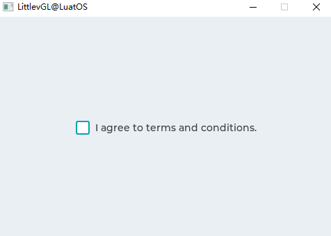

上述效果的示例代码：

```lua
local function event_handler(obj, event)
    if(event == lvgl.EVENT_CLICKED) then
        if lvgl.checkbox_is_checked(obj) == true then
            print("State: Checked\n")
        else
            print("State: Unchecked\n")
        end
    end
end

local cb = lvgl.checkbox_create(lvgl.scr_act(), nil)
    lvgl.checkbox_set_text(cb, "I agree to terms and conditions.")
    lvgl.obj_align(cb, nil, lvgl.ALIGN_CENTER, 0, 0)
    lvgl.obj_set_event_cb(cb, event_handler)
```


## 图表(chart)

### 概述

图表是可视化数据点的基本对象。它们支持折线图（将点与线连接和/或在其上绘制点）和柱形图。

图表还支持分隔线，2 y轴，刻度线和刻度线文本。

### 零件和样式

图表的主要部分称为 `lvgl.CHART_PART_BG` ，它使用所有典型的背景属性。文本样式属性确定轴文本的样式，而线属性确定刻度线的样式。填充值在侧面增加了一些空间，因此使序列区域更小。填充也可用于为轴文本和刻度线留出空间。

该系列的背景称为 `lvgl.CHART_PART_SERIES_BG` ，它位于主要背景上。在此部分上绘制了分隔线和系列数据。除典型的背景样式属性外，分割线还使用线型属性。填充值指示此零件与轴文本之间的间隔。

`lvgl.CHART_PART_SERIES` 可以引用该系列的样式。对于列类型，使用以下属性：

- 半径：数据点的半径
- padding_inner：相同x坐标的列之间的间隔

如果是线型图，则使用以下属性：

- 线属性来描述线
- 点的大小半径
- bg_opa：线条下方区域的整体不透明度
- bg_main_stop：的％bg_opa在顶部以创建一个alpha褪色（0：在顶部透明，255：bg_opa在顶部）
- bg_grad_stop：底部bg_opa的百分比以创建alpha渐变（0：底部透明，255：bg_opa顶部）
- bg_drag_dir：应该 `lvgl.GRAD_DIR_VER` 允许通过bg_main_stop和bg_grad_stop进行Alpha淡入

`lvgl.CHART_PART_CURSOR` 引用游标。可以添加任意数量的光标，并且可以通过与行相关的样式属性来设置其外观。创建游标时设置游标的颜色，并用该值覆盖 `line_color` 样式。

### 用法

#### 数据系列

您可以通过 `lvgl.chart_add_series(chart, color)` 向图表添加任意数量的系列。它为包含所选颜色的 `lvgl.chart_u series_t` 结构分配数据，如果不使用外部数组，如果分配了外部数组，则与该系列关联的任何内部点都将被释放，而序列指向外部数组。

#### 系列类型

存在以下数据显示类型：

- **lvgl.CHART_TYPE_NONE** - 不显示任何数据。它可以用来隐藏系列。
- **lvgl.CHART_TYPE_LINE** - 在两点之间画线。
- **lvgl.CHART_TYPE_COLUMN** - 绘制列。

可以使用 `lvgl.chart_set_type(chart, lvgl.CHART_TYPE_...)` 指定显示类型。可以对类型进行“或”运算（例如 `lvgl.CHART_TYPE_LINE` ）。

#### 修改数据

有几个选项可以设置系列数据：

1. 在数组中手动设置值，例如 `ser1->points[3] = 7` ，然后使用 `lvgl.chart_refresh(chart)` 刷新图表。
2. 使用 `lvgl.chart_set_point_id(chart, ser, value, id)` ，其中id是您要更新的点的索引。
3. 使用 `lvgl.chart_set_next(chart, ser, value)` 。
4. 使用 `lvgl.chart_init_points(chart, ser, value)` 将所有点初始化为给定值。
5. 使用 `lvgl.chart_set_points(chart, ser, value_array)` 设置数组中的所有点。

使用 `lvgl.CHART_POINT_DEF` 作为值可使库跳过该点，列或线段的绘制。

#### 覆盖系列的默认起点

如果希望绘图从默认点（序列的点[0]）之外的其他点开始，则可以使用 `lvgl.chart_set_x_start_point(chart, ser, id)` 函数设置替代索引，其中id是要开始的新索引位置从。

#### 设置外部数据源

可以使用以下函数从外部数据源更新图表系列： `lvgl.chart_set_ext_array(chart, ser, array, point_cnt )` ，其中array是lvgl.coord_t与point_cnt元素的外部数组。注意：更新外部数据源后，应调用 `lvgl.chart_refresh(chart)` 来更新图表。

#### 获取当前图表信息

有四个功能可获取有关图表的信息：

- `lvgl.chart_get_type(chart)` 返回当前图表类型。
- `lvgl.chart_get_point_count(chart)` 返回当前图表点数。
- `lvgl.chart_get_x_start_point(ser)` 返回指定系列的当前绘图索引。
- `lvgl.chart_get_point_id(chart, ser, id)` 返回指定系列的特定索引处的数据值。

#### 更新模式

`lvgl.chart_set_next` 可以以两种方式运行，具体取决于更新模式：

- **lvgl.CHART_UPDATE_MODE_SHIFT** - 将旧数据向左移动，然后向右添加新数据。
- **lvgl.CHART_UPDATE_MODE_CIRCULAR** - 循环添加新数据（如ECG图）。

可以使用 `lvgl.chart_set_update_mode(chart, lvgl.CHART_UPDATE_MODE_...)` 更改更新模式。

#### 浮标个数

可以通过 `lvgl.chart_set_point_count(chart, point_num)` 修改系列中的点数。默认值为10。注意：当将外部缓冲区分配给序列时，这也会影响处理的点数。

#### 垂直范围

可以使用 `lvgl.chart_set_range(chart, y_min, y_max)` 在y方向上指定最小值和最大值。点的值将按比例缩放。默认范围是：0..100。

#### 分割线

水平和垂直分隔线的数量可以通过 `lvgl.chart_set_div_line_count(chart, hdiv_num, vdiv_` 进行修改。默认设置为3条水平分割线和5条垂直分割线。

#### 刻度线和标签

刻度和标签可以添加到轴上。

`lvgl.chart_set_x_tick_text(chart, list_of_values, num_tick_marks, lvgl.CHART_AXIS_...)` 设置x轴上的刻度和文本。 `list_of_values` 是一个字符串，带有 `'\n'` 终止文本（期望最后一个），其中包含用于刻度的文本。 `list_of_values` 是一个字符串，带有 `'\n'` 终止文本（期望最后一个），其中包含用于刻度的文本。例如。 `const char * list_of_values = "first\nsec\nthird"` 。 `list_of_values` 可以为 `NULL` 。 如果设置了 `list_of_values` ，则 `num_tick_marks` 告诉两个标签之间的刻度数。如果 `list_of_values` 为 `NULL` ，则它指定滴答声的总数。

主刻度线绘制在放置文本的位置，次刻度线绘制在其他位置。 [``](http://lvgl.100ask.net/7.11/documentation/04_widgets/09_chart.html#id15)lvgl.chart_set_x_tick_length(chart, major_tick_len, minor_tick_len) `` 设置x轴上刻度线的长度。

y轴也存在相同的功能： `lvgl.chart_set_y_tick_text` 和 `lvgl.chart_set_y_tick_length` 。

#### 光标

可以使用 `lvgl.chart_cursor_t * c1 = lvgl.chart_add_cursor(chart, color, dir);` 添加光标。 `dir` `lvgl.CHART_CURSOR_NONE/RIGHT/UP/LEFT/DOWN` 的可能值或它们的OR-ed值，用于指示应在哪个方向上绘制光标。

`lvgl.chart_set_cursor_point(chart, cursor, &point)` 设置光标的位置。 `point` 是指向 `lvgl.poin_t` 变量的指针。例如。`lvgl.point_t point = {10, 20};` 。该点相对于图表的序列区域。

`lvgl.coord_t p_index = lvgl.chart_get_nearest_index_from_coord(chart, x)` 告诉哪个点索引最接近X坐标（相对于序列区域）。例如，当单击图表时，它可用于将光标捕捉到一个点。

`lvgl.chart_get_x_from_index(chart, series, id)` 和 `lvgl.chart_get_y_from_index(chart, series, id)` 告诉给定点的X和Y坐标。将光标放置到给定点很有用。

可以使用 `lvgl.chart_get_series_area(chart, &area)` 检索当前系列区域，其中 `area` 是指向 `lvgl.area_t` 变量的指针，用于存储结果。该区域具有绝对坐标。

### 事件

仅通用事件是按对象类型发送的。

了解有关 [事件](http://lvgl.100ask.net/documentation/03_overview/03_events.html) 的更多信息。

### 按键

对象类型不处理任何键。

进一步了解 [按键](http://lvgl.100ask.net/documentation/03_overview/05_indev.html) 。

### 范例

#### 折线图


上述效果的示例代码：

```lua
    --Create a chart
    local chart;
    chart = lvgl.chart_create(lvgl.scr_act(), nil);
    lvgl.obj_set_size(chart, 200, 150);
    lvgl.obj_align(chart, nil, lvgl.ALIGN_CENTER, 0, 0);
    lvgl.chart_set_type(chart, lvgl.CHART_TYPE_LINE);   --Show lines and points too*/

    --Add two data series
    local ser1 = lvgl.chart_add_series(chart, lvgl.color_make(0xFF, 0x00, 0x00));
    local ser2 = lvgl.chart_add_series(chart, lvgl.color_make(0x00, 0x80, 0x00));

    --Set the next points on 'ser1'
    lvgl.chart_set_next(chart, ser1, 10);
    lvgl.chart_set_next(chart, ser1, 10);
    lvgl.chart_set_next(chart, ser1, 10);
    lvgl.chart_set_next(chart, ser1, 10);
    lvgl.chart_set_next(chart, ser1, 10);
    lvgl.chart_set_next(chart, ser1, 10);
    lvgl.chart_set_next(chart, ser1, 10);
    lvgl.chart_set_next(chart, ser1, 30);
    lvgl.chart_set_next(chart, ser1, 70);
    lvgl.chart_set_next(chart, ser1, 90);

    lvgl.chart_set_next(chart, ser2, 90);
    lvgl.chart_set_next(chart, ser2, 70);
    lvgl.chart_set_next(chart, ser2, 65);
    lvgl.chart_set_next(chart, ser2, 65);
    lvgl.chart_set_next(chart, ser2, 65);
    lvgl.chart_set_next(chart, ser2, 65);
    lvgl.chart_set_next(chart, ser2, 65);
    lvgl.chart_set_next(chart, ser2, 65);
    lvgl.chart_set_next(chart, ser2, 65);
    lvgl.chart_set_next(chart, ser2, 65);

    lvgl.chart_refresh(chart); --Required after direct set
```


## 容器(cont)

### 概述

容器本质上是具有布局和自动调整大小功能的 **基本对象** 。

### 零件和样式

容器只有一个主要样式称为 `lvgl.CONT_PART_MAIN` ，它可以使用所有通常的bacground属性和填充来自动调整布局大小。

### 用法

#### 布局

可以在容器上应用布局以自动订购其子代。布局间距来自样式的 `填充(pad)` 属性。可能的布局选项：

- **lvgl.LAYOUT_OFF** - 不要对齐子代。
- **lvgl.LAYOUT_CENTER** - 将子项与列中的中心对齐，并 `padd_inner` 在它们之间保持间距。
- **lvgl.LAYOUT_COLUMN_LEFT** - 在左对齐的列中对齐子级。请 `padd_left` 在左边，空间 `pad_top` 空间的顶部和 `pad_inner` 孩子之间的空间。
- **lvgl.LAYOUT_COLUMN_MID** - 在中心列中对齐子代。 `padd_top` 在顶部和 `pad_inner` 孩子之间保持空间。
- **lvgl.LAYOUT_COLUMN_RIGHT** - 在右对齐的列中对齐子代。保持 `padd_right` 右边的 `pad_top` 空间，顶部的 [``](http://lvgl.100ask.net/7.11/documentation/04_widgets/10_cont.html#id5)pad_inner空间和孩子之间的空间。
- **lvgl.LAYOUT_ROW_TOP** - 在顶部对齐的行中对齐子级。请pad_left在左边，空间pad_top空间的顶部和pad_inner`` 孩子之间的空间。
- **lvgl.LAYOUT_ROW_MID** - 在居中的行中对齐子级。 `pad_left` 在左边和 `pad_inner` 孩子之间保持空间。
- **lvgl.LAYOUT_ROW_BOTTOM** - 在底部对齐的行中对齐子级。请 `pad_left` 在左边，空间 `pad_bottom` 空间的底部和 `pad_inner` 孩子之间的空间。
- **lvgl.LAYOUT_PRETTY_TOP** - 将作为连续多的对象可能（至少 `pad_inner` 空间和 `pad_left/right` 空间两侧）。在孩子之间的每一行中平均分配空间。如果这是连续不同身高的孩子，请对齐其上边缘。
- **lvgl.LAYOUT_PRETTY_MID** - 与 `lvgl.LAYOUT_PRETTY_MID` 相同，但是如果此处的孩子连续排成不同的高度，则对齐他们的中线。
- **lvgl.LAYOUT_PRETTY_BOTTOM** - 与 ··lvgl.LAYOUT_PRETTY_BOTTOM·· 相同， ··但是如果这是连续高度不同的子项，请对齐其底线。
- **lvgl.LAYOUT_GRID** - 类似于 `lvgl.LAYOUT_PRETTY` 但不能平均划分水平空间，只是让它们之间的 `pad_left/right` 边缘和 `pad_inner` 空间分开。

#### 自动调整

容器具有自动适应功能，可以根据其子代和/或父代自动更改容器的大小。存在以下选项：

- **lvgl.FIT_NONE** - 不要自动更改大小。
- **lvgl.FIT_TIGHT** - 将容器收缩包装在其所有子容器周围，同时 `pad_top/bottom/left/right` 在边缘保留空间。
- **lvgl.FIT_PARENT** - 将大小设置为父项的大小减去 `pad_top/bottom/left/right` （来自父项的样式）空间。
- **lvgl.FIT_MAX** - 使用 `lvgl.FIT_PARENT` 而不是父小， `lvgl.FIT_TIGHT` 时大。它将确保该容器至少是其父容器的大小。

要为所有方向设置自动适合模式，请使用。要在水平和垂直方向上使用不同的自动拟合，请使用。要在所有四个方向上使用不同的自动拟合，请使用。lvgl.cont_set_fit(cont, [lvgl.FIT_](http://lvgl.100ask.net/7.11/documentation/04_widgets/10_cont.html#id16)…)lvgl.cont_set_fit2(cont, hor_fit_type, ver_fit_type)lvgl.cont_set_fit4(cont, left_fit_type, right_fit_type, top_fit_type, bottom_fit_type)

### 事件

仅 [通用事件](http://lvgl.100ask.net/documentation/03_overview/03_events.html#id2) 是按对象类型发送的。

了解有关 [事件](http://lvgl.100ask.net/documentation/03_overview/03_events.html) 的更多信息。

### 按键

对象类型不处理任何键。

进一步了解 [按键](http://lvgl.100ask.net/documentation/03_overview/05_indev.html) 。

### 范例

#### 容器示例

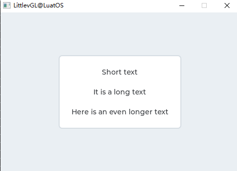

上述效果的示例代码：

```lua
    local cont;
    cont = lvgl.cont_create(lvgl.scr_act(), nil);
    lvgl.obj_set_auto_realign(cont, true);                    --Auto realign when the size changes*/
    lvgl.obj_align_origo(cont, nil, lvgl.ALIGN_CENTER, 0, 0);  --This parametrs will be sued when realigned*/
    lvgl.cont_set_fit(cont, lvgl.FIT_TIGHT);
    lvgl.cont_set_layout(cont, lvgl.LAYOUT_COLUMN_MID);

    local label;
    label = lvgl.label_create(cont, nil);
    lvgl.label_set_text(label, "Short text");

    sys.wait(500)

    label = lvgl.label_create(cont, nil);
    lvgl.label_set_text(label, "It is a long text");

    sys.wait(500)

    label = lvgl.label_create(cont, nil);
    lvgl.label_set_text(label, "Here is an even longer text");
```


## 颜色选择器(cpicker)

### 概述

顾名思义，拾色器允许选择颜色。可以依次选择颜色的色相，饱和度和值。

小部件有两种形式：圆形（圆盘）和矩形。

在这两种形式中，长按对象，颜色选择器将更改为颜色的下一个参数（色相，饱和度或值）。此外，双击将重置当前参数。

### 零件和样式

拾色器的主要部分称为 `lvgl.CPICKER_PART_BG` 。以圆形形式，它使用scale_width设置圆的宽度，并使用pad_inner在圆和内部预览圆之间填充。在矩形模式下，半径可以用于在矩形上应用半径。

该对象具有称为的虚拟部分 `lvgl.CPICKER_PART_KNOB` ，它是在当前值上绘制的矩形（或圆形）。它使用所有矩形（如样式属性和填充）使其大于圆形或矩形背景的宽度。

### 用法

#### 类型

可以使用 `lvgl.cpicker_set_type(cpicker, lvgl.CPICKER_TYPE_RECT/DISC)` 更改颜色选择器的类型

#### 设定颜色

可以使用 `lvgl.cpicker_set_hue/saturation/value(cpicker, x)` 手动设置colro，或者使用 `lvgl.cpicker_set_hsv(cpicker, hsv)` 或 `lvgl.cpicker_set_color(cpicker, rgb)` 一次全部设置

#### 色彩模式

可以使用 `lvgl.cpicker_set_color_mode(cpicker, lvgl.CPICKER_COLOR_MODE_HUE/SATURATION/VALUE)` 手动选择当前颜色。

使用 `lvgl.cpicker_set_color_mode_fixed(cpicker, true)` 固定颜色（不要长按更改）

#### 旋钮颜色

`lvgl.cpicker_set_knob_colored(cpicker, true)` 使旋钮自动将所选颜色显示为背景色。

### 事件

仅 [通用事件](http://lvgl.100ask.net/documentation/03_overview/03_events.html#id2) 是按对象类型发送的。

了解有关 [事件](http://lvgl.100ask.net/documentation/03_overview/03_events.html) 的更多信息。

### 按键

- **lvgl.KEY_UP, lvgl.KEY_RIGHT** 将当前参数的值增加1
- **lvgl.KEY_DOWN, lvgl.KEY_LEFT** 将当前参数减1
- **lvgl.KEY_ENTER** 长按将显示下一个模式。通过双击将重置当前参数。

进一步了解 [按键](http://lvgl.100ask.net/documentation/03_overview/05_indev.html) 。

### 范例

#### 光盘颜色选择器

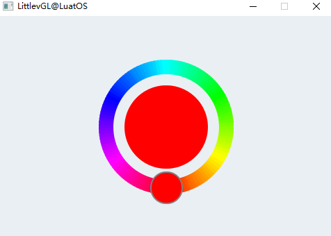

上述效果的示例代码：

```lua
    local cpicker
    cpicker = lvgl.cpicker_create(lvgl.scr_act(), nil)
    lvgl.obj_set_size(cpicker, 200, 200)
    lvgl.obj_align(cpicker, nil, lvgl.ALIGN_CENTER, 0, 0)
```


## 下拉列表(dropdown)

### 概述

下拉列表允许用户从列表中选择一个值。

下拉列表默认情况下处于关闭状态，并显示单个值或预定义的文本。激活后（通过单击下拉列表），将创建一个列表，用户可以从中选择一个选项。当用户选择新值时，该列表将被删除。

### 小部件和样式

调用下拉列表的主要部分， `lvgl.DROPDOWN_PART_MAIN` 它是一个简单的 [lvgl.obj](http://lvgl.100ask.net/documentation/04_widgets/01_obj.html) 对象。它使用所有典型的背景属性。按下，聚焦，编辑等阶梯也照常应用。

单击主对象时创建的列表是Page。它的背景部分可以被引用， `lvgl.DROPDOWN_PART_LIST` 并为矩形本身使用所有典型的背景属性，并为选项使用文本属性。要调整选项之间的间距，请使用text_line_space样式属性。填充值可用于在边缘上留出一些空间。

页面的可滚动部分被隐藏，其样式始终为空（透明，无填充）。

滚动条可以被引用 `lvgl.DROPDOWN_PART_SCRLBAR` 并使用所有典型的背景属性。

可以 `lvgl.DROPDOWN_PART_SELECTED` 使用所有典型的背景属性引用并使用所选的选项。它将以其默认状态在所选选项上绘制一个矩形，并在按下状态下在被按下的选项上绘制一个矩形。

### 用法

#### 设定选项

选项作为带有 `lvgl.dropdown_set_options(dropdown, options)` 的字符串传递到下拉列表。选项应用 `\n` 分隔。例如： `"First\nSecond\nThird"` 。该字符串将保存在下拉列表中，因此也可以保存在本地变量中。

`lvgl.dropdown_add_option(dropdown, "New option", pos)` 函数向 `pos` 索引插入一个新选项。

为了节省内存，还可以使用 `lvgl.dropdown_set_static_options(dropdown, options)` 从静态（常量）字符串设置选项。在这种情况下，当存在下拉列表且不能使用 `lvgl.dropdown_add_option` 时，options字符串应处于活动状态

可以使用 `lvgl.dropdown_set_selected(dropdown, id)` 手动选择一个选项，其中id是选项的索引。

#### 获取选择的选项

使用获取当前选择的选项 `lvgl.dropdown_get_selected(dropdown)` 。它将返回所选选项的索引。 `lvgl.dropdown_get_selected_str(dropdown, buf, buf_size)` 将所选选项的名称复制到 `buf` 。

#### 方向

该列表可以在任何一侧创建。默认值 `lvgl.DROPDOWN_DOWN` 可以通过功能进行修改。 `lvgl.dropdown_set_dir(dropdown, lvgl.DROPDOWN_DIR_LEFT/RIGHT/UP/DOWN)`

如果列表垂直于屏幕之外，它将与边缘对齐。

#### 符号

可以使用 `lvgl.dropdown_set_symbol(dropdown, lvgl.SYMBOL_...)` 将符号（通常是箭头）添加到下拉列表中

如果下拉列表的方向为 `lvgl.DROPDOWN_DIR_LEFT` ，则该符号将显示在左侧，否则显示在右侧。

#### 最大高度

可以通过 `lvgl.dropdown_set_max_height(dropdown, height)` 设置下拉列表的最大高度。默认情况下，它设置为3/4垂直分辨率。

#### 显示所选

主要部分可以显示所选选项或静态文本。可以使用 `lvgl.dropdown_set_show_selected(sropdown, true/false)` 进行控制。

可以使用 `lvgl.dropdown_set_text(dropdown, "Text")` 设置静态文本。仅保存文本指针。

如果也不想突出显示所选选项，则可以将自定义透明样式用于 `lvgl.DROPDOWN_PART_SELECTED` 。

#### 动画时间

下拉列表的打开/关闭动画时间由 `lvgl.dropdown_set_anim_time(ddlist, anim_time)` 调整。动画时间为零表示没有动画。

#### 手动打开/关闭

要手动打开或关闭下拉列表，可以使用 `lvgl.dropdown_open/close(dropdown, lvgl.ANIM_ON/OFF)` 功能。

### 事件

除了 [通用事件](http://lvgl.100ask.net/documentation/03_overview/03_events.html#id2) 外，下拉列表还发送以下 [特殊事件](http://lvgl.100ask.net/documentation/03_overview/03_events.html#id7) ：

- **lvgl.EVENT_VALUE_CHANGED** - 选择新选项时发送。

了解有关 [事件](http://lvgl.100ask.net/documentation/03_overview/03_events.html) 的更多信息。

### 按键

以下按键由按钮处理：

- **lvgl.KEY_RIGHT/DOWN** - 选择下一个选项。
- **lvgl.KEY_LEFT/UP** - 选择上一个选项。
- **LY_KEY_ENTER** - 应用选定的选项（发送lvgl.EVENT_VALUE_CHANGED事件并关闭下拉列表）。

进一步了解 [按键](http://lvgl.100ask.net/documentation/03_overview/05_indev.html) 。

### 范例

#### 简单的下拉列表

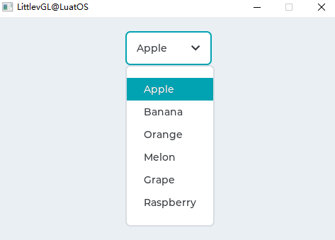

上述效果的示例代码：

```lua
    
--demo1
local function event_handler(obj, event)
    if(event == lvgl.EVENT_VALUE_CHANGED) then
        local buf = lvgl.dropdown_get_selected_str(obj, 20);
        print(string.format("Option: %s\n", buf))
    end
end

--Create a normal drop down list
    local ddlist = lvgl.dropdown_create(lvgl.scr_act(), nil);
    lvgl.dropdown_set_options(ddlist, 
[[Apple
Banana
Orange
Melon
Grape
Raspberry]]);

    lvgl.obj_align(ddlist, nil, lvgl.ALIGN_IN_TOP_MID, 0, 20);
    lvgl.obj_set_event_cb(ddlist, event_handler);
```

#### 删除“向上”列表

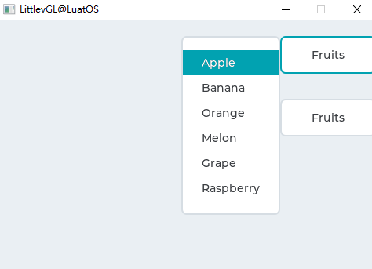

上述效果的示例代码：

```lua
    --Create a normal drop down list
    local ddlist = lvgl.dropdown_create(lvgl.scr_act(), nil);
    lvgl.dropdown_set_options(ddlist, 
[[Apple
Banana
Orange
Melon
Grape
Raspberry]]);

    lvgl.dropdown_set_dir(ddlist, lvgl.DROPDOWN_DIR_LEFT);
    lvgl.dropdown_set_symbol(ddlist, nil);
    lvgl.dropdown_set_show_selected(ddlist, false);
    lvgl.dropdown_set_text(ddlist, "Fruits");

    --It will be called automatically when the size changes
    lvgl.obj_align(ddlist, nil, lvgl.ALIGN_IN_TOP_RIGHT, 0, 20);

    --Copy the drop LEFT list
    ddlist = lvgl.dropdown_create(lvgl.scr_act(), ddlist);
    lvgl.obj_align(ddlist, nil, lvgl.ALIGN_IN_TOP_RIGHT, 0, 100);
```


## 仪表(gauge)

### 概述

仪表是带有刻度标签和一个或多个指针的仪表。

### 零件和样式

仪表的主要部分称为`lvgl.GAUGE_PART_MAIN`。它使用典型的背景样式属性绘制背景，并使用*线条*和*比例*样式属性绘制“小”比例线。它还使用*文本*属性来设置比例标签的样式。*pad_inner*用于设置刻度线和刻度标签之间的空间。

`lvgl.GAUGE_PART_MAJOR`是使用*线*和*比例*样式属性描述主要比例线（添加标签的位置）的虚拟零件。

`lvgl.GAUGE_PART_NEEDLE`也是虚拟零件，它通过*线型*属性描述针。的*大小*和典型的背景属性用于描述在所述针（多个）的枢转点的矩形（或圆形）。 *pad_inner*用于使针小于刻度线的外半径。

### 用法

#### 设定值和针

仪表可以显示不止一根针。使用该函数设置针数和每个针的颜色数组。数组必须是静态或全局变量，因为只存储其指针。`lvgl.gauge_set_needle_count(gauge, needle_num, color_array)`

您可以使用来设置针的值。`lvgl.gauge_set_value(gauge, needle_id, value)`

#### 规模

您可以使用该功能调整刻度角度以及刻度线和标签的数量。默认设置为 220 度、6 个比例标签和 21 条线。`lvgl.gauge_set_scale(gauge, angle, line_num, label_cnt)`

Gauge 的刻度可以有偏移。可以用 调整。`lvgl.gauge_set_angle_offset(gauge, angle)`

#### 范围

仪表的范围可以由 指定。默认范围是 0..100。`lvgl.gauge_set_range(gauge, min, max)`

#### 针图像

图像也可以用作针。图像应指向右侧（如`==>`）。要设置图像，请使用. 和从左上角的旋转中心偏移。图像将重新着色为针的颜色，强度来自 中的样式。`lvgl.gauge_set_needle_img(gauge1, &img, pivot_x, pivot_y)``pivot_x``pivot_y``image_recolor_opa``lvgl.GAUGE_PART_NEEDLE`

#### 临界值

要设置临界值，请使用。在此值之后，比例颜色将更改为*scale_end_color*。默认临界值为 80。`lvgl.gauge_set_critical_value(gauge, value)`

### 事件

仅 [通用事件](http://lvgl.100ask.net/documentation/03_overview/03_events.html#id2) 是按对象类型发送的。

了解有关 [事件](http://lvgl.100ask.net/documentation/03_overview/03_events.html) 的更多内容。

### 按键

对象类型不处理任何键。

了解有关 [按键](http://lvgl.100ask.net/documentation/03_overview/05_indev.html) 的更多内容。

### 范例

#### 简单的仪表

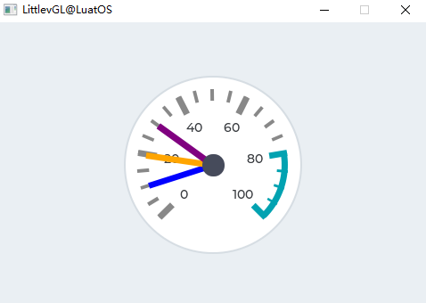

上述效果的示例代码：

```lua
    --Describe the color for the needles
    local needle_colors = {lvgl.COLOR_BLUE,lvgl.COLOR_ORANGE,lvgl.COLOR_PURPLE}
    --Create a gauge*/
    local gauge1 = lvgl.gauge_create(lvgl.scr_act(), nil);
    lvgl.gauge_set_needle_count(gauge1, 3, needle_colors);
    lvgl.obj_set_size(gauge1, 200, 200);
    lvgl.obj_align(gauge1, nil, lvgl.ALIGN_CENTER, 0, 0);

    --Set the values*/
    lvgl.gauge_set_value(gauge1, 0, 10);
    lvgl.gauge_set_value(gauge1, 1, 20);
    lvgl.gauge_set_value(gauge1, 2, 30);
```


## 图片(img)

### 概述

图像是从外部作为文件显示的基本对象。图像也可以显示符号（ `lvgl.SYMBOL_...` ）。

使用 [图像解码器](http://lvgl.100ask.net/documentation/03_overview/08_image.html#id9) 接口，也可以支持自定义图像格式。

### 零件和样式

图像只有一个称为 `lvgl.IMG_PART_MAIN` 的主要部分，该部分使用典型的背景样式属性绘制背景矩形和图像属性。填充值用于使背景实际变大。 （它不会更改图像的实际大小，但仅在绘图期间应用大小修改）

### 用法

#### 图片来源

为了提供最大的灵活性，图像的来源可以是：

- 外部存储的文件（例如SD卡上的文件）。
- [符号](http://lvgl.100ask.net/documentation/03_overview/07_font.html) 文字。

要使用 **外部文件** ，还需要使用在线转换器工具转换图像文件，但是现在应该选择二进制输出格式。还需要使用LVGL的文件系统模块，并为基本文件操作注册具有某些功能的驱动程序。进入文件系统以了解更多信息。要设置来自文件的图像，请使用 `lvgl.img_set_src(img, "S:folder1/my_img.bin")` 。

可以类似于 [`标签`_](http://lvgl.100ask.net/7.11/documentation/04_widgets/14_img.html#id27) 设置符号。在这种情况下，图像将根据样式中指定的字体呈现为文本。它可以使用轻量级的单色“字母”代替实际图像。可以设置符号，例如 `lvgl.img_set_src(img1, lvgl.SYMBOL_OK)` 。

#### 标签作为图片

图像和标签有时用于传达相同的内容。例如，描述按钮的作用。因此，图像和标签可以互换。为了处理这些图像，甚至可以使用 `lvgl.SYMBOL_DUMMY` 作为文本的前缀来显示文本。例如， `lvgl.img_set_src(img, lvgl.SYMBOL_DUMMY "Some text")` .

#### 透明度

内部（可变）和外部图像支持2种透明度处理方法：

- **Chrome keying** - 具有 `lvgl.COLOR_TRANSP` (lvgl.conf.h) 颜色的像素将是透明的。
- **Alpha byte** - 一个alpha字节被添加到每个像素。

#### 调色板和Alpha指数

除了本色（RGB）颜色格式外，还支持以下格式：

- **Indexed** - 索引，图像具有调色板。
- **Alpha indexed** - Alpha索引，仅存储Alpha值。

可以在字体转换器中选择这些选项。要了解有关颜色格式的更多信息，请阅读 `图像(images)` 部分。

#### 重新着色

根据像素的亮度，可以在运行时将图像重新着色为任何颜色。在不存储同一图像的更多版本的情况下，显示图像的不同状态（选中，未激活，按下等）非常有用。 可以通过在 `lvgl.OPA_TRANSP` （不重新着色，值：0）和 `lvgl.OPA_COVER` （完全重新着色，值：255）之间设置 `img.intense` 来启用该样式。默认值为 `lvgl.OPA_TRANSP` ，因此此功能被禁用。

#### 自动调整尺寸

调用 `lvgl.img_set_auto_size(image, true)` 函数，将设置图像对象的大小自动设置为图像源的宽度和高度。 如果启用了自动调整大小，则在设置新文件时，对象大小将自动更改。以后，可以手动修改大小。如果图像不是屏幕，默认情况下将启用自动调整大小。

#### 镶嵌

使用 `lvgl.img_set_offset_x(img, x_ofs) `` 和 ``lvgl.img_set_offset_y(img, y_ofs)` ，可以向显示的图像添加一些偏移。如果对象尺寸小于图像源尺寸，则很有用。使用offset参数，可以通过对x或y偏移量进行 [动画](http://lvgl.100ask.net/documentation/03_overview/10_animation.html) 处理来创建 [纹理图集](https://en.wikipedia.org/wiki/Texture_atlas) 或“运行中的图像”效果。

#### 转换

使用 `lvgl.img_set_zoom(img, factor)` 图像将被缩放。将 `factor` 设置为 `256` 或 `lvgl.IMG_ZOOM_NONE` 以禁用缩放。较大的值将放大图像（例如512倍），较小的值将缩小图像（例如 `128` 倍）。分数刻度也适用。例如： `281` 为10％放大。

要旋转图像，请使用 `lvgl.img_set_angle(img, angle)` 。角度精度为0.1度，因此对于45.8°设置458。

默认情况下，旋转的枢轴点是图像的中心。可以使用 `lvgl.img_set_pivot(img, pivot_x, pivot_y)` 进行更改。 0;0是左上角。

可以使用 `lvgl.img_set_antialias(img, true/false)` 调整转换的质量。启用抗锯齿功能后，转换的质量更高，但速度较慢。

转换需要整个图像可用。因此，可以转换索引图像（ `lvgl.IMG_CF_INDEXED_...` ），仅alpha图像（ `lvgl.IMG_CF_ALPHA_...` ）或文件中的图像。换句话说，转换仅适用于存储为C数组的真彩色图像，或者自定义 [图像解码器](http://lvgl.100ask.net/documentation/03_overview/08_image.html#id9) 返回整个图像。

注意，图像对象的真实坐标在变换期间不会改变。即 `lvgl.obj_get_width/height/x/y()` 将返回原始的非缩放坐标。

#### 旋转

图像可以旋转

### 事件

默认情况下，禁用图像对象的单击，仅发送与非输入设备相关的常规事件。如果要捕获图像对象的所有一般事件，则应使用以下命令启用其单击： lvgl.obj_set_click(img, true)

了解有关 [事件](http://lvgl.100ask.net/documentation/03_overview/03_events.html) 的更多内容。

### 按键

对象类型不处理任何键。

了解有关 [按键](http://lvgl.100ask.net/documentation/03_overview/05_indev.html) 的更多内容。

### 范例

#### 图片来自于数组

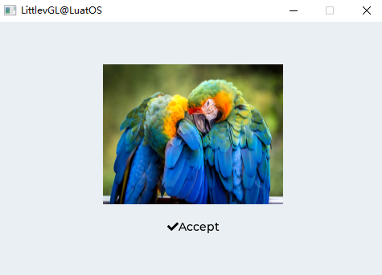

上述效果的示例代码：

```lua
    local img1 = lvgl.img_create(lvgl.scr_act(), nil);
    lvgl.img_set_src(img1, "/img/img_cogwheel_argb.png");
    lvgl.obj_align(img1, nil, lvgl.ALIGN_CENTER, 0, -20);

    local img2 = lvgl.img_create(lvgl.scr_act(), nil);
    lvgl.img_set_src(img2, lvgl.SYMBOL_OK.."Accept");
    lvgl.obj_align(img2, img1, lvgl.ALIGN_OUT_BOTTOM_MID, 0, 20);
```


## 图片按钮(imgbtn)

### 概述

图像按钮与简单的“按钮”对象非常相似。唯一的区别是，它在每种状态下显示用户定义的图像，而不是绘制矩形。在阅读本节之前，请先阅读 [按钮](http://lvgl.100ask.net/documentation/04_widgets/04_btn.html) 一节以更好地理解本节内容。

### 零件和样式

图像按钮对象只有一个主要部分，称为 `lvgl.IMG_BTN_PART_MAIN` ，在其中使用了所有图像样式属性。可以使用image_recolor和image_recolor_opa属性在每种状态下为图像重新着色。例如，如果按下该按钮可使图像变暗。

### 用法

#### 图片来源

调用 `lvgl.imgbtn_set_src(imgbtn, lvgl.BTN_STATE_..., &img_src)` 将图像设置为一种状态。除了“图像”按钮不支持“符号”之外，图像源的工作原理与 [图像对象](http://lvgl.100ask.net/documentation/04_widgets/14_img.html) 中所述的相同。

如果在 lvgl.conf.h 中启用了 `lvgl.IMGBTN_TILED` ，则 `lvgl.imgbtn_set_src_tiled(imgbtn, lvgl.BTN_STATE_..., &img_src_left, &img_src_mid, &img_src_right)` 可用。使用平铺功能，将重复中间图像以填充对象的宽度。因此，对于 `lvgl.IMGBTN_TILED` ，可以使用 `lvgl.obj_set_width()` 设置图像按钮的宽度。但是，如果没有此选项，则宽度将始终与图像源的宽度相同。

#### 按钮功能

类似于普通按钮 `lvgl.imgbtn_set_checkable(imgbtn, true/false)` ，`lvgl.imgbtn_toggle(imgbtn)` 和 `lvgl.imgbtn_set_state(imgbtn, lvgl.BTN_STATE_...)` 也可以使用。

### 事件

除了 [通用事件](http://lvgl.100ask.net/documentation/03_overview/03_events.html#id2) ，以下 [特殊事件](http://lvgl.100ask.net/documentation/03_overview/03_events.html#id7) 也通过按钮发送：

- **lvgl.EVENT_VALUE_CHANGED** - 切换按钮时发送。

请注意，与通用输入设备相关的事件（如lvgl.EVENT_PRESSED）也以非活动状态发送。您需要使用lvgl.btn_get_state（btn）检查状态，以忽略非活动按钮中的事件。

了解有关 [事件](http://lvgl.100ask.net/documentation/03_overview/03_events.html) 的更多内容。

### 按键

以下按键类型由按钮处理：

- **lvgl.KEY_RIGHT/UP** - 如果启用了切换，则进入切换状态。
- **lvgl.KEY_LEFT/DOWN** - 如果启用了切换，则进入非切换状态。

请注意，与往常一样，lvgl.KEY_ENTER的状态会转换为lvgl.EVENT_PRESSED / PRESSING / RELEASED等。

了解有关 [按键](http://lvgl.100ask.net/documentation/03_overview/05_indev.html) 的更多内容。

### 范例

#### 简单的图像按钮

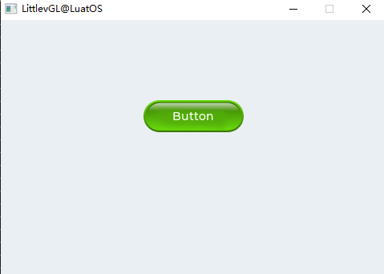

上述效果的示例代码：

```lua
    --Darken the button when pressed
    -- local lvgl.style_t style;
    local style = lvgl.style_t()
    lvgl.style_init(style);
    lvgl.style_set_image_recolor_opa(style, lvgl.STATE_PRESSED, lvgl.OPA_30);
    lvgl.style_set_image_recolor(style, lvgl.STATE_PRESSED, lvgl.color_make(0x00, 0x00, 0x00));
    lvgl.style_set_text_color(style, lvgl.STATE_DEFAULT, lvgl.color_make(0xFF, 0xFF, 0xFF));

    --Create an Image button
    local imgbtn1 = lvgl.imgbtn_create(lvgl.scr_act(), nil);
    lvgl.imgbtn_set_src(imgbtn1, lvgl.BTN_STATE_RELEASED, "/img/imgbtn_green.png");
    lvgl.imgbtn_set_src(imgbtn1, lvgl.BTN_STATE_PRESSED, "/img/imgbtn_green.png");
    lvgl.imgbtn_set_src(imgbtn1, lvgl.BTN_STATE_CHECKED_RELEASED, "/img/imgbtn_blue.png");
    lvgl.imgbtn_set_src(imgbtn1, lvgl.BTN_STATE_CHECKED_PRESSED, "/img/imgbtn_blue.png");
    lvgl.imgbtn_set_checkable(imgbtn1, true);
    lvgl.obj_add_style(imgbtn1, lvgl.IMGBTN_PART_MAIN, style);
    lvgl.obj_align(imgbtn1, nil, lvgl.ALIGN_CENTER, 0, -40);

    --Create a label on the Image button
    local label = lvgl.label_create(imgbtn1, nil);
    lvgl.label_set_text(label, "Button");
```

## 键盘(keyboard)

### 概述

Keyboard对象是特殊的 [按钮矩阵(lvgl.imgbtn)](http://lvgl.100ask.net/documentation/04_widgets/05_btnmatrix.html) ，具有预定义的按键映射和其他功能，以实现虚拟键盘来编写文本。

### 零件和样式

类似于按钮matices，键盘包括2部分：

- `lvgl.KEYBOARD_PART_BG` 这是主要部分，并使用了所有典型的背景属性
- `lvgl.KEYBOARD_PART_BTN` 这是按钮的虚拟部分。它还使用所有典型的背景属性和文本属性。

### 用法

#### 模式

键盘具有以下模式：

- **lvgl.KEYBOARD_MODE_TEXT_LOWER** - 显示小写字母
- **lvgl.KEYBOARD_MODE_TEXT_UPPER** - 显示大写字母
- **lvgl.KEYBOARD_MODE_TEXT_SPECIAL** - 显示特殊字符
- **lvgl.KEYBOARD_MODE_NUM** - 显示数字，+ /-号和小数点。

文本模式( `TEXT` )的布局包含更改模式的按钮。

要手动设置模式，请使用 `lvgl.keyboard_set_mode(kb, mode)` 。默认更多是 `lvgl.KEYBOARD_MODE_TEXT_UPPER` 。

#### 分配文本区域

可以为键盘分配一个 [文本区域(Text area)](http://lvgl.100ask.net/7.11/documentation/04_widgets/documentation/04_widgets/32_textarea.html) ，以将单击的字符自动放在此处。要分配文本区域，请使用 `lvgl.keyboard_set_textarea(kb, ta)` 。

分配的文本区域的光标可以通过键盘进行管理：分配了键盘后，上一个文本区域的光标将被隐藏，并且将显示新的文本区域。当通过“确定”或“关闭”按钮关闭键盘时，光标也将被隐藏。游标管理器功能由 `` lvgl.keyboard_set_cursor_manage(kb, true)`` 启用。默认为不管理。

#### 新的键盘布局

可以使用 `lvgl.keyboard_set_map(kb, map)` 和 `lvgl.keyboard_set_ctrl_map(kb, ctrl_map)` 为键盘指定新的地图（布局）。了解有关 [按钮矩阵(lvgl.imgbtn)](http://lvgl.100ask.net/documentation/04_widgets/05_btnmatrix.html) 的更多信息。记住，使用以下关键字将具有与原始地图相同的效果：

- **lvgl.SYMBOL_OK** - 应用.
- [**](http://lvgl.100ask.net/7.11/documentation/04_widgets/16_keyboard.html#id7)lvgl.SYMBOL_CLOSE - 关闭.
- [**](http://lvgl.100ask.net/7.11/documentation/04_widgets/16_keyboard.html#id9)lvgl.SYMBOL_BACKSPACE - 从左侧删除。
- [**](http://lvgl.100ask.net/7.11/documentation/04_widgets/16_keyboard.html#id11)lvgl.SYMBOL_LEFT - 向左移动光标。
- [**](http://lvgl.100ask.net/7.11/documentation/04_widgets/16_keyboard.html#id13)lvgl.SYMBOL_RIGHT - 向右移动光标。
- **“ABC”** - 加载大写地图。
- **“abc”** - 加载小写地图。
- **“Enter”** - 换行.

### 事件

除了 [通用事件](http://lvgl.100ask.net/documentation/03_overview/03_events.html#id2) ，键盘还支持以下 [特殊事件](http://lvgl.100ask.net/documentation/03_overview/03_events.html#id7) ：

- **lvgl.EVENT_VALUE_CHANGED** - 按下/释放按钮时发送，或长按后重复发送。事件数据设置为按下/释放按钮的ID。
- **lvgl.EVENT_APPLY** - OK按钮被点击
- **lvgl.EVENT_CANCEL** - 关闭按钮被点击

键盘具有一个默认的事件处理程序回调，称为lvgl.keyboard_def_event_cb。它处理按钮按下，地图更改，分配的文本区域等。可以将其完全替换为自定义事件处理程序，但是，可以在事件处理程序的开头调用lvgl.keyboard_def_event_cb来处理与以前相同的操作。

了解有关 [事件](http://lvgl.100ask.net/documentation/03_overview/03_events.html) 的更多内容。

### 按键

键盘可处理一下以下按键：

- **lvgl.KEY_RIGHT/UP/LEFT/RIGHT** - 要在按钮之间导航并选择一个。
- **lvgl.KEY_ENTER** - 按下/释放所选按钮。

了解有关 [按键](http://lvgl.100ask.net/documentation/03_overview/05_indev.html) 的更多内容。

### 范例

#### 带文字区域的键盘

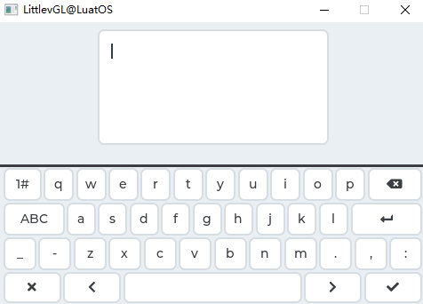

上述效果的示例代码：

```lua
local keyboard = {}

local  kb
local  ta

local function kb_event_cb(keyboard, e)
    if e == lvgl.EVENT_DELETE then return end
    lvgl.keyboard_def_event_cb(kb, e);
    if(e == lvgl.EVENT_CANCEL) then
        lvgl.keyboard_set_textarea(kb, nil);
        lvgl.obj_del(kb);
        kb = nil
    end
end

local function kb_create()
    kb = lvgl.keyboard_create(lvgl.scr_act(), nil);
    lvgl.keyboard_set_cursor_manage(kb, true);
    lvgl.obj_set_event_cb(kb, kb_event_cb);
    lvgl.keyboard_set_textarea(kb, ta);
end

local function ta_event_cb(ta_local, e)
    if(e == lvgl.EVENT_CLICKED and kb == nil) then
        kb_create()
    end
end

function keyboard.demo()
    --Create a text area. The keyboard will write here
    ta  = lvgl.textarea_create(lvgl.scr_act(), nil);
    lvgl.obj_align(ta, nil, lvgl.ALIGN_IN_TOP_MID, 0, lvgl.DPI / 16);
    lvgl.obj_set_event_cb(ta, ta_event_cb);
    lvgl.textarea_set_text(ta, "");
    local lvgl.VER_RES = lvgl.disp_get_ver_res(lvgl.disp_get_default())
    local max_h = lvgl.VER_RES / 2 - lvgl.DPI / 8;
    if(lvgl.obj_get_height(ta) > max_h) then lvgl.obj_set_height(ta, max_h)end;

    kb_create();
end

return keyboard

```


## 标签(label)

### 概述

标签是用于显示文本的基本对象类型。

### 零件和样式

标签只有一个主要部分，称为 `lvgl.LABEL_PART_MAIN` 。它使用所有典型的背景属性和文本属性。填充值可用于使文本的区域在相关方向上变小。

### 用法

#### 设定文字

可以在运行时使用 `lvgl.label_set_text(label, "New text")` 在标签上设置文本。它将动态分配一个缓冲区，并将提供的字符串复制到该缓冲区中。因此，在该函数返回后，无需将传递给 `lvgl.label_set_text` 的文本保留在范围内。

使用 `lvgl.label_set_text_fmt(label, "Value: %d", 15)` ，可以使用printf格式设置文本。

标签能够显示来自0终止的静态字符缓冲区的文本。为此，请使用 `lvgl.label_set_static_text(label, "Text")` 。在这种情况下，文本不会存储在动态内存中，而是直接使用给定的缓冲区。这意味着数组不能是在函数退出时超出范围的局部变量。 常数字符串可以安全地与 `lvgl.label_set_static_text` 一起使用（除非与 `lvgl.LABEL_LONG_DOT` 一起使用，因为它可以就地修改缓冲区），因为它们存储在ROM存储器中，该存储器始终可以访问。

也可以使用原始数组作为标签文本。数组不必以 `\0` 终止。在这种情况下，文本将与 `lvgl.label_set_text` 一样保存到动态存储器中。要设置原始字符数组，请使用 `lvgl.label_set_array_text(label, char_array, size)` 函数。

#### 越线

换行符由标签对象自动处理。可以使用 `\n` 换行。例如： `"line1\nline2\n\nline4"`

#### 长模式

默认情况下，标签对象的宽度会自动扩展为文本大小。否则，可以根据几种长模式策略来操纵文本：

- **lvgl.LABEL_LONG_EXPAND** - 将对象大小扩展为文本大小（默认）
- **lvgl.LABEL_LONG_BREAK** - 保持对象宽度，断开（换行）过长的线条并扩大对象高度
- **lvgl.LABEL_LONG_DOT** - 保持对象大小，打断文本并在最后一行写点（使用 `lvgl.label_set_static_text` 时不支持）
- **lvgl.LABEL_LONG_SROLL** - 保持大小并来回滚动标签
- **lvgl.LABEL_LONG_SROLL_CIRC** - 保持大小并循环滚动标签
- **lvgl.LABEL_LONG_CROP** - 保持大小并裁剪文本

可以使用 `lvgl.label_set_long_mode(label, lvgl.LABEL_LONG_...)` 指定长模式

重要的是要注意，当创建标签并设置其文本时，标签的大小已扩展为文本大小。除了默认的 `lvgl.LABEL_LONG_EXPAND` ，长模式 `lvgl.obj_set_width/height/size()` 无效。

因此，需要更改长模式，首先设置新的长模式，然后使用 `lvgl.obj_set_width/height/size()` 设置大小。

另一个重要的注意事项是 `lvgl.LABEL_LONG_DOT` 在原地操纵文本缓冲区，以便添加/删除点。当使用 `lvgl.label_set_text` 或`` lvgl.label_set_array_text`` 时，将分配一个单独的缓冲区，并且该实现细节不会被注意。 `lvgl.label_set_static_text` 并非如此！如果打算使用 `lvgl.LABEL_LONG_DOT` ，则传递给 `lvgl.label_set_static_text` 的缓冲区必须可写。

#### 文字对齐

文本的行可以使用 `lvgl.label_set_align(label, lvgl.LABEL_ALIGN_LEFT/RIGHT/CENTER)` 左右对齐。请注意，它将仅对齐线，而不对齐标签对象本身。

标签本身不支持垂直对齐；应该将标签放在更大的容器中，然后将整个标签对象对齐。

#### 文字重新着色

在文本中，可以使用命令来重新着色部分文本。例如： `"Write a #ff0000 red# word"` 。可以通过 `lvgl.label_set_recolor()` 函数分别为每个标签启用此功能。

请注意，重新着色只能在一行中进行。因此， `\n` 不应在重新着色的文本中使用，或者用 `lvgl.LABEL_LONG_BREAK` 换行，否则，新行中的文本将不会重新着色。

#### 很长的文字

Lvgl通过保存一些额外的数据（~12个字节）来加快绘图速度，可以有效地处理很长的字符（> 40k 个字符）。要启用此功能，请在lvgl.conf.h中设置 `lvgl.LABEL_LONG_TXT_HINT  1`

#### 符号

标签可以在字母旁边显示符号（或单独显示）。阅读 [字体(font)](http://lvgl.100ask.net/documentation/03_overview/07_font.html#id1) 部分以了解有关符号的更多信息。

### 事件

仅 [通用事件](http://lvgl.100ask.net/documentation/03_overview/03_events.html#id2) 是按对象类型发送的。

了解有关 [事件](http://lvgl.100ask.net/documentation/03_overview/03_events.html) 的更多内容。

### 按键

对象类型不处理任何键。

了解有关 [按键](http://lvgl.100ask.net/documentation/03_overview/05_indev.html) 的更多内容。

### 范例

#### 给标签重新着色和滚动

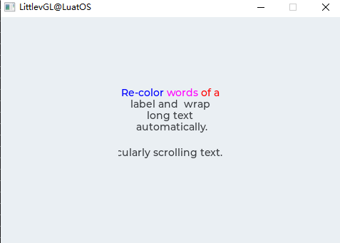

上述效果的示例代码：

```lua
local label_demo = {}

function label_demo.demo()
    local label1 = lvgl.label_create(lvgl.scr_act(), nil);
    lvgl.label_set_long_mode(label1, lvgl.LABEL_LONG_BREAK);     --Break the long lines
    lvgl.label_set_recolor(label1, true);                      --Enable re-coloring by commands in the text
    lvgl.label_set_align(label1, lvgl.LABEL_ALIGN_CENTER);       --Center aligned lines
    lvgl.label_set_text(label1, "#0000ff Re-color# #ff00ff words# #ff0000 of a# label and  wrap long text automatically.");
    lvgl.obj_set_width(label1, 150);
    lvgl.obj_align(label1, nil, lvgl.ALIGN_CENTER, 0, -30);

    local label2 = lvgl.label_create(lvgl.scr_act(), nil);
    lvgl.label_set_long_mode(label2, lvgl.LABEL_LONG_SROLL_CIRC);     --Circular scroll
    lvgl.obj_set_width(label2, 150);
    lvgl.label_set_text(label2, "It is a circularly scrolling text. ");
    lvgl.obj_align(label2, nil, lvgl.ALIGN_CENTER, 0, 30);
end

return label_demo

```


## LED(led)

### 概述

LED是矩形（或圆形）对象。它的亮度可以调节。亮度降低时，LED的颜色会变暗。

### 零件和样式

LED只有一个主要部分，称为 `lvgl.LED_PART_MAIN` ，它使用所有典型的背景样式属性。

### 用法

#### 亮度

可以使用 `lvgl.led_set_bright(led, bright)` 设置它们的亮度。亮度应介于0（最暗）和255（最亮）之间。

#### 切换

使用 `lvgl.led_on(led)` 和 `lvgl.led_off(led)` 将亮度设置为预定义的ON或OFF值。 `lvgl.led_toggle(led)` 在ON和OFF状态之间切换。

### 事件

仅支持 [通用事件](http://lvgl.100ask.net/documentation/03_overview/03_events.html#id2)

了解有关 [事件](http://lvgl.100ask.net/documentation/03_overview/03_events.html) 的更多内容。

### 按键处理

对象类型不处理任何键。

了解有关 [按键](http://lvgl.100ask.net/documentation/03_overview/05_indev.html) 的更多内容。

### 范例

#### 自定义风格的LED

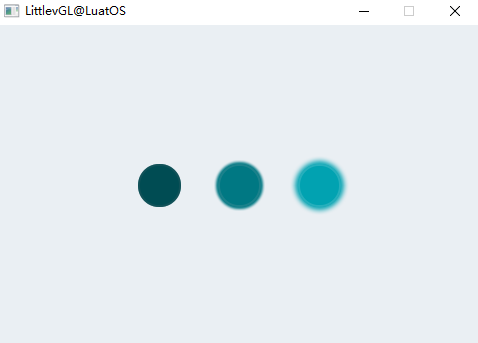

上述效果的示例代码：

```lua
local led_demo = {}

function led_demo.demo()
    --Create a LED and switch it OFF
    local led1  = lvgl.led_create(lvgl.scr_act(), nil);
    lvgl.obj_align(led1, nil, lvgl.ALIGN_CENTER, -80, 0);
    lvgl.led_off(led1);

    --Copy the previous LED and set a brightness
    local led2  = lvgl.led_create(lvgl.scr_act(), led1);
    lvgl.obj_align(led2, nil, lvgl.ALIGN_CENTER, 0, 0);
    lvgl.led_set_bright(led2, 190);

    --Copy the previous LED and switch it ON
    local led3  = lvgl.led_create(lvgl.scr_act(), led1);
    lvgl.obj_align(led3, nil, lvgl.ALIGN_CENTER, 80, 0);
    lvgl.led_on(led3);
end

return led_demo

```


## 线(line)

### 概述

Line对象能够在一组点之间绘制直线。

### 零件和样式

生产线只有一个主要部分，称为 `lvgl.LABEL_PART_MAIN` 。它使用所有线型属性。

### 用法

#### 设置点

这些点必须存储在 `lvgl.point_t` 数组中，并通过 `lvgl.line_set_points(lines, point_array, point_cnt)` 函数传递给对象。

#### 自动大小

可以根据其点自动设置线对象的大小。可以使用 `lvgl.line_set_auto_size(line, true)` 函数启用它。如果启用，则在设置点后，将根据点之间的最大x和y坐标更改对象的宽度和高度。默认情况下，自动尺寸已启用。

#### 倒y

通过默认，y == 0点位于对象的顶部。在某些情况下可能是直觉的，因此可以使用 `lvgl.line_set_y_invert(line, true)` 反转y坐标。在这种情况下，y == 0将是对象的底部。默认情况下，禁用y反转。

### 事件

仅支持 [通用事件](http://lvgl.100ask.net/documentation/03_overview/03_events.html#id2) 。

了解有关 [事件](http://lvgl.100ask.net/documentation/03_overview/03_events.html) 的更多内容。

### 按键处理

对象类型不处理任何键。

了解有关 [按键](http://lvgl.100ask.net/documentation/03_overview/05_indev.html) 的更多内容。

### 范例

#### 简单线

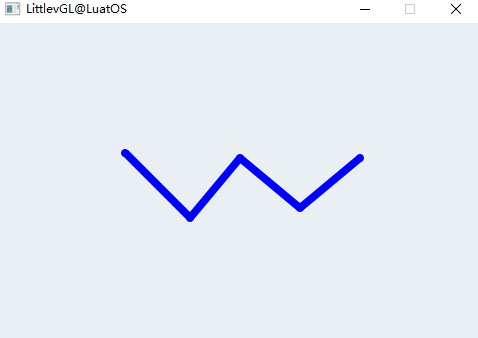

上述效果的示例代码：

```lua
local line_demo = {}

function line_demo.demo()
    --Create an array for the points of the line
    local line_points = { {5, 5}, {70, 70}, {120, 10}, {180, 60}, {240, 10} };

    --Create style
    local style_line = lvgl.style_t();
    lvgl.style_init(style_line);
    lvgl.style_set_line_width(style_line, lvgl.STATE_DEFAULT, 8);
    lvgl.style_set_line_color(style_line, lvgl.STATE_DEFAULT, lvgl.color_make(0x00, 0x00, 0xFF));
    lvgl.style_set_line_rounded(style_line, lvgl.STATE_DEFAULT, true);

    --Create a line and apply the new style
    local line1;
    line1 = lvgl.line_create(lvgl.scr_act(), nil);
    lvgl.line_set_points(line1, line_points, 5);     --Set the points
    lvgl.obj_add_style(line1, lvgl.LINE_PART_MAIN, style_line);     --Set the points
    lvgl.obj_align(line1, nil, lvgl.ALIGN_CENTER, 0, 0);
end

return line_demo

```


## 列表(list)

### 概述

列表是从背景 [页面(Page)](http://lvgl.100ask.net/documentation/04_widgets/24_page.html) 和其上的 [按钮(Buttons)](http://lvgl.100ask.net/documentation/04_widgets/04_btn.html) 构建的。按钮包含可选的类似图标的 [`图像(Image)`_](http://lvgl.100ask.net/7.11/documentation/04_widgets/20_list.html#id24) （也可以是符号）和 [`](http://lvgl.100ask.net/7.11/documentation/04_widgets/20_list.html#id2)标签(Label) [`](http://lvgl.100ask.net/7.11/documentation/04_widgets/20_list.html#id4)_。当列表足够长时，可以滚动它。

### 零件和样式

列表与 [页面(Page)](http://lvgl.100ask.net/documentation/04_widgets/24_page.html) 具有相同的部分

- `lvgl.LIST_PART_BG`
- `lvgl.LIST_PART_SCRL`
- `lvgl.LIST_PART_SCRLBAR`
- `lvgl.LIST_PART_EDGE_FLASH`

有关详细信息，请参见 [页面(Page)](http://lvgl.100ask.net/documentation/04_widgets/24_page.html) 部分。

列表上的按钮被视为普通按钮，它们只有一个主要部分，称为 `lvgl.BTN_PART_MAIN` 。

### 用法

#### 添加按钮

可以使用 `lvgl.list_add_btn(list, &icon_img, "Text")` 或符号 `lvgl.list_add_btn(list, SYMBOL_EDIT, "Edit text")` 添加新的列表元素（按钮）。如果不想添加图像，请使用 `NULL` 作为图像源。该函数返回指向创建的按钮的指针，以允许进行进一步的配置。

按钮的宽度根据对象的宽度设置为最大。按钮的高度会根据内容自动调整。 （内容高度+ padding_top + padding_bottom）。

标签以 `lvgl.LABEL_LONG_SROLL_CIRC` 长模式创建，以自动循环滚动长标签。

`lvgl.list_get_btn_label(list_btn)` 和 `lvgl.list_get_btn_img(list_btn)` 可用于获取标签和列表按钮的图像。可以直接使用 `lvgl.list_get_btn_text(list_btn)` 来输入文本。

#### 删除按钮

要删除列表元素，请使用 `lvgl.list_remove(list, btn_index)` 。可以通过 `lvgl.list_get_btn_index(list, btn)` 获得btn_index，其中btn是 `lvgl.list_add_btn()` 的返回值。

要清除列表（删除所有按钮），请使用 `lvgl.list_clean(list)`

#### 手动导航

可以使用 `lvgl.list_up(list)` 和 `lvgl.list_down(list)` 在列表中手动导航。

可以使用 `lvgl.list_focus(btn, lvgl.ANIM_ON/OFF)` 直接关注按钮。

上/下/焦点移动的动画时间可以通过以下命令设置： `lvgl.list_set_anim_time(list, anim_time)` 。动画时间为零表示不是动画。

#### 布局

默认情况下，列表是垂直的。要获取水平列表，请使用 `lvgl.list_set_layout(list, lvgl.LAYOUT_ROW_MID)` 。

#### 边缘闪烁

当列表到达最高或最低位置时，可以显示类似圆圈的效果。 `lvgl.list_set_edge_flash(list, true)` 启用此功能。

#### 滚动传播

如果列表是在其他可滚动元素（例如 [页面(Page)](http://lvgl.100ask.net/documentation/04_widgets/24_page.html) ）上创建的，并且列表无法进一步滚动，则滚动可以传播到父级。这样，滚动将在父级上继续。可以通过lvgl.list_set_scroll_propagation（list，true）启用它

### 事件

仅支持 [通用事件](http://lvgl.100ask.net/documentation/03_overview/03_events.html#id2) 。

了解有关 [事件](http://lvgl.100ask.net/documentation/03_overview/03_events.html) 的更多内容。

### 按键处理

列表处理以下按键：

- **lvgl.KEY_RIGHT/DOWN** 选择下一个按钮
- **lvgl.KEY_LEFT/UP** 选择上一个按钮

请注意，与往常一样， `lvgl.KEY_ENTER` 的状态会转换为 `lvgl.EVENT_PRESSED/PRESSING/RELEASED` 等。

所选按钮处于 `lvgl.BTN_STATE_PR/TG_PR` 状态。

要手动选择按钮，请使用 `lvgl.list_set_btn_selected(list, btn)` 。当列表散焦并再次聚焦时，它将恢复最后选择的按钮。

了解有关 [按键](http://lvgl.100ask.net/documentation/03_overview/05_indev.html) 的更多内容。

### 范例

#### 简单的列表

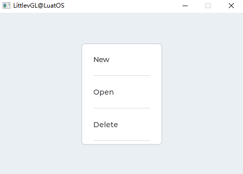

上述效果的示例代码：

```lua
local list_demo = {}

local function event_handler(obj, event)
    if(event == lvgl.EVENT_CLICKED) then
        print(string.format("Clicked: %s\n", lvgl.list_get_btn_text(obj)));
    end
end

function list_demo.demo()
    --Create a list
    local list1 = lvgl.list_create(lvgl.scr_act(), nil);
    lvgl.obj_set_size(list1, 160, 200);
    lvgl.obj_align(list1, nil, lvgl.ALIGN_CENTER, 0, 0);

    --Add buttons to the list
    local list_btn;

    list_btn = lvgl.list_add_btn(list1, lvgl.SYMBOL_FILE, "New");
    lvgl.obj_set_event_cb(list_btn, event_handler);

    list_btn = lvgl.list_add_btn(list1, lvgl.SYMBOL_DIRECTORY, "Open");
    lvgl.obj_set_event_cb(list_btn, event_handler);

    list_btn = lvgl.list_add_btn(list1, lvgl.SYMBOL_CLOSE, "Delete");
    lvgl.obj_set_event_cb(list_btn, event_handler);

    list_btn = lvgl.list_add_btn(list1, lvgl.SYMBOL_EDIT, "Edit");
    lvgl.obj_set_event_cb(list_btn, event_handler);

    list_btn = lvgl.list_add_btn(list1, lvgl.SYMBOL_SAVE, "Save");
    lvgl.obj_set_event_cb(list_btn, event_handler);

    list_btn = lvgl.list_add_btn(list1, lvgl.SYMBOL_BELL, "Notify");
    lvgl.obj_set_event_cb(list_btn, event_handler);

    list_btn = lvgl.list_add_btn(list1, lvgl.SYMBOL_BATTERY_FULL, "Battery");
    lvgl.obj_set_event_cb(list_btn, event_handler);
end

return list_demo

```


## 仪表(弧形刻度)(lmeter)

### 概述

线表对象由一些绘制比例的径向线组成。设置线表的值将按比例更改刻度线的颜色。

### 零件和样式

线表只有一个主要部分，称为 `lvgl.LINEMETER_PART_MAIN` 。它使用所有典型的背景属性绘制矩形或圆形背景，并使用line和scale属性绘制比例线。活动行（与较小的值相关，即当前值）的颜色从line_color到scale_grad_color。最后（当前值之后）的行设置为scale_end_color color。

### 用法

#### 设定数值

用 `lvgl.linemeter_set_value(linemeter, new_value)` 设置新值时，比例的比例部分将重新着色。

#### 范围和角度

`lvgl.linemeter_set_range(linemeter, min, max)` 函数设置线表的范围。

可以通过 `lvgl.linemeter_set_scale(linemeter, angle, line_num)` 设置比例尺的角度和行数。默认角度为240，默认行号为31。

#### 角度偏移

默认情况下，刻度角相对于y轴对称地解释。这导致“站立”线表。使用 `lvgl.linemeter_set_angle_offset` 可以添加缩放角度的偏移量。它可以用于例如将四分之一线表放到角落或将半线表放到右侧或左侧。

#### 镜像

默认情况下，线表的线路是顺时针激活的。可以使用 `lvgl.linemeter_set_mirror(linemeter, true/false)` 进行更改。

### 事件

仅支持 [通用事件](http://lvgl.100ask.net/documentation/03_overview/03_events.html#id2) 。

了解有关 [事件](http://lvgl.100ask.net/documentation/03_overview/03_events.html) 的更多内容。

### 按键处理

对象类型不处理任何键。

了解有关 [按键](http://lvgl.100ask.net/documentation/03_overview/05_indev.html) 的更多内容。

### 范例

#### 简单的仪表

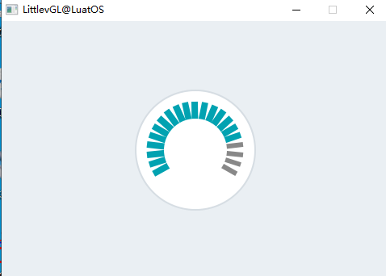

上述效果的示例代码：

```lua
local lmeter_demo = {}

function lmeter_demo.demo()
    --Create a line meter
    local lmeter;
    lmeter = lvgl.linemeter_create(lvgl.scr_act(), nil);
    lvgl.linemeter_set_range(lmeter, 0, 100);                   --Set the range
    lvgl.linemeter_set_value(lmeter, 80);                       --Set the current value
    lvgl.linemeter_set_scale(lmeter, 240, 21);                  --Set the angle and number of lines
    lvgl.obj_set_size(lmeter, 150, 150);
    lvgl.obj_align(lmeter, nil, lvgl.ALIGN_CENTER, 0, 0);
end

return lmeter_demo

```


## 消息框(msdbox)

### 概述

消息框充当弹出窗口。它们由背景容器，标签和按钮的 [按钮矩阵(lvgl.imgbtn)](http://lvgl.100ask.net/documentation/04_widgets/05_btnmatrix.html) 构建而成。

文本将自动分成多行（具有 `lvgl.LABEL_LONG_MODE_BREAK` ），高度将自动设置为包含文本和按钮（ `lvgl.FIT_TIGHT` 垂直放置）-

### 零件和样式

消息框的主要部分称为 `lvgl.MSGBOX_PART_MAIN` ，它使用所有典型的背景样式属性。使用填充会增加侧面的空间。pad_inner将在文本和按钮之间添加空格。标签样式属性会影响文本样式。

按钮部分与 [按钮矩阵(lvgl.imgbtn)](http://lvgl.100ask.net/documentation/04_widgets/05_btnmatrix.html) 的情况相同：

- `lvgl.MSGBOX_PART_BTN_BG` 按钮的背景
- `lvgl.MSGBOX_PART_BTN` 按钮

### 用法

#### 设置文本

要设置文本，请使用 `lvgl.msgbox_set_text(msgbox, "My text")` 函数。不仅将保存文本指针，而且文本也可以位于局部变量中。

#### 添加按钮

要添加按钮，请使用 `lvgl.msgbox_add_btns(msgbox, btn_str)` 函数。需要指定按钮的文本，例如 `const char * btn_str[] = {"Apply", "Close", ""}` 。有关更多信息，请访问Button矩阵文档。

仅当首次调用 `lvgl.msgbox_add_btns()` 时，才会创建 [按钮矩阵(lvgl.imgbtn)](http://lvgl.100ask.net/documentation/04_widgets/05_btnmatrix.html)。

#### 自动关闭

使用 `lvgl.msgbox_start_auto_close(mbox, delay)` 可以在动画 `延迟(delay)` 了几毫秒后自动关闭消息框。 `lvgl.mbox_stop_auto_close(mbox)` 函数停止启动的自动关闭。

关闭动画的持续时间可以通过 `lvgl.mbox_set_anim_time(mbox, anim_time)` 设置。

### 事件

除了 [通用事件](http://lvgl.100ask.net/documentation/03_overview/03_events.html#id2) ，复选框还支持以下 [特殊事件](http://lvgl.100ask.net/documentation/03_overview/03_events.html#id7) ：

- **lvgl.EVENT_VALUE_CHANGED** 单击按钮时发送。事件数据设置为单击按钮的ID。

消息框具有一个默认的事件回调，当单击按钮时，该事件回调将自行关闭。

了解有关 [事件](http://lvgl.100ask.net/documentation/03_overview/03_events.html) 的更多内容。

### 按键处理

消息框可处理以下按键：

- **lvgl.KEY_RIGHT/DOWN** 选择下一个按钮
- **lvgl.KEY_LEFT/TOP** 选择上一个按钮
- **lvgl.KEY_ENTER** 单击选定的按钮

了解有关 [按键](http://lvgl.100ask.net/documentation/03_overview/05_indev.html) 的更多内容。

### 范例

#### 简单消息框


上述效果的示例代码：

```lua
local msdbox_demo = {}

local function event_handler(obj, event)
    if(event == lvgl.EVENT_VALUE_CHANGED) then
        print(string.format("Button: %s\n", lvgl.msgbox_get_active_btn_text(obj)));
    end
end

function msdbox_demo.demo()
    local  btns ={"Apply", "Close", ""};

    local mbox1 = lvgl.msgbox_create(lvgl.scr_act(), NULL);
    lvgl.msgbox_set_text(mbox1, "A message box with two buttons.");
    lvgl.msgbox_add_btns(mbox1, btns);----
    lvgl.obj_set_width(mbox1, 200);
    lvgl.obj_set_event_cb(mbox1, event_handler);
    lvgl.obj_align(mbox1, nil, lvgl.ALIGN_CENTER, 0, 0); --Align to the corner
end

return msdbox_demo

```


## 对象遮罩(objmask)

### 概述

对象遮罩能够向绘图对象添加一些遮罩。

### 零件和样式

对象遮罩只有一个主要部分`lvgl.OBJMASK_PART_BG`，它使用典型的背景样式属性。

### 用法

#### 添加遮罩

在向*对象遮罩*添加遮罩之前，应初始化遮罩：

```
    lvgl.draw_mask_<type>_param_t mask_param;
    lvgl.draw_mask_<type>_init(&mask_param, ...);
    lvgl.objmask_mask_t * mask_p = lvgl.objmask_add_mask(objmask, &mask_param);
```

Lvgl 支持以下掩码类型：

- **line**剪辑**线条**顶部/底部左侧/右侧的像素。可以从两个点或一个点和一个角度初始化：
- **角度**仅在给定的开始和结束角度之间保持像素
- **半径**将像素仅保留在可以具有半径的矩形内（也可以用于圆形）。可以反转以将像素保持在矩形之外。
- 垂直**淡入**淡出（根据它们的 y 位置更改像素不透明度）
- **map**使用一个 alpha 掩码（一个字节数组）来描述像素的不透明度。

遮罩中的坐标是相对于对象的。也就是说，如果对象移动，蒙版也随之移动。

有关掩码*init*函数的详细信息，请参阅下面的[API](https://docs.lvgl.io/latest/en/html/widgets/objmask.html#api)文档。

#### 更新遮罩

可以使用 更新现有掩码，其中是 的返回值。`lvgl.objmask_update_mask(objmask, mask_p, new_param)``mask_p``lvgl.objmask_add_mask`

#### 取下遮罩

可以用以下方法取下口罩 `lvgl.objmask_remove_mask(objmask, mask_p)`

### 事件

对象类型仅发送[通用事件](https://docs.lvgl.io/latest/en/html/overview/event.html#generic-events)。

了解有关[活动的](https://docs.lvgl.io/latest/en/html/overview/event.html)更多信息。

### 按键处理

对象类型不处理任何*按键信息*。

了解有关[按键](https://docs.lvgl.io/latest/en/html/overview/indev.html)更多信息。

### 范例

#### 几个对象遮罩

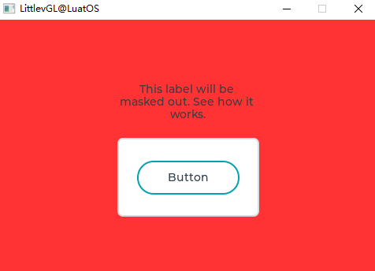

示例代码：

```lua
local objmask_demo = {}

function objmask_demo.demo()
    --Set a very visible color for the screen to clearly see what happens*/
    lvgl.obj_set_style_local_bg_color(lvgl.scr_act(), lvgl.OBJ_PART_MAIN, lvgl.STATE_DEFAULT, lvgl.color_hex3(0xf33));

    local om = lvgl.objmask_create(lvgl.scr_act(), nil);
    lvgl.obj_set_size(om, 200, 200);
    lvgl.obj_align(om, nil, lvgl.ALIGN_CENTER, 0, 0);
    local label = lvgl.label_create(om, nil);
    lvgl.label_set_long_mode(label, lvgl.LABEL_LONG_BREAK);
    lvgl.label_set_align(label, lvgl.LABEL_ALIGN_CENTER);
    lvgl.obj_set_width(label, 180);
    lvgl.label_set_text(label, "This label will be masked out. See how it works.");
    lvgl.obj_align(label, nil, lvgl.ALIGN_IN_TOP_MID, 0, 20);

    local cont = lvgl.cont_create(om, nil);
    lvgl.obj_set_size(cont, 180, 100);
    lvgl.obj_set_drag(cont, true);
    lvgl.obj_align(cont, nil, lvgl.ALIGN_IN_BOTTOM_MID, 0, -10);

    local btn = lvgl.btn_create(cont, nil);
    lvgl.obj_align(btn, nil, lvgl.ALIGN_CENTER, 0, 0);
    lvgl.obj_set_style_local_value_str(btn, lvgl.BTN_PART_MAIN, lvgl.STATE_DEFAULT, "Button");

    lvgl.refr_now(nil);
    sys.wait(1000)
    
    local a = lvgl.area_t()
    local r1 = lvgl.draw_mask_radius_param_t()
    a.x1 = 10;
    a.y1 = 10;
    a.x2 = 190;
    a.y2 = 190;
    -- lvgl.draw_mask_radius_init(r1, a, lvgl.RADIUS_CIRCLE, false);
    lvgl.draw_mask_radius_init(r1, a, 0x7FFF, false);
    lvgl.objmask_add_mask(om, r1);
    
    lvgl.refr_now(nil);
    sys.wait(1000)

    a.x1 = 100;
    a.y1 = 100;
    a.x2 = 150;
    a.y2 = 150;
    -- lvgl.draw_mask_radius_init(r1, a, lvgl.RADIUS_CIRCLE, true);
    lvgl.draw_mask_radius_init(r1, a, 0x7FFF, false);
    lvgl.objmask_add_mask(om, r1);

    lvgl.refr_now(nil);
    sys.wait(1000)

    local l1 = lvgl.draw_mask_line_param_t()
    lvgl.draw_mask_line_points_init(l1, 0, 0, 100, 200, lvgl.DRAW_MASK_LINE_SIDE_TOP);
    lvgl.objmask_add_mask(om, l1);

    lvgl.refr_now(nil);
    sys.wait(1000)

    local f1 = lvgl.draw_mask_fade_param_t()
    a.x1 = 100;
    a.y1 = 0;
    a.x2 = 200;
    a.y2 = 200;
    -- lvgl.draw_mask_fade_init(f1, a, lvgl.OPA_TRANSP, 0, lvgl.OPA_COVER, 150);
    lvgl.draw_mask_fade_init(f1, a, 0, 0, 255, 150);
    lvgl.objmask_add_mask(om, f1);
end

return objmask_demo

```


## 页面(page)

### 概述

该页面由两个相互连接的[容器](https://docs.lvgl.io/latest/en/html/widgets/cont.html)组成：

- 一个**背景**
- **可滚动**的顶部。

### 零件和样式

页面的主要部分被称为页面的`lvgl.PAGE_PART_BG`背景。它使用所有典型的背景样式属性。使用填充会在两侧增加空间。

可以通过`lvgl.PAGE_PART_SCRL`部件引用可滚动对象。它还使用所有典型的背景样式属性和填充来增加两侧的空间。

`lvgl.LIST_PART_SCROLLBAR`是背景的虚拟部分，用于绘制滚动条。使用所有典型的背景样式属性，*size*来设置滚动条的宽度，以及*pad_right*和*pad_bottom*来设置间距。

`lvgl.LIST_PART_EDGE_FLASH`也是背景的虚拟部分，当列表无法在那个方向进一步滚动时，在侧面绘制一个半圆。使用所有典型的背景属性。

### 用法

背景对象可以像页面本身一样被引用。例如设置页面的宽度：.`lvgl.obj_set_width(page, 100)`

如果在页面上创建了子项，它将自动移动到可滚动容器。如果可滚动容器变大，则可以通过拖动来滚动背景（如智能手机上的列表）。

默认情况下，可滚动的`lvgl.FIT_MAX`适合所有方向。这意味着当孩子们在背景中时，可滚动的大小将与背景的大小（减去填充）相同。但是当一个对象位于背景之外时，可滚动大小将增加以涉及它。

#### 滚动条

滚动条可以根据四种策略显示：

- `lvgl.SCRLBAR_MODE_OFF` 从不显示滚动条
- `lvgl.SCRLBAR_MODE_ON` 始终显示滚动条
- `lvgl.SCRLBAR_MODE_DRAG` 拖动页面时显示滚动条
- `lvgl.SCRLBAR_MODE_AUTO` 当可滚动容器足够大可以滚动时显示滚动条
- `lvgl.SCRLBAR_MODE_HIDE` 暂时隐藏滚动条
- `lvgl.SCRLBAR_MODE_UNHIDE` 取消隐藏以前隐藏的滚动条。也恢复原来的模式

滚动条显示策略可以通过以下方式更改：。默认值为。`lvgl.page_set_scrlbar_mode(page, SB_MODE)``lvgl.SCRLBAR_MODE_AUTO`

#### 胶水对象

一个孩子可以“粘”到页面上。在这种情况下，如果可以通过拖动该对象来滚动页面。它可以通过.`lvgl.page_glue_obj(child, true)`

#### 焦点对象

页面上的对象可以用 聚焦。它将移动可滚动容器以显示子项。动画的时间可以以毫秒为单位设置。 不必是页面的直接子级。如果可滚动对象也是该对象的祖父对象，则此方法有效。`lvgl.page_focus(page, child, lvgl.ANIM_ONO/FF)``lvgl.page_set_anim_time(page, anim_time)``child`

#### 手动导航

您可以使用和手动移动可滚动对象`lvgl.page_scroll_hor(page, dist)``lvgl.page_scroll_ver(page, dist)`

#### 边缘闪光

如果列表到达最顶部/底部/左侧/右侧位置，则可以显示类似圆形的效果。启用此功能。`lvgl.page_set_edge_flash(list, en)`

#### 滚动传播

如果列表是在其他可滚动元素（如其他页面）上创建的，并且页面无法进一步滚动，则滚动可以传播到父级以继续在父级上滚动。它可以启用`lvgl.page_set_scroll_propagation(list, true)`

#### 清理页面

页面上创建的所有对象都可以使用`lvgl.page_clean(page)`. 请注意，`lvgl.obj_clean(page)`这在这里不起作用，因为它也会删除可滚动对象。

#### 可滚动API

有直接设置/获取可滚动属性的函数：

- `lvgl.page_get_scrl()`
- `lvgl.page_set_scrl_fit/fint2/fit4()`
- `lvgl.page_set_scrl_width()`
- `lvgl.page_set_scrl_height()`
- `lvgl.page_set_scrl_fit_width()`
- `lvgl.page_set_scrl_fit_height()`
- `lvgl.page_set_scrl_layout()`

### 事件

对象类型仅发送[通用事件](https://docs.lvgl.io/latest/en/html/overview/event.html#generic-events)。

可滚动对象有一个默认事件回调，它将以下事件传播到背景对象： `lvgl.EVENT_PRESSED`, `lvgl.EVENT_PRESSING`, `lvgl.EVENT_PRESS_LOST`, `lvgl.EVENT_RELEASED`, `lvgl.EVENT_SHORT_CLICKED`, `lvgl.EVENT_CLICKED`, `lvgl.EVENT_LONG_PRESSED`,`lvgl.EVENT_LONG_PRESSED_REPEAT`

了解有关[活动的](https://docs.lvgl.io/latest/en/html/overview/event.html)更多信息。

### 按键处理

以下*Keys*由 Page 处理：

- **lvgl.KEY_RIGHT/LEFT/UP/DOWN**滚动页面

了解有关[密钥的](https://docs.lvgl.io/latest/en/html/overview/indev.html)更多信息。

### 范例

#### 带滚动条的页面

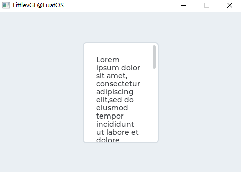

上述效果的示例代码：

```lua
local page_demo = {}

function page_demo.demo()
    --Create a page
    local page = lvgl.page_create(lvgl.scr_act(), nil);
    lvgl.obj_set_size(page, 150, 200);
    lvgl.obj_align(page, nil, lvgl.ALIGN_CENTER, 0, 0);

    --Create a label on the page
    local label = lvgl.label_create(page, nil);
    lvgl.label_set_long_mode(label, lvgl.LABEL_LONG_BREAK);            --Automatically break long lines
    lvgl.obj_set_width(label, lvgl.page_get_width_fit(page));          --Set the label width to max value to not show hor. scroll bars
    lvgl.label_set_text(label, 
[[Lorem ipsum dolor sit amet, consectetur adipiscing elit,sed do eiusmod tempor incididunt ut labore et dolore magna aliqua.
Ut enim ad minim veniam, quis nostrud exercitation ullamco
laboris nisi ut aliquip ex ea commodo consequat. Duis aute irure
dolor in reprehenderit in voluptate velit esse cillum dolore
eu fugiat nulla pariatur.
Excepteur sint occaecat cupidatat non proident, sunt in culpa
qui officia deserunt mollit anim id est laborum.]]);
end

return page_demo

```


## 滚轮(roller)

### 概述

滚筒允许通过滚动简单地从多个选项中选择一个选项。

### 零件和样式

滚筒的主要部件称为 `lvgl.ROLLER_PART_BG` 。它是一个矩形，并使用所有典型的背景属性。 Roller标签的样式继承自背景的文本样式属性。 要调整选项之间的间距，请使用text_line_space样式属性。填充样式属性设置了侧面的空间。

中间的选定选项可以用 `lvgl.ROLLER_PART_SELECTED` 虚拟零件引用。除了典型的背景属性外，它还使用文本属性来更改所选区域中文本的外观。

### 用法

#### 设定选项

这些选项作为带有 `lvgl.roller_set_options(roller, options, lvgl.ROLLER_MODE_NORMAL/INFINITE)` 的字符串传递给Roller。选项应用 `\n` 分隔。例如： `"First\nSecond\nThird"` 。

`lvgl.ROLLER_MODE_INFINITE` 使滚子呈圆形。

可以使用 `lvgl.roller_set_selected(roller, id, lvgl.ANIM_ON/OFF)` 手动选择选项，其中id是选项的索引。

#### 获取选择的选项

使用 `lvgl.roller_get_selected(roller)` 获取当前选定的选项，它将返回选定选项的索引。

`lvgl.roller_get_selected_str(roller, buf, buf_size)` 将所选选项的名称复制到 `buf` 。

#### 选项对齐

要水平对齐标签，请使用 `lvgl.roller_set_align(roller, lvgl.LABEL_ALIGN_LEFT/CENTER/RIGHT)` 水平对齐标签。

#### 可见行

可见行数可以通过 `lvgl.roller_set_visible_row_count(roller, num)` 进行调整

#### 动画时间

当滚轴滚动且未完全停在某个选项上时，它将自动滚动到最近的有效选项。可以通过 `lvgl.roller_set_anim_time(roller, anim_time)` 更改此滚动动画的时间。动画时间为零表示没有动画。

### 事件

除了 [通用事件](http://lvgl.100ask.net/documentation/03_overview/03_events.html#id2) ，滚筒还支持以下 [特殊事件](http://lvgl.100ask.net/documentation/03_overview/03_events.html#id7) ：

- **lvgl.EVENT_VALUE_CHANGED** 选定新选项时发送

了解有关 [事件](http://lvgl.100ask.net/documentation/03_overview/03_events.html) 的更多内容。

### 按键处理

以下按键由按钮处理：

- **lvgl.KEY_RIGHT/DOWN** 选择下一个选项
- **lvgl.KEY_LEFT/UP** 选择上一个选项
- **LY_KEY_ENTER** 应用选定的选项（发送lvgl.EVENT_VALUE_CHANGED事件）

了解有关 [按键](http://lvgl.100ask.net/documentation/03_overview/05_indev.html) 的更多内容。

### 范例

#### 简易滚筒

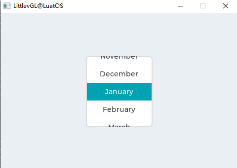

上述效果的示例代码：

```lua
local roller_demo = {}

local function event_handler(obj, event)
    if(event == lvgl.EVENT_VALUE_CHANGED) then
        local buf = lvgl.roller_get_selected_str(obj, 20);
        print(string.format("Selected month: %s\n", buf))
    end
end

function roller_demo.demo()
    local roller1 = lvgl.roller_create(lvgl.scr_act(), nil);
    lvgl.roller_set_options(roller1,
[[January
February
March
April
May
June
July
August
September
October
November
December]],
lvgl.ROLLER_MODE_INFINITE);

    lvgl.roller_set_visible_row_count(roller1, 4);
    lvgl.obj_align(roller1, nil, lvgl.ALIGN_CENTER, 0, 0);
    lvgl.obj_set_event_cb(roller1, event_handler);
end

return roller_demo

```


## 滑块(slider)

### 概述

滑杆对象看起来像是带有旋钮的 `进度条(lvgl.bar)` 。可以拖动该旋钮以设置一个值。滑块也可以是垂直或水平的。

### 零件和样式

滑块的主要部分称为 `lvgl.SLIDER_PART_BG` ，它使用典型的背景样式属性。

`lvgl.SLIDER_PART_INDIC` 是一个虚拟部件，它也使用所有典型的背景属性。默认情况下，指标的最大大小与背景的大小相同，但在 `lvgl.SLIDER_PART_BG` 中设置正填充值将使指标变小。 （负值会使它变大） 如果在指示器上使用了值样式属性，则将根据指示器的当前大小来计算对齐方式。例如，中心对齐值始终显示在指示器的中间，无论其当前大小如何。

`lvgl.SLIDER_PART_KNOB` 是一个虚拟部件，使用所有典型的背景属性来描述旋钮。与指示器类似，值文本也与旋钮的当前位置和大小对齐。默认情况下，旋钮是正方形（具有半径），其边长等于滑块的较小边。 可以使用填充值使旋钮变大。填充值也可以是不对称的。

### 用法

### 值和范围

要设置初始值，请使用 `lvgl.slider_set_value(slider, new_value, lvgl.ANIM_ON/OFF)` 。 `lvgl.slider_set_anim_time(slider, anim_time)` 设置动画时间（以毫秒为单位）。

要指定范围（最小，最大值），可以使用 `lvgl.slider_set_range(slider, min , max)` 。

### 对称范围

除普通类型外，滑块还可以配置为两种其他类型：

- **lvgl.SLIDER_TYPE_NORMAL** 普通型
- **lvgl.SLIDER_TYPE_SYMMETRICAL** 将指标对称地绘制为零（从零开始，从左到右）
- **lvgl.SLIDER_TYPE_RANGE** 允许为左（起始）值使用附加旋钮。 （可与 `lvgl.slider_set/get_left_value()` 一起使用）

可以使用 `lvgl.slider_set_type(slider, lvgl.SLIDER_TYPE_...)` 更改类型

### 仅旋钮模式

通常，可以通过拖动旋钮或单击滑块来调整滑块。在后一种情况下，旋钮移动到所单击的点，并且滑块值相应地变化。在某些情况下，希望将滑块设置为仅在拖动旋钮时做出反应。

通过调用 `lvgl.obj_set_adv_hittest(slider, true);` 启用此功能。

### 事件

除了 [通用事件](http://lvgl.100ask.net/documentation/03_overview/03_events.html#id2) ，滑杆还支持以下 [特殊事件](http://lvgl.100ask.net/documentation/03_overview/03_events.html#id7) ：

- **lvgl.EVENT_VALUE_CHANGED** 在使用键拖动或更改滑块时发送。拖动滑块时（仅当释放时）连续发送事件。使用lvgl.slider_is_dragged确定滑块是被拖动还是刚刚释放。

了解有关 [事件](http://lvgl.100ask.net/documentation/03_overview/03_events.html) 的更多内容。

### 按键处理

滑杆可处理以下按键：

- **lvgl.KEY_UP, lvgl.KEY_RIGHT** 将滑块的值增加1
- **lvgl.KEY_DOWN, lvgl.KEY_LEFT** 将滑块的值减1

了解有关 [按键](http://lvgl.100ask.net/documentation/03_overview/05_indev.html) 的更多内容。

### 范例

#### 自定义样式的滑块

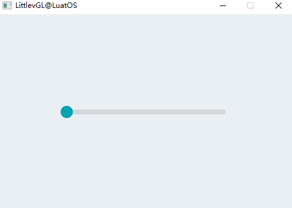

上述效果的示例代码：

```lua
local slider_demo = {}

local function event_handler(obj, event)
    if(event == lvgl.EVENT_VALUE_CHANGED) then
        print(string.format("Value: %d\n", lvgl.slider_get_value(obj)));
    end
end

function slider_demo.demo()
    --Create a slider
    local slider = lvgl.slider_create(lvgl.scr_act(), nil);
    lvgl.obj_align(slider, nil, lvgl.ALIGN_CENTER, 0, 0);
    lvgl.obj_set_event_cb(slider, event_handler);
end

return slider_demo

```


## 微调器(spinbox)

### 概述

数字调整框包含一个数字文本，可通过按键或API函数增加或减少数字。 数字调整框的下面是修改后的 [文本框(lvgl.textarea)](http://lvgl.100ask.net/documentation/04_widgets/32_textarea.html) 。

### 零件和样式

数字调整框的主要部分称为 `lvgl.SPINBOX_PART_BG` ，它是使用所有典型背景样式属性的矩形背景。它还使用其文本样式属性描述标签的样式。

`lvgl.SPINBOX_PART_CURSOR` 是描述光标的虚拟部分。阅读文本区域文档以获取详细说明。

### 用法

### 设定格式

`lvgl.spinbox_set_digit_format(spinbox, digit_count, separator_position)` 设置数字的格式。 `digit_count` 设置位数。前导零被添加以填充左侧的空间。 `spacer_position` 设置小数点前的位数。 0表示没有小数点。

`lvgl.spinbox_set_padding_left(spinbox, cnt)` 在符号之间最左边的数字之间添加 `cnt` “空格”字符。

### 值和范围

`lvgl.spinbox_set_range(spinbox, min, max)` 设置Spinbox的范围。

`lvgl.spinbox_set_value(spinbox, num)` 手动设置Spinbox的值。

`lvgl.spinbox_increment(spinbox)` 和 `lvgl.spinbox_decrement(spinbox)` 递增/递减Spinbox的值。

`lvgl.spinbox_set_step(spinbox, step)` 设置增量减量。

### 事件

除了 [通用事件](http://lvgl.100ask.net/documentation/03_overview/03_events.html#id2) ，数字调整框还支持以下 [特殊事件](http://lvgl.100ask.net/documentation/03_overview/03_events.html#id7) ：

- **lvgl.EVENT_VALUE_CHANGED** 值更改时发送。 （将该值设置为int32_t作为事件数据）
- **lvgl.EVENT_INSERT** 由父“文本”区域发送，但不应使用。

了解有关 [事件](http://lvgl.100ask.net/documentation/03_overview/03_events.html) 的更多内容。

### 按键处理

数字调整框支持一下按键：

- **lvgl.KEY_LEFT/RIGHT** 使用键盘向左/向右移动光标。使用编码器递减/递增所选数字。
- **LY_KEY_ENTER** 应用选定的选项（发送lvgl.EVENT_VALUE_CHANGED事件并关闭下拉列表）
- **lvgl.KEY_ENTER** 随着编码器得到的净数字。跳到最后一个之后的第一个。

了解有关 [按键](http://lvgl.100ask.net/documentation/03_overview/05_indev.html) 的更多内容。

### 范例

#### 简单的数字调整框

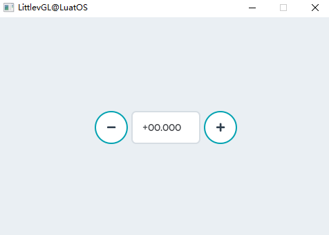

上述效果的示例代码：

```lua
local spinbox_demo = {}

local spinbox

local function lvgl.spinbox_increment_event_cb(btn, e)
    if(e == lvgl.EVENT_SHORT_CLICKED or e == lvgl.EVENT_LONG_PRESSED_REPEAT) then
        lvgl.spinbox_increment(spinbox);
    end
end

local function lvgl.spinbox_decrement_event_cb(btn, e)
    if(e == lvgl.EVENT_SHORT_CLICKED or e == lvgl.EVENT_LONG_PRESSED_REPEAT) then
        lvgl.spinbox_decrement(spinbox);
    end
end

function spinbox_demo.demo()
    spinbox = lvgl.spinbox_create(lvgl.scr_act(), nil);
    lvgl.spinbox_set_range(spinbox, -1000, 90000);
    lvgl.spinbox_set_digit_format(spinbox, 5, 2);
    lvgl.spinbox_step_prev(spinbox);
    lvgl.obj_set_width(spinbox, 100);
    lvgl.obj_align(spinbox, nil, lvgl.ALIGN_CENTER, 0, 0);

    local h = lvgl.obj_get_height(spinbox);
    local btn = lvgl.btn_create(lvgl.scr_act(), nil);
    lvgl.obj_set_size(btn, h, h);
    lvgl.obj_align(btn, spinbox, lvgl.ALIGN_OUT_RIGHT_MID, 5, 0);
    lvgl.theme_apply(btn, lvgl.THEME_SPINBOX_BTN);
    lvgl.obj_set_style_local_value_str(btn, lvgl.BTN_PART_MAIN, lvgl.STATE_DEFAULT, lvgl.SYMBOL_PLUS);
    lvgl.obj_set_event_cb(btn, lvgl.spinbox_increment_event_cb);

    btn = lvgl.btn_create(lvgl.scr_act(), btn);
    lvgl.obj_align(btn, spinbox, lvgl.ALIGN_OUT_LEFT_MID, -5, 0);
    lvgl.obj_set_event_cb(btn, lvgl.spinbox_decrement_event_cb);
    lvgl.obj_set_style_local_value_str(btn, lvgl.BTN_PART_MAIN, lvgl.STATE_DEFAULT, lvgl.SYMBOL_MINUS);
end

return spinbox_demo

```


## 旋转器(spinner)

### 概述

旋转器对象是边界上的旋转弧，实现旋转加载效果。

### 零件和样式

旋转器包括一下部分：

- `lvgl.SPINNER_PART_BG`: 主要部分
- `lvgl.SPINNER_PART_INDIC`: 旋转弧（虚拟部分）

零件和样式的作用与 [弧(lvgl.arc)](http://lvgl.100ask.net/documentation/04_widgets/02_arc.html) 情况相同。

### 用法

#### 弧长

圆弧的长度可以通过 `lvgl.spinner_set_arc_length(spinner, deg)` 进行调整。

#### 旋转速度

旋转速度可以通过 `lvgl.spinner_set_spin_time(preload, time_ms)` 进行调整。

#### 旋转类型

支持以下旋转类型

- **lvgl.SPINNER_TYPE_SPINNING_ARC** 旋转弧线，在顶部减速
- **lvgl.SPINNER_TYPE_FILLSPIN_ARC** 旋转弧线，在顶部放慢速度，但也伸展弧线
- **lvgl.SPINNER_TYPE_CONSTANT_ARC** 以恒定速度旋转

使用 `lvgl.spinner_set_type(preload, lvgl.SPINNER_TYPE_...)` 进行设置

#### 旋转方向

旋转方向可以通过 `lvgl.spinner_set_dir(preload, lvgl.SPINNER_DIR_FORWARD/BACKWARD)` 进行更改。

### 事件

仅支持 [通用事件](http://lvgl.100ask.net/documentation/03_overview/03_events.html#id2)

了解有关 [事件](http://lvgl.100ask.net/documentation/03_overview/03_events.html) 的更多内容。

### 按键处理

对象类型不处理任何键。

了解有关 [按键](http://lvgl.100ask.net/documentation/03_overview/05_indev.html) 的更多内容。

### 范例

#### 简单的旋转效果

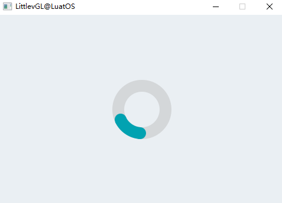

上述效果的示例代码：

```lua
local spinner_demo = {}

function spinner_demo.demo()
    --Create a Preloader object
    local preload = lvgl.spinner_create(lvgl.scr_act(), nil);
    lvgl.obj_set_size(preload, 100, 100);
    lvgl.obj_align(preload, nil, lvgl.ALIGN_CENTER, 0, 0);
end

return spinner_demo

```


## 开关(switch)

### 概述

开关可用于打开/关闭某物。它看起来像一个小滑块。

### 零件和样式

开关使用以下部分

- `lvgl.SWITCH_PART_BG` : 主要部分
- `lvgl.SWITCH_PART_INDIC` : 指标（虚拟部分）
- `lvgl.SWITCH_PART_KNOB` : 旋钮（虚拟部分）

零件和样式与 [滑杆(lvgl.slider)](http://lvgl.100ask.net/documentation/04_widgets/26_slider.html) 情况相同。阅读其文档以获取详细说明。

### 用法

#### 变更状态

可以通过单击或通过下面的函数更改开关的状态：

- `lvgl.switch_on(switch, lvgl.ANIM_ON/OFF)` 开
- `lvgl.switch_off(switch, lvgl.ANIM_ON/OFF)` 关
- `lvgl.switch_toggle(switch, lvgl.ANOM_ON/OFF)` 切换开关的位置

#### 动画时间

切换开关状态时的动画时间可以使用 `lvgl.switch_set_anim_time(switch, anim_time)` 进行调整。

### 事件

除了 [通用事件](http://lvgl.100ask.net/documentation/03_overview/03_events.html#id2) ，开关还支持以下 [特殊事件](http://lvgl.100ask.net/documentation/03_overview/03_events.html#id7) ：

- **lvgl.EVENT_VALUE_CHANGED** 在开关更改状态时发送。

了解有关 [事件](http://lvgl.100ask.net/documentation/03_overview/03_events.html) 的更多内容。

### 按键处理

开关可处理以下按键：

- **lvgl.KEY_UP, lvgl.KEY_RIGHT** 打开滑块
- **lvgl.KEY_DOWN, lvgl.KEY_LEFT** 关闭滑块

了解有关 [按键](http://lvgl.100ask.net/documentation/03_overview/05_indev.html) 的更多内容。

### 范例

#### 简单开关

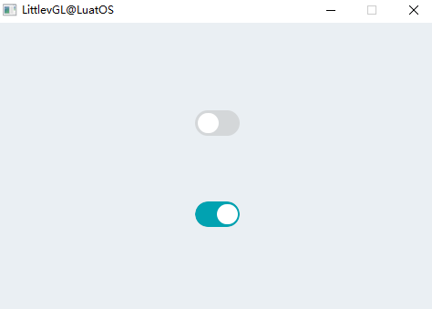

上述效果的示例代码：

```lua
local switch_demo = {}

local function event_handler(obj, event)
    if(event == lvgl.EVENT_VALUE_CHANGED) then
        if lvgl.switch_get_state(obj) == true then
            print("State: On\n")
        else
            print("State: Off\n")
        end
    end
end

function switch_demo.demo()
    --Create a switch and apply the styles
    local sw1 = lvgl.switch_create(lvgl.scr_act(), nil);
    lvgl.obj_align(sw1, nil, lvgl.ALIGN_CENTER, 0, -50);
    lvgl.obj_set_event_cb(sw1, event_handler);

    --Copy the first switch and turn it ON
    local sw2 = lvgl.switch_create(lvgl.scr_act(), sw1);
    lvgl.switch_on(sw2, lvgl.ANIM_ON);
    lvgl.obj_align(sw2, nil, lvgl.ALIGN_CENTER, 0, 50);
end

return switch_demo

```


## 表格(table)

### 概述

像往常一样，表格是从包含文本的行，列和单元格构建的。

表格对象的权重非常轻，因为仅存储了文本。没有为单元创建任何实际对象，但它们是动态绘制的。

### 零件和样式

表格的主要部分称为 `lvgl.TABLE_PART_BG` 。它是一个类似于背景的矩形，并使用所有典型的背景样式属性。

对于单元，有4个虚拟部分。每个单元格都有类型(1, 2, … 16)，该类型指示要在其上应用哪个部分的样式。单元格部分可以由 `lvgl.TABLE_PART_CELL1 + x` 引用，其中 `x` 在 `0..15` 之间。

可以在lvgl.conf.h中通过 `lvgl.TABLE_CELL_STYLE_CNT` 调整单元格类型的数量。默认情况下为4。默认的4种单元格类型部分也使用专用名称进行引用：

- `lvgl.TABLE_PART_CELL1`
- `lvgl.TABLE_PART_CELL2`
- `lvgl.TABLE_PART_CELL3`
- `lvgl.TABLE_PART_CELL4`

单元格还使用所有典型的背景样式属性。如果单元格内容中有换行符( `\n` )，则在换行符后将使用线条样式属性绘制水平分隔线。

单元格中的文本样式是从单元格部分或背景部分继承的。

### 用法

#### 行(row)和列(column)

要设置行数和列数，请使用 `lvgl.table_set_row_cnt(table, row_cnt)` 和 `lvgl.table_set_col_cnt(table, col_cnt)`

#### 宽度(width)和高度(height)

列的宽度可以使用 `lvgl.table_set_col_width(table, col_id, width)` 设置。 Table对象的总宽度将设置为列宽的总和。

高度是根据单元格样式（字体，填充等）和行数自动计算的。

#### 设定单元格数值类型

单元格只能存储文本，因此在将数字显示在表格中之前，需要将数字转换为文本。

`lvgl.table_set_cell_value(table, row, col, "Content")` 。文本由表保存，因此它甚至可以是局部变量。

可以在 `"Value\n60.3"` 之类的文本中使用换行符。

#### 对齐

可以使用 `lvgl.table_set_cell_align(table, row, col, lvgl.LABEL_ALIGN_LEFT/CENTER/RIGHT)` 调整单元格中的文本对齐方式。

#### 单元格类型(cell_type)

可以使用4种不同的单元格类型。每个都有自己的风格。

单元格类型可用于添加不同的样式，例如：

- 表头
- 第一栏
- 突出显示一个单元格
- 等等

可以使用 `lvgl.table_set_cell_type(table, row, col, type)` 选择类型， `类型(type)` 可以为1、2、3或4，对应上面的四种类型。

#### 合并单元格

单元格可以与 `lvgl.table_set_cell_merge_right(table, col, row, true)` 水平合并。要合并更多相邻的单元格，请对每个单元格应用此功能。

#### 裁剪文字

默认情况下，文字会自动换行以适合单元格的宽度，并且单元格的高度会自动设置。要禁用此功能并保持文本原样，请启用 `lvgl.table_set_cell_crop(table, row, col, true)` 。

#### 滚动

使表格可滚动放置在 [页面(lvgl.page)](http://lvgl.100ask.net/documentation/04_widgets/24_page.html) 上

### 事件

仅支持 [通用事件](http://lvgl.100ask.net/documentation/03_overview/03_events.html#id2)

了解有关 [事件](http://lvgl.100ask.net/documentation/03_overview/03_events.html) 的更多内容。

### 按键处理

对象类型不处理任何键。

了解有关 [按键](http://lvgl.100ask.net/documentation/03_overview/05_indev.html) 的更多内容。

### 范例

#### 简单的表格

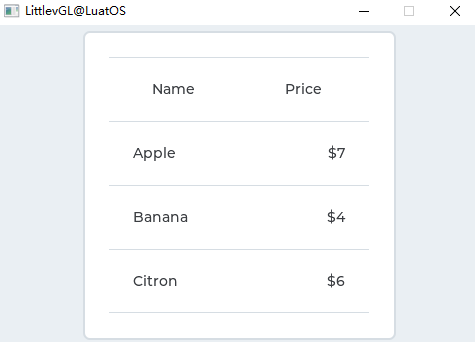

上述效果的示例代码：

```lua
local table_demo = {}

function table_demo.demo()
    local table = lvgl.table_create(lvgl.scr_act(), nil);
    lvgl.table_set_col_cnt(table, 2);
    lvgl.table_set_row_cnt(table, 4);
    lvgl.obj_align(table, nil, lvgl.ALIGN_CENTER, 0, 0);

    --Make the cells of the first row center aligned 
    lvgl.table_set_cell_align(table, 0, 0, lvgl.LABEL_ALIGN_CENTER);
    lvgl.table_set_cell_align(table, 0, 1, lvgl.LABEL_ALIGN_CENTER);

    --Align the price values to the right in the 2nd column
    lvgl.table_set_cell_align(table, 1, 1, lvgl.LABEL_ALIGN_RIGHT);
    lvgl.table_set_cell_align(table, 2, 1, lvgl.LABEL_ALIGN_RIGHT);
    lvgl.table_set_cell_align(table, 3, 1, lvgl.LABEL_ALIGN_RIGHT);

    lvgl.table_set_cell_type(table, 0, 0, 2);
    lvgl.table_set_cell_type(table, 0, 1, 2);


    --Fill the first column
    lvgl.table_set_cell_value(table, 0, 0, "Name");
    lvgl.table_set_cell_value(table, 1, 0, "Apple");
    lvgl.table_set_cell_value(table, 2, 0, "Banana");
    lvgl.table_set_cell_value(table, 3, 0, "Citron");

    --Fill the second column
    lvgl.table_set_cell_value(table, 0, 1, "Price");
    lvgl.table_set_cell_value(table, 1, 1, "$7");
    lvgl.table_set_cell_value(table, 2, 1, "$4");
    lvgl.table_set_cell_value(table, 3, 1, "$6");

end

return table_demo

```


## 标签视图(tabview)

### 概述

页签对象可用于组织选项卡中的内容。

### 零件和样式

Tab视图对象包含几个部分。主要是 `lvgl.TABVIEW_PART_BG` 。它是一个矩形容器，用于容纳Tab视图的其他部分。

在背景上创建了2个重要的实际部分：

- `lvgl.TABVIEW_PART_BG_SCRL` 这是 [页面(lvgl.page)](http://lvgl.100ask.net/documentation/04_widgets/24_page.html) 的可滚动部分。它使选项卡的内容彼此相邻。页面的背景始终是透明的，不能从外部访问。
- `lvgl.TABVIEW_PART_TAB_BG` 选项卡按钮是一个 [按钮矩阵(lvgl.btnmatrix)](http://lvgl.100ask.net/documentation/04_widgets/05_btnmatrix.html) 。单击按钮将 `lvgl.TABVIEW_PART_BG_SCRL` 滚动到相关选项卡的内容。可以通过 `lvgl.TABVIEW_PART_TAB_BTN` 访问选项卡按钮。选择选项卡时，按钮处于选中状态，可以使用 `lvgl.STATE_CHECKED` 设置样式。选项卡的按钮矩阵的高度是根据字体高度加上背景和按钮样式的填充来计算的。

列出的所有部分均支持典型的背景样式属性和填充。

`lvgl.TABVIEW_PART_TAB_BG` 还有一个实际部分，即一个指标，称为 `lvgl.TABVIEW_PART_INDIC` 。它是当前选定选项卡下的一个类似矩形的细对象。当选项卡视图是动画到其它选项卡中的指示器也将被动画。它可以是使用典型背景样式属性的样式。 size样式属性将设置其厚度。

添加新选项卡后，将在 `lvgl.TABVIEW_PART_BG_SCRL` 上为其创建一个页面，并将新按钮添加到 `lvgl.TABVIEW_PART_TAB_BG` 按钮矩阵。创建的页面可以用作普通页面，它们具有通常的页面部分。

### 用法

#### 添加标签

可以使用 `lvgl.tabview_add_tab(tabview, "Tab name")` 添加新标签。它将返回指向可以创建选项卡内容的 [页面(lvgl.page)](http://lvgl.100ask.net/documentation/04_widgets/24_page.html) 对象的指针。

#### 选中标签

通过下面的方法选中一标签：

- 在按钮矩阵部分上单击它
- 滑动
- 使用 `lvgl.tabview_set_tab_act(tabview, id, lvgl.ANIM_ON/OFF)` 函数

#### 更改标签的名称

要在运行时更改选项卡ID的名称（底层按钮矩阵的显示文本），可以使用函数 `lvgl.tabview_set_tab_name(tabview, id, name)` 。

#### Tab按钮的位置

默认情况下，选项卡选择器按钮位于“选项卡”视图的顶部。可以使用 `lvgl.tabview_set_btns_pos(tabview, lvgl.TABVIEW_TAB_POS_TOP/BOTTOM/LEFT/RIGHT/NONE)` 进行更改

`lvgl.TABVIEW_TAB_POS_NONE` 将隐藏选项卡。

请注意，添加标签后，您无法将标签的位置从顶部或底部更改为左侧或右侧。

#### 动画时间

动画时间由 `lvgl.tabview_set_anim_time(tabview, anim_time_ms)` 调整。加载新选项卡时使用。

#### 滚动传播

由于选项卡的内容对象是一个Page，因此它可以从其他类似Page的对象接收滚动传播。 例如，如果在选项卡的内容上创建了一个文本区域，并且滚动了该文本区域，但到达末尾，则滚动可以传播到内容页面。可以使用 [``](http://lvgl.100ask.net/7.11/documentation/04_widgets/31_tabview.html#id10)lvgl.page/textarea_set_scroll_propagation(obj, true)``启用它。

默认情况下，选项卡的内容页面已启用滚动传播，因此，当它们水平滚动时，滚动内容将传播到 `lvgl.TABVIEW_PART_BG_SCRL` ，这样页面将被滚动。

可以使用 `lvgl.page_set_scroll_propagation(tab_page, false)` 禁用手动滑动。

### 事件

除了 [通用事件](http://lvgl.100ask.net/documentation/03_overview/03_events.html#id2) ，页签还支持以下 [特殊事件](http://lvgl.100ask.net/documentation/03_overview/03_events.html#id7) ：

- **lvgl.EVENT_VALUE_CHANGED** 通过滑动或单击选项卡按钮选择新选项卡时发送

了解有关 [事件](http://lvgl.100ask.net/documentation/03_overview/03_events.html) 的更多内容。

### 按键处理

复选框可处理以下按键：

- **lvgl.KEY_RIGHT/LEFT** 选择一个标签
- **lvgl.KEY_ENTER Change** 更改为所选标签

了解有关 [按键](http://lvgl.100ask.net/documentation/03_overview/05_indev.html) 的更多内容。

### 范例

#### 简单的页签

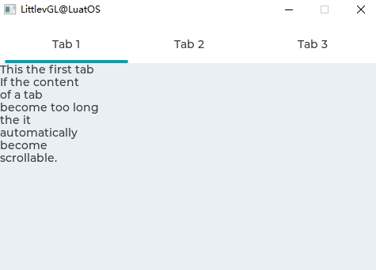

上述效果的示例代码：

```lua
local tabview_demo = {}

function tabview_demo.demo()
    --Create a Tab view object
    local tabview;
    tabview = lvgl.tabview_create(lvgl.scr_act(), nil);

    --Add 3 tabs (the tabs are page (lvgl.page) and can be scrolled
    local tab1 = lvgl.tabview_add_tab(tabview, "Tab 1");
    local tab2 = lvgl.tabview_add_tab(tabview, "Tab 2");
    local tab3 = lvgl.tabview_add_tab(tabview, "Tab 3");


    --Add content to the tabs
    local label = lvgl.label_create(tab1, nil);
    lvgl.label_set_text(label, 
[[This the first tab
If the content
of a tab
become too long
the it 
automatically
become
scrollable.]]);

    label = lvgl.label_create(tab2, nil);
    lvgl.label_set_text(label, "Second tab");

    label = lvgl.label_create(tab3, nil);
    lvgl.label_set_text(label, "Third tab");
end

return tabview_demo

```


## 文本框(textarea)

### 概述

文本框是一个带有标签和光标的 [页面(lvgl.page)](http://lvgl.100ask.net/documentation/04_widgets/24_page.html) 。可以在其中添加文本或字符。长行被换行，并且当文本变得足够长时，可以滚动文本区域。

### 零件和样式

文本框与 [页面(lvgl.page)](http://lvgl.100ask.net/documentation/04_widgets/24_page.html) 具有相同的部分。期望 `lvgl.PAGE_PART_SCRL` ，因为它不能被引用并且始终是透明的。请参阅该页面的详细文档。

除了Page部分之外，还存在虚拟 ``lvgl.TEXTAREA_PART_CURSOR` 部分来绘制光标。光标的区域始终是当前字符的边界框。可以通过在 `lvgl.TEXTAREA_PART_CURSOR` 的样式中添加背景色和背景色来创建块光标。创建行光标使光标透明并设置border_side属性。

### 用法

#### 添加文字

可以使用以下命令将文本或字符插入当前光标的位置：

- `lvgl.textarea_add_char(textarea, 'c')`
- `lvgl.textarea_add_text(textarea, "insert this text")`

要添加宽字符，例如 `'á'` , `'ß'` 或 CJK 字符(中日韩统一表意文字)，请使用 `lvgl.textarea_add_text(ta, "á")` 。

`lvgl.textarea_set_text(ta, "New text")` 更改整个文本。

#### 占位符

可以使用 `lvgl.textarea_set_placeholder_text(ta, "Placeholder text")` 指定一个占位符文本-当“文本”区域为空时显示。

#### 删除字符

要从当前光标位置的左侧删除字符，请使用 `lvgl.textarea_del_char(textarea)`

要从右边删除，请使用 `lvgl.textarea_del_char(textarea)`

#### 移动光标

可以使用 `lvgl.textarea_set_cursor_pos(textarea, 10)` 直接修改光标位置。 `0` 位置表示“在第一个字符之前”， `lvgl.TA_CURSOR_LAST` 表示“在最后一个字符之后”

可以使用

- `lvgl.textarea_cursor_right(textarea)`
- `lvgl.textarea_cursor_left(textarea)`
- `lvgl.textarea_cursor_up(textarea)`
- `lvgl.textarea_cursor_down(textarea)`

如果调用 `lvgl.textarea_set_cursor_click_pos(textarea, true)` ，则光标将跳至单击“文本”区域的位置。

#### 隐藏光标

可以使用 `lvgl.textarea_set_cursor_hidden(textarea, true)` 隐藏光标。

#### 光标闪烁时间

光标的闪烁时间可以通过 `lvgl.textarea_set_cursor_blink_time(textarea, time_ms)` 进行调整。

#### 单行模式

可以将“文本”区域配置为以 `lvgl.textarea_set_one_line(ta, true)` 为一行。在此模式下，高度自动设置为仅显示一行，忽略换行符，并且禁用自动换行。

#### 密码模式

文本区域支持可以通过 `lvgl.textarea_set_pwd_mode(textarea, true)` 启用的密码模式。

如果字体中存在 `•` ( [Bullet,U+2022](http://www.fileformat.info/info/unicode/char/2022/index.htm) ) 字符，则一段时间后或输入新字符后，输入的字符将转换为该字符。如果 `•` 不存在，将使用 `*` 。

在密码模式下 `lvgl.textarea_get_text(textarea)` 给出真实文本，而不是项目符号字符。

可见时间可以使用lvgl.textarea_set_pwd_show_time（textarea，time_ms）进行调整。

#### 文字对齐

可以使用 `lvgl.textarea_set_text_align(textarea, lvgl.LABEL_ALIGN_LET/CENTER/RIGHT)` 将文本左，中或右对齐。

在单行模式下，仅当文本保持对齐时才能水平滚动文本。

#### 字符过滤

可以使用 `lvgl.textarae_set_accepted_chars(ta, "0123456789.+-")` 设置可接受字符的列表。其他字符将被忽略。

#### 最大文字长度

最大字符数可以通过 `lvgl.textarea_set_max_length(textarea, max_char_num)` 进行限制

#### 长文本

如果“文本”区域中的文本很长（例如> 20k个字符），则其滚动和绘制速度可能会很慢。但是，通过在 lvgl.conf.h 中启用 `lvgl.LABEL_LONG_TXT_HINT 1` 可以极大地改善它。 它将保存一些有关标签的信息，以加快其绘制速度。使用 `lvgl.LABEL_LONG_TXT_HINT` ，滚动和绘图将与使用“普通”短文本一样快。

#### 选择文字

如果通过 `lvgl.textarea_set_text_sel(textarea, true)` 启用，则可以选择一部分文本。就像用鼠标在PC上选择文本时一样。

#### 滚动条

可以根据 `lvgl.textarea_set_scrollbar_mode(textarea, lvgl.SCRLBAR_MODE_...)` 设置的不同策略显示滚动条。在Page对象中了解更多信息。

#### 滚动传播

当“文本”区域在另一个可滚动对象（如“页面”）上滚动并且滚动已到达“文本”区域的边缘时，滚动可以传播到父对象。也就是说，当“文本”区域可以进一步滚动时，父级将被滚动。

可以使用 `lvgl.ta_set_scroll_propagation(ta, true)` 启用它。

在 [页面(lvgl.page)](http://lvgl.100ask.net/documentation/04_widgets/24_page.html) 对象中了解更多信息。

#### 边缘闪烁

当“文本”区域滚动到边缘时，如果通过 `lvgl.ta_set_edge_flash(ta, true)` 启用，则可以显示类似Flash动画的圆圈

### 事件

除了 [通用事件](http://lvgl.100ask.net/documentation/03_overview/03_events.html#id2) ，文本框还支持以下 [特殊事件](http://lvgl.100ask.net/documentation/03_overview/03_events.html#id7) ：

- **lvgl.EVENT_INSERT** 在插入字符或文本之前发送。事件数据是计划插入的文本。lvgl.ta_set_insert_replace（ta，“新文本”）替换要插入的文本。新文本不能位于局部变量中，该局部变量会在事件回调存在时被销毁。 “”表示请勿插入任何内容。
- **lvgl.EVENT_VALUE_CHANGED** 当文本区域的内容已更改时。
- **lvgl.EVENT_APPLY** 当lvgl.KEY_ENTER发送到处于单行模式的文本区域时。

了解有关 [事件](http://lvgl.100ask.net/documentation/03_overview/03_events.html) 的更多内容。

### 按键处理

文本框可处理以下按键：

- **lvgl.KEY_UP/DOWN/LEFT/RIGHT** 移动光标
- **Any character** 将字符添加到当前光标位置

了解有关 [按键](http://lvgl.100ask.net/documentation/03_overview/05_indev.html) 的更多内容。

### 范例

#### 简单的文本框

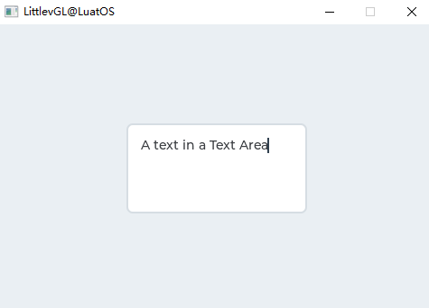

上述效果的示例代码：

```lua
local textarea = {}

local ta1;
local i = 1;
local function event_handler(obj, event)
    if(event == lvgl.EVENT_VALUE_CHANGED) then
        print(string.format("Value: %s\n", lvgl.textarea_get_text(obj)));
    elseif (event == lvgl.EVENT_LONG_PRESSED_REPEAT) then
        --For simple test: Long press the Text are to add the text below
        local txt = "\n\nYou can scroll it if the text is long enough.\n";
        if(i <= #txt) then
            lvgl.textarea_add_char(ta1, txt:byte(i));
            i=i+1;
        end
    end
end

function textarea.demo()
    ta1 = lvgl.textarea_create(lvgl.scr_act(), nil);
    lvgl.obj_set_size(ta1, 200, 100);
    lvgl.obj_align(ta1, nil, lvgl.ALIGN_CENTER, 0, 0);
    lvgl.textarea_set_text(ta1, "A text in a Text Area");    --Set an initial text
    lvgl.obj_set_event_cb(ta1, event_handler);
end

return textarea

```


## 平铺视图(tileview)

### 概述

平铺视图(Tileview)是一个容器对象，其中的元素（称为图块）可以以网格形式排列。通过滑动，用户可以在图块之间导航。

如果Tileview是屏幕尺寸的，它将提供可能已经在智能手表上看到的用户界面。

### 零件和样式

Tileview与 [页面(lvgl.page)](http://lvgl.100ask.net/documentation/04_widgets/24_page.html) 具有相同的部分。期望 `lvgl.PAGE_PART_SCRL` ，因为它不能被引用并且始终是透明的。请参阅该页面的详细文档。

### 用法

#### 有效区域

磁贴不必在每个元素都存在的地方形成完整的网格。网格中可以有孔，但必须是连续的，即不能有空的行或列。

使用 `lvgl.tileview_set_valid_positions(tileview, valid_pos_array, array_len)` 可以设置有效位置。仅可以滚动到该位置。 `0,0` 索引表示左上方的图块。 例如。 `lvgl.point_t valid_pos_array[] = {{0,0}, {0,1}, {1,1}, {{lvgl.COORD_MIN, lvgl.COORD_MIN}}` 给出了 “L” 形的图块视图。它指示 `{1,1}` 中没有图块，因此用户无法在此处滚动。

换句话说， `valid_pos_array` 告诉磁贴在哪里。可以即时更改它以禁用特定图块上的某些位置。 例如，可能存在一个2x2网格，其中添加了所有图块，但第一行（y = 0）作为“主行”，第二行（y = 1）包含其上方图块的选项。 假设水平滚动只能在主行中进行，而在第二行中的选项之间则不可能进行。在这种情况下， `valid_pos_array` 需要改变时，选择一个新的主瓦：

- 对于第一个主磁贴： `{0,0}，{0,1}，{1,0}` 以禁用 `{1,1}` 选项磁贴
- 对于第二个主磁贴： `{0,0}，{1,0}，{1,1}` 以禁用 `{0,1}` 选项磁贴

#### 设置瓷砖

设置当前可见的图块使用： `lvgl.tileview_set_tile_act(tileview, x_id, y_id, lvgl.ANIM_ON/OFF)`

#### 添加元素

要添加元素，只需在Tileview上创建一个对象并将其手动定位到所需位置即可。

`lvgl.tileview_add_element(tielview, element)` 应该用来使Tileview滚动（拖动）其元素一个。例如，如果图块上有一个按钮，则需要将该按钮显式添加到Tileview中，以使用户也可以使用该按钮滚动Tileview。

#### 滚动传播

页面状对象（如 `列表(lvgl.list)` ）的滚动传播功能在这里可以很好地使用。例如，可以有一个完整的 `列表(lvgl.list)` ，当列表到达最顶部或最底部时，用户将改为滚动图块视图。

#### 动画时间

平铺视图的动画时间可以使用 `lvgl.tileview_set_anim_time(tileview, anim_time)` 进行调整。

在以下情况下应用动画

- 使用 `lvgl.tileview_set_tile_act` 选择一个新图块
- 当前磁贴稍微滚动然后释放（还原原始标题）
- 当前磁贴滚动超过一半大小，然后释放（移至下一个磁贴）

#### 边缘闪光

当滚动到达的图块视图击中无效位置或图块视图的末尾时，可以添加 “边缘闪光” 效果。

使用 `lvgl.tileview_set_edge_flash(tileview, true)` 启用此功能。

### 事件

除了 [通用事件](http://lvgl.100ask.net/documentation/03_overview/03_events.html#id2) ，平铺视图还支持以下 [特殊事件](http://lvgl.100ask.net/documentation/03_overview/03_events.html#id7) ：

- [**](http://lvgl.100ask.net/7.11/documentation/04_widgets/33_tileview.html#id11)lvgl.EVENT_VALUE_CHANGED ** 当加载了带有滚动或 `lvgl.tileview_set_act` 的新图块时发送。将事件数据设置为 `valid_pos_array` 中新图块的索引（其类型为 `uint32_t *` ）

了解有关 [事件](http://lvgl.100ask.net/documentation/03_overview/03_events.html) 的更多内容。

### 按键处理

平铺视图可处理以下按键：

- **lvgl.KEY_UP, lvgl.KEY_RIGHT** 将滑块的值增加1
- **lvgl.KEY_DOWN, lvgl.KEY_LEFT** 将滑块的值减1

了解有关 [按键](http://lvgl.100ask.net/documentation/03_overview/05_indev.html) 的更多内容。

### 范例

#### 包含内容的平铺视图

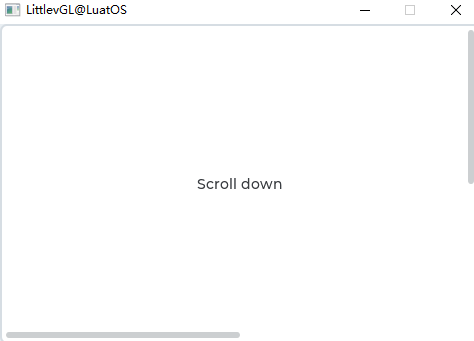

上述效果的示例代码：

```lua
local tileview_demo = {}

function tileview_demo.demo()

    local lvgl.VER_RES = lvgl.disp_get_ver_res(lvgl.disp_get_default())
    local lvgl.HOR_RES = lvgl.disp_get_hor_res(lvgl.disp_get_default())

    local valid_pos = {{0,0}, {0, 1}, {1,1}};
    local tileview;
    tileview = lvgl.tileview_create(lvgl.scr_act(), nil);
    lvgl.tileview_set_valid_positions(tileview, valid_pos, 3);
    lvgl.tileview_set_edge_flash(tileview, true);

    local tile1 = lvgl.obj_create(tileview, nil);
    lvgl.obj_set_size(tile1, lvgl.HOR_RES, lvgl.VER_RES);
    lvgl.tileview_add_element(tileview, tile1);

    --Tile1: just a label
    local label = lvgl.label_create(tile1, nil);
    lvgl.label_set_text(label, "Scroll down");
    lvgl.obj_align(label, nil, lvgl.ALIGN_CENTER, 0, 0);

    --Tile2: a list
    local list = lvgl.list_create(tileview, nil);
    lvgl.obj_set_size(list, lvgl.HOR_RES, lvgl.VER_RES);
    lvgl.obj_set_pos(list, 0, lvgl.VER_RES);
    lvgl.list_set_scroll_propagation(list, true);
    lvgl.list_set_scrollbar_mode(list, lvgl.SCROLLBAR_MODE_OFF);

    lvgl.list_add_btn(list, nil, "One");
    lvgl.list_add_btn(list, nil, "Two");
    lvgl.list_add_btn(list, nil, "Three");
    lvgl.list_add_btn(list, nil, "Four");
    lvgl.list_add_btn(list, nil, "Five");
    lvgl.list_add_btn(list, nil, "Six");
    lvgl.list_add_btn(list, nil, "Seven");
    lvgl.list_add_btn(list, nil, "Eight");

    --Tile3: a button
    local tile3 = lvgl.obj_create(tileview, tile1);
    lvgl.obj_set_pos(tile3, lvgl.HOR_RES, lvgl.VER_RES);
    lvgl.tileview_add_element(tileview, tile3);

    local btn = lvgl.btn_create(tile3, nil);
    lvgl.obj_align(btn, nil, lvgl.ALIGN_CENTER, 0, 0);
    lvgl.tileview_add_element(tileview, btn);
    label = lvgl.label_create(btn, nil);
    lvgl.label_set_text(label, "No scroll up");
end

return tileview_demo

```


## 窗口(win) 

### 概述

窗口是类似 [容器(lvgl.cont)](http://lvgl.100ask.net/documentation/04_widgets/10_cont.html) 的对象，由带有标题和按钮的标题以及内容区域构建而成。

### 零件和样式

主要部分是 `lvgl.WIN_PART_BG` ，它包含另外两个实际部分：

- `lvgl.WIN_PART_HEADER` 顶部的标题容器，带有标题和控制按钮
- `lvgl.WIN_PART_CONTENT_SCRL` 页眉下方内容的页面可滚动部分。

除此之外， `lvgl.WIN_PART_CONTENT_SCRL` 还有一个滚动条，称为 `lvgl.WIN_PART_CONTENT_SCRL` 。阅读 [页面(lvgl.page)](http://lvgl.100ask.net/documentation/04_widgets/24_page.html) 的文档以获取有关滚动条的更多详细信息。

所有部分均支持典型的背景属性。标题使用标题部分的Text属性。

控制按钮的高度为：标头高度-标头padding_top-标头padding_bottom。

### 用法

#### 窗口标题

窗口上有一个标题，可以通过以下方式修改 `lvgl.win_set_title(win, "New title")`

#### 控制按钮

可以使用以下命令将控制按钮添加到窗口标题的右侧： `lvgl.win_add_btn_right(win, lvgl.SYMBOL_CLOSE)` ，要在窗口标题的左侧添加按钮，请使用lvgl.win_add_btn_left（win，lvgl.SYMBOL_CLOSE）。第二个参数是图像源，因此它可以是符号，指向lvgl.img_dsc_t变量的指针或文件的路径。

可以使用 `lvgl.win_add_btn_left(win, lvgl.SYMBOL_CLOSE)` 设置按钮的宽度。如果 `w == 0` ，则按钮将为正方形。

`lvgl.win_close_event_cb` 可以用作关闭窗口的事件回调。

#### 滚动条

可以通过 `lvgl.win_set_scrlbar_mode(win, lvgl.SCRLBAR_MODE_...)` 设置滚动条行为。有关详细信息，请参见 [页面(lvgl.page)](http://lvgl.100ask.net/documentation/04_widgets/24_page.html) 。

#### 手动滚动和聚焦

要直接滚动窗口，可以使用 `lvgl.win_scroll_hor(win, dist_px)` 或 `lvgl.win_scroll_ver(win, dist_px)` 。

要使窗口在其上显示对象，请使用 `lvgl.win_focus(win, child, lvgl.ANIM_ON/OFF)` 。

滚动和焦点动画的时间可以使用 `lvgl.win_set_anim_time(win, anim_time_ms)` 进行调整

#### 布局

要设置内容的布局，请使用 `lvgl.win_set_layout(win, lvgl.LAYOUT_...)` 。有关详细信息，请参见 [容器(lvgl.cont)](http://lvgl.100ask.net/documentation/04_widgets/10_cont.html) 。

### 事件

仅支持 [通用事件](http://lvgl.100ask.net/documentation/03_overview/03_events.html#id2)

了解有关 [事件](http://lvgl.100ask.net/documentation/03_overview/03_events.html) 的更多内容。

### 按键处理

窗口可处理以下按键：

- **lvgl.KEY_RIGHT/LEFT/UP/DOWN** 滚动页面

了解有关 [按键](http://lvgl.100ask.net/documentation/03_overview/05_indev.html) 的更多内容。

### 范例

#### 简单的窗口

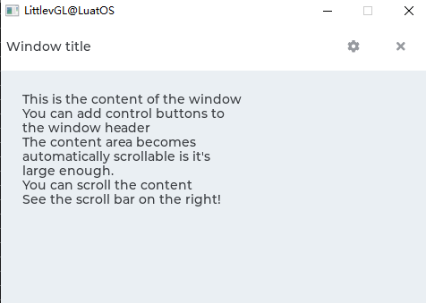

上述效果的示例代码：

```lua
local win_demo = {}

function win_demo.demo()
    --Create a window
    local win = lvgl.win_create(lvgl.scr_act(), nil);
    lvgl.win_set_title(win, "Window title");                        --Set the title


    --Add control button to the header
    local close_btn = lvgl.win_add_btn(win, lvgl.SYMBOL_CLOSE);           --Add close button and use built-in close action
    lvgl.obj_set_event_cb(close_btn, lvgl.win_close_event_cb);
    lvgl.win_add_btn(win, lvgl.SYMBOL_SETTINGS);        --Add a setup button

    --Add some dummy content
    local txt = lvgl.label_create(win, nil);
    lvgl.label_set_text(txt,
[[This is the content of the window
You can add control buttons to
the window header
The content area becomes
automatically scrollable is it's 
large enough.
You can scroll the content
See the scroll bar on the right!]]);
end

return win_demo

```


# LVGL进阶

## 动画

## 主题

## 文件系统

## 输入设备

## 字体

LVGL字体支持很全，支持 **UTF-8** 编码的 Unicode 字符，分内部字体和外部字体，字体制作工具也很多：[LVGL官方的字体制作工具](https://lvgl.io/tools/fontconverter)，第三方的[LvglFontTool](http://www.lfly.xyz/forum.php?mod=viewthread&tid=24&extra=page%3D1)和[MCU_Font](https://gitee.com/WuBinCPP/MCU_Font_Release)等。本文会介绍不同字体制作方法时分别使用不同工具使大家对其都有了解。

### 内部字体

LVGL的内部字体分为 LVGL自带字体和自己制作的自定义内部字体。

#### 内部自支持字体

LVGL的内部就已经支持多种字体大小，可通过 *LV_FONT_...* 定义在 `lv_conf.h` 中启用即可

```c
/* Montserrat fonts with bpp = 4
 * https://fonts.google.com/specimen/Montserrat  */
#define LV_FONT_MONTSERRAT_8     0
#define LV_FONT_MONTSERRAT_10    0
#define LV_FONT_MONTSERRAT_12    0
#define LV_FONT_MONTSERRAT_14    1
#define LV_FONT_MONTSERRAT_16    0
#define LV_FONT_MONTSERRAT_18    0
#define LV_FONT_MONTSERRAT_20    0
#define LV_FONT_MONTSERRAT_22    0
#define LV_FONT_MONTSERRAT_24    0
#define LV_FONT_MONTSERRAT_26    0
#define LV_FONT_MONTSERRAT_28    0
#define LV_FONT_MONTSERRAT_30    0
#define LV_FONT_MONTSERRAT_32    0
#define LV_FONT_MONTSERRAT_34    0
#define LV_FONT_MONTSERRAT_36    0
#define LV_FONT_MONTSERRAT_38    0
#define LV_FONT_MONTSERRAT_40    0
#define LV_FONT_MONTSERRAT_42    0
#define LV_FONT_MONTSERRAT_44    0
#define LV_FONT_MONTSERRAT_46    0
#define LV_FONT_MONTSERRAT_48    0

/* Demonstrate special features */
#define LV_FONT_MONTSERRAT_12_SUBPX      0
#define LV_FONT_MONTSERRAT_28_COMPRESSED 0  /*bpp = 3*/
#define LV_FONT_DEJAVU_16_PERSIAN_HEBREW 0  /*Hebrew, Arabic, PErisan letters and all their forms*/
#define LV_FONT_SIMSUN_16_CJK            0  /*1000 most common CJK radicals*/

/*Pixel perfect monospace font
 * http://pelulamu.net/unscii/ */
#define LV_FONT_UNSCII_8     0
#define LV_FONT_UNSCII_16     0

```

同时支持多国语言：希伯来语、阿拉伯语、波斯语字母及其所有形式，并且支持中文，但是实际上中文的支持是使用1000多个最常见的部首组成的，实际测试会发现很多汉字都没有~

#### 内部自定义字体

当你要使用一些好看的字体，或者中文等LVGL没有集成的字体怎么办呢？当然可以自己制作字库，首先介绍的是使用LvglFontTool制作内部字体，打开LvglFontTool


抗锯齿选择默认，我们的lvgl是7.11版本，所以此处版本选择用于6.0版本以上，英文和数字根据自己需要勾选，类型选择内部字体，剩下都勾选上即可，字体名自己设置，包含里加上lvgl.h头文件，之后我们点击选择字体


字体我们选择我们的ttf字体，选择字体大小，点击确定
之后写入需要的汉字或者根据自己需要点击加入常用汉字、全部汉字、图标


之后点击保存，开始转换

稍作等待

之后将生成的.c文件放在LuatOS\components\lvgl\font目录下，在luat_lvgl_fonts.h中声明你的字库

```c
#ifndef LUAT_LIB_FONTS_H
#define LUAT_LIB_FONTS_H

#include "luat_base.h"

#ifdef __cplusplus
extern "C" {
#endif
#include "../src/lv_font/lv_font.h"

LV_FONT_DECLARE(lv_font_opposans_m_8)
LV_FONT_DECLARE(lv_font_opposans_m_10)
LV_FONT_DECLARE(lv_font_opposans_m_12)
LV_FONT_DECLARE(lv_font_opposans_m_14)
LV_FONT_DECLARE(lv_font_opposans_m_16)
LV_FONT_DECLARE(lv_font_opposans_m_18)
LV_FONT_DECLARE(lv_font_opposans_m_20)
LV_FONT_DECLARE(lv_font_opposans_m_22)
LV_FONT_DECLARE(lv_font_simsun_48)

#ifdef __cplusplus
}
#endif
#endif

```

之后在luat_lib_lvgl_font.c中对lua暴露你的字库就可以了

```c
/*
获取内置字体
@api lvgl.font_get(name)
@string 字体名称+字号, 例如 opposans_m_10 simsun_48
@return userdata 字体指针
@usage

local font = lvgl.font_get("simsun_48")
*/
int luat_lv_font_get(lua_State *L) {
    lv_font_t* font = NULL;
    const char* fontname = luaL_checkstring(L, 1);
    if (!strcmp("", fontname)) {
    }
#ifdef LV_FONT_MONTSERRAT_14
    else if (!strcmp("montserrat_14", fontname)) { font = &lv_font_montserrat_14;}
#endif
#ifdef LV_FONT_OPPOSANS_M_8
    else if (!strcmp("opposans_m_8", fontname)) { font = &lv_font_opposans_m_8;}
#endif
#ifdef LV_FONT_OPPOSANS_M_10
    else if (!strcmp("opposans_m_10", fontname)) { font = &lv_font_opposans_m_10;}
#endif
#ifdef LV_FONT_OPPOSANS_M_12
    else if (!strcmp("opposans_m_12", fontname)) { font = &lv_font_opposans_m_12;}
#endif
#ifdef LV_FONT_OPPOSANS_M_14
    else if (!strcmp("opposans_m_14", fontname)) { font = &lv_font_opposans_m_14;}
#endif
#ifdef LV_FONT_OPPOSANS_M_16
    else if (!strcmp("opposans_m_16", fontname)) { font = &lv_font_opposans_m_16;}
#endif
#ifdef LV_FONT_OPPOSANS_M_18
    else if (!strcmp("opposans_m_18", fontname)) { font = &lv_font_opposans_m_18;}
#endif
#ifdef LV_FONT_OPPOSANS_M_20
    else if (!strcmp("opposans_m_20", fontname)) { font = &lv_font_opposans_m_20;}
#endif
#ifdef LV_FONT_OPPOSANS_M_22
    else if (!strcmp("opposans_m_22", fontname)) { font = &lv_font_opposans_m_22;}
#endif
#ifdef USE_LVGL_SIMSUN_48
    else if (!strcmp("simsun_48", fontname)) { font = &lv_font_simsun_48;}
#endif

    if (font) {
        lua_pushlightuserdata(L, font);
        return 1;
    }
    return 0;
}
```

**注意：编译时别忘了在luat_conf_bsp.h中启用lvgl和字库呦**~

### 外部字体

LVGL同时支持外部字体，你可以将.bin格式字体放在flash中或sd中，在程序运行中加载字体，这种方式无需修改固件

这里我们用[离线版LVGL官方工具](https://github.com/lvgl/lv_font_conv)生成外部字体

首先安装[nodejs](https://nodejs.org/en/download/)这里不做介绍，下载安装即可

打开cmd运行

```shell
npm i lv_font_conv -g
```

即可安装好lv_font_conv 

我们cmd运行`lv_font_conv`测试


证明lv_font_conv 已正常运行

下面我们了解一下lv_font_conv命令：

常用命令：

- `--bpp` - 每像素位数（抗锯齿）
- `--size` - 输出字体大小（像素）
- `-o`, `--output`- 输出路径（文件或目录，取决于格式）
- `--format` - 输出格式
  - `--format dump` - 转储字形图像和字体信息，用于调试
  - `--format bin`- 以二进制形式转储字体（如[规范中所述](https://github.com/lvgl/lv_font_conv/blob/master/doc/font_spec.md)）
  - `--format lvgl`- 以[LittlevGL](https://github.com/lvgl/lvgl)格式转储字体
- `--force-fast-kern-format`- 始终使用更快速的 kering 存储格式，但要付出一定的代价。如果出现尺寸差异，则会显示出来
- `--lcd` - 生成具有 3 倍水平分辨率的位图，用于子像素平滑
- `--lcd-v` - 生成具有 3 倍垂直分辨率的位图，用于子像素平滑
- `--use-color-info`- 尝试使用字体中的字形颜色信息来创建灰度图标。由于灰色色调是通过透明度模拟的，因此仅在对比背景上效果会很好
- `--lv-include`- 仅与`--format lvgl`，为 设置备用路径`lvgl.h`

字体命令：

- `--font`- 字体文件的路径（ttf/woff/woff2/otf）。可多次用于合并
- `-r`, `--range`- 单个字形或范围 + 可选映射，属于先前声明的`--font`. 可以多次使用。例子：
  - `-r 0x1F450` - 单值、十进制或十六进制格式
  - `-r 0x1F450-0x1F470` - 范围
  - `-r '0x1F450=>0xF005'` - 带有映射的单个字形
  - `-r '0x1F450-0x1F470=>0xF005'` - 带映射的范围
  - `-r 0x1F450 -r 0x1F451-0x1F470` - 2个范围
  - `-r 0x1F450,0x1F451-0x1F470`- 同上，但定义为 single `-r`
- `--symbols`- 要复制的字符列表（而不是 中的数字格式`-r`）
  - `--symbols 0123456789.,` - 提取字符以显示数字
- `--autohint-off` - 不要强制自动提示（默认情况下“灯”是打开的）
- `--autohint-strong` - 使用更强大的自动提示（会破坏字距调整）

其他调试选项：

- `--no-compress` - 禁用内置 RLE 压缩
- `--no-prefilter` - 禁用位图线过滤器（XOR），用于提高压缩率
- `--no-kerning` - 删除字距调整信息以减小大小（不推荐）
- `--full-info` - 不要缩短“font_info.json”（包括像素数据）

我们输入以下命令即可生成我们想要的.bin外部字库了

```shell
lv_font_conv --no-compress --format bin --font H:\OPPOSans-M.ttf -o H:\myfontd\opposans_m_8.bin --bpp 4 --size 8 -r 0x30-0x39 -r 0x41-0x5A -r 0x61-0x7A -r 0x4E00-0x9FFF
```

不想自己做？好的，我已经做好一些放在LuatOS\docs\markdown\exts\lvgl\fonts目录下了呦~


### 字体使用

字体使用非常简单，使用lvgl.obj_set_style_local_text_font设置字体即可，外部字体文件需要使用lvgl.font_load函数加载，下面看一下范例：

**注意：使用后记得释放字体**

内部字体：

```lua
	local screen_label = lvgl.label_create(nil, nil)
	lvgl.label_set_text(screen_label, "中文测试abcdABCD1234")
	local style_screen_label_main = lvgl.style_create()
	lvgl.style_set_text_font(style_screen_label_main, lvgl.STATE_DEFAULT, lvgl.font_get("opposans_m_12"))
	lvgl.obj_add_style(screen_label, lvgl.LABEL_PART_MAIN, style_screen_label4_main)
    lvgl.scr_load(screen_label)
```

效果：


外部字体：

```lua
	local screen_label = lvgl.label_create(nil, nil)
	lvgl.label_set_text(screen_label, "这是一个中文字体测试程序abcdABCD1234")
    local font = lvgl.font_load("/OPPOSans.bin")
    lvgl.obj_set_style_local_text_font(screen_label, lvgl.LABEL_PART_MAIN, lvgl.STATE_DEFAULT, font)
    lvgl.scr_load(screen_label)
```

效果：


### 字体说明

本文使用的字体是OPPO的[OPPO Sans](https://www.coloros.com/index/newsDetail?id=72)字体，（含中文及西文，6 款字重）允许个人或企业免费使用，含商业用途，版权归 OPPO 广东移动通信有限公司所有。

您应遵守以下条款，违者必究：

1. 不对字体进行改编或二次开发；

2. 不对外售卖字体；

3. 不向他方提供其他下载渠道；

4. 不用于违法用途。

## 显示设备

# 注意事项

