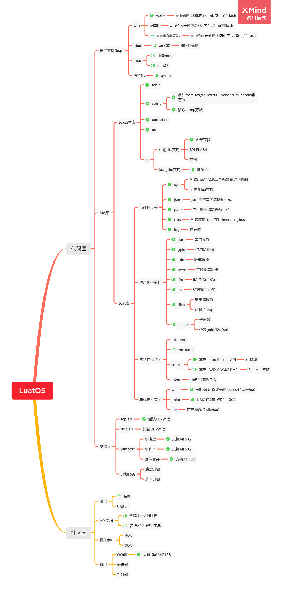

# LuatOS 项目进度报告 - 20200612

## 全景图

较之前的版本又长出了几个分支^_^

# 本周进展

## LuatOS整体

### 本周已完成
1. `adc`/`pwm`/`crypto`库的抽象设计和实现

### 下周计划完成
1. `m2m`库的抽象设计
2. 继续推进`luatos.com`备案

## Air302 NBIOT芯片

该模块为当前的重点开发任务

### 固件版本V0001_20200612

模块尚未正式发售,固件只推送给种子用户

1. 总体进度估算, 已完成50%
2. 硬件层, 70%可用
3. 应用层, 20%可用

### 本周已完成
1. 硬件层已完成 `uart`/`gpio`/`pwm`/`adc` 的适配
2. 应用层已完成 `socket`/`mqtt` 的适配

### 下周计划完成
1. 硬件层,适配`spi`/`i2c`
2. 应用层,适配`aliyun物联网sdk`
3. 解决客户反馈的bug

## Air640W wifi芯片

### 本周无固件版本发布
1. 从功能上说, 已完成90%的适配任务

### 本周已完成

1. `crypto`库的md5/sha1的硬件加速, 支持无加密的阿里云mqtt连接

### 下周计划完成

1. `crypto`库支持sha256/sha512/aes/3des, 由社区推动.
2. `pwm` 适配, 由社区推动.

## 新的Wifi/BLE芯片

该厂商的信息暂时保密^_^

### 本周已完成
1. 环境搭建,编译/下载ok
2. 调研移植的难点和工作量

### 下周计划完成
1. 移植文件系统littlefs,或者先用ROMFS,待定
2. 移植一款heap实现,使用heap_4或者rtt版本修改而成
3. 把LuatOS核心跑起来
