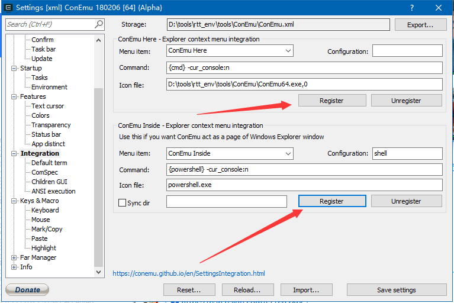
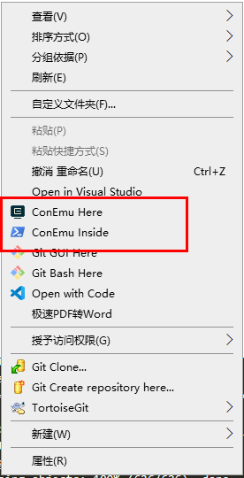

# 安装编译工具

将 `env_released_1.2.0.7z` 解压到 `D:/tools/` 

```bash
PS D:/tools/rtt_env> ls


    目录: D:/tools/rtt_env


Mode                LastWriteTime         Length Name
----                -------------         ------ ----
d-----        2020/2/29     16:17                local_pkgs
d-----        2020/2/29     16:23                packages
d-----        2020/2/29     16:17                sample
d-----        2020/2/29     16:23                tools
------        2020/2/29     16:17         367432 Add_Env_To_Right-click_Menu.png
------        2020/2/29     16:17           5323 ChangeLog.txt
------        2020/2/29     16:17            321 env.bat
------        2020/2/29     16:17        3703909 env.exe
------        2020/2/29     16:17         660836 Env_User_Manual_zh.pdf
------        2020/2/29     16:17         222908 Package_Development_Guide_zh.pdf

```

# 初始化控制台

双击 `env.bat` 然后进入工程目录

```bash
zozoh@DESKTOP-DI2HLQA D:/github/LuatOS/bsp/w60x
> ls
Kconfig    SConscript    drivers      makeimg.py   project.eww      rt-thread    template.ewp
README.md  SConstruct    luat         oneshot      project.uvoptx   rtconfig.h   template.uvoptx
ROM.ini    applications  makeimg.bat  project.ewp  project.uvprojx  rtconfig.py  template.uvprojx
```



点了这两个按钮，虽然没啥反应，但是在鼠标上下文菜单里，应该有




# 更新代码库

```bash
zozoh@DESKTOP-DI2HLQA D:/github/LuatOS/bsp/w60x
> pkgs --update
Start to download package : netutils-1.1.0.zip
Downloded 5450 KB
Start to unpack. Please wait...
==============================>  NETUTILS v1.1.0 is downloaded successfully.

Cloning into 'D:/github/LuatOS/bsp/w60x/packages/u8g2-c-latest'...
remote: Enumerating objects: 608, done.
remote: Counting objects: 100% (608/608), done.
remote: Compressing objects: 100% (513/513), done.
Rremote: Total 608 (delta 373), reused 147 (delta 88), pack-reused 0eceiving objects:  91% (554/608), 18.04 MiB | 3.06Receiving objects:  92% (560/608),
Receiving objects: 100% (608/608), 18.89 MiB | 2.17 MiB/s, done.
Resolving deltas: 100% (373/373), done.
==============================>  U8G2 c-latest is downloaded successfully.

Cloning into 'D:/github/LuatOS/bsp/w60x/packages/wm_libraries-latest'...
remote: Enumerating objects: 774, done.
remote: Counting objects: 100% (774/774), done.
remote: Compressing objects: 100% (626/626), done.
remote: Total 774 (delta 159), reused 598 (delta 84), pack-reused 0
Receiving objects: 100% (774/774), 46.47 MiB | 4.05 MiB/s, done.
Resolving deltas: 100% (159/159), done.
Updating files: 100% (324/324), done.
==============================>  WM_LIBRARIES latest is downloaded successfully.

==============================>  wm_libraries update done

Operation completed successfully.
```

# 编译

```bash
zozoh@DESKTOP-DI2HLQA D:/github/LuatOS/bsp/w60x
> scons -j8
scons: Reading SConscript files ...
>>>D:/github/LuatOS/bsp/w60x
scons: done reading SConscript files.
scons: Building targets ...
scons: building associated VariantDir targets: build
CC build/applications/main.o
CC build/drivers/board.o
CC build/drivers/drv_crypto.o
CC build/drivers/drv_flash.o
CC build/drivers/drv_hw_timer.o
CC build/drivers/drv_pin.o
CC build/drivers/drv_pwm.o
CC build/drivers/drv_rtc.o
CC build/drivers/drv_soft_i2c.o
CC build/drivers/drv_spi.o
CC build/drivers/drv_standby.o
CC build/drivers/drv_uart.o
CC build/drivers/drv_wdt.o
CC build/drivers/drv_wifi.o
CC build/drivers/pin_map.o
CC build/kernel/components/dfs/filesystems/devfs/devfs.o
CC build/kernel/components/dfs/src/dfs.o
...
C D:/github/LuatOS/luat/rtt/rtt_mem.o
CC D:/github/LuatOS/luat/packages/lfs/lfs.o
CC D:/github/LuatOS/luat/packages/lfs/lfs_util.o
CC D:/github/LuatOS/luat/packages/lua-cjson/fpconv.o
CC D:/github/LuatOS/luat/packages/lua-cjson/lua_cjson.o
CC D:/github/LuatOS/luat/packages/lua-cjson/strbuf.o
CC D:/github/LuatOS/luat/packages/vsprintf/atob.o
CC D:/github/LuatOS/luat/packages/vsprintf/vsprintf.o
CC D:/github/LuatOS/luat/w60x/dfs_lfs2.o
CC D:/github/LuatOS/luat/w60x/luat_fs_w60x.o
CC D:/github/LuatOS/luat/w60x/rtt_w60x_patch.o
LINK rtthread.elf
arm-none-eabi-objcopy -O binary rtthread.elf rtthread.bin
arm-none-eabi-size rtthread.elf
   text    data     bss     dec     hex filename
 502168    5120   76340  583628   8e7cc rtthread.elf
python ./makeimg.py
makeimg 1M Flash...
makeimg 2M Flash...
end
scons: done building targets.
```

> 如果是四核 CPU，`-j8` 开启多线程编译，会快一点

- `menuconfig` 可打开编译控制台的配置项目
- `scons -c` 清除编译中间文件

# 查看编译结果

```bash
zozoh@DESKTOP-DI2HLQA D:/github/LuatOS/bsp/w60x/Bin
> ls
rtthread.bin     rtthread_2M.FLS     rtthread_GZ_2M.img   rtthread_SEC_2M.img  version.txt
rtthread_1M.FLS  rtthread_GZ_1M.img  rtthread_SEC_1M.img  secboot.img
```


