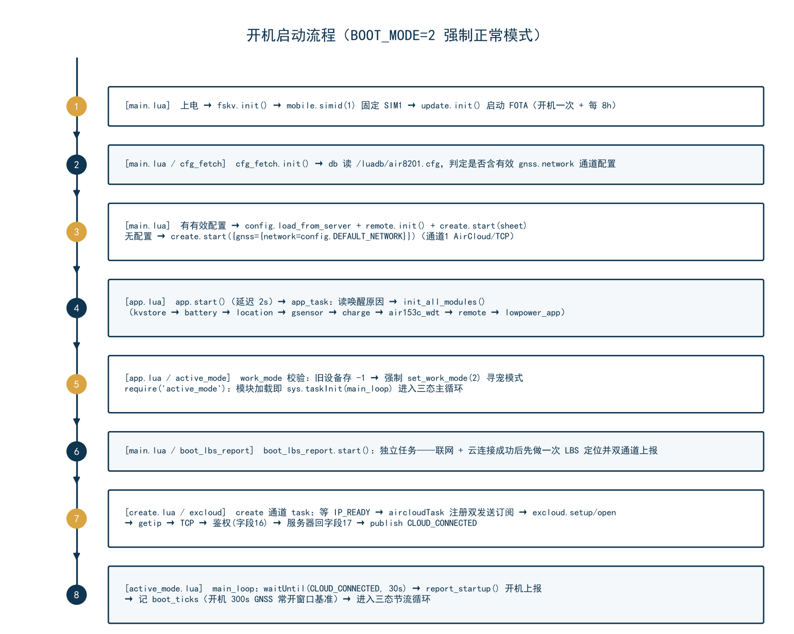
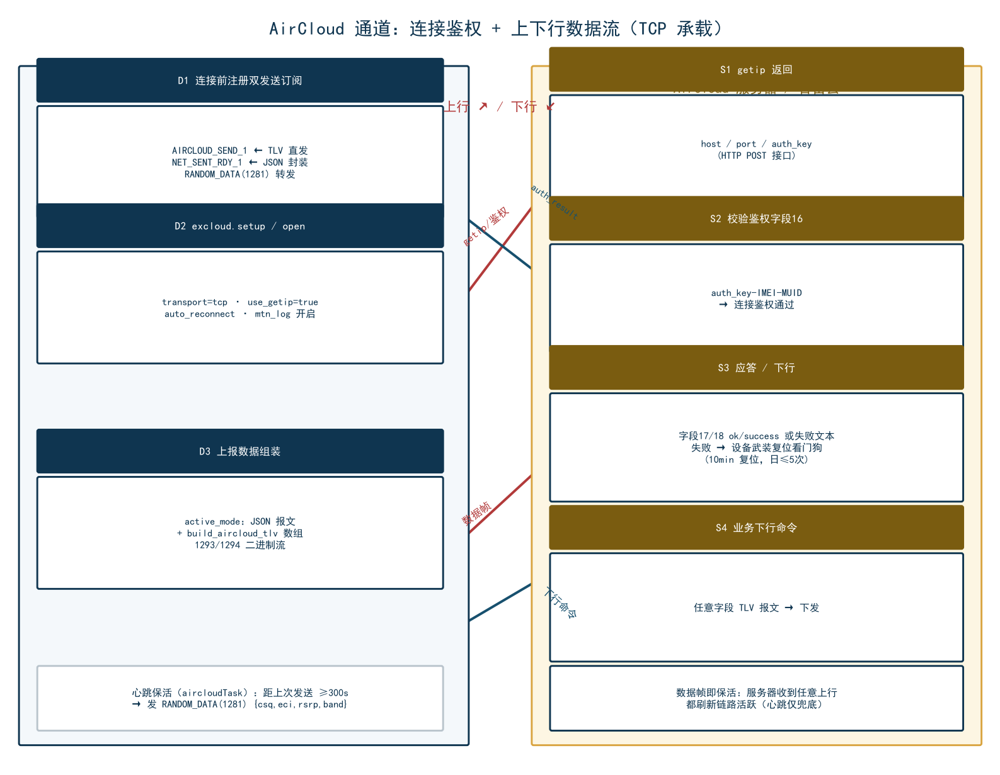
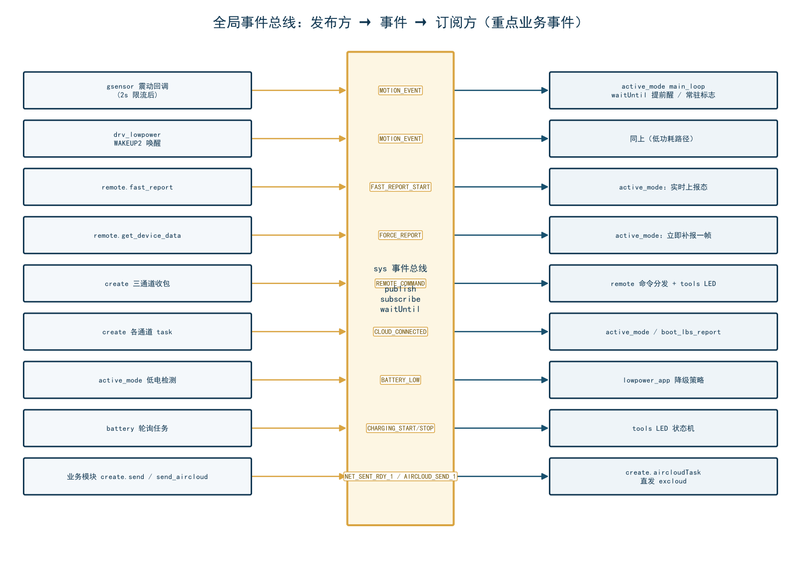

# LuatOS iRTU-8202G 车辆/宠物定位器固件代码分析文档

> **项目**：Air8202（Air780EGP 模组，G 版无 H 版）
> **固件版本**：004.000.030（本分析基于 004.000.030 冗余清理后的代码，2026-09-02）
> **工程目录**：`D:\dev\LuatOS\module\iRTU\irtu-8202G-smart-nocfg`
> **运行环境**：LuatOS（Air780EGP 模组 / Air780E 系列；DA221 三轴加速度计、YHM2712A 充电 IC、Air153C 硬件看门狗、双 SIM 卡槽——固件固定使用 SIM1）
> **文档目的**：让不熟悉本工程的人能够快速理解整体工作逻辑、通信流程与模块划分

---

## 目录

1. [功能概述与模块划分](#1-功能概述与模块划分)
2. [目录与文件介绍](#2-目录与文件介绍)
3. [设备通信流程](#3-设备通信流程)
4. [设备工作模式](#4-设备工作模式)
5. [AirCloud 通信协议详解](#5-aircloud-通信协议详解)
6. [函数调用 / 事件订阅 / 数据表逻辑关系](#6-函数调用--事件订阅--数据表逻辑关系)
7. [本工程 TLV 字段详细格式](#7-本工程-tlv-字段详细格式)

---

# 1. 功能概述与模块划分

## 1.1 产品定位

本工程是合宙 **Air780EGP（8202G）** 模组上的定位追踪器固件，典型应用为**宠物定位**与**车辆追踪**。设备以低功耗方式长期佩戴/安装在移动目标上，通过内置 **GNSS（GPS/北斗）+ LBS 基站 + WiFi** 混合定位获得位置，经 **合宙 AirCloud 云平台**（TLV 二进制协议）或通用 TCP/MQTT 通道周期性上报；同时接收云平台下行命令（如实时上报、开关机、OTA 等），实现远程管理与轨迹监控。

**主要功能清单：**

| 功能域 | 说明 | 承载模块 |
|---|---|---|
| 定位 | GNSS（GPS/北斗）优先，LBS（免费 lbsLoc2 / 付费 AirLBS+WiFi）兜底 | `location`、`modules/exgnss`、`lib/airlbs`、`lib/lbsLoc2` |
| 运动感知 | DA221 三轴加速度计：震动中断唤醒、运动中/静止判定、20Hz 原始数据流 | `gsensor`、`lib/exvib` |
| 上报 | JSON 报文 + AirCloud TLV 双通道上报；三态节流（实时 1s / GNSS 开 10s / GNSS 关 300s） | `active_mode`、`create`、`lib/excloud` |
| 远程控制 | get_device_data / change_mode / fast_report / update 等 11 种下行命令 | `remote` |
| 功耗管理 | 三种功耗模式：normal(全功率) / power_save(低功耗) / psm_sleep(深度休眠) | `lowpower_app` + `drv_normal/lovpower/psm` |
| 充电管理 | YHM2712A 充电 IC：电压/电量/充电阶段/充满检测（30s 轮询） | `battery`、`charge`、`lib/exs_yhm2712a` |
| 硬件看门狗 | Air153C 硬件看门狗（喂狗 GPIO24，180s 周期）；另 excloud 内置软件复位看门狗（10 分钟自愈，每日 ≤5 次） | `air153c_wdt`、`lib/exair153x_wdt`、`lib/excloud` |
| LED 指示 | GPIO26 绿灯 / GPIO27 红灯：开机 60s 亮、GNSS 切换亮 10s、充电红/充满绿、600s 无下行闪烁 | `tools` |
| OTA 升级 | libfota3（默认，仅合宙按 IMEI 升级）与 libfota2（客户自管）双模式 | `update`、`lib/libfota2`、`lib/libfota3` |
| 开机 LBS 上报 | 开机联网后先补一次 LBS 定位（快定位），不等 GNSS 冷启动 | `boot_lbs_report` |

## 1.2 总体架构与模块划分

整个固件按"**应用入口 → 业务核心 → 底层驱动库**"三层组织，外加一条全局**事件总线**贯穿各层。


**分层说明：**

| 层次 | 职责 | 文件 |
|---|---|---|
| **L0 入口层** | 开机模式分发、硬件/功能模块启动顺序控制、系统运行 | `main.lua`、`app.lua`、`lowpower/*` |
| **L1 业务核心层** | 工作循环、上报策略、数据采集组装、命令处理 | `active_mode.lua`、`create.lua`、`modules/remote.lua`、`modules/location.lua`、`modules/battery.lua`、`modules/sensors/gsensor.lua` |
| **L2 支撑服务层** | 配置加载/持久化、键值存储、工具、开机 LBS、OTA、充电/看门狗使能 | `config.lua`、`cfg_fetch.lua`、`utils/kvstore.lua`、`utils/tools.lua`、`boot_lbs_report.lua`、`update.lua`、`charge.lua`、`air153c_wdt.lua` |
| **L3 底层库 lib** | 合宙扩展库：AirCloud 协议（TLV）、MQTT/TCP、基站定位、传感器驱动、FOTA 等（**视为黑盒驱动，本工程不改**） | `lib/*.lua` |

> **注意**：`modules/exgnss.lua` 虽位于业务目录，其本质是 LuatOS `libgnss` 内置库的**包装层**（提供"GNSS 应用"开/关计数管理与 NMEA 读取），可视作 L2/L3 边界组件。

## 1.3 核心设计思想（先理解这 4 条，再看代码会非常快）

1. **GNSS 三态上报策略（004.000.009 起）**：不再按 work_mode 区分上报节奏，而由"是否需要 GNSS"动态决定——GNSS 开时 10s 一报（全功率），GNSS 关时 300s 一报（低功耗），实时上报命令可临时进入 1s 一报。**GNSS 是否开启 = 开机窗口 300s ∨ 正在震动 ∨ 180s 内震过 ∨ 实时上报结束保持窗口 180s**。
2. **运动传感驱动 GNSS**：设备"动"才需要高频定位——DA221 震动中断 → 发布 `MOTION_EVENT` → 主循环提前醒来评估并开 GNSS → 立即上报；静止超过 180s 自动关 GNSS 省电。
3. **双通道上报**：同一帧数据既组 JSON 报文（`create.send`，内含 msg_id/type 便于服务器判重），又组 AirCloud TLV 二进制报文（`create.send_aircloud`，含 1293/1294 二进制流等 JSON 装不下的数据）。在默认"仅 AirCloud 通道"配置下，JSON 报文被 create 封装为 TLV `RANDOM_DATA`(1281) 字段同走 AirCloud（004.000.030 修复）。
4. **事件驱动 + 协程**：全工程基于 LuatOS `sys` 事件总线（`sys.publish`/`sys.subscribe`/`sys.waitUntil`）与协程调度，模块间尽量不直接 require 调用，避免环形依赖，也便于解耦。

---

# 2. 目录与文件介绍

## 2.1 目录总览

```
irtu-8202G-smart-nocfg/
├── main.lua                    L0 入口：模式分发 / FOTA / 固定 SIM1 / 启动云连接与 app
├── app.lua                     L0 应用装配：初始化硬件与各模块，强制进入"寻宠模式"
├── active_mode.lua             L1 核心：GNSS 三态上报主循环 + 数据采集与 TLV/JSON 组装
├── create.lua                  L1 核心：云平台连接管理（AirCloud / MQTT / TCP 三通道）
├── config.lua                  静态配置 + 服务端配置装载（load_from_server）
├── cfg_fetch.lua               本地持久化配置加载（db）；远程配置拉取（已禁用入口）
├── boot_lbs_report.lua         开机联网后的一次性 LBS 定位与双通道上报
├── charge.lua                  YHM2712A 充电管理使能
├── air153c_wdt.lua             Air153C 硬件看门狗使能
├── update.lua                  FOTA 升级管理（libfota2/3）
├── modules/
│   ├── location.lua            定位业务：GNSS 状态缓存、LBS 请求、NMEA 1Hz 流采样(1294 数据源)
│   ├── remote.lua              下行命令分发与应答（11 种命令）
│   ├── battery.lua             YHM2712A 状态轮询与电量换算
│   ├── exgnss.lua              libgnss 的"GNSS 应用"包装（开/关引用计数、NMEA 读取）
│   └── sensors/
│       └── gsensor.lua         DA221 震动检测 + 中断快照 + 20Hz 流采样(1293 数据源)
├── lowpower/
│   ├── lowpower_app.lua        功耗模式高层管理（normal/power_save/psm 分发）
│   ├── drv_normal.lua          订阅 DRV_SET_NORMAL → pm.power(WORK_MODE,0)
│   ├── drv_lowpower.lua        订阅 DRV_SET_LOWPOWER → 低功耗配置+震动唤醒
│   └── drv_psm.lua             订阅 DRV_SET_PSM → PSM 深度休眠
├── utils/
│   ├── kvstore.lua             fskv 键值存储（work_mode/low_power_mode/audio_volume）
│   └── tools.lua               LED 状态机（当前唯一职责）
└── lib/                        【底层库，本项目一律不改】AirCloud 协议栈等
    ├── excloud.lua            ★ AirCloud 客户端：TCP/MQTT 连接、TLV 编解码、鉴权、重连、复位看门狗
    ├── exmtn.lua               运维日志（/hzmtn1-4.trc 循环文件、缓存/直写两种方式）
    ├── libnet.lua              阻塞式 socket 连接/收发辅助
    ├── libfota2.lua / libfota3.lua   FOTA 升级库
    ├── exs_yhm2712a.lua        YHM2712A 充电 IC 驱动（单线 CMD 通信）
    ├── exair153x_wdt.lua       Air153C 硬件看门狗驱动
    ├── exvib.lua               DA221 三轴加速度驱动（运动检测 + read_xyz）
    ├── airlbs.lua / lbsLoc2.lua   付费多基站+WiFi / 免费单基站定位
    ├── httpplus.lua            文件上传 HTTP 客户端（zbuff 流式）
    ├── db.lua                  配置以 Lua 表序列化持久化到 /luadb/air8201.cfg
    ├── dtulib.lua              十六进制转换等小工具
    ├── factory.lua             G 版产测模式（BOOT_MODE=1/0 分支进入）
    └── ...
```

## 2.2 关键文件逐一口径

| 文件 | 版本 | 角色一句话概括 | 关键对外接口 |
|---|---|---|---|
| `main.lua` | 4.5 | 开机入口：固定 SIM1 → FOTA → 加载本地配置 → 启动 create 云连接 → 启动 app → 启动 boot_lbs_report | 全局 `VERSION="004.000.030"`、`BOOT_MODE` |
| `app.lua` | 3.2 | 应用装配：读取唤醒原因、初始化全部功能模块、旧设备未激活(-1) 强制转寻宠(2)、进入 active_mode | `app.start()` |
| `active_mode.lua` | 4.2 | **全工程大脑**：GNSS 开关状态机 + 上报节流 + 数据采集组装（TLV/JSON） | `sys.taskInit(main_loop)`（模块加载即启动） |
| `create.lua` | 6.1 | 云通道管家：三种通道 task 启动/重连/断线复位；AirCloud 下双订阅直发（AIRCLOUD_SEND_ TLV / NET_SENT_RDY_ JSON 转 RANDOM_DATA） | `create.start(sheet)`、`create.send(json)`、`create.send_aircloud(tlvs)` |
| `config.lua` | 2.1 | 集中配置 + `load_from_server` 覆盖 | `config.DEFAULT_NETWORK` 等 |
| `modules/remote.lua` | 3.1 | 订阅 `REMOTE_COMMAND` 执行 11 种命令并回执 | `remote.init()` |
| `modules/location.lua` | 2.0 | GPS/LBS 采集与缓存、NMEA 流采样 | `location.get_report_location(gnss_on)`、`get_lbs_location()`、`get_nmea_stream()` |
| `modules/sensors/gsensor.lua` | — | DA221 运动检测 / 快照 / 流采样 | `gsensor.get_stream_data(200)`、`on_vibration()`、`get_status()` |
| `utils/tools.lua` | 2.1 | LED 状态机（500ms 定时刷新） | `tools.init_led()`、`led_gnss_switched_on()` |
| `lib/excloud.lua` | 20260901 | AirCloud 协议栈：16B 消息头 + TLV；鉴权/心跳/重连/复位看门狗 | `excloud.setup/open/send/on/mtn_log`，`FIELD_MEANINGS`、`DATA_TYPES` |

> 阅读建议：`main.lua → app.lua → active_mode.lua → create.lua → excloud.lua` 是主干；`remote/location/gsensor/battery` 是枝叶；`config/kvstore/tools/lowpower` 是支撑。

# 3. 设备通信流程

## 3.1 开机启动流程（时序）



**逐步说明：**

| 步 | 动作 | 代码位置 | 说明 |
|---|---|---|---|
| 1 | `fskv.init()`；`mobile.simid(1)` | main.lua | 固定使用卡槽 SIM1（双卡槽硬件，SIM0 不用） |
| 2 | `update.init()` | main.lua | libfota3：开机检测一次 + 每 8h 自动检测；不阻塞启动 |
| 3 | BOOT_MODE=2 分发 | main.lua L104 | 默认强制正常模式，跳过产测（产测分支仅 0/1 时可达） |
| 4 | `cfg_fetch.init()` 加载本地配置 | main.lua L53 | 读取 `/luadb/air8201.cfg`，判定是否有"有效定位版配置"（gnss.network.conf 非空） |
| 5 | 有有效配置 → `config.load_from_server` + `remote.init()` + `create.start(sheet)`；无 → `create.start({gnss={network=config.DEFAULT_NETWORK}})` | main.lua L67-85 | 云通道启动；DEFAULT_NETWORK = 通道1 AIRCLOUD/TCP |
| 6 | `app.start()`（延迟 2s） | main.lua L93-95 | 进入 app_task |
| 7 | `boot_lbs_report.start()` | main.lua L98 | 独立任务：联网后先做一次 LBS 定位并双通道上报（不等 GNSS） |
| 8 | app_task：读唤醒原因、监听 Power 键、`init_all_modules()` | app.lua | 初始化顺序：kvstore → battery → location → gsensor → charge → air153c_wdt → remote → lowpower_app |
| 9 | work_mode 校验 | app.lua L110 | 若旧设备存 -1（未激活），强制 `set_work_mode(2)` 进寻宠模式 |
| 10 | `require("active_mode")` | app.lua L118 | 模块加载即 `sys.taskInit(main_loop)`，进入 GNSS 三态主循环 |

## 3.2 网络连接与鉴权流程（AirCloud 通道）



**连接链路（create.aircloudTask → excloud）：**

1. `create.start` 筛选 `conf_on[i]==1` 的通道 → `sys.taskInit(connect, active_conf)`；
2. `connect()` 分发：`AIRCLOUD` 类型 → `sys.taskInitEx(aircloudTask, "DTU_k", ...)`（默认通道 k=1）；
3. `aircloudTask`：
   - **先注册两个发送订阅**（连接前注册避免丢消息）：
     - `AIRCLOUD_SEND_1` ← `create.send_aircloud(TLV数组)` → 直接 `excloud.send(tlvs)`
     - `NET_SENT_RDY_1` ← `create.send(JSON串)` → 封装为 `RANDOM_DATA(1281)` ASCII 字段 `excloud.send`
   - 等待 `IP_READY`；
   - `excloud.on(cb)` 注册回调（connect_result / auth_result / message / disconnect / send_result）；
   - `excloud.setup()`（transport=tcp、use_getip=true、auto_reconnect、mtn_log 开启）→ `excloud.open()`；
4. `excloud.open()` 内部：getip（POST api.luatos.com/iot/getip 拿 host/port/auth_key，重试 3 次）→ TCP connect → 发鉴权请求（字段16 `AUTH_REQUEST`，ASCII 值 `auth_key-IMEI-MUID`）；
5. 服务器回字段 17 `AUTH_RESPONSE`：`ok/success` → `is_authenticated=true`、回调 `auth_result(success)`；**非 ok/success → 判鉴权失败，武装复位看门狗**（10 分钟复位，当日 ≤5 次，超限降级 1 小时慢速重试）；
6. `create` 侧收到 `connect_result.success` → `datalink[cid]=true` + 发布 `CLOUD_CONNECTED`；`active_mode` 主循环 `waitUntil("CLOUD_CONNECTED",30000)` 后执行开机上报。

**心跳保活**：aircloudTask 主循环 `keepAlive(300s)` 轮询——若距上次成功发送 ≥300s 则发心跳（RANDOM_DATA 字段内容为 `{csq,eci,rsrp,band}` JSON），有数据上报则自动跳过（数据即保活）。

## 3.3 上行数据上报流程

**一条典型周期上报（GNSS 开启期间，10s 节奏）的数据流：**

```
collect_data_and_report()  [active_mode.lua]
   │
   ├─ pm.power(WORK_MODE,0)        恢复全功率
   ├─ 等 IP_READY（≤30s）
   ├─ battery.force_check()         读电池缓存（YHM2712A 后台轮询刷新）
   ├─ location.get_report_location(gnss_active)  → {gps="lat,lng", gps_status}
   │      GNSS 优先锁定：开机以来成功过一次 → 恒走 GNSS（当前成功用当前值，否则用最近成功值）
   │      从未成功 → LBS（lbsLoc2/AirLBS），gps_status=3/4/5
   ├─ mobile.csq() / iccid() / scell()         信号/ICCID/频段
   ├─ gsensor.read_xyz()                        "x,y,z"（g 值，3 位小数）
   ├─ gsensor.get_stream_data(200)  ← GNSS开&非实时上报时：20Hz×10s=200 样本 12bit 紧凑编码 ≈900B
   ├─ exgnss.gsv() → top4 CN / 搜星数
   ├─ location.get_nmea_stream()    ← GNSS开&非实时上报时：1Hz×10 样本 ×10B =100B 差值编码
   │
   ├─ 组装 JSON 报文 {msg_id,imei,ts,type:"property_report",data:{...}}
   │      → create.send(json)  ──► publish NET_SENT_RDY_1
   │                               └─► aircloudTask 订阅 → RANDOM_DATA TLV → excloud.send
   │
   └─ 组装 TLV 数组 build_aircloud_tlv(d, xyz_stream, nmea_stream, gnss_active)
          → create.send_aircloud(tlvs) ──► publish AIRCLOUD_SEND_1
                                          └─► excloud.send(tlvs)  ★二进制数据只走此通道
```

**JSON 报文格式（示例，type=property_report）：**

```json
{
  "msg_id": "861234567890123-1767300000",   // IMEI-时间戳，服务器判重用
  "imei": "861234567890123",
  "ts": 1767300000,
  "type": "property_report",                // startup / property_report / command_reply / boot_lbs_report
  "data": {
    "work_mode": 2,              // 0常规 1智能 2寻宠
    "vbat": 3980,                // 电池电压 mV
    "bat_change": 0,             // 1=充电器在位
    "gps": "23.12845,113.32187", // WGS84 坐标（lat,lng）
    "gps_status": 2,             // 2=GPS 3=失败 4=免费LBS 5=付费LBS
    "signal": 18,                // CSQ
    "iccid": "8986000000000000000",
    "chip_model": "Air8202",
    "boot_reason": "power_on",
    "band": "LTE B3",
    "wake_interval": 10,         // 本次上报周期（1/10/300）
    "top4_cn": "31,29,28,27",    // 最强 4 星 CN
    "sat_total": 24, "sat_visible": 9,
    "gsensor_xyz": "0.021,-0.015,0.998"
  }
}
```

## 3.4 下行命令流程


```
服务器下行 TLV 报文
   └─ excloud socket 回调 → parse_data() → 字段 17/18 走鉴权/回应判定；其余 → callback("message", msg)
        └─ create.lua on() 回调：message → 逐 TLV → publish REMOTE_COMMAND {command=tlv.value, raw=tlv}
             └─ remote.handle_command → execute_command（独立协程）
                  ├─ json.decode 失败 → 忽略
                  ├─ 命中 command_handlers 表 → 执行 handler
                  └─ 未知命令 → send_reply(result=1, "未知命令")
```

**11 种命令一览（command_handlers）：**

| # | 命令 | 行为 | 回执 result |
|---|---|---|---|
| 1 | `get_device_data` | publish `FORCE_REPORT` → active_mode 立即上报一次 | 0 ok |
| 2 | `change_mode` | 校验 mode ∈{-1,0,1,2} → kvstore 写 work_mode → 按设备模式设功耗 → 3s 后 reboot | 0/2 参数错 |
| 3 | `call` | 无 SIP 硬件，拒绝 | 4 不支持 |
| 4 | `play_sound` | 无音频硬件，拒绝 | 4 不支持 |
| 5 | `open_light` | LED 手动开(1)/恢复自动(0) | 0/2 参数错 |
| 6 | `close_device` | 回执后 3s `pm.shutdown()` | 0 ok |
| 7 | `set_report_interval` | 校验范围后**回执不支持**（GNSS 三态固定节奏） | 4 不支持 |
| 8 | `set_volume` | 保存音量到 kvstore，回执不支持 | 4 不支持 |
| 9 | `update` | 触发 OTA 检查 | 0 ok |
| 10 | `fota_mode` | 切换 libfota2/3 | 0 ok / 1 缺参 |
| 11 | `fast_report` | publish `FAST_REPORT_START` → 进入 1s 实时上报 1 分钟 | 0 ok |

**命令触发的三个关键事件：**

| 事件 | 发布方 | 订阅方/效果 |
|---|---|---|
| `FORCE_REPORT` | remote.get_device_data | active_mode 置 force_report_pending → 清零节流基准 → 立即上报一帧 |
| `FAST_REPORT_START` | remote.fast_report | active_mode 进入实时上报：未开 GNSS 先强制开；60s 倒计时（重复下发续期） |
| `REMOTE_COMMAND` | create（一切下行） | remote 命令分发 + tools 记 last_rx_time（LED 通信正常证据） |

**回执（command_reply）经 JSON 通道返回**：`{msg_id, reply_to, type:"command_reply", data:{command,result,message}}` → `create.send` → RANDOM_DATA TLV 上送。

# 4. 设备工作模式

## 4.1 模式体系总览：三条独立的模式轴

阅读本工程代码时最容易混淆的是"模式"一词——代码里实际存在**三条互相独立的模式轴**，分别回答三个问题：

| 模式轴 | 取值 | 回答的问题 | 管理位置 |
|---|---|---|---|
| **设备工作模式** `work_mode` | -1 未激活 / 0 常规 / 1 智能 / 2 寻宠(GPS定位) | "设备被用来做什么场景" | `kvstore` 持久化，`app.lua` 启动分发，`remote.change_mode` 云命令切换 |
| **上报运行模式**（GNSS 三态） | 实时上报(1s) / GNSS 开启(10s) / GNSS 关闭(300s) | "现在该不该用 GNSS、多久报一次" | `active_mode.lua` 主循环状态机（**全工程核心**） |
| **功耗模式** `power_mode` | normal / power_save / psm_sleep | "整机功耗调到哪一档" | `lowpower_app.lua` 高层 → `drv_normal/lowpower/psm` 驱动 |

> **关键认知（004.000.009 重构后）**：设备工作模式 `work_mode` **不再直接决定上报节奏**。真正决定上报节奏的是"是否需要 GNSS"这一动态状态；`work_mode` 目前只影响低电量策略的兜底判断（见 4.4），且由于绑定流程废弃，固件在 `app.lua` 中强制收敛为寻宠模式(2)。三条轴之间的联动链见 4.6。

## 4.2 设备工作模式 work_mode（fskv 持久化）

### 4.2.1 取值定义（config.DEVICE_MODE）

| 值 | 名称 | 历史含义 | 当前实际行为（004.000.030） |
|---|---|---|---|
| -1 | UNACTIVATED 未激活 | 出厂未绑定 App，进入待绑定模式 | **已废弃**：`app.lua` 检测到旧设备存 -1 时强制 `set_work_mode(2)` 进寻宠模式 |
| 0 | PERFORMANCE 常规 | 常规模式 | 保留取值，云命令可切；`set_mode_by_device_mode` 映射到 POWER_SAVE 功耗 |
| 1 | SMART 智能 | 智能省电模式 | 同上，映射到 POWER_SAVE |
| 2 | FIND 寻宠/GPS定位 | 宠物查找，GPS 常开 | **出厂默认值**，开机即进入；映射到 NORMAL(全功率) |

### 4.2.2 生命周期与写入路径

```
首次上电（kvstore.init）             云命令 change_mode（remote.lua）
   └─ fskv.set("work_mode","2")          └─ 校验 mode∈{-1,0,1,2}
                                             ├─ kvstore.set_work_mode(mode)   # 立即持久化
                                             ├─ lowpower_app.set_mode_by_device_mode(mode)
                                             └─ 3 秒后 pm.reboot()            # 重启生效
                                                    │
                                                    ▼
                                    app.lua: 若读到 -1 → 强制改为 2（寻宠）
                                                    │
                                                    ▼
                                    require("active_mode") → GNSS 三态主循环
```

- 存储键：`work_mode`（`fskv`），默认值 `"2"`；
- **读取方**：`app.lua`（启动分发）、`active_mode.collect_data_and_report`（随 1290/JSON 上报）、`boot_lbs_report`（随开机 LBS 上报）、`lowpower_app.handle_low_battery`（低电量策略判断）、`remote.change_mode`；
- 写入方：`kvstore.init`（首启默认）、`remote.change_mode`（云命令）、`app.lua`（-1 强制修正）。

> 结论：对本固件而言 work_mode 是一个"名义模式"。除低电量兜底与 1290 字段上报外，业务行为完全由 4.3 的 GNSS 三态状态机决定。

## 4.3 上报运行模式：GNSS 三态状态机（全工程核心）

### 4.3.1 三种运行态

| 运行态 | 上报间隔 | 功耗 | 触发方式 | 是否上报流数据(1293/1294) | 是否上报 1292 单点三轴 |
|---|---|---|---|---|---|
| **实时上报** `fast_report_active=true` | 1s（`REPORT_FAST`） | mode0（GNSS 必开） | 云命令 `fast_report`，持续 60s，可续期 | 否（每秒报文只带常规字段） | 是 |
| **GNSS 开启** `gnss_active=true` | 10s（`REPORT_GNSS_ON`） | mode0 NORMAL | `is_gnss_required()` 命中 | 是（20Hz×10s 200样本 1293 + 1Hz×10样本 1294） | 否（由 1293 原始流替代） |
| **GNSS 关闭** `gnss_active=false` | 300s（`REPORT_GNSS_OFF`） | mode1 POWER_SAVE | `is_gnss_required()` 全部不命中 | 否 | 是 |


### 4.3.2 GNSS 开启条件（is_gnss_required，满足任一即开）

```lua
-- active_mode.lua is_gnss_required()
return true 当且仅当任一成立：
   条件0: fast_report_hold_until > 0 且 os.time() < fast_report_hold_until
          （实时上报结束后 180s 强制保持 GNSS 开启窗口）
   条件1: (mcu.ticks() - boot_ticks) / 1000 < GNSS_BOOT_WINDOW (300s)
          （开机后 300 秒内 GNSS 常开；用 mcu.ticks 毫秒 tick，不受 NTP 校时影响）
   条件2+3: gsensor.get_status().last_motion_time > 0
          且 (os.time() - last_motion_time) <= GNSS_MOTION_KEEP (180s)
          （正在震动，或最近 180 秒内震动过——统一用 180s 窗口判定）
```

**四个常量**（均可按产品调优）：

| 常量 | 值 | 含义 |
|---|---|---|
| `GNSS_BOOT_WINDOW` | 300s | 开机 GNSS 常开窗口（保证开机即有轨迹） |
| `GNSS_MOTION_KEEP` | 180s | 震动后 GNSS 保持开启时长（004.000.021 由 30s 调大：震动后用户大概率会继续移动） |
| `REPORT_GNSS_ON` | 10s | GNSS 开启期上报间隔 |
| `REPORT_GNSS_OFF` | 300s | GNSS 关闭期上报间隔 |

### 4.3.3 状态切换动作

**开 GNSS（switch_gnss_on，三处复用）**：

| 步骤 | 动作 | 目的 |
|---|---|---|
| 1 | `location.start_find_gps()` | 打开 GNSS（exgnss DEFAULT 常开应用） |
| 2 | `lowpower.set_mode(NORMAL)` | 功耗 mode0，GNSS 需全功率 |
| 3 | `gsensor.stream_start()` | 开启 20Hz 三轴流采样（1293 数据源） |
| 4 | `location.nmea_stream_start()` | 开启 1Hz NMEA 采样（1294 数据源） |
| 5 | `last_report_time = 0` | 立即触发一次上报（不等下一节流周期） |
| 6 | `tools.led_gnss_switched_on()` | 红灯亮 10s（关→开切换视觉提示） |
| 7 | `excloud.mtn_log(...)` | 写运维日志（触发原因、上报间隔） |

**关 GNSS（主循环 elseif 分支）**：

| 步骤 | 动作 |
|---|---|
| 1 | `gnss_active=false` |
| 2 | `location.stop_find_gps()`（exgnss.close 仅注销本应用，所有应用关闭后 GNSS 才真正断电） |
| 3 | `lowpower.set_mode(POWER_SAVE)` → 功耗 mode1 |
| 4 | `gsensor.stream_stop()`（停采样 + 清空缓冲） |
| 5 | `location.nmea_stream_stop()`（同上） |

### 4.3.4 实时上报模式（fast_report，004.000.028 新增）时序

```
云命令 fast_report
   └─ publish FAST_REPORT_START
        └─ active_mode 订阅回调：
             ├─ 若当前 GNSS 关 → switch_gnss_on("fast_report进入实时上报强制")   # 实时上报必须带实时坐标
             ├─ fast_report_active = true
             └─ fast_report_deadline = os.time() + 60
主循环每轮：
   ├─ 步骤0: 若 fast_report_active 且 os.time() >= deadline
   │      → 结束实时上报：fast_report_hold_until = now + 180（强制 GNSS 保持窗口）
   │      → 若 GNSS 关 → switch_gnss_on("实时上报结束强制")
   ├─ 期间暂停 is_gnss_required() 评估（不自相冲突）
   └─ 上报节流 interval = 1s；上报时跳过 1293/1294 取流
特点：
   - 重复下发命令 → 重置 60s 倒计时（续期）
   - 1 分钟内约上报 60 帧（每秒 1 次）
   - 结束后强制进入 GNSS 开启态，180s 后才恢复按震动条件评估
```

### 4.3.5 震动唤醒主循环（事件闭环）

```
DA221 硬件中断(WAKEUP2) → gpio 回调 interrupt_handler（gsensor.lua）
   ├─ 2s 限流过滤（state.vibration_interval=2000ms）
   ├─ is_moving=true、motion_timeout=60（震动后网络恢复需时间，运动有效期临时延长到60s）
   ├─ pending_gps=true（强制本次上报走 GPS，不依赖 is_moving 时序）
   ├─ publish GSENSOR_XYZ_CAPTURE（由 xyz_capture_task 协程读 I2C 存快照——中断上下文禁止 I2C）
   └─ 调 vibration_callback → active_mode 里发布 MOTION_EVENT
        ├─ main_loop 的 waitUntil(MOTION_EVENT) 立即返回 → 步骤1 重新评估 GNSS
        └─ 若正阻塞在上报/等网络（≤30s），由常驻订阅的 motion_event_flag 兜底，本轮结束立即生效
```

## 4.4 功耗模式 power_mode

### 4.4.1 三档定义（config.POWER_MODE）

| 档位 | 底层动作 | 适用场景 |
|---|---|---|
| `normal` | `DRV_SET_NORMAL` → `pm.power(pm.WORK_MODE, 0)` | GNSS 开启期/实时上报期：需全功率 + 网络长连接 |
| `power_save` | `DRV_SET_LOWPOWER` → 配置 PWR_KEY/WAKEUP2 中断唤醒、`location.close()` 关 GPS、`pm.power(pm.WORK_MODE, 1)`，唤醒后恢复 gsensor 中断 | GNSS 关闭期：300s 才报一次，传感器低功耗待命，震动唤醒 |
| `psm_sleep` | `DRV_SET_PSM` → 配置唤醒源、`pm.power(pm.WORK_MODE, 3)` | 深度休眠：当前仅在低电量(<10%)且未激活模式下进入；**激活后基本不触发**（驱动内功能项已注释留空） |

调用链：`lowpower.set_mode(mode)` → 校验 mode → `sys.publish("DRV_SET_NORMAL/LOWPOWER/PSM")` → `drv_*.lua` 模块加载时 `sys.subscribe` 注册的回调 → 各自 task 执行。

### 4.4.2 功耗与 GNSS 三态联动（active_mode 驱动）

| 事件 | 功耗切换 |
|---|---|
| GNSS 关 → 开 | `set_mode(NORMAL)` mode0 |
| GNSS 开 → 关 | `set_mode(POWER_SAVE)` mode1 |
| GNSS 关闭期每次上报 | 上报开始时 `pm.power(pm.WORK_MODE, 0)` 临时唤醒全功率，上报完成后再 `set_mode(POWER_SAVE)` 回低功耗 |
| 实时上报期 | 全程 mode0（结束后强制进 GNSS 开，避免功耗模式震荡） |

### 4.4.3 低电量降级策略（lowpower_app.handle_low_battery）

`active_mode.battery_monitor_task` 每 60s 检测：电量 < `BATTERY_LOW`(20%) → `publish BATTERY_LOW`；`kvstore.set_low_power_mode(true)`。lowpower_app 订阅后按 work_mode 分流：

| work_mode | 电量 <20% | 电量 <10%(BATTERY_CRITICAL) |
|---|---|---|
| 未激活 -1（理论可达） | → POWER_SAVE | → PSM_SLEEP 深度休眠 |
| 寻宠 2（实际默认） | → POWER_SAVE（降级，放弃全功率持续定位） | 沿用 POWER_SAVE（无更低档处理） |
| 常规/智能 0/1 | 保持 POWER_SAVE | 保持 POWER_SAVE |

## 4.5 四条联动链小结（把三条轴串起来）

| # | 场景 | 决策链 |
|---|---|---|
| 1 | 开机 | work_mode(默认2 寻宠) → app 强制 active_mode → **开机 300s GNSS 常开窗口** → 每 10s 全功率上报 |
| 2 | 行驶中 | DA221 震动 → MOTION_EVENT → GNSS 保持开（180s 滚动续期）→ 10s 一报 + 1293/1294 流 |
| 3 | 静止超 180s | is_gnss_required 全不命中 → 关 GNSS → POWER_SAVE → 300s 一报（1292 单点三轴替代流） |
| 4 | 云命令介入 | `fast_report` → 1s 实时上报 60s；`get_device_data` → FORCE_REPORT 立即补一帧；`change_mode` → 改 work_mode + 3s 后重启 |

---

# 5. AirCloud 通信协议详解

> 本协议为**合宙 IOT 通用报文协议 - AirCloud**（官方文档：<https://docs.openluat.com/protocols/aircloud/>）在 8202G 上的落地实现，代码集中在 `lib/excloud.lua`。本工程在**标准字段之外自定义了 1290~1294 五个字段**（见第 7 节），属于协议允许的扩展区（1280-1535 为通用测试数据区）。

## 5.1 协议总体格式

一条 AirCloud 报文 = **16 字节消息头** + **TLV 序列体**，承载于 TCP（默认）/ UDP / MQTT 之上：

```
┌──────────────────────────────┬──────────────────────────────┐
│  16 字节消息头 (header)      │  N 个 TLV 单元拼接 (body)     │
└──────────────────────────────┴──────────────────────────────┘
         每个 TLV = 4 字节头 + 变长 value
```

## 5.2 消息头字段表（16 字节）

发送侧 `build_header()` / 接收侧 `parse_message()` 完全对应：

| 偏移 | 长度 | 字段 | 说明 |
|---|---|---|---|
| 0 | 8B | 设备 ID | 二进制编码的设备标识。4G 设备(type=1)：**14 位 IMEI 压缩成 8 字节 BCD**（每字节两个十进制位，`string.toHex` 后可还原）；WiFi/MCU(type=2/3)：MAC 地址 6B 左补零到 7B 再处理；虚拟设备(type=9)：11 位手机号+3 位序列号 |
| 8 | 2B | 序列号 sequence_num | 大端；发送侧每包自增 1，1~65535 循环（发送前自增，回调返回最新值） |
| 10 | 2B | 消息长度 msg_length | 大端；**仅 body（TLV 序列）的长度，不含 16B 头** |
| 12 | 4B | flags | 见下表位定义；大端存储 |

### flags 位定义

| 位 | 掩码 | 含义 |
|---|---|---|
| bit0-3 | 0x0F | 协议版本号 `protocol_version` |
| bit4 | 0x10 | need_reply：1=需要服务器回复（鉴权报文置 1） |
| bit5 | 0x20 | is_udp：1=UDP 承载 |
| bit6 | 0x40 | has_auth_key（接收解析用；UDP 模式下 auth_key 直接附加在 body 之后发送） |
| bit7-31 | — | 保留 |

> UDP 特殊：TCP/MQTT 下报文 = header + body；UDP 下 = header + `udp_auth_key` + body。

## 5.3 TLV 单元格式

```
┌───────────────────┬───────────────────┬────────────────────────┐
│ field_type  2B    │ length  2B       │ value  length 字节     │
└───────────────────┴───────────────────┴────────────────────────┘
   bit15-12 = 数据类型   value 字节数(大端)
   bit11-0  = 字段含义
```

- `field_type = (data_type << 12) | (field_meaning & 0xFFF)`；
- 值编码由 `encode_value()` 完成：INTEGER=4B 大端；FLOAT=×1000 后 4B 大端整数（非 IEEE754）；BOOLEAN=1B；ASCII/BINARY/UNICODE=原字节；
- **解码注意**：FLOAT 解码时 ÷1000 还原；ASCII 空字符串编码会失败（`encode_value` 返回空串即 build_tlv 失败、整包发送失败）——因此业务侧约定**空值字符串字段一律跳过不组装**（见 active_mode/build_aircloud_tlv 注释）。

**示例（INTEGER 类型字段 1290=工作模式，值 2）**：

```
field_type = (0x0 << 12) | 1290 = 0x050A
长度       = 4
value      = 00 00 00 02
整条 TLV   = 05 0A 00 04 00 00 00 02   (8 字节)
```

## 5.4 数据类型表（DATA_TYPES）

| 常量 | 值 | value 编码 | 解码 |
|---|---|---|---|
| INTEGER | 0x0 | 4B 有符号大端（溢出告警但不失败） | 大端还原 |
| FLOAT | 0x1 | 4B 大端整数 = 实际值 ×1000 | ÷1000 |
| BOOLEAN | 0x2 | 1B：`\1`/`\0` | 首字节非 0 即 true |
| ASCII | 0x3 | 原样字符串 | 原样 |
| BINARY | 0x4 | 原样二进制 | 原样（日志只打长度不打内容） |
| UNICODE | 0x5 | 原样 | 原样 |

## 5.5 字段含义表（FIELD_MEANINGS）

excloud.lua 按官方协议定义了四大区段的标准字段（本工程实际使用项加 ★）：

### 5.5.1 控制信令（16-255）

| 值 | 常量 | 方向 | 说明 | 本工程使用 |
|---|---|---|---|---|
| 16 | AUTH_REQUEST | 上行 | 鉴权请求 | ★ 值=`auth_key-IMEI-MUID`(ASCII) |
| 17 | AUTH_RESPONSE | 下行 | 鉴权回复 | ★ ok/success=成功，否则武装复位看门狗 |
| 18 | REPORT_RESPONSE | 下行 | 上报回应 | ★ 同上（ok/success 解除鉴权失败态） |
| 19 | CONTROL_COMMAND | 下行 | 控制命令 | — |
| 20 | CONTROL_RESPONSE | 上行 | 控制回应 | — |
| 21 | IRTU_DOWN | 下行 | iRTU 下行命令 | — |
| 22 | IRTU_UP | 上行 | iRTU 上行回复 | — |
| 23/24 | FILE_UPLOAD_START/FINISH | 上行 | 文件上传开始/完成通知 | 库内部文件上传用 |
| 25 | MTN_LOG_UPLOAD_REQ_SIGNAL | 下行 | 运维日志上传请求 | ★ 收到即上传 /hzmtn*.trc |
| 26 | MTN_LOG_UPLOAD_RESP_SIGNAL | 上行 | 运维日志上传响应 | 库内部 |
| 27 | MTN_LOG_UPLOAD_STATUS_SIGNAL | 上行 | 运维日志上传状态 | 库内部 |
| 28-31 | SMS_SEND / SMS_SEND_RSP / SMS_REPORT / SMS_REPORT_RSP | 双向 | 短信收发/状态 | — |

### 5.5.2 传感采集类（256-511）

| 值 | 常量 | 说明 |
|---|---|---|
| 256-265 | TEMPERATURE/HUMIDITY/PARTICULATE/ACIDITY/ALKALINITY/ALTITUDE/WATER_LEVEL/ENV_TEMPERATURE/POWER_METERING/WORK_STATUS | 温湿度/颗粒/酸碱度/海拔/水位/电量计量/工作状态等 |

### 5.5.3 GNSS 资产管理类（512-767）

| 值 | 常量 | 说明 | 本工程使用 |
|---|---|---|---|
| 512 | GNSS_LONGITUDE | 经度 | ★ ASCII 字符串（从 "lat,lng" 拆分） |
| 513 | GNSS_LATITUDE | 纬度 | ★ ASCII 字符串 |
| 514 | SPEED | 行驶速度 | —（速度走 1294 流） |
| 515 | GNSS_CN | 最强 4 颗卫星 CN | ★ 仅 gps_status=2 时 |
| 516 | SATELLITES_TOTAL | 搜星总数 | ★ |
| 517 | SATELLITES_VISIBLE | 可见卫星数 | ★ |
| 518 | HEADING | 航向角 | — |
| 519 | LOCATION_METHOD | 定位方式标识 | ★ ASCII "2/3/4/5" |
| 520 | GNSS_INFO | GNSS 芯片型号固件 | — |
| 521 | DIRECTION | 方向 | — |

### 5.5.4 设备参数类（768-1023）

| 值 | 常量 | 说明 | 本工程使用 |
|---|---|---|---|
| 771 | BATTERY_LEVEL | 电量(mV) | —（电池电压用 799） |
| 772 | SERVING_CELL | 驻留频段 | ★ ASCII "LTE B3" |
| 774 | COMPONENT_MODEL | 元器件型号 | ★ ASCII "Air8202" |
| 776 | BOOT_REASON | 开机原因 | ★ ASCII |
| 779 | WAKE_INTERVAL | 定时唤醒间隔 | ★ INTEGER（1/10/300） |
| 782 | SIGNAL_STRENGTH_4G | 4G 信号强度 CSQ | ★ INTEGER |
| 783 | SIM_ICCID | SIM 卡 ICCID | ★ ASCII |
| 784-787 | FILE_UPLOAD_TYPE/NAME/SIZE/UPLOAD_RESULT_STATUS | 文件上传元数据 | 库内部 |
| 788-792 | MTN_LOG_FILE_INDEX/TOTAL/SIZE/STATUS/NAME | 运维日志文件信息 | 库内部 |
| 799 | VOLTAGE | 实际电压 | ★ INTEGER（电池电压 mV） |
| 800 | SET_VOLTAGE | 设置电压 | — |

### 5.5.5 软件与短信日志类（1024-1279）

| 值 | 常量 | 说明 |
|---|---|---|
| 1024-1026 | LUA_CORE/EXT/APP_ERROR | Lua 错误上报 |
| 1027 | FIRMWARE_VERSION | 固件版本号 |
| 1028-1029 | SMS_FORWARD / CALL_FORWARD | 短信/来电转发 |
| 1030-1038 | SYSTEM_MEM_* / LUA_MEM_* / PSRANM_MEM_* | 内存统计 |
| 1039-1048 | SMS_SEQ/CALLEE/CONTENT/STATUS/CALLER/... | 短信业务字段 |

### 5.5.6 通用测试数据类（1280-1535）★ 自定义字段区

| 值 | 常量/名称 | 说明 | 本工程使用 |
|---|---|---|---|
| 1280 | TIMESTAMP | 时间戳 | — |
| 1281 | RANDOM_DATA | 无意义数据 | ★★ **JSON 报文与心跳的封装字段**（ASCII） |
| 1282 | BUSINESS_SN | 业务 SN | — |
| 1283 | HEARTBEAT_COUNT | 心跳次数 | — |
| 1284 | ONLINE_DURATION | 在线时长 | — |
| **1290** | —（自定义） | 工作模式 work_mode | ★ INTEGER |
| **1291** | —（自定义） | 充电状态 bat_change | ★ INTEGER |
| **1292** | —（自定义） | 单点三轴 ASCII "x,y,z"(g) | ★ ASCII |
| **1293** | —（自定义） | 20Hz 三轴原始流（12bit 紧凑） | ★ BINARY ≤900B |
| **1294** | —（自定义） | 1Hz 定位五元组流（int16 差值） | ★ BINARY ≤100B |

> 1290~1294 的**逐字节格式**见第 7 节。

## 5.6 连接与鉴权协议流程（TCP 默认路径）

```
设备                                AirCloud 服务器
 │  1) POST https://api.luatos.com/iot/getip
 │     forms: key="unusedkey-IMEI-MUID"(auth_key 现仅为占位), type=3
 │ ◄── 返回 JSON：host / port / auth_key / udp_auth_key 等
 │
 │  2) TCP connect(host, port)
 │
 │  3) 鉴权报文（msg_length 只含 body）：
 │     header(16B, need_reply=1) + TLV{field=16 AUTH_REQUEST, type=ASCII,
 │     value="<auth_key>-<IMEI>-<MUID>"}
 │ ──►
 │ ◄── 4) 下行 TLV{field=17 AUTH_RESPONSE, value="ok"/"success"(或失败文本)}
 │       ├─ ok/success 前缀匹配(is_success_reply) → is_authenticated=true，
 │       │   若有鉴权失败武装状态则解除 → 回调 auth_result(success=true)
 │       └─ 否则 → is_authenticated=false → 回调 auth_result(success=false)
 │            + arm_watchdog_on_auth_fail("field=17 value=...")   # 武装复位看门狗
 │
 │  5) 鉴权通过后自由收发数据报文（18 上报回应同按 ok/success 判定）
```

**鉴权失败看门狗（004.000.020+）**：鉴权回复非 ok/success（或上报被拒）→ 武装 10 分钟复位定时器；当日复位 ≤5 次（fskv 持久化计数），超限降级为 1 小时慢速重试，避免死循环。

**MQTT 承载差异**：TCP 改为 MQTT 后连接不变，但发送走发布主题——
- 鉴权报文：`/AirCloud/up/<device_id_hex>/auth`
- 数据报文：`/AirCloud/up/<device_id_hex>/all`

## 5.7 收包解析流程（parse_data）

```
socket 收包 → parse_message()（16B 头 + 逐 TLV 切分）
   ├─ 摘要日志：下行字节数 + 字段号列表（不打内容，防日志膨胀）
   └─ 逐 TLV 特殊字段拦截：
        ├─ field=25 MTN_LOG_UPLOAD_REQ_SIGNAL → handle_mtn_log_upload_request() 上传后 return
        ├─ field=17 AUTH_RESPONSE 或 18 REPORT_RESPONSE → ok/success 判定鉴权状态
        │     （成功→解除失败态；失败→武装看门狗），不转发给业务回调
        └─ 其余字段 → callback_func("message", message)
             └─ create.lua on() 回调 → 逐 TLV publish REMOTE_COMMAND
                  └─ remote.lua / tools.lua（LED 通信正常证据）双订阅
```

## 5.8 上行发送路径与心跳保活

三条发送入口（create.lua 中转）：

| 入口 | 触发 | 内容 | excloud.send 参数 |
|---|---|---|---|
| `AIRCLOUD_SEND_1` 订阅 | `create.send_aircloud(tlvs)`（active_mode/boot_lbs_report 组装的结构化 TLV） | 直接按 TLV 数组打包 | `send(tlvs, false)` |
| `NET_SENT_RDY_1` 订阅 | `create.send(json)`（JSON 报文：startup/property_report/command_reply/boot_lbs_report） | 封装为 `RANDOM_DATA(1281)` ASCII 字段 | `send({1281 字段}, false)` |
| 心跳 | aircloudTask 主循环 keepAlive=300s | `RANDOM_DATA(1281)` ASCII=`{csq,eci,rsrp,band}` JSON（aircloud_heart） | `send(..., false, false, true)` silent=true |

**心跳节流逻辑**：aircloudTask 记录 `last_send_time`（mcu.ticks），主循环每 300s 检查：距上次成功发送 <300s → 数据上报已保活，跳过；否则发一次心跳（静默模式：成功不写运维日志，失败仍记录）。

**失败自愈**：`excloud.send` 发送失败（TCP/UDP）→ 记录错误 → `cleanup_connection()` + 标记断开 → 走统一重连逻辑（指数退避，重连成功后若断连前心跳在跑则自动恢复）。MQTT publish 失败属 QoS 语义，不强制重连。

## 5.9 单包长度约束（重要）

- AirCloud 约束：**单条数据包内全部 TLV 总字节 ≤ 1400**；
- 本工程最大的 1293 字段（900B）+ 4B TLV 头 = 904B，为整包 1400 上限留足余量；
- 发送侧不强制拆分，业务组装时已按此上限设计（见 gsensor.lua 注释：200 样本 × 12bit = 900B 的选取即考虑此约束）。

## 5.10 运维日志上传（mtn_log，25/26/27）

- 日志来源：`exmtn` 循环写 `/hzmtn1.trc` ~ `/hzmtn4.trc`（blocks=2）；
- 埋点：GNSS 开关、实时上报进出、1293 流异常、收发字节数与结果、连接/断开/MQTT 错误等（aircloud_mtn_log_enabled=true 时 excloud 内部事件也写）；
- 触发：服务器下发 field=25 → 上传全部日志文件（响应字段 26、状态字段 27）；缓存写方式(CACHE_WRITE)；
- 作用：远程排查不上报/GNSS 异常等，是本工程"可观测性"的主要通道。

# 6. 函数调用 / 事件订阅 / 数据表逻辑关系

## 6.1 运行时协程全景（sys.taskInit 常驻任务）

LuatOS 是"协程 + 事件驱动"模型：`sys.taskInit(func)` 生成一个独立协程，协程内部通过 `sys.wait/sys.waitUntil` 挂起等待事件。本工程运行期的常驻协程如下（按启动顺序）：

| 协程 | 创建处 | 职责 | 生命周期 |
|---|---|---|---|
| start_app | main.lua L106 | 开机主流程：加载配置→云连接→app→boot_lbs_report | 执行完即退 |
| cfg_fetch 后台配置任务 | cfg_fetch.lua L58 | HTTP 拉远端配置（当前 main.lua 已禁用入口） | 执行完即退 |
| app_task | app.lua L124 | 读唤醒原因、初始化全部模块、require active_mode | 执行完即退 |
| connect → 通道 task | create.lua L458/L416 | 按激活通道 taskInitEx 启动 tcpTask/mqttTask/aircloudTask（**常驻**） | 断线自愈循环，永不退 |
| aircloudTask | create.lua L427 | AirCloud 心跳保活 + 双订阅转发（AIRCLOUD_SEND_/NET_SENT_RDY_） | 常驻 |
| main_loop | active_mode.lua L585（模块加载即启动） | **核心状态机**：GNSS 开关评估 + 上报节流 + 数据采集上报 | 常驻 |
| battery_monitor_task | active_mode.lua L495 | 每 60s 低电量检测，<20% 发 BATTERY_LOW | 常驻 |
| do_lbs_report | boot_lbs_report.lua L141 | 开机一次性 LBS 双通道上报 | 执行完即退 |
| battery_poll_task | battery.lua L136 | 每 30s 轮询 YHM2712A，刷新电池缓存 + 充电事件 | 常驻 |
| charge setup task | charge.lua L22 | YHM2712A setup + start | 执行完即退 |
| xyz_capture_task | gsensor.lua L182 | 订阅 GSENSOR_XYZ_CAPTURE，读 I2C 存三轴快照 | 随 close 退出 |
| stream_task | gsensor.lua L188 | 20Hz 三轴流采样（stream_on 门控） | 常驻 |
| nmea_stream_task | location.lua L39 | 1Hz NMEA 五元组采样（on 门控） | 常驻 |
| execute_command 协程 | remote.lua L203 | 每个下行命令一个一次性协程（处理函数内可 sys.wait） | 执行完即退 |
| lowpower 驱动任务 | drv_normal/lowpower/psm L35/L99/L95 | 各功耗档配置（每次切换 taskInit） | 执行完即退 |
| 看门狗喂狗循环 | lib/exair153x_wdt L235 | Air153C 自动喂狗 | 常驻 |

> 关键技巧：active_mode 主循环阻塞在上报/等网络期间，gsensor/location 的**采样协程独立运行不中断**——这保证 1293/1294 的 10 秒窗口内采样连续（代码注释明确说明这一设计）。

## 6.2 全局事件总线：订阅/发布关系总表

事件名（业务侧；库内部事件用"—"标注）：

| 事件 | 发布方（时机） | 订阅方（作用） |
|---|---|---|
| `MOTION_EVENT` | ① gsensor 震动回调（active_mode 注册，2s 限流后）；② FORCE_REPORT 订阅回调（顺带唤醒）；③ drv_lowpower WAKEUP2 唤醒 | ① main_loop `waitUntil(MOTION_EVENT, 剩余ms)`（提前醒评估 GNSS）；② main_loop 常驻订阅置 motion_event_flag（兜底阻塞期丢失） |
| `FAST_REPORT_START` | remote.fast_report（云命令） | active_mode 订阅：进实时上报态（开 GNSS、置 60s 倒计时、续期） |
| `FORCE_REPORT` | remote.get_device_data（云命令） | active_mode 订阅：置 force_report_pending → 步骤 3.1 清零节流立即上报一帧 |
| `REMOTE_COMMAND` | create 三通道收包（TCP 原样 / MQTT payload / AirCloud 逐 TLV） | ① remote.handle_command（命令分发）；② tools 订阅（刷新 last_rx_time，LED 通信正常证据） |
| `CLOUD_CONNECTED` | create 各通道 task 连接成功（tcp/mqtt/aircloud） | active_mode main_loop `waitUntil(...,30000)` 后做 startup 上报；boot_lbs_report `waitUntil(...,60000)` |
| `IP_READY` | 系统网络注册成功 | 各 task 等待联网；create 模块级订阅打日志 |
| `IP_LOSE` | 系统网络掉线 | create 模块级订阅打日志 |
| `BATTERY_LOW` | active_mode.battery_monitor_task（<20%） | lowpower_app.handle_low_battery（低电量降级） |
| `CHARGING_START/STOP` | battery 轮询任务（YHM2712A 充电器插拔变化） | tools 订阅：更新 vbus_state + 刷 LED |
| `DRV_SET_NORMAL` | lowpower.set_mode(normal) | drv_normal（pm.power WORK_MODE 0） |
| `DRV_SET_LOWPOWER` | lowpower.set_mode(power_save) | drv_lowpower（中断唤醒 + 关 GPS + WORK_MODE 1） |
| `DRV_SET_PSM` | lowpower.set_mode(psm_sleep) | drv_psm（WORK_MODE 3） |
| `NET_SENT_RDY_1` | create.send(JSON 串) | 默认：aircloudTask 订阅→封装 RANDOM_DATA TLV；若启用 MQTT/TCP 通道则由对应 task 原样上送（两路并存） |
| `AIRCLOUD_SEND_1` | create.send_aircloud(TLV 数组) | aircloudTask 订阅→excloud.send 直发 |
| `GSENSOR_XYZ_CAPTURE` | gsensor 中断回调（限流后） | xyz_capture_task `waitUntil`（协程读 I2C 存快照） |
| `GNSS_STATE` | exgnss（OPEN/CLOSE/FIXED/LOSE 等） | location.gnss_state_callback（FIXED→写 last_gps_data 缓存）；exgnss 内部多处 |
| `BOOT_LBS_REPORT_DONE` | boot_lbs_report（完成后） | 可选监听（当前无订阅方） |
| `CFG_FETCH_READY` | cfg_fetch（配置拉取完成） | 可选（当前无订阅方） |
| `FOTA_CHECK_DONE` | update/libfota2 回调 | 可选 |
| — `mqtt_conack<cid>` | mqttTask mqtt.on conack | mqttTask 等待连接成功 |
| — `YHM27XX_REG` | exs_yhm2712a 单线通信响应 | 充电 IC 驱动内部 |
| — `NTP_UPDATE` | exgnss（GNSS 校时成功） | location/airlbs/libfota3 等等待时间同步 |
| — `WLAN_SCAN_DONE` | wlan 扫描完成 | location（付费 AirLBS WiFi 辅助） |
| — `CELL_INFO_UPDATE` / `LBS_*` / `SIM_IND` | 各库内部 | 库内部 |

### 事件流图（简化版）



## 6.3 主要函数调用链

### 6.3.1 开机装配链（main → app）

```
main.lua(模块加载)
 ├─ fskv.init() → mobile.simid(1) → update.init()(FOTA)
 └─ BOOT_MODE=2 → sys.taskInit(start_app)
       └─ start_app
            ├─ cfg_fetch.init()            → db.new("/luadb/air8201.cfg"):export() → sheet
            ├─ has_valid_gnss(sheet) ? 
            │    ├─ 是 → config.load_from_server(sheet.gnss) → remote.init() → create.start(sheet)
            │    └─ 否 → create.start({gnss={network=config.DEFAULT_NETWORK}})
            ├─ app.start() (延迟2s)
            │     └─ app_task
            │          ├─ pm.lastReson() 唤醒原因解析
            │          └─ init_all_modules():
            │               kvstore.init → battery.init(轮询任务)
            │               → location.init(exgnss.setup + GNSS_STATE订阅 + nmea_stream_task + wlan.init)
            │               → gsensor.init(exvib.open + WAKEUP2中断 + 两采样任务)
            │               → charge.init(YHM setup task)
            │               → air153c_wdt.init(喂狗循环)
            │               → remote.init(订阅 REMOTE_COMMAND)
            │               → lowpower_app.init(订阅 BATTERY_LOW；require drv_* 三驱动)
            │          └─ work_mode==-1 → 强制 set_work_mode(2)
            │          └─ require("active_mode")   ← 模块加载即 taskInit(main_loop)
            └─ boot_lbs_report.start() → taskInit(do_lbs_report)
```

### 6.3.2 上报数据组装链（每帧执行一次）

```
main_loop（节流到点 / FORCE_REPORT / MOTION_EVENT 提前醒）
 └─ collect_data_and_report()
      ├─ pm.power(WORK_MODE,0)                     # 临时全功率
      ├─ 等 IP_READY ≤30s（socket.adapter 轮询 + waitUntil）
      ├─ battery.force_check() → {voltage,level,charging,...}  # 读缓存（非阻塞）
      ├─ location.get_report_location(gnss_active) → {gps,gps_status}   # GNSS 优先锁定（见 6.4.3）
      ├─ mobile.csq()/iccid()/scell() → 信号/ICCID/EARFCN
      ├─ gsensor.read_xyz() → "x,y,z" 字符串
      ├─ [GNSS开&非实时] gsensor.get_stream_data(200) → 1293 载荷
      ├─ exgnss.gsv() → top4_cn/sat_total/sat_visible
      ├─ [GNSS开&非实时] location.get_nmea_stream(ref) → 1294 载荷
      ├─ build_msg("property_report") → json.encode → create.send(payload)
      │     └─ publish NET_SENT_RDY_1 → aircloudTask → RANDOM_DATA(1281) → excloud.send
      └─ create.send_aircloud(build_aircloud_tlv(...))
            └─ publish AIRCLOUD_SEND_1 → aircloudTask → excloud.send(tlvs)
                  └─ build_tlv 逐个 → build_header → socket.tx / mqtt publish
```

### 6.3.3 下行命令链（REMOTE_COMMAND 消费顺序）

```
服务器 → excloud.parse_data
   ├─ 17/18/25 字段 → excloud 内部处理（鉴权/日志上传），不转发
   └─ 其余 → callback("message") → create.on 回调 → 逐 TLV publish REMOTE_COMMAND
        ├─ tools（模块加载即订阅，先于 remote.init？不——tools 由 active_mode require 链加载，remote 由 app 初始化）
        │    └─ led_server_rx(): last_rx_time=now（LED 常亮证据）
        └─ remote.handle_command（remote.init 订阅）
             └─ execute_command(raw)：sys.taskInit 协程内
                  ├─ pcall(json.decode) 失败→忽略
                  ├─ command_handlers[cmd] 命中 → handler(parsed, parsed)
                  └─ 未命中 → send_reply(result=1,"未知命令")
```

### 6.3.4 功耗切换链

```
active_mode（GNSS 状态切换/上报完成）
 └─ lowpower.set_mode(POWER_SAVE/NORMAL)
      ├─ 校验 mode ∈ config.POWER_MODE
      ├─ publish DRV_SET_LOWPOWER / DRV_SET_NORMAL / DRV_SET_PSM
      └─ drv_lowpower 订阅回调 → taskInit(lowpower_task)
           ├─ set_lowpower_interrupt_wakeup()   # PWR_KEY + WAKEUP2 中断唤醒
           ├─ location.close()                  # 关 GPS（减少功耗）
           ├─ pm.power(pm.WORK_MODE, 1)         # 真正切低功耗
           └─ gsensor._restore_interrupt()      # 唤醒后恢复 DA221 中断
```

## 6.4 数据表 / 状态表及其逻辑关系

### 6.4.1 fskv 键值表（kvstore 封装，掉电不丢）

| 键 | 初值 | 写入方 | 读取方 | 用途 |
|---|---|---|---|---|
| `initialized` | "true"（首启写） | kvstore.init | kvstore.init | 首启标记 |
| `work_mode` | "2" | kvstore.init / remote.change_mode / app.lua(-1修正) | app / active_mode / boot_lbs_report / lowpower_app / remote | 设备工作模式 |
| `low_power_mode` | "false" | active_mode（低电检测） | lowpower_app（set_mode_by_device_mode 等） | 低电量状态 |
| `audio_volume` | "80" | remote.set_volume | remote（预留） | 音量（无音频硬件） |
| `test_done` | — | 产测 | main.lua（BOOT_MODE=0 分支） | 产测完成标记 |
| `auth_fail_count`（约） | — | excloud（复位看门狗计数） | excloud | 当日鉴权失败复位次数 |

### 6.4.2 持久化配置文件 /luadb/air8201.cfg（db.lua 表序列化）

| 字段 | 内容 | 生产方 |
|---|---|---|
| `uconf` | true（有本地配置标记） | cfg_fetch（云端拉取后 import） |
| `param_ver` | 服务端参数版本号 | cfg_fetch |
| `project_key` | 云项目密钥 | cfg_fetch |
| `gnss` | `{network={conf,conf_on}, loc_strategy, battery, charge, wdt, alarm...}` | 服务端下发的定位版配置（parameter_gnss） |

读取链：`main.lua → cfg_fetch.init() → db:export() → sheet`；有有效 `gnss.network.conf` → `config.load_from_server(sheet.gnss)` 覆盖 config 默认值 → `create.start(sheet)` 按 `network.conf` + `conf_on` 启通道。

### 6.4.3 核心内存状态表（模块内缓存，只读接口导出）

| 状态表 | 位置 | 关键字段 | 维护方 → 消费方 |
|---|---|---|---|
| `location.location_state` | location.lua | `last_gps_data`（最近定位成功 RMC）、`last_gps_time`、`last_lbs_data/time`、`_gps_started`、`first_wifi_scan` | **GNSS 优先锁定**：FIXED 回调写 last_gps_data；`get_report_location` 读：非 nil → 恒走 GNSS（当前 fix 用当前值，否则用最近值，status 恒 2）；nil → LBS(4/5)/失败(3) |
| `nmea_stream` | location.lua | `on`、`buf`（≤10 样本 {lat,lng,speed,course,altitude}） | nmea_stream_start/stop；get_nmea_stream 消费（1294） |
| `battery.battery_state` | battery.lua | voltage/level/charging/charge_stage/charger_present/... | battery_poll_task 30s 刷新 → 业务只读缓存（**禁止同步调 IC**：status() 单次可阻塞 20s） |
| `gsensor.state` | gsensor.lua | initialized/is_moving/last_motion_time/motion_timeout/pending_gps/last_xyz/stream_on/stream_buffer(≤205 样本 6B 编码) | 中断回调写运动态；active_mode 读 get_status() 判 GNSS 需求 |
| `active_mode` 模块级变量 | active_mode.lua | gnss_active/last_report_time/fast_report_active/fast_report_deadline/fast_report_hold_until/force_report_pending/motion_event_flag/boot_ticks | main_loop 状态机自维护 |
| `lowpower.power_state` | lowpower_app.lua | `mode`（当前功耗档） | set_mode/set_mode_by_device_mode 维护 |
| `create.datalink` | create.lua | `datalink[cid]`（通道连接态） | 各通道 task 维护；`create.is_connected()` 读 |
| `tools.led` / `device_state` | tools.lua | boot_time/gnss_on_until/last_rx_time/manual_on/blink_phase、vbus_state | LED 状态机（500ms 定时器 + 事件触发刷新） |
| `kvstore` → fskv | 文件系统 | 见 6.4.1 | — |

### 6.4.4 GNSS 优先锁定策略（location.lua 核心决策表）

| 场景 | 判断 | 输出 gps / gps_status |
|---|---|---|
| 曾 GNSS 成功 + 当前 GNSS 开 + 实时 fix | `last_gps_data` 非 nil 且 exgnss.is_fix() 且 rmc valid | 当前坐标 / **2** |
| 曾 GNSS 成功 + 当前未 fix（掉星/GNSS 关） | last 非 nil | **最近一次成功坐标** / **2**（位置随报文"滞后"，换取一致性） |
| 从未成功（last 为 nil） | 免费模式(AIRLBS.MODE=0) → lbsLoc2 | LBS 坐标 / **4**；失败 / 3 |
| 从未成功 + 付费模式(MODE=1) | AirLBS（多基站+WiFi） | LBS 坐标 / **5**；失败 / 3 |

### 6.4.5 上报字段映射表（JSON 通道 ↔ TLV 通道）

一份 `msg.data` 同时驱动两条通道，映射关系如下（★=仅在特定运行态携带）：

| msg.data 键（active_mode 组装） | JSON 报文 | TLV 字段 | 编码 |
|---|---|---|---|
| work_mode | ✓ | **1290** 工作模式 | INTEGER 4B |
| vbat (mV) | ✓ | **799** VOLTAGE | INTEGER 4B |
| bat_change (0/1) | ✓ | **1291** 充电状态 | INTEGER 4B |
| signal (CSQ) | ✓ | **782** SIGNAL_STRENGTH_4G | INTEGER 4B |
| gps "lat,lng" | ✓ | **513** GNSS_LATITUDE + **512** GNSS_LONGITUDE（拆分） | ASCII |
| gps_status | ✓ | **519** LOCATION_METHOD（tostring） | ASCII |
| band "LTE B3" | ✓ | **772** SERVING_CELL | ASCII |
| gsensor_xyz | ✓ | **1292** 单点三轴 ★GNSS关/实时上报 | ASCII |
| gsensor_stream（二进制） | ✗ 不进 JSON | **1293** 20Hz 流 ★GNSS开且非实时 | BINARY |
| nmea_stream（二进制） | ✗ 不进 JSON | **1294** 1Hz 五元组流 ★GNSS开且非实时 | BINARY |
| chip_model | ✓ | **774** COMPONENT_MODEL | ASCII |
| boot_reason | ✓ | **776** BOOT_REASON | ASCII |
| wake_interval (1/10/300) | ✓ | **779** WAKE_INTERVAL | INTEGER 4B |
| iccid | ✓ | **783** SIM_ICCID | ASCII |
| top4_cn | ✓ | **515** GNSS_CN ★gps_status==2 | ASCII |
| sat_total / sat_visible | ✓ | **516** SATELLITES_TOTAL / **517** SATELLITES_VISIBLE ★gps_status==2 | INTEGER |
| position_active_report | ✓ | ✗ 无 TLV 映射 | — |
| msg_id/imei/ts/type（框架字段） | ✓ | ✗（TLV 通道靠消息头 seq + 字段语义识别；512/513 同时作 1294 差值基准） | — |

---

# 7. 本工程 TLV 字段详细格式

## 7.0 自定义字段总览（1290~1294）

| 字段号 | 名称 | 类型 | 典型长度 | 携带时机 | 数据源 |
|---|---|---|---|---|---|
| 1290 | work_mode 工作模式 | INTEGER | 4B | 每帧 | kvstore |
| 1291 | bat_change 充电状态 | INTEGER | 4B | 每帧 | battery.is_charging() |
| 1292 | 单点三轴（ASCII "x,y,z"） | ASCII | ~20B | GNSS 关 / 实时上报 | gsensor.read_xyz() |
| 1293 | 20Hz 三轴原始流（12bit 紧凑） | BINARY | 4B+900B=904B | GNSS 开且非实时上报 | gsensor 流采样缓冲 |
| 1294 | 1Hz 定位五元组流（int16 差值） | BINARY | 4B+100B=104B | 同上 | location NMEA 采样缓冲 |

## 7.1 字段 1290：工作模式（INTEGER）

```
TLV 头部：field_type = 0x0000 | 1290 = 0x050A；length = 0x0004
value    ：00 00 00 02          ← work_mode（大端 4B）
编码源   ：active_mode msg.data.work_mode / boot_lbs_report d.work_mode
取值     ：0=常规 1=智能 2=寻宠(GPS定位)（-1 未激活已废弃）
```

## 7.2 字段 1291：充电状态（INTEGER）

```
value：00 00 00 00  → 充电器不在位（未充电）
       00 00 00 01  → 充电器在位（含充满未拔，charging 语义）
编码源：battery.is_charging() 返回 true/false → 1/0
```

## 7.3 字段 1292：单点三轴加速度（ASCII）

```
value："0.021,-0.015,0.998"
         └─ x ─┘  └─ y ─┘  └─ z ─┘
格式  ：x,y,z 逗号分隔，各 3 位小数，单位 g（重力加速度）
编码源：string.format("%.3f,%.3f,%.3f", x_acc, y_acc, z_acc)
读取  ：gsensor.read_xyz() → exvib.read_xyz（I2C 主动读，g 值）
携带策略：GNSS 关闭（整包无 1293 原始流，用单点代替）或 实时上报（每秒报文只带常规字段）时携带；
         GNSS 开启且非实时上报时不带（1293 流已含完整运动信息，避免冗余撑长报文）
```

## 7.4 字段 1293：20Hz 三轴原始数据流（BINARY，12bit 紧凑编码）

### 7.4.1 采集侧（gsensor.lua）

| 参数 | 值 | 说明 |
|---|---|---|
| 采样率 | 20Hz（STREAM_INTERVAL_MS=50ms） | 流采样协程用 mcu.ticks 时间片调度，自动补偿 I2C 耗时 |
| 缓冲 | ≤205 样本 | 10s=200 + 少量余量；超出丢最旧 |
| 内存格式 | 每样本 **6B**：`string.pack(">i2i2i2", rx, ry, rz)` | x/y/z 各 2B 有符号 int16 大端，样本时间正序 |
| 数据源 | DA221 原始 12 位计数值（-2048~2047，2g 量程） | `exvib.read_xyz()` 的 raw 返回值 |
| 开关 | `stream_start()`（GNSS 开）/ `stream_stop()`（GNSS 关，清空缓冲） | active_mode 状态机驱动 |

### 7.4.2 编码规则（get_stream_data 输出）

- 取最近 N=min(count=200, #buf) 个样本；N 为奇数时**丢弃最旧 1 个**（保证两两成组）；
- 每 **2 个样本** = 6 个 12bit 值 = 72bit → 压成 **9 字节**；
- 字节内位序：**x1,y1,z1,x2,y2,z2**（12bit 值 MSB 在前），即 72bit 大端位流按 12bit 切成 6 段；
- 实现：`pack12(a,b)` 把两个 12bit 值装入 3 字节：
  ```
  byte1 = (a >> 4) & 0xFF
  byte2 = ((a & 0x0F) << 4) | ((b >> 8) & 0x0F)
  byte3 = b & 0xFF
  每样本组拼接：pack12(x1,y1) .. pack12(z1,x2) .. pack12(y2,z2)
  ```
- 200 样本 → 100 组 × 9B = **900 字节**；加 TLV 4B 头 = **904B**（≤ AirCloud 单包 1400B 约束）；
- DA221 原始值 12 位有符号 → `a & 0xFFF` 两补码截断**无损**。

### 7.4.3 编码示例

样本1：(x1=0x000, y1=0x001, z1=0x002)　样本2：(x2=0x003, y2=0x004, z2=0x005)

```
组内 9 字节 = pack12(0x000,0x001) .. pack12(0x002,0x003) .. pack12(0x004,0x005)
            = 00 00 01 | 00 20 03 | 00 40 05
整段（16 进制）：
  样本1   样本2
  x1 y1 z1 x2 y2 z2        （每值 12bit）
  000 001 002 003 004 005
  └──00 00 01──┘└──00 20 03──┘└──00 40 05──┘
  解码：9B → 连续 72bit 位流 → 每 12bit 一切：
  0x000 0x001 0x002 0x003 0x004 0x005（最高位为符号位，>0x7FF 则减 4096 还原负数）
```

### 7.4.4 解码方法（服务端）

1. 每 9 字节一组；
2. 读成 72bit 连续位流，按 12bit 切出 6 个值；
3. 符号扩展：值 > 0x7FF(2047) → 值 - 4096；
4. 得原始计数 (raw_x1, raw_y1, raw_z1, raw_x2, raw_y2, raw_z2)；如需 g 值：raw / 满量程 × 量程（2g 配置下 LSB≈0.00098g，具体量程需与 exvib 配置核对）。

## 7.5 字段 1294：1Hz 定位五元组数据流（BINARY，int16 差值编码）

### 7.5.1 采集侧（location.lua）

| 参数 | 值 | 说明 |
|---|---|---|
| 采样率 | 1Hz（每秒一次） | nmea_stream_task：读 `exgnss.rmc(2)` + `exgnss.gga(2)` |
| 入缓冲条件 | `rmc.valid=true` 且 lat/lng 非空 | 无效定位不入缓冲 |
| 缓冲 | ≤10 样本（NMEA_STREAM_KEEP） | 对应 10 秒（GNSS 开 10s 一报） |
| 样本字段 | {lat, lng, speed(节), course(度), altitude(米, GGA)} | speed 单位节，编码时换算 km/h |

### 7.5.2 编码规则（get_nmea_stream(ref_lat, ref_lng)）

每样本 **10 字节** = 5 个有符号 int16 大端（`string.pack(">i2i2i2i2i2")`），时间正序（最早在前）：

| 偏移 | 内容 | 编码 | 分辨率/范围 |
|---|---|---|---|
| 0-1 | 经度差 dLng | (s.lng − ref_lng) × 100000 | 1LSB≈0.00001°≈1.1m；范围 ±0.33° |
| 2-3 | 纬度差 dLat | (s.lat − ref_lat) × 100000 | 同上 |
| 4-5 | 速度 | s.speed(节) × 1.852 × 10 | 1LSB=0.1km/h；上限 3276.7km/h |
| 6-7 | 航向 | s.course × 10 | 1LSB=0.1°；0~3599（静止时不可信） |
| 8-9 | 海拔 | s.altitude(米) | 1LSB=1m |

- **差值基准**：ref_lat/ref_lng = 同包 TLV 512/513 字段坐标（服务端用"报文坐标 + 差值"还原每秒绝对坐标）；
- 舍入钳位：`to_i16` = floor(v+0.5)，超 ±32767 钳位（防 string.pack 溢出报错）；
- 10 样本 × 10B = **100 字节**；TLV 4B 头 = 104B。

### 7.5.3 编码示例

ref = (23.12845, 113.32187)，样本 = (23.13000, 113.32200)、速度 0.5 节、航向 90.0°、海拔 15m：

```
dLat = (23.13000 − 23.12845) × 100000 = 155  → 0x009B
dLng = (113.32200 − 113.32187) × 100000 = 13  → 0x000D
speed = 0.5 × 1.852 × 10 = 9.26 → 9         → 0x0009
course = 90.0 × 10 = 900                     → 0x0384
alt = 15                                      → 0x000F
样本 10 字节：00 9B | 00 0D | 00 09 | 03 84 | 00 0F
```

### 7.5.4 服务端还原公式

```
绝对经度 = TLV 512 字段(经度) + dLng / 100000
绝对纬度 = TLV 513 字段(纬度) + dLat / 100000
速度(km/h) = speed_raw × 0.1
航向(°) = course_raw × 0.1
```

## 7.6 整包大小与携带矩阵

| 运行态 | 携带的二进制流 | 整包 body 估算 |
|---|---|---|
| GNSS 开（10s 周期） | 1293(904B) + 1294(104B) + 常规字段(≈80B) | ≈1100B（上限内） |
| GNSS 关（300s 周期） | 无 1293/1294；1292 单点三轴(≈25B) + 常规字段 | ≈100B |
| 实时上报（1s 周期） | 无流；1292 单点三轴每帧 + 常规字段 | ≈100B × 60 帧 |
| 开机 LBS（boot_lbs_report） | 无流 | ≈80B |
