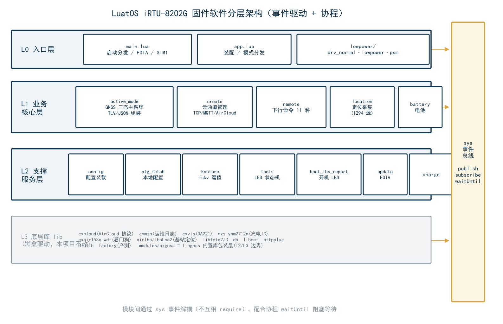

# LuatOS iRTU-8202G 车辆/宠物定位器固件代码分析文档

> **项目**：Air8202（Air780EGP 模组，G 版无 H 版）
> **固件版本**：004.000.030（本分析基于 004.000.030 冗余清理后的代码，2026-09-02）
> **工程目录**：`D:\dev\LuatOS\module\iRTU\irtu-8202G-smart-nocfg`
> **运行环境**：LuatOS（Air780EGP 模组 / Air780E 系列；DA221 三轴加速度计、YHM2712A 充电 IC、Air153C 硬件看门狗、双 SIM 卡槽——固件固定使用 SIM1）
> **文档目的**：让不熟悉本工程的人能够快速理解整体工作逻辑、通信流程与模块划分

---

## 目录

1. [功能概述与模块划分](#1-功能概述与模块划分)
2. [目录与文件介绍](#2-目录与文件介绍)
3. [设备通信流程](#3-设备通信流程)
4. [设备工作模式](#4-设备工作模式)
5. [AirCloud 通信协议详解](#5-aircloud-通信协议详解)
6. [函数调用 / 事件订阅 / 数据表逻辑关系](#6-函数调用--事件订阅--数据表逻辑关系)
7. [本工程 TLV 字段详细格式](#7-本工程-tlv-字段详细格式)

---

# 1. 功能概述与模块划分

## 1.1 产品定位

本工程是合宙 **Air780EGP（8202G）** 模组上的定位追踪器固件，典型应用为**宠物定位**与**车辆追踪**。设备以低功耗方式长期佩戴/安装在移动目标上，通过内置 **GNSS（GPS/北斗）+ LBS 基站 + WiFi** 混合定位获得位置，经 **合宙 AirCloud 云平台**（TLV 二进制协议）或通用 TCP/MQTT 通道周期性上报；同时接收云平台下行命令（如实时上报、开关机、OTA 等），实现远程管理与轨迹监控。

**主要功能清单：**

| 功能域 | 说明 | 承载模块 |
|---|---|---|
| 定位 | GNSS（GPS/北斗）优先，LBS（免费 lbsLoc2 / 付费 AirLBS+WiFi）兜底 | `location`、`modules/exgnss`、`lib/airlbs`、`lib/lbsLoc2` |
| 运动感知 | DA221 三轴加速度计：震动中断唤醒、运动中/静止判定、20Hz 原始数据流 | `gsensor`、`lib/exvib` |
| 上报 | JSON 报文 + AirCloud TLV 双通道上报；三态节流（实时 1s / GNSS 开 10s / GNSS 关 300s） | `active_mode`、`create`、`lib/excloud` |
| 远程控制 | get_device_data / change_mode / fast_report / update 等 11 种下行命令 | `remote` |
| 功耗管理 | 三种功耗模式：normal(全功率) / power_save(低功耗) / psm_sleep(深度休眠) | `lowpower_app` + `drv_normal/lovpower/psm` |
| 充电管理 | YHM2712A 充电 IC：电压/电量/充电阶段/充满检测（30s 轮询） | `battery`、`charge`、`lib/exs_yhm2712a` |
| 硬件看门狗 | Air153C 硬件看门狗（喂狗 GPIO24，180s 周期）；另 excloud 内置软件复位看门狗（10 分钟自愈，每日 ≤5 次） | `air153c_wdt`、`lib/exair153x_wdt`、`lib/excloud` |
| LED 指示 | GPIO26 绿灯 / GPIO27 红灯：开机 60s 亮、GNSS 切换亮 10s、充电红/充满绿、600s 无下行闪烁 | `tools` |
| OTA 升级 | libfota3（默认，仅合宙按 IMEI 升级）与 libfota2（客户自管）双模式 | `update`、`lib/libfota2`、`lib/libfota3` |
| 开机 LBS 上报 | 开机联网后先补一次 LBS 定位（快定位），不等 GNSS 冷启动 | `boot_lbs_report` |

## 1.2 总体架构与模块划分

整个固件按"**应用入口 → 业务核心 → 底层驱动库**"三层组织，外加一条全局**事件总线**贯穿各层。



**分层说明：**

| 层次 | 职责 | 文件 |
|---|---|---|
| **L0 入口层** | 开机模式分发、硬件/功能模块启动顺序控制、系统运行 | `main.lua`、`app.lua`、`lowpower/*` |
| **L1 业务核心层** | 工作循环、上报策略、数据采集组装、命令处理 | `active_mode.lua`、`create.lua`、`modules/remote.lua`、`modules/location.lua`、`modules/battery.lua`、`modules/sensors/gsensor.lua` |
| **L2 支撑服务层** | 配置加载/持久化、键值存储、工具、开机 LBS、OTA、充电/看门狗使能 | `config.lua`、`cfg_fetch.lua`、`utils/kvstore.lua`、`utils/tools.lua`、`boot_lbs_report.lua`、`update.lua`、`charge.lua`、`air153c_wdt.lua` |
| **L3 底层库 lib** | 合宙扩展库：AirCloud 协议（TLV）、MQTT/TCP、基站定位、传感器驱动、FOTA 等（**视为黑盒驱动，本工程不改**） | `lib/*.lua` |

> **注意**：`modules/exgnss.lua` 虽位于业务目录，其本质是 LuatOS `libgnss` 内置库的**包装层**（提供"GNSS 应用"开/关计数管理与 NMEA 读取），可视作 L2/L3 边界组件。

## 1.3 核心设计思想（先理解这 4 条，再看代码会非常快）

1. **GNSS 三态上报策略（004.000.009 起）**：不再按 work_mode 区分上报节奏，而由"是否需要 GNSS"动态决定——GNSS 开时 10s 一报（全功率），GNSS 关时 300s 一报（低功耗），实时上报命令可临时进入 1s 一报。**GNSS 是否开启 = 开机窗口 300s ∨ 正在震动 ∨ 180s 内震过 ∨ 实时上报结束保持窗口 180s**。
2. **运动传感驱动 GNSS**：设备"动"才需要高频定位——DA221 震动中断 → 发布 `MOTION_EVENT` → 主循环提前醒来评估并开 GNSS → 立即上报；静止超过 180s 自动关 GNSS 省电。
3. **双通道上报**：同一帧数据既组 JSON 报文（`create.send`，内含 msg_id/type 便于服务器判重），又组 AirCloud TLV 二进制报文（`create.send_aircloud`，含 1293/1294 二进制流等 JSON 装不下的数据）。在默认"仅 AirCloud 通道"配置下，JSON 报文被 create 封装为 TLV `RANDOM_DATA`(1281) 字段同走 AirCloud（004.000.030 修复）。
4. **事件驱动 + 协程**：全工程基于 LuatOS `sys` 事件总线（`sys.publish`/`sys.subscribe`/`sys.waitUntil`）与协程调度，模块间尽量不直接 require 调用，避免环形依赖，也便于解耦。

---

# 2. 目录与文件介绍

## 2.1 目录总览

```
irtu-8202G-smart-nocfg/
├── main.lua                    L0 入口：模式分发 / FOTA / 固定 SIM1 / 启动云连接与 app
├── app.lua                     L0 应用装配：初始化硬件与各模块，强制进入"寻宠模式"
├── active_mode.lua             L1 核心：GNSS 三态上报主循环 + 数据采集与 TLV/JSON 组装
├── create.lua                  L1 核心：云平台连接管理（AirCloud / MQTT / TCP 三通道）
├── config.lua                  静态配置 + 服务端配置装载（load_from_server）
├── cfg_fetch.lua               本地持久化配置加载（db）；远程配置拉取（已禁用入口）
├── boot_lbs_report.lua         开机联网后的一次性 LBS 定位与双通道上报
├── charge.lua                  YHM2712A 充电管理使能
├── air153c_wdt.lua             Air153C 硬件看门狗使能
├── update.lua                  FOTA 升级管理（libfota2/3）
├── modules/
│   ├── location.lua            定位业务：GNSS 状态缓存、LBS 请求、NMEA 1Hz 流采样(1294 数据源)
│   ├── remote.lua              下行命令分发与应答（11 种命令）
│   ├── battery.lua             YHM2712A 状态轮询与电量换算
│   ├── exgnss.lua              libgnss 的"GNSS 应用"包装（开/关引用计数、NMEA 读取）
│   └── sensors/
│       └── gsensor.lua         DA221 震动检测 + 中断快照 + 20Hz 流采样(1293 数据源)
├── lowpower/
│   ├── lowpower_app.lua        功耗模式高层管理（normal/power_save/psm 分发）
│   ├── drv_normal.lua          订阅 DRV_SET_NORMAL → pm.power(WORK_MODE,0)
│   ├── drv_lowpower.lua        订阅 DRV_SET_LOWPOWER → 低功耗配置+震动唤醒
│   └── drv_psm.lua             订阅 DRV_SET_PSM → PSM 深度休眠
├── utils/
│   ├── kvstore.lua             fskv 键值存储（work_mode/low_power_mode/audio_volume）
│   └── tools.lua               LED 状态机（当前唯一职责）
└── lib/                        【底层库，本项目一律不改】AirCloud 协议栈等
    ├── excloud.lua            ★ AirCloud 客户端：TCP/MQTT 连接、TLV 编解码、鉴权、重连、复位看门狗
    ├── exmtn.lua               运维日志（/hzmtn1-4.trc 循环文件、缓存/直写两种方式）
    ├── libnet.lua              阻塞式 socket 连接/收发辅助
    ├── libfota2.lua / libfota3.lua   FOTA 升级库
    ├── exs_yhm2712a.lua        YHM2712A 充电 IC 驱动（单线 CMD 通信）
    ├── exair153x_wdt.lua       Air153C 硬件看门狗驱动
    ├── exvib.lua               DA221 三轴加速度驱动（运动检测 + read_xyz）
    ├── airlbs.lua / lbsLoc2.lua   付费多基站+WiFi / 免费单基站定位
    ├── httpplus.lua            文件上传 HTTP 客户端（zbuff 流式）
    ├── db.lua                  配置以 Lua 表序列化持久化到 /luadb/air8201.cfg
    ├── dtulib.lua              十六进制转换等小工具
    ├── factory.lua             G 版产测模式（BOOT_MODE=1/0 分支进入）
    └── ...
```

## 2.2 关键文件逐一口径

| 文件 | 版本 | 角色一句话概括 | 关键对外接口 |
|---|---|---|---|
| `main.lua` | 4.5 | 开机入口：固定 SIM1 → FOTA → 加载本地配置 → 启动 create 云连接 → 启动 app → 启动 boot_lbs_report | 全局 `VERSION="004.000.030"`、`BOOT_MODE` |
| `app.lua` | 3.2 | 应用装配：读取唤醒原因、初始化全部功能模块、旧设备未激活(-1) 强制转寻宠(2)、进入 active_mode | `app.start()` |
| `active_mode.lua` | 4.2 | **全工程大脑**：GNSS 开关状态机 + 上报节流 + 数据采集组装（TLV/JSON） | `sys.taskInit(main_loop)`（模块加载即启动） |
| `create.lua` | 6.1 | 云通道管家：三种通道 task 启动/重连/断线复位；AirCloud 下双订阅直发（AIRCLOUD_SEND_ TLV / NET_SENT_RDY_ JSON 转 RANDOM_DATA） | `create.start(sheet)`、`create.send(json)`、`create.send_aircloud(tlvs)` |
| `config.lua` | 2.1 | 集中配置 + `load_from_server` 覆盖 | `config.DEFAULT_NETWORK` 等 |
| `modules/remote.lua` | 3.1 | 订阅 `REMOTE_COMMAND` 执行 11 种命令并回执 | `remote.init()` |
| `modules/location.lua` | 2.0 | GPS/LBS 采集与缓存、NMEA 流采样 | `location.get_report_location(gnss_on)`、`get_lbs_location()`、`get_nmea_stream()` |
| `modules/sensors/gsensor.lua` | — | DA221 运动检测 / 快照 / 流采样 | `gsensor.get_stream_data(200)`、`on_vibration()`、`get_status()` |
| `utils/tools.lua` | 2.1 | LED 状态机（500ms 定时刷新） | `tools.init_led()`、`led_gnss_switched_on()` |
| `lib/excloud.lua` | 20260901 | AirCloud 协议栈：16B 消息头 + TLV；鉴权/心跳/重连/复位看门狗 | `excloud.setup/open/send/on/mtn_log`，`FIELD_MEANINGS`、`DATA_TYPES` |

> 阅读建议：`main.lua → app.lua → active_mode.lua → create.lua → excloud.lua` 是主干；`remote/location/gsensor/battery` 是枝叶；`config/kvstore/tools/lowpower` 是支撑。
