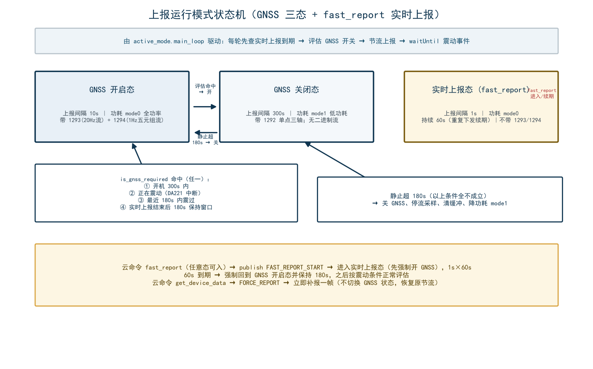

# 4. 设备工作模式

## 4.1 模式体系总览：三条独立的模式轴

阅读本工程代码时最容易混淆的是"模式"一词——代码里实际存在**三条互相独立的模式轴**，分别回答三个问题：

| 模式轴 | 取值 | 回答的问题 | 管理位置 |
|---|---|---|---|
| **设备工作模式** `work_mode` | -1 未激活 / 0 常规 / 1 智能 / 2 寻宠(GPS定位) | "设备被用来做什么场景" | `kvstore` 持久化，`app.lua` 启动分发，`remote.change_mode` 云命令切换 |
| **上报运行模式**（GNSS 三态） | 实时上报(1s) / GNSS 开启(10s) / GNSS 关闭(300s) | "现在该不该用 GNSS、多久报一次" | `active_mode.lua` 主循环状态机（**全工程核心**） |
| **功耗模式** `power_mode` | normal / power_save / psm_sleep | "整机功耗调到哪一档" | `lowpower_app.lua` 高层 → `drv_normal/lowpower/psm` 驱动 |

> **关键认知（004.000.009 重构后）**：设备工作模式 `work_mode` **不再直接决定上报节奏**。真正决定上报节奏的是"是否需要 GNSS"这一动态状态；`work_mode` 目前只影响低电量策略的兜底判断（见 4.4），且由于绑定流程废弃，固件在 `app.lua` 中强制收敛为寻宠模式(2)。三条轴之间的联动链见 4.6。

## 4.2 设备工作模式 work_mode（fskv 持久化）

### 4.2.1 取值定义（config.DEVICE_MODE）

| 值 | 名称 | 历史含义 | 当前实际行为（004.000.030） |
|---|---|---|---|
| -1 | UNACTIVATED 未激活 | 出厂未绑定 App，进入待绑定模式 | **已废弃**：`app.lua` 检测到旧设备存 -1 时强制 `set_work_mode(2)` 进寻宠模式 |
| 0 | PERFORMANCE 常规 | 常规模式 | 保留取值，云命令可切；`set_mode_by_device_mode` 映射到 POWER_SAVE 功耗 |
| 1 | SMART 智能 | 智能省电模式 | 同上，映射到 POWER_SAVE |
| 2 | FIND 寻宠/GPS定位 | 宠物查找，GPS 常开 | **出厂默认值**，开机即进入；映射到 NORMAL(全功率) |

### 4.2.2 生命周期与写入路径

```
首次上电（kvstore.init）             云命令 change_mode（remote.lua）
   └─ fskv.set("work_mode","2")          └─ 校验 mode∈{-1,0,1,2}
                                             ├─ kvstore.set_work_mode(mode)   # 立即持久化
                                             ├─ lowpower_app.set_mode_by_device_mode(mode)
                                             └─ 3 秒后 pm.reboot()            # 重启生效
                                                    │
                                                    ▼
                                    app.lua: 若读到 -1 → 强制改为 2（寻宠）
                                                    │
                                                    ▼
                                    require("active_mode") → GNSS 三态主循环
```

- 存储键：`work_mode`（`fskv`），默认值 `"2"`；
- **读取方**：`app.lua`（启动分发）、`active_mode.collect_data_and_report`（随 1290/JSON 上报）、`boot_lbs_report`（随开机 LBS 上报）、`lowpower_app.handle_low_battery`（低电量策略判断）、`remote.change_mode`；
- 写入方：`kvstore.init`（首启默认）、`remote.change_mode`（云命令）、`app.lua`（-1 强制修正）。

> 结论：对本固件而言 work_mode 是一个"名义模式"。除低电量兜底与 1290 字段上报外，业务行为完全由 4.3 的 GNSS 三态状态机决定。

## 4.3 上报运行模式：GNSS 三态状态机（全工程核心）

### 4.3.1 三种运行态

| 运行态 | 上报间隔 | 功耗 | 触发方式 | 是否上报流数据(1293/1294) | 是否上报 1292 单点三轴 |
|---|---|---|---|---|---|
| **实时上报** `fast_report_active=true` | 1s（`REPORT_FAST`） | mode0（GNSS 必开） | 云命令 `fast_report`，持续 60s，可续期 | 否（每秒报文只带常规字段） | 是 |
| **GNSS 开启** `gnss_active=true` | 10s（`REPORT_GNSS_ON`） | mode0 NORMAL | `is_gnss_required()` 命中 | 是（20Hz×10s 200样本 1293 + 1Hz×10样本 1294） | 否（由 1293 原始流替代） |
| **GNSS 关闭** `gnss_active=false` | 300s（`REPORT_GNSS_OFF`） | mode1 POWER_SAVE | `is_gnss_required()` 全部不命中 | 否 | 是 |



### 4.3.2 GNSS 开启条件（is_gnss_required，满足任一即开）

```lua
-- active_mode.lua is_gnss_required()
return true 当且仅当任一成立：
   条件0: fast_report_hold_until > 0 且 os.time() < fast_report_hold_until
          （实时上报结束后 180s 强制保持 GNSS 开启窗口）
   条件1: (mcu.ticks() - boot_ticks) / 1000 < GNSS_BOOT_WINDOW (300s)
          （开机后 300 秒内 GNSS 常开；用 mcu.ticks 毫秒 tick，不受 NTP 校时影响）
   条件2+3: gsensor.get_status().last_motion_time > 0
          且 (os.time() - last_motion_time) <= GNSS_MOTION_KEEP (180s)
          （正在震动，或最近 180 秒内震动过——统一用 180s 窗口判定）
```

**四个常量**（均可按产品调优）：

| 常量 | 值 | 含义 |
|---|---|---|
| `GNSS_BOOT_WINDOW` | 300s | 开机 GNSS 常开窗口（保证开机即有轨迹） |
| `GNSS_MOTION_KEEP` | 180s | 震动后 GNSS 保持开启时长（004.000.021 由 30s 调大：震动后用户大概率会继续移动） |
| `REPORT_GNSS_ON` | 10s | GNSS 开启期上报间隔 |
| `REPORT_GNSS_OFF` | 300s | GNSS 关闭期上报间隔 |

### 4.3.3 状态切换动作

**开 GNSS（switch_gnss_on，三处复用）**：

| 步骤 | 动作 | 目的 |
|---|---|---|
| 1 | `location.start_find_gps()` | 打开 GNSS（exgnss DEFAULT 常开应用） |
| 2 | `lowpower.set_mode(NORMAL)` | 功耗 mode0，GNSS 需全功率 |
| 3 | `gsensor.stream_start()` | 开启 20Hz 三轴流采样（1293 数据源） |
| 4 | `location.nmea_stream_start()` | 开启 1Hz NMEA 采样（1294 数据源） |
| 5 | `last_report_time = 0` | 立即触发一次上报（不等下一节流周期） |
| 6 | `tools.led_gnss_switched_on()` | 红灯亮 10s（关→开切换视觉提示） |
| 7 | `excloud.mtn_log(...)` | 写运维日志（触发原因、上报间隔） |

**关 GNSS（主循环 elseif 分支）**：

| 步骤 | 动作 |
|---|---|
| 1 | `gnss_active=false` |
| 2 | `location.stop_find_gps()`（exgnss.close 仅注销本应用，所有应用关闭后 GNSS 才真正断电） |
| 3 | `lowpower.set_mode(POWER_SAVE)` → 功耗 mode1 |
| 4 | `gsensor.stream_stop()`（停采样 + 清空缓冲） |
| 5 | `location.nmea_stream_stop()`（同上） |

### 4.3.4 实时上报模式（fast_report，004.000.028 新增）时序

```
云命令 fast_report
   └─ publish FAST_REPORT_START
        └─ active_mode 订阅回调：
             ├─ 若当前 GNSS 关 → switch_gnss_on("fast_report进入实时上报强制")   # 实时上报必须带实时坐标
             ├─ fast_report_active = true
             └─ fast_report_deadline = os.time() + 60
主循环每轮：
   ├─ 步骤0: 若 fast_report_active 且 os.time() >= deadline
   │      → 结束实时上报：fast_report_hold_until = now + 180（强制 GNSS 保持窗口）
   │      → 若 GNSS 关 → switch_gnss_on("实时上报结束强制")
   ├─ 期间暂停 is_gnss_required() 评估（不自相冲突）
   └─ 上报节流 interval = 1s；上报时跳过 1293/1294 取流
特点：
   - 重复下发命令 → 重置 60s 倒计时（续期）
   - 1 分钟内约上报 60 帧（每秒 1 次）
   - 结束后强制进入 GNSS 开启态，180s 后才恢复按震动条件评估
```

### 4.3.5 震动唤醒主循环（事件闭环）

```
DA221 硬件中断(WAKEUP2) → gpio 回调 interrupt_handler（gsensor.lua）
   ├─ 2s 限流过滤（state.vibration_interval=2000ms）
   ├─ is_moving=true、motion_timeout=60（震动后网络恢复需时间，运动有效期临时延长到60s）
   ├─ pending_gps=true（强制本次上报走 GPS，不依赖 is_moving 时序）
   ├─ publish GSENSOR_XYZ_CAPTURE（由 xyz_capture_task 协程读 I2C 存快照——中断上下文禁止 I2C）
   └─ 调 vibration_callback → active_mode 里发布 MOTION_EVENT
        ├─ main_loop 的 waitUntil(MOTION_EVENT) 立即返回 → 步骤1 重新评估 GNSS
        └─ 若正阻塞在上报/等网络（≤30s），由常驻订阅的 motion_event_flag 兜底，本轮结束立即生效
```

## 4.4 功耗模式 power_mode

### 4.4.1 三档定义（config.POWER_MODE）

| 档位 | 底层动作 | 适用场景 |
|---|---|---|
| `normal` | `DRV_SET_NORMAL` → `pm.power(pm.WORK_MODE, 0)` | GNSS 开启期/实时上报期：需全功率 + 网络长连接 |
| `power_save` | `DRV_SET_LOWPOWER` → 配置 PWR_KEY/WAKEUP2 中断唤醒、`location.close()` 关 GPS、`pm.power(pm.WORK_MODE, 1)`，唤醒后恢复 gsensor 中断 | GNSS 关闭期：300s 才报一次，传感器低功耗待命，震动唤醒 |
| `psm_sleep` | `DRV_SET_PSM` → 配置唤醒源、`pm.power(pm.WORK_MODE, 3)` | 深度休眠：当前仅在低电量(<10%)且未激活模式下进入；**激活后基本不触发**（驱动内功能项已注释留空） |

调用链：`lowpower.set_mode(mode)` → 校验 mode → `sys.publish("DRV_SET_NORMAL/LOWPOWER/PSM")` → `drv_*.lua` 模块加载时 `sys.subscribe` 注册的回调 → 各自 task 执行。

### 4.4.2 功耗与 GNSS 三态联动（active_mode 驱动）

| 事件 | 功耗切换 |
|---|---|
| GNSS 关 → 开 | `set_mode(NORMAL)` mode0 |
| GNSS 开 → 关 | `set_mode(POWER_SAVE)` mode1 |
| GNSS 关闭期每次上报 | 上报开始时 `pm.power(pm.WORK_MODE, 0)` 临时唤醒全功率，上报完成后再 `set_mode(POWER_SAVE)` 回低功耗 |
| 实时上报期 | 全程 mode0（结束后强制进 GNSS 开，避免功耗模式震荡） |

### 4.4.3 低电量降级策略（lowpower_app.handle_low_battery）

`active_mode.battery_monitor_task` 每 60s 检测：电量 < `BATTERY_LOW`(20%) → `publish BATTERY_LOW`；`kvstore.set_low_power_mode(true)`。lowpower_app 订阅后按 work_mode 分流：

| work_mode | 电量 <20% | 电量 <10%(BATTERY_CRITICAL) |
|---|---|---|
| 未激活 -1（理论可达） | → POWER_SAVE | → PSM_SLEEP 深度休眠 |
| 寻宠 2（实际默认） | → POWER_SAVE（降级，放弃全功率持续定位） | 沿用 POWER_SAVE（无更低档处理） |
| 常规/智能 0/1 | 保持 POWER_SAVE | 保持 POWER_SAVE |

## 4.5 四条联动链小结（把三条轴串起来）

| # | 场景 | 决策链 |
|---|---|---|
| 1 | 开机 | work_mode(默认2 寻宠) → app 强制 active_mode → **开机 300s GNSS 常开窗口** → 每 10s 全功率上报 |
| 2 | 行驶中 | DA221 震动 → MOTION_EVENT → GNSS 保持开（180s 滚动续期）→ 10s 一报 + 1293/1294 流 |
| 3 | 静止超 180s | is_gnss_required 全不命中 → 关 GNSS → POWER_SAVE → 300s 一报（1292 单点三轴替代流） |
| 4 | 云命令介入 | `fast_report` → 1s 实时上报 60s；`get_device_data` → FORCE_REPORT 立即补一帧；`change_mode` → 改 work_mode + 3s 后重启 |

---

# 5. AirCloud 通信协议详解

> 本协议为**合宙 IOT 通用报文协议 - AirCloud**（官方文档：<https://docs.openluat.com/protocols/aircloud/>）在 8202G 上的落地实现，代码集中在 `lib/excloud.lua`。本工程在**标准字段之外自定义了 1290~1294 五个字段**（见第 7 节），属于协议允许的扩展区（1280-1535 为通用测试数据区）。

## 5.1 协议总体格式

一条 AirCloud 报文 = **16 字节消息头** + **TLV 序列体**，承载于 TCP（默认）/ UDP / MQTT 之上：

```
┌──────────────────────────────┬──────────────────────────────┐
│  16 字节消息头 (header)      │  N 个 TLV 单元拼接 (body)     │
└──────────────────────────────┴──────────────────────────────┘
         每个 TLV = 4 字节头 + 变长 value
```

## 5.2 消息头字段表（16 字节）

发送侧 `build_header()` / 接收侧 `parse_message()` 完全对应：

| 偏移 | 长度 | 字段 | 说明 |
|---|---|---|---|
| 0 | 8B | 设备 ID | 二进制编码的设备标识。4G 设备(type=1)：**14 位 IMEI 压缩成 8 字节 BCD**（每字节两个十进制位，`string.toHex` 后可还原）；WiFi/MCU(type=2/3)：MAC 地址 6B 左补零到 7B 再处理；虚拟设备(type=9)：11 位手机号+3 位序列号 |
| 8 | 2B | 序列号 sequence_num | 大端；发送侧每包自增 1，1~65535 循环（发送前自增，回调返回最新值） |
| 10 | 2B | 消息长度 msg_length | 大端；**仅 body（TLV 序列）的长度，不含 16B 头** |
| 12 | 4B | flags | 见下表位定义；大端存储 |

### flags 位定义

| 位 | 掩码 | 含义 |
|---|---|---|
| bit0-3 | 0x0F | 协议版本号 `protocol_version` |
| bit4 | 0x10 | need_reply：1=需要服务器回复（鉴权报文置 1） |
| bit5 | 0x20 | is_udp：1=UDP 承载 |
| bit6 | 0x40 | has_auth_key（接收解析用；UDP 模式下 auth_key 直接附加在 body 之后发送） |
| bit7-31 | — | 保留 |

> UDP 特殊：TCP/MQTT 下报文 = header + body；UDP 下 = header + `udp_auth_key` + body。

## 5.3 TLV 单元格式

```
┌───────────────────┬───────────────────┬────────────────────────┐
│ field_type  2B    │ length  2B       │ value  length 字节     │
└───────────────────┴───────────────────┴────────────────────────┘
   bit15-12 = 数据类型   value 字节数(大端)
   bit11-0  = 字段含义
```

- `field_type = (data_type << 12) | (field_meaning & 0xFFF)`；
- 值编码由 `encode_value()` 完成：INTEGER=4B 大端；FLOAT=×1000 后 4B 大端整数（非 IEEE754）；BOOLEAN=1B；ASCII/BINARY/UNICODE=原字节；
- **解码注意**：FLOAT 解码时 ÷1000 还原；ASCII 空字符串编码会失败（`encode_value` 返回空串即 build_tlv 失败、整包发送失败）——因此业务侧约定**空值字符串字段一律跳过不组装**（见 active_mode/build_aircloud_tlv 注释）。

**示例（INTEGER 类型字段 1290=工作模式，值 2）**：

```
field_type = (0x0 << 12) | 1290 = 0x050A
长度       = 4
value      = 00 00 00 02
整条 TLV   = 05 0A 00 04 00 00 00 02   (8 字节)
```

## 5.4 数据类型表（DATA_TYPES）

| 常量 | 值 | value 编码 | 解码 |
|---|---|---|---|
| INTEGER | 0x0 | 4B 有符号大端（溢出告警但不失败） | 大端还原 |
| FLOAT | 0x1 | 4B 大端整数 = 实际值 ×1000 | ÷1000 |
| BOOLEAN | 0x2 | 1B：`\1`/`\0` | 首字节非 0 即 true |
| ASCII | 0x3 | 原样字符串 | 原样 |
| BINARY | 0x4 | 原样二进制 | 原样（日志只打长度不打内容） |
| UNICODE | 0x5 | 原样 | 原样 |

## 5.5 字段含义表（FIELD_MEANINGS）

excloud.lua 按官方协议定义了四大区段的标准字段（本工程实际使用项加 ★）：

### 5.5.1 控制信令（16-255）

| 值 | 常量 | 方向 | 说明 | 本工程使用 |
|---|---|---|---|---|
| 16 | AUTH_REQUEST | 上行 | 鉴权请求 | ★ 值=`auth_key-IMEI-MUID`(ASCII) |
| 17 | AUTH_RESPONSE | 下行 | 鉴权回复 | ★ ok/success=成功，否则武装复位看门狗 |
| 18 | REPORT_RESPONSE | 下行 | 上报回应 | ★ 同上（ok/success 解除鉴权失败态） |
| 19 | CONTROL_COMMAND | 下行 | 控制命令 | — |
| 20 | CONTROL_RESPONSE | 上行 | 控制回应 | — |
| 21 | IRTU_DOWN | 下行 | iRTU 下行命令 | — |
| 22 | IRTU_UP | 上行 | iRTU 上行回复 | — |
| 23/24 | FILE_UPLOAD_START/FINISH | 上行 | 文件上传开始/完成通知 | 库内部文件上传用 |
| 25 | MTN_LOG_UPLOAD_REQ_SIGNAL | 下行 | 运维日志上传请求 | ★ 收到即上传 /hzmtn*.trc |
| 26 | MTN_LOG_UPLOAD_RESP_SIGNAL | 上行 | 运维日志上传响应 | 库内部 |
| 27 | MTN_LOG_UPLOAD_STATUS_SIGNAL | 上行 | 运维日志上传状态 | 库内部 |
| 28-31 | SMS_SEND / SMS_SEND_RSP / SMS_REPORT / SMS_REPORT_RSP | 双向 | 短信收发/状态 | — |

### 5.5.2 传感采集类（256-511）

| 值 | 常量 | 说明 |
|---|---|---|
| 256-265 | TEMPERATURE/HUMIDITY/PARTICULATE/ACIDITY/ALKALINITY/ALTITUDE/WATER_LEVEL/ENV_TEMPERATURE/POWER_METERING/WORK_STATUS | 温湿度/颗粒/酸碱度/海拔/水位/电量计量/工作状态等 |

### 5.5.3 GNSS 资产管理类（512-767）

| 值 | 常量 | 说明 | 本工程使用 |
|---|---|---|---|
| 512 | GNSS_LONGITUDE | 经度 | ★ ASCII 字符串（从 "lat,lng" 拆分） |
| 513 | GNSS_LATITUDE | 纬度 | ★ ASCII 字符串 |
| 514 | SPEED | 行驶速度 | —（速度走 1294 流） |
| 515 | GNSS_CN | 最强 4 颗卫星 CN | ★ 仅 gps_status=2 时 |
| 516 | SATELLITES_TOTAL | 搜星总数 | ★ |
| 517 | SATELLITES_VISIBLE | 可见卫星数 | ★ |
| 518 | HEADING | 航向角 | — |
| 519 | LOCATION_METHOD | 定位方式标识 | ★ ASCII "2/3/4/5" |
| 520 | GNSS_INFO | GNSS 芯片型号固件 | — |
| 521 | DIRECTION | 方向 | — |

### 5.5.4 设备参数类（768-1023）

| 值 | 常量 | 说明 | 本工程使用 |
|---|---|---|---|
| 771 | BATTERY_LEVEL | 电量(mV) | —（电池电压用 799） |
| 772 | SERVING_CELL | 驻留频段 | ★ ASCII "LTE B3" |
| 774 | COMPONENT_MODEL | 元器件型号 | ★ ASCII "Air8202" |
| 776 | BOOT_REASON | 开机原因 | ★ ASCII |
| 779 | WAKE_INTERVAL | 定时唤醒间隔 | ★ INTEGER（1/10/300） |
| 782 | SIGNAL_STRENGTH_4G | 4G 信号强度 CSQ | ★ INTEGER |
| 783 | SIM_ICCID | SIM 卡 ICCID | ★ ASCII |
| 784-787 | FILE_UPLOAD_TYPE/NAME/SIZE/UPLOAD_RESULT_STATUS | 文件上传元数据 | 库内部 |
| 788-792 | MTN_LOG_FILE_INDEX/TOTAL/SIZE/STATUS/NAME | 运维日志文件信息 | 库内部 |
| 799 | VOLTAGE | 实际电压 | ★ INTEGER（电池电压 mV） |
| 800 | SET_VOLTAGE | 设置电压 | — |

### 5.5.5 软件与短信日志类（1024-1279）

| 值 | 常量 | 说明 |
|---|---|---|
| 1024-1026 | LUA_CORE/EXT/APP_ERROR | Lua 错误上报 |
| 1027 | FIRMWARE_VERSION | 固件版本号 |
| 1028-1029 | SMS_FORWARD / CALL_FORWARD | 短信/来电转发 |
| 1030-1038 | SYSTEM_MEM_* / LUA_MEM_* / PSRANM_MEM_* | 内存统计 |
| 1039-1048 | SMS_SEQ/CALLEE/CONTENT/STATUS/CALLER/... | 短信业务字段 |

### 5.5.6 通用测试数据类（1280-1535）★ 自定义字段区

| 值 | 常量/名称 | 说明 | 本工程使用 |
|---|---|---|---|
| 1280 | TIMESTAMP | 时间戳 | — |
| 1281 | RANDOM_DATA | 无意义数据 | ★★ **JSON 报文与心跳的封装字段**（ASCII） |
| 1282 | BUSINESS_SN | 业务 SN | — |
| 1283 | HEARTBEAT_COUNT | 心跳次数 | — |
| 1284 | ONLINE_DURATION | 在线时长 | — |
| **1290** | —（自定义） | 工作模式 work_mode | ★ INTEGER |
| **1291** | —（自定义） | 充电状态 bat_change | ★ INTEGER |
| **1292** | —（自定义） | 单点三轴 ASCII "x,y,z"(g) | ★ ASCII |
| **1293** | —（自定义） | 20Hz 三轴原始流（12bit 紧凑） | ★ BINARY ≤900B |
| **1294** | —（自定义） | 1Hz 定位五元组流（int16 差值） | ★ BINARY ≤100B |

> 1290~1294 的**逐字节格式**见第 7 节。

## 5.6 连接与鉴权协议流程（TCP 默认路径）

```
设备                                AirCloud 服务器
 │  1) POST https://api.luatos.com/iot/getip
 │     forms: key="unusedkey-IMEI-MUID"(auth_key 现仅为占位), type=3
 │ ◄── 返回 JSON：host / port / auth_key / udp_auth_key 等
 │
 │  2) TCP connect(host, port)
 │
 │  3) 鉴权报文（msg_length 只含 body）：
 │     header(16B, need_reply=1) + TLV{field=16 AUTH_REQUEST, type=ASCII,
 │     value="<auth_key>-<IMEI>-<MUID>"}
 │ ──►
 │ ◄── 4) 下行 TLV{field=17 AUTH_RESPONSE, value="ok"/"success"(或失败文本)}
 │       ├─ ok/success 前缀匹配(is_success_reply) → is_authenticated=true，
 │       │   若有鉴权失败武装状态则解除 → 回调 auth_result(success=true)
 │       └─ 否则 → is_authenticated=false → 回调 auth_result(success=false)
 │            + arm_watchdog_on_auth_fail("field=17 value=...")   # 武装复位看门狗
 │
 │  5) 鉴权通过后自由收发数据报文（18 上报回应同按 ok/success 判定）
```

**鉴权失败看门狗（004.000.020+）**：鉴权回复非 ok/success（或上报被拒）→ 武装 10 分钟复位定时器；当日复位 ≤5 次（fskv 持久化计数），超限降级为 1 小时慢速重试，避免死循环。

**MQTT 承载差异**：TCP 改为 MQTT 后连接不变，但发送走发布主题——
- 鉴权报文：`/AirCloud/up/<device_id_hex>/auth`
- 数据报文：`/AirCloud/up/<device_id_hex>/all`

## 5.7 收包解析流程（parse_data）

```
socket 收包 → parse_message()（16B 头 + 逐 TLV 切分）
   ├─ 摘要日志：下行字节数 + 字段号列表（不打内容，防日志膨胀）
   └─ 逐 TLV 特殊字段拦截：
        ├─ field=25 MTN_LOG_UPLOAD_REQ_SIGNAL → handle_mtn_log_upload_request() 上传后 return
        ├─ field=17 AUTH_RESPONSE 或 18 REPORT_RESPONSE → ok/success 判定鉴权状态
        │     （成功→解除失败态；失败→武装看门狗），不转发给业务回调
        └─ 其余字段 → callback_func("message", message)
             └─ create.lua on() 回调 → 逐 TLV publish REMOTE_COMMAND
                  └─ remote.lua / tools.lua（LED 通信正常证据）双订阅
```

## 5.8 上行发送路径与心跳保活

三条发送入口（create.lua 中转）：

| 入口 | 触发 | 内容 | excloud.send 参数 |
|---|---|---|---|
| `AIRCLOUD_SEND_1` 订阅 | `create.send_aircloud(tlvs)`（active_mode/boot_lbs_report 组装的结构化 TLV） | 直接按 TLV 数组打包 | `send(tlvs, false)` |
| `NET_SENT_RDY_1` 订阅 | `create.send(json)`（JSON 报文：startup/property_report/command_reply/boot_lbs_report） | 封装为 `RANDOM_DATA(1281)` ASCII 字段 | `send({1281 字段}, false)` |
| 心跳 | aircloudTask 主循环 keepAlive=300s | `RANDOM_DATA(1281)` ASCII=`{csq,eci,rsrp,band}` JSON（aircloud_heart） | `send(..., false, false, true)` silent=true |

**心跳节流逻辑**：aircloudTask 记录 `last_send_time`（mcu.ticks），主循环每 300s 检查：距上次成功发送 <300s → 数据上报已保活，跳过；否则发一次心跳（静默模式：成功不写运维日志，失败仍记录）。

**失败自愈**：`excloud.send` 发送失败（TCP/UDP）→ 记录错误 → `cleanup_connection()` + 标记断开 → 走统一重连逻辑（指数退避，重连成功后若断连前心跳在跑则自动恢复）。MQTT publish 失败属 QoS 语义，不强制重连。

## 5.9 单包长度约束（重要）

- AirCloud 约束：**单条数据包内全部 TLV 总字节 ≤ 1400**；
- 本工程最大的 1293 字段（900B）+ 4B TLV 头 = 904B，为整包 1400 上限留足余量；
- 发送侧不强制拆分，业务组装时已按此上限设计（见 gsensor.lua 注释：200 样本 × 12bit = 900B 的选取即考虑此约束）。

## 5.10 运维日志上传（mtn_log，25/26/27）

- 日志来源：`exmtn` 循环写 `/hzmtn1.trc` ~ `/hzmtn4.trc`（blocks=2）；
- 埋点：GNSS 开关、实时上报进出、1293 流异常、收发字节数与结果、连接/断开/MQTT 错误等（aircloud_mtn_log_enabled=true 时 excloud 内部事件也写）；
- 触发：服务器下发 field=25 → 上传全部日志文件（响应字段 26、状态字段 27）；缓存写方式(CACHE_WRITE)；
- 作用：远程排查不上报/GNSS 异常等，是本工程"可观测性"的主要通道。
