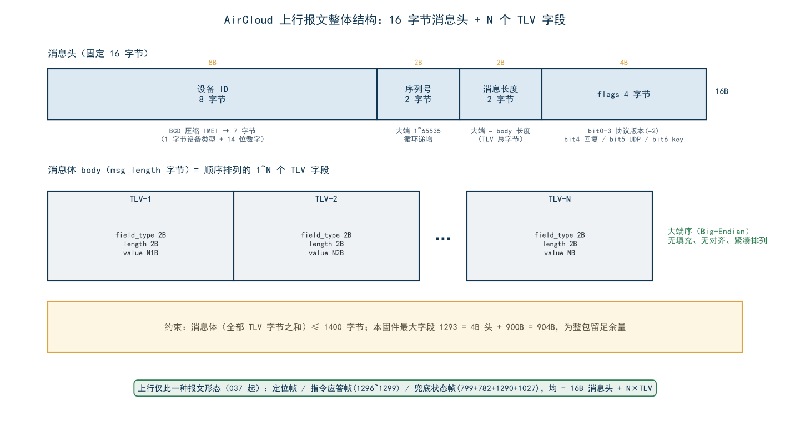
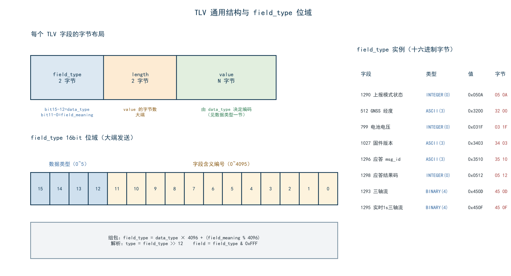
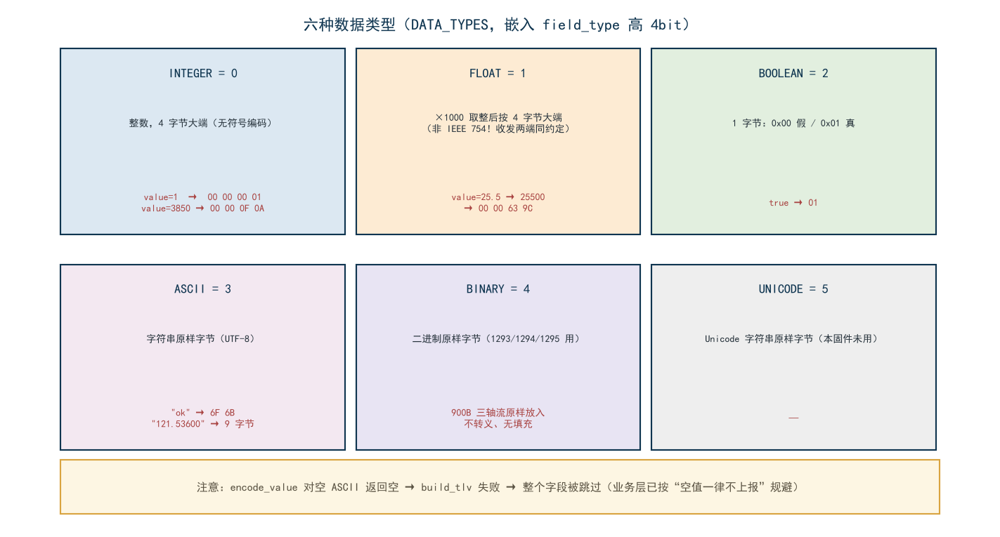
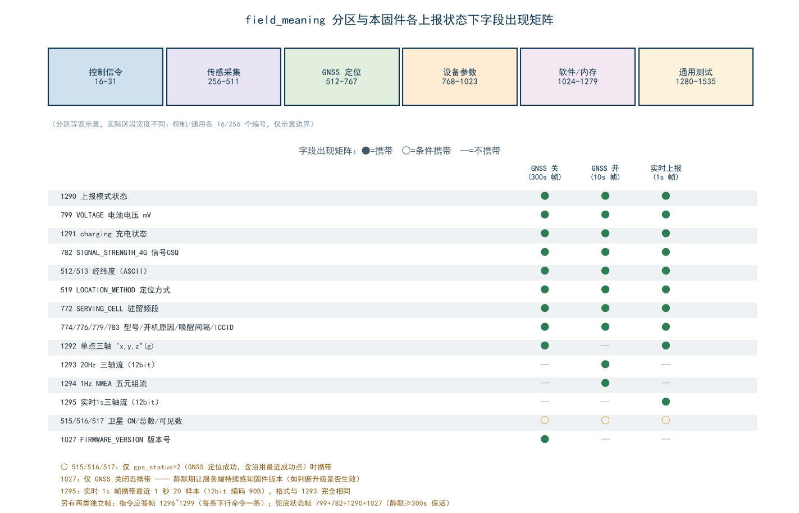
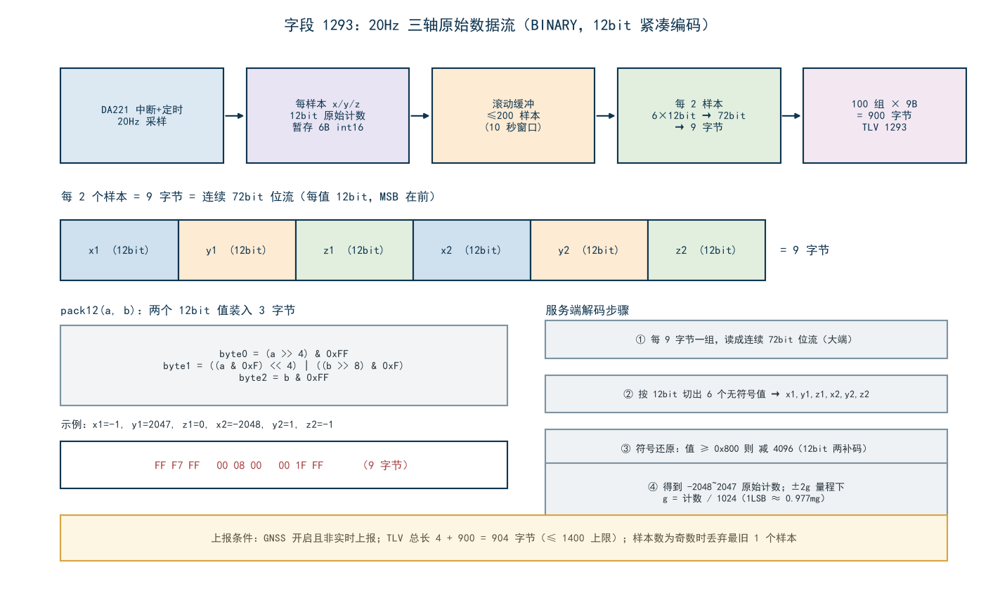
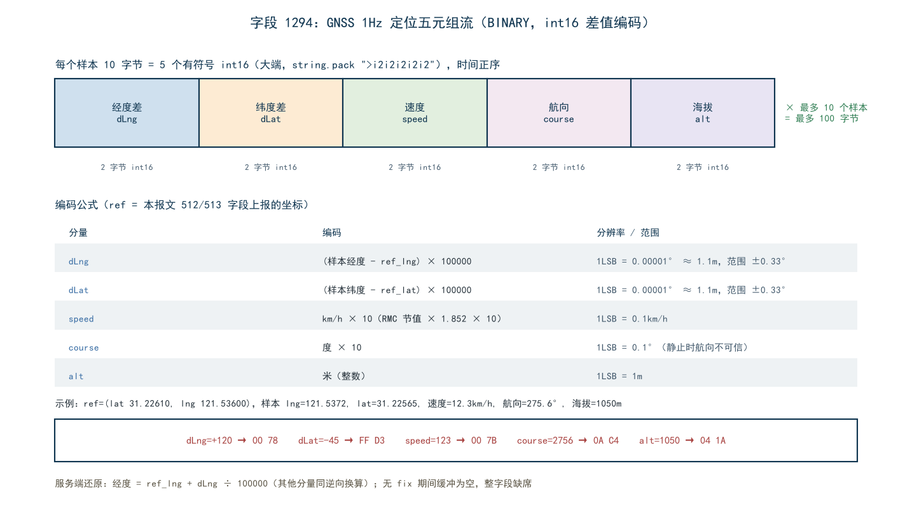

# AirCloud TLV 数据格式详解

**适用项目**：irtu_8202_bookbag 书包定位器固件（LuatOS，Air780EGP，PROJECT=Air8202bag）
**协议依据**：合宙 IOT 通用报文协议 — AirCloud（`https://docs.openluat.com/protocols/aircloud/`），协议版本 2
**代码来源**：`lib/excloud.lua`（协议编解码库）、`active_mode.lua`（组包逻辑）、`gsensor.lua` / `modules/location.lua`（数据源）
**固件版本**：001.000.002（本文档随 001.000.002 同步更新：基线继承原 8202G 项目 004.000.037 的纯 TLV 上行协议——1281 JSON 通道已移除、1296~1299 指令应答字段与 799/782/1290/1027 兜底状态帧沿用；001.000.002 新增 gnss_schedule 下行命令与第 11 章下行配置链路对接说明）

---

## 目录

1. [报文总览](#1-报文总览)
2. [消息头结构（16 字节）](#2-消息头结构16-字节)
3. [TLV 通用结构](#3-tlv-通用结构)
4. [六种数据类型详解](#4-六种数据类型详解)
5. [字段编号（field_meaning）分区与字段清单](#5-字段编号field_meaning分区与字段清单)
6. [上行通道与兜底状态帧（原 1281 JSON 通道）](#6-上行通道与兜底状态帧原-1281-json-通道)
7. [自定义字段详解（1290–1299）](#7-自定义字段详解1290–1299)
8. [标准字段明细](#8-标准字段明细)
9. [完整帧逐字节示例](#9-完整帧逐字节示例)
10. [约束与注意事项](#10-约束与注意事项)
11. [下行配置链路对接（网页端 → 服务器 → 终端）](#11-下行配置链路对接网页端--服务器--终端)

---

## 1. 报文总览

设备与 AirCloud 平台之间的每一条报文都由两部分组成：

```
┌──────────────┬──────────────────────────────┐
│  消息头 16B   │   消息体 body = N 个 TLV 字段  │
└──────────────┴──────────────────────────────┘
      固定长度            变长，≤ 1400 字节
```

- **消息头**固定 16 字节，携带设备身份、序列号、消息长度与控制标志；
- **消息体**由 1 个或多个 TLV（Type-Length-Value）字段顺序拼接而成；
- 消息体的长度受 **1400 字节** 上限约束（TCP/MQTT 单包安全值），组包前固件会按字段预算裁剪；
- 整帧**所有多字节整数均为大端序（Big-Endian）**；
- 004.000.037 起**上行只有结构化 TLV 一种报文形态**：定位帧（build_aircloud_tlv）、指令应答帧（1296~1299）、兜底状态帧（799/782/1290/1027）三者均为 16B 消息头 + N×TLV，原 1281 JSON 报文通道已整体移除。



---

## 2. 消息头结构（16 字节）

消息头由 `excloud.lua` 的 `build_header()` 与 `packDeviceInfo()` 生成，共 16 字节：

| 偏移 | 长度 | 内容 | 说明 |
|------|------|------|------|
| 0 | 1B | 设备类型 | 1=4G 设备（IMEI）、2=WiFi（MAC）、3=MCU、9=虚拟设备。本固件固定为 `1` |
| 1 | 7B | 设备 ID（BCD） | 14 位 IMEI 两两压缩：`"86412305012345"` → `86 41 23 05 01 23 45`。不足 14 位左补 0 |
| 8 | 2B | 序列号 sequence_num | 全局自增（1~65535 循环），用于请求-响应配对 |
| 10 | 2B | 消息长度 msg_length | **消息体 body 的字节数**（不含 16B 消息头本身） |
| 12 | 4B | 控制标志 flags | 位域见下表 |

**flags 位域**（32 位整数，实际仅低 7 位有效）：

| 位 | 含义 | 本固件取值 |
|----|------|-----------|
| bit0–3 | 协议版本号 | `2`（`protocol_version = 2`，由代码强制，不允许配置） |
| bit4 | need_reply：是否需要服务器回复 | 上报帧=1，心跳/鉴权按需 |
| bit5 | UDP 承载标志 | TCP/MQTT 模式=0 |
| bit6 | 报文中包含 auth_key | 通常 0（密钥经 getip 服务发现获取） |

**示例**：需要回复的 TCP 上报帧，flags = 2 + 16 = 18，编码为 4 字节大端 `00 00 00 12`。

**鉴权请求的 flags**：`excloud.send(message, true, true)` → need_reply=1，flags 仍为 `0x12`；鉴权信息本身放在字段 16（AUTH_REQUEST）的 value 中。

---

## 3. TLV 通用结构

每个 TLV 字段由三部分组成，**头 4 字节固定，value 变长**：

```
┌─────────────────────┬──────────────┬──────────────────┐
│  field_type  2 字节  │  length 2B   │   value  N 字节   │
└─────────────────────┴──────────────┴──────────────────┘
```

### 3.1 field_type 位域（2 字节）

`field_type` 并不是裸的字段编号，它把**字段编号**与**数据类型**压缩进了同一个 16 位整数：

```
15          12 11                    0
┌─────────────┬────────────────────────┐
│  data_type  │      field_meaning      │
│  （4 位）    │      （12 位）           │
└─────────────┴────────────────────────┘
```

**组包公式**（`excloud.build_tlv`）：

```lua
field_type = data_type * 0x1000 + (field_meaning % 0x1000)
```

- 高 4 位 `data_type`：0~5，对应六种数据类型（见第 4 节）；
- 低 12 位 `field_meaning`：字段编号对 0x1000 取模（字段编号本身不会超过 4095，取模仅为防御）。

**解析公式**（`excloud.parse_tlv`，逆向过程）：

```lua
data_type     = math.floor(field_type / 0x1000)   -- 高 4 位
field_meaning = field_type % 0x1000               -- 低 12 位
```

### 3.2 本固件实际使用的 field_type 十六进制对照表

| 字段 | 名称 | data_type | field_type（十进制/十六进制） | 字节序 |
|------|------|-----------|------------------------------|--------|
| 1290 | 上报模式状态 | INTEGER(0) | 1290 = `0x050A` | `05 0A` |
| 1291 | 充电状态 | INTEGER(0) | 1291 = `0x050B` | `05 0B` |
| 1292 | 单点三轴加速度 | ASCII(3) | 0x3000+0x50C = `0x350C` | `35 0C` |
| 1293 | 三轴原始数据流 | BINARY(4) | 0x4000+0x50D = `0x450D` | `45 0D` |
| 1294 | 定位五元组流 | BINARY(4) | 0x4000+0x50E = `0x450E` | `45 0E` |
| 1295 | 实时1s三轴流 | BINARY(4) | 0x4000+0x50F = `0x450F` | `45 0F` |
| 1296 | 应答 msg_id | ASCII(3) | 0x3000+0x510 = `0x3510` | `35 10` |
| 1297 | 应答命令名 | ASCII(3) | 0x3000+0x511 = `0x3511` | `35 11` |
| 1298 | 应答结果码 | INTEGER(0) | 1298 = `0x0512` | `05 12` |
| 1299 | 应答描述 | ASCII(3) | 0x3000+0x513 = `0x3513` | `35 13` |
| 512 | GNSS 经度 | ASCII(3) | 0x3000+0x200 = `0x3200` | `32 00` |
| 513 | GNSS 纬度 | ASCII(3) | 0x3000+0x201 = `0x3201` | `32 01` |
| 515 | 最强 4 星 CN | ASCII(3) | 0x3000+0x203 = `0x3203` | `32 03` |
| 516 | 搜星总数 | INTEGER(0) | 516 = `0x0204` | `02 04` |
| 517 | 可见卫星数 | INTEGER(0) | 517 = `0x0205` | `02 05` |
| 519 | 定位方式 | ASCII(3) | 0x3000+0x207 = `0x3207` | `32 07` |
| 772 | 驻留频段 | ASCII(3) | 0x3000+0x304 = `0x3304` | `33 04` |
| 774 | 元器件型号 | ASCII(3) | 0x3000+0x306 = `0x3306` | `33 06` |
| 776 | 开机原因 | ASCII(3) | 0x3000+0x308 = `0x3308` | `33 08` |
| 779 | 定时唤醒间隔 | INTEGER(0) | 779 = `0x030B` | `03 0B` |
| 782 | 4G 信号强度 | INTEGER(0) | 782 = `0x030E` | `03 0E` |
| 783 | SIM ICCID | ASCII(3) | 0x3000+0x30F = `0x330F` | `33 0F` |
| 799 | 电池电压 | INTEGER(0) | 799 = `0x031F` | `03 1F` |
| 1027 | 固件版本号 | ASCII(3) | 0x3000+0x403 = `0x3403` | `34 03` |
| 16 | 鉴权请求 | ASCII(3) | 0x3000+0x010 = `0x3010` | `30 10` |
| 17 | 鉴权回复 | ASCII(3) | 0x3000+0x011 = `0x3011` | `30 11` |
| 18 | 上报回应 | ASCII(3) | 0x3000+0x012 = `0x3012` | `30 12` |



### 3.3 length 与 value

- `length`：2 字节大端，表示**value 的字节数**（不含 field_type 与 length 自身的 4 字节）；
- `value`：按 `data_type` 解释，编码规则见下一节；
- 空值字段的处置：**空 ASCII 字符串编码会失败，导致该字段被跳过甚至整包发送失败**，因此固件组包时对一切字符串字段做了 `~=""` 非空保护后再插入。

---

## 4. 六种数据类型详解

`data_type` 占 field_type 的高 4 位，共 6 种（`excloud.lua` 265 行 `DATA_TYPES`）：

| 值 | 名称 | value 长度 | 编码方式 | 解码方式 |
|----|------|-----------|---------|---------|
| 0x0 | INTEGER | 固定 4B | `math.floor(value)` 后 4 字节大端无符号；越界（<0 或 >0xFFFFFFFF）仅告警不拦截 | 按 4B 大端读回整数 |
| 0x1 | FLOAT | 固定 4B | **非 IEEE 754**：`math.floor(value × 1000)` 后按 4B 大端整数编码（保留 3 位小数） | 4B 大端整数 ÷ 1000 |
| 0x2 | BOOLEAN | 固定 1B | 真=`0x01`，假=`0x00` | 字节 ≠ 0 即真 |
| 0x3 | ASCII | 变长 | 原样字符串字节 | 原样字符串 |
| 0x4 | BINARY | 变长 | 原始二进制 | 原始二进制 |
| 0x5 | UNICODE | 变长 | 原样字节 | 原样字节 |

**编码要点**：

- **INTEGER** 无符号：负数会被 `to_big_endian` 判为溢出并告警（返回值未定义），固件中所有整型字段（信号强度、电压、卫星数等）均为非负值；负数场景一律改用其它字段编码（如 1293/1294 内部用 int16）。
- **FLOAT** 的 ×1000 定点编码示例：`25.5` → `25.5 × 1000 = 25500` → 4 字节大端 `00 00 63 9C`。这**不是 IEEE 754 浮点**，服务端解码时同样按整数÷1000 还原。
- **ASCII/UNICODE**：空串编码返回空字符串，在组包循环中触发 `#field_data == 0` 分支被丢弃——这是"空值字段跳过"保护的根本原因。
- 本固件实际上只使用 **INTEGER / ASCII / BINARY** 三种类型；BOOLEAN 与 FLOAT 由协议库保留。



---

## 5. 字段编号（field_meaning）分区与字段清单

### 5.1 协议分区总览

field_meaning 按数值区间划分为六大类（区间宽度不等，下图为等宽示意）：

| 区间 | 类别 | 本固件是否使用 |
|------|------|---------------|
| 16–255 | 控制信令（鉴权/回复/命令/文件/短信） | ✔ 上行 16/17/18；下行 21（IRTU_DOWN，服务器命令载体，见第 11 章） |
| 256–511 | 传感采集类（温湿度等） | ✘ |
| 512–767 | GNSS 资产管理类（定位核心字段） | ✔ 512/513/515/516/517/519 |
| 768–1023 | 设备参数类（硬件信息/文件上传） | ✔ 772/774/776/779/782/783/799 |
| 1024–1279 | 软件与短信日志类 | ✔ 1027 |
| 1280–1535 | 通用测试数据类 | ✔ 1290/1291/1292/1293/1294/1295/1296/1297/1298/1299（1281 已于 037 停用） |



### 5.2 本固件组包字段一览（`build_aircloud_tlv` 的输出顺序）

| 序 | 字段 | 名称 | 类型 | 出现条件 |
|----|------|------|------|---------|
| 1 | 1290 | 上报模式状态 | INTEGER | 每帧必带（0=GNSS 关 / 1=GNSS 开 / 2=实时） |
| 2 | 799 | 电池电压 (mV) | INTEGER | 每帧必带 |
| 3 | 1291 | 充电状态 | INTEGER | 每帧必带 |
| 4 | 782 | 4G 信号强度 (CSQ) | INTEGER | 每帧必带 |
| 5 | 512 | GNSS 经度 | ASCII | `gps` 字段为 `"lat,lng"` 且解析成功 |
| 6 | 513 | GNSS 纬度 | ASCII | 同上 |
| 7 | 519 | 定位方式标识 | ASCII | 每帧必带（`gps_status` 数字字符串） |
| 8 | 772 | 驻留频段 | ASCII | band 非空 |
| 9 | 1292 | 单点三轴 "x,y,z" | ASCII | GNSS 关闭 或 实时上报模式，且非空 |
| 10 | 1293 | 三轴原始流 | BINARY | GNSS 开启期间（xyz_stream 非空） |
| 11 | 1294 | 定位五元组流 | BINARY | GNSS 开启期间（nmea_stream 非空） |
| 12 | 1295 | 实时1s三轴流 | BINARY | 实时上报模式（fast_report_active，流非空） |
| 13 | 774 | 元器件型号 | ASCII | 非空 |
| 14 | 776 | 开机原因 | ASCII | 非空 |
| 15 | 779 | 定时唤醒间隔 | INTEGER | 每帧必带 |
| 16 | 783 | SIM ICCID | ASCII | 非空 |
| 17 | 515 | 最强 4 星 CN | ASCII | 仅 gps_status=2 且非空 |
| 18 | 516 | 搜星总数 | INTEGER | 仅 gps_status=2 |
| 19 | 517 | 可见卫星数 | INTEGER | 仅 gps_status=2 |
| 20 | 1027 | 固件版本号 | ASCII | **仅 GNSS 关闭状态**（300s 节流帧） |

另有独立发送路径的帧：**16 AUTH_REQUEST**（鉴权请求，连接建立时发送一次）、下行 **17 AUTH_RESPONSE / 18 REPORT_RESPONSE**（服务器回复，用于灯控状态机与指令应答判定）、**指令应答帧（1296~1299）**（remote.lua 收到下行命令后组帧应答，见 7.6）、**兜底状态帧（799+782+1290+1027）**（create.lua 心跳位置发送，见第 6 节）。

---

## 6. 上行通道与兜底状态帧（原 1281 JSON 通道）

004.000.036 及之前，固件存在两条上行形态：结构化 TLV 报文 + 1281（RANDOM_DATA，原义"无意义数据"）封装的 JSON 字符串报文。**004.000.037 起 JSON 通道整体移除**，上行只剩结构化 TLV 一种形态，共三类帧：

### 6.1 三类上行帧总览

| 帧 | 组包位置 | 字段构成 | 触发时机 |
|----|---------|---------|---------|
| 定位帧 | `active_mode.build_aircloud_tlv` | 第 5.2 节清单 | 三态节奏：实时 1s / GNSS 开 10s / GNSS 关 300s |
| 指令应答帧 | `remote.send_reply` | 1296 msg_id / 1297 command / 1298 result / 1299 message | 每收到并处理一条下行命令后 |
| 兜底状态帧 | `create.aircloud_status_frame` | 799 电压 / 782 CSQ / 1290 模式 / 1027 版本 | 距上次**成功**上行 ≥300s 时兜底发送（接替原 JSON 心跳的保活职责） |

### 6.2 兜底状态帧细节

- **触发逻辑**：aircloudTask 主循环每 300s 检查一次 `last_send_time`（TLV 定位帧/应答帧发送成功均会刷新）；仅当距上次成功上行满 300s 才发送——定位帧正常时状态帧几乎不会出现，链路静默期（发送持续失败等）时承担保活。
- **字段取值**：电压读 battery 模块 30s 轮询缓存（`battery.get_voltage()`，未初始化时 0）；1290 由 `active_mode.get_report_mode()` 现场查询（2=实时 / 1=GNSS 开 / 0=GNSS 关，与定位帧语义一致）；1027 使版本号在任意 GNSS 状态下周期可见（不再仅限 GNSS 关态定位帧）。
- 原 JSON 心跳里的 **eci / rsrp 随通道移除而不再上报**，服务端如需这两项需另行扩展自定义字段。

### 6.3 指令应答帧（替代原 command_reply JSON）

服务器下行命令（JSON，经 REMOTE_COMMAND 分发）处理后，`remote.send_reply` 以 4 个自定义字段组一帧应答：1296 原样带回下行命令的 msg_id（关联用，缺失时省略）、1297 命令名、1298 结果码（0=成功）、1299 描述文本。四个字段全部为可选非空才插入（1298 恒带），字段明细见 7.6。

### 6.4 停用说明（1281）

1281 的 field_type `35 01` 定义保留在协议库（`excloud.lua` FIELD_MEANINGS）中，但固件**不再组包发送**；服务端应移除对 1281 value 的 JSON 解析逻辑。原 JSON 外壳中的 msg_id/ts/imei（startup、property_report、boot_lbs_report）随之消失：IMEI 仍在 16B 消息头 BCD 编码中，其余业务字段均有对应 TLV（见 5.2）。

---

## 7. 自定义字段详解（1290–1299）

协议预留的 1280–1535"通用测试数据"区间被本固件征用为自定义业务字段。

### 7.1 1290 工作模式 / 1291 充电状态（INTEGER）

| 字段 | 类型 | 取值 | 说明 |
|------|------|------|------|
| 1290 | INTEGER, 4B | 0 / 1 / 2 | 上报模式状态：**0=GNSS 关闭，1=GNSS 开启，2=实时上报模式**（开机 LBS 上报时 GNSS 尚未启动，恒为 0）。服务端据此判断本帧的三轴字段形态（关态 1292 单点 / 开态 1293+1294 流 / 实时 1292 单点 + 1295 流） |
| 1291 | INTEGER, 4B | 0 / 1 | 充电状态：0=未充电，1=充电中（`bat_change`）。灯控颜色（充电黄/不充电绿）与服务端 UI 均依赖此字段 |

编码即 4 字节大端：`1291=1` → `05 0B 00 04 00 00 00 01`。

### 7.2 1292 单点三轴加速度（ASCII）

- **格式**：`"x,y,z"`，逗号分隔三个带符号小数，**单位 g，保留 3 位小数**；
- **来源**：DA221 三轴加速度计最近一次采样，经 `exvib.read_xyz()` 的 g 换算（±2g 量程，`g = raw / 1024`，1LSB ≈ 0.977mg）；
- **上报条件**：
  - GNSS **关闭**期间：300s 节流帧携带，作为静默期的 gsensor 状态快照；
  - 实时上报（fast_report）模式：1s 帧携带（此时 1293/1294 流不上报，单点值作为 gsensor 状态快照；高频波形改由 1295 携带最近 1 秒 20 样本流）；
  - GNSS 开启的常规 10s 帧**不上报**（整包已带 1293 流，单点冗余，为省流裁掉）；
- **示例**：`"-0.012,0.003,0.995"`（静止平放设备：z 轴 ≈ 1g 重力）。

### 7.3 1293 三轴原始数据流（BINARY，12bit 紧凑编码）



**采集与缓存**

| 项 | 值 |
|----|-----|
| 传感器 | DA221，量程 ±2g（rangemode 1），1LSB ≈ 0.977mg |
| 采样率 | 20Hz（ODR 250Hz，内部抽取） |
| 缓存窗口 | 最近 10 秒 = **200 个样本** |
| 原始计数值域 | −2048 ~ +2047（int12，`g = raw / 1024`） |

**两级编码流程**

1. **缓冲级**：每个样本暂存为 6 字节 `int16 × 3`（x,y,z 各 2 字节大端），200 样本 = 1200B；
2. **打包级**：按样本对两两压缩——每 2 个样本共 6 个 12bit 值（x1,y1,z1,x2,y2,z2），拼成 72bit = **9 字节**大端位流；200 样本 = 100 组 × 9B = **900 字节**。

**pack12 两值装 3 字节**（`gsensor.lua`）：

```lua
byte0 = (a >> 4) & 0xFF          -- a 的高 8 位
byte1 = ((a & 0xF) << 4) | ((b >> 8) & 0xF)  -- a 低 4 位 + b 高 4 位
byte2 = b & 0xFF                 -- b 的低 8 位
```

配对顺序：`(x1,y1)`、`(z1,x2)`、`(y2,z2)` 三次 pack12 得 9 字节。

**字节级示例**：`x1=-1, y1=2047, z1=0, x2=-2048, y2=1, z2=-1`

| 组 | 输入对 | 12bit 补码 | 输出 3 字节 |
|----|--------|-----------|------------|
| 1 | (−1, 2047) | 0xFFF, 0x7FF | `FF F7 FF` |
| 2 | (0, −2048) | 0x000, 0x800 | `00 08 00` |
| 3 | (1, −1) | 0x001, 0xFFF | `00 1F FF` |

**解码（服务端）**：

1. 每 3 字节还原 2 个 12bit 无符号值：`v1 = (b0<<4) | (b1>>4)`，`v2 = ((b1&0xF)<<8) | b2`；
2. `v ≥ 0x800` 则减 4096 得有符号数（12bit 补码）；
3. 依次取出 x1,y1,z1,x2,y2,z2；换算物理值：`g = raw / 1024`。

### 7.4 1294 定位五元组数据流（BINARY，差值编码）



**采集**：GNSS 开启期间 1Hz 采样，取最近 **10 个有效定位样本**（约 10 秒），时间正序存放；每样本 **10 字节**，10 样本共 **100 字节**。

**每样本布局**（Lua `string.pack(">i2i2i2i2i2")`，5 个有符号 int16 大端）：

| 偏移 | 内容 | 编码约定 | 精度/范围 |
|------|------|---------|----------|
| 0–1 | dLng 经度差 | `(lng − ref_lng) × 1e5` | 1LSB ≈ 1.1m，±0.33° |
| 2–3 | dLat 纬度差 | `(lat − ref_lat) × 1e5` | 1LSB ≈ 1.1m，±0.33° |
| 4–5 | speed | `km/h × 10`（RMC 节值 × 1.852） | 0.1km/h/LSB |
| 6–7 | course 航向 | `度 × 10` | 0.1°/LSB |
| 8–9 | alt 海拔 | `米` | 1m/LSB |

**参考坐标 ref**：即**本帧报文中 512/513 字段携带的坐标**——解码时必须先读同帧 512/513，再把每个样本的差值叠加回去还原轨迹。这样 10 个样本只用 100B 就表达了 10 个绝对坐标（省去每个坐标 16 字节左右的 ASCII）。

**字节级示例**（单个样本）：

| 分量 | 数值 | int16 大端 |
|------|------|-----------|
| dLng | +120 | `00 78` |
| dLat | −45 | `FF D3` |
| speed | 12.3 km/h（123） | `00 7B` |
| course | 275.6°（2756） | `0A C4` |
| alt | 1050 m | `04 1A` |

拼接：`00 78 FF D3 00 7B 0A C4 04 1A`（10B）。

### 7.5 1295 实时 1 秒三轴数据流（BINARY，12bit 紧凑编码）

> **组包格式与 1293 完全相同**，仅样本窗口不同：1293 取最近 200 个样本（10 秒，GNSS 开 10s 帧），1295 取最近 **20 个样本（1 秒，实时上报 1s 帧）**。编解码图解复用[第 7.3 节的图 4](#73-1293三轴原始数据流binary12bit-紧凑编码)，不再另绘。

**为什么需要 1295**：实时上报模式每秒一帧，节奏足够密，无需再携带 10 秒（900B）的历史流；但单点 1292 只有"此刻"一个值，丢失了帧与帧之间的高频振动细节。1295 以每帧仅 90B 的代价还原这一秒内的 20Hz 波形，填补两者之间的信息空白。

**规格**

| 项 | 值 |
|----|-----|
| 字段号 / 类型 | 1295 / BINARY(4)，field_type 字节 `45 0F` |
| 数据源 | gsensor 20Hz 滚动缓冲（与 1293 同源，GNSS 开启期间持续采样） |
| 样本窗口 | 最近 20 个样本 = 20Hz × 1 秒 |
| 编码 | 12bit 紧凑编码，每 2 样本 9 字节（同 1293：`pack12(x1,y1)..pack12(z1,x2)..pack12(y2,z2)`） |
| 体积 | 12bit × 3 轴 × 20 样本 = 720bit = **90 字节**，TLV 总长 4 + 90 = 94B |
| 上报条件 | 实时上报模式（fast_report_active）且缓冲非空 |
| 采样不足 | 与 1293 同语义：缓冲不足 20 样本时携带实际样本数（偶数个），不足 2 个则整帧不带 1295 |

**三种状态下的三轴字段矩阵**（互斥不重复）：

| 状态 | 帧节奏 | 携带字段 | 说明 |
|------|--------|---------|------|
| GNSS 关闭 | 300s | 1292 单点 | 静默期状态快照 |
| GNSS 开启（常规） | 10s | 1293（200 样本 900B）+ 1294 | 10 秒历史流 |
| 实时上报 | 1s | 1292 单点 + **1295（20 样本 90B）** | 每秒一帧高频波形，不带 1293/1294 |

**解码**：与 1293 完全一致——每 9 字节还原 2 个样本（6 个 12bit 值，顺序 x1,y1,z1,x2,y2,z2），`v ≥ 0x800` 减 4096 得原始计数，`g = raw / 1024` 换算物理值。

### 7.6 指令应答帧字段（1296–1299）

服务器下行命令（JSON）处理完毕后，`remote.send_reply` 将执行结果组为一帧 TLV 应答（替代 036 及之前的 command_reply JSON 报文）：

| 字段 | 名称 | 类型 | 取值 | 说明 |
|------|------|------|------|------|
| 1296 | 应答 msg_id | ASCII | 下行命令的 msg_id 原样带回 | 服务端做命令-应答关联；下行未携带时本字段省略 |
| 1297 | 应答命令名 | ASCII | 如 `"fast_report"`、`"change_mode"` | 非空才插入 |
| 1298 | 应答结果码 | INTEGER | `0`=成功，非 0=失败（参数错误 2、不支持 4、未知命令 1 等） | **恒携带** |
| 1299 | 应答描述 | ASCII | 如 `"ok, fast report started (1min)"` | 非空才插入 |

- 组帧位置：`remote.lua send_reply`，经 `create.send_aircloud` 直发，与定位帧同通道；
- 示例：`35 10 00 09 "CMD-12345" + 35 11 00 0B "change_mode" + 05 12 00 04 00 00 00 00 + 35 13 00 0B "ok, mode=2"`；
- 一条命令恰好对应一条应答帧；命令执行本身（如 fast_report 生效）仍以定位帧数据变化为最终确认。

---

## 8. 标准字段明细

### 8.1 定位类（512–519）

| 字段 | 名称 | 类型 | 格式与说明 |
|------|------|------|-----------|
| 512 | GNSS 经度 | ASCII | 十进制度数字符串，如 `"116.39747"`；与 513 同帧成对出现 |
| 513 | GNSS 纬度 | ASCII | 如 `"39.90869"` |
| 515 | 最强 4 星 CN | ASCII | 载噪比列表，仅 gps_status=2 上报 |
| 516 | 搜星总数 | INTEGER | 参与定位解算统计 |
| 517 | 可见卫星数 | INTEGER | 视野内卫星总数 |
| 519 | 定位方式标识 | ASCII | `gps_status` 的数字字符串：`"2"`=GNSS 定位成功；`"4"`/`"5"`=LBS 定位；`"3"`=定位失败。服务端据此区分位置可信度 |

### 8.2 设备参数类（772–799）

| 字段 | 名称 | 类型 | 说明 |
|------|------|------|------|
| 772 | 驻留频段 | ASCII | 如 `"BAND_LTE_B3"`；band 非空才上报 |
| 774 | 元器件型号 | ASCII | 如 `"Air780EGP"` |
| 776 | 开机原因 | ASCII | 如 `"power_key"`、正常启动/复位原因 |
| 779 | 定时唤醒间隔 | INTEGER | 单位秒，低功耗调度参数 |
| 782 | 4G 信号强度 | INTEGER | CSQ 值 0–31 |
| 783 | SIM ICCID | ASCII | 19–20 位字符串 |
| 799 | 电池电压 | INTEGER | 单位 mV，如 3980 |

### 8.3 软件类（1027 固件版本号）

- **类型**：ASCII，value 即版本字符串 `"001.000.002"`；
- **上报条件**：GNSS 关闭状态的 300s 节流帧，以及**兜底状态帧**（第 6 节，任意 GNSS 状态下链路静默 ≥300s 时发送）；
- **设计理由**：GNSS 关闭期间 1293/1294/1295 流与 1292 均可能缺席，附加版本字段让服务端在静默期仍能感知固件版本（如确认 OTA 升级是否生效）；GNSS 开启（10s 帧）/实时上报（1s 帧）定位帧期间不携带，避免高频重复浪费流量。

### 8.4 控制信令类（16/17/18）

| 字段 | 方向 | 类型 | value 格式 |
|------|------|------|-----------|
| 16 AUTH_REQUEST | 上行 | ASCII | `auth_key .. "-" .. device_id .. "-" .. muid`（4G 设备拼 muid，其余 `auth_key-device_id`） |
| 17 AUTH_RESPONSE | 下行 | ASCII | 鉴权结果（前缀 `ok`/`success` 视为成功） |
| 18 REPORT_RESPONSE | 下行 | ASCII | 上报应答；17/18 同时驱动灯控状态机的"服务器回复"判定 |

**灯控判定口径**：REMOTE_COMMAND 回调中仅当 `raw` 为 TLV 解析表且 `field ∈ {17, 18}` 才认定为"服务器回复"；成功判定为回复文本去空白小写后以 `ok` 或 `success` 开头。收到回复刷新 600s 窗口并立即刷新 LED。

---

## 9. 完整帧逐字节示例

以一帧 **GNSS 关闭状态的 300s 节流上报**（无 1293/1294/1295 流、带 1027 版本号）为例。假设：

- 设备类型 1（4G），IMEI `86412305012345`
- 序列号 1，需要回复（flags=0x12）
- 1290=0（GNSS 关闭），电压 3980mV，未充电，CSQ 25，定位失败（gps_status=3），频段 `BAND_LTE_B3`，单点三轴 `"-0.012,0.003,0.995"`，型号 `Air780EGP`，开机原因 `power_key`，唤醒间隔 300s，ICCID `8986011912345678901`，版本 `001.000.002`

**消息头（16B）**：

```
01                          -- 设备类型：4G
86 41 23 05 01 23 45        -- IMEI BCD（7B）
00 01                       -- 序列号 = 1
00 8D                       -- 消息长度 = 141（仅消息体）
00 00 00 12                 -- flags：版本2 + need_reply
```

**消息体（141B）**：

| # | 字段 | field_type | length | value（十六进制/文本） | 小计 |
|---|------|-----------|--------|----------------------|------|
| 1 | 1290 工作模式 | `05 0A` | `00 04` | `00 00 00 00` (GNSS 关闭) | 7B |
| 2 | 799 电池电压 | `03 1F` | `00 04` | `00 00 0F 8C` (3980) | 7B |
| 3 | 1291 充电状态 | `05 0B` | `00 04` | `00 00 00 00` | 7B |
| 4 | 782 信号强度 | `03 0E` | `00 04` | `00 00 00 19` (25) | 7B |
| 5 | 519 定位方式 | `32 07` | `00 01` | `33` ("3") | 4B |
| 6 | 772 驻留频段 | `33 04` | `00 0B` | `"BAND_LTE_B3"` | 15B |
| 7 | 1292 单点三轴 | `35 0C` | `00 12` | `"-0.012,0.003,0.995"` | 22B |
| 8 | 774 元器件型号 | `33 06` | `00 09` | `"Air780EGP"` | 13B |
| 9 | 776 开机原因 | `33 08` | `00 09` | `"power_key"` | 13B |
| 10 | 779 唤醒间隔 | `03 0B` | `00 04` | `00 00 01 2C` (300) | 7B |
| 11 | 783 ICCID | `33 0F` | `00 13` | `"8986011912345678901"` | 23B |
| 12 | 1027 固件版本 | `34 03` | `00 0C` | `"001.000.002"` | 16B |
| | | | | **合计** | **141B** |

整帧总长 = 16 + 141 = **157 字节**。注意本帧因 GNSS 关闭：无 512/513（无定位）、无 515/516/517（gps_status≠2）、无 1293/1294/1295（无 GNSS 流）、1292 正常携带（GNSS 关态上报条件满足）、1027 携带（GNSS 关态专属）。

若是 GNSS 开启的 10s 帧，则会追加 1293（900B）与 1294（100B）两条 BINARY 字段，并携带 512/513/515/516/517，同时**去掉** 1027。

若是**实时上报 1s 帧**，则不携带 1293/1294，改为追加 1295（最近 1 秒 20 样本，90B）这条 BINARY 字段，并携带 1292 单点三轴；1027 同样不带（GNSS 开启）。实时帧 body 典型规模 ≈ 常规字段 + 94B（1295），仍远小于 1400B 上限。

---

## 10. 约束与注意事项

1. **消息体 ≤ 1400 字节**：GNSS 开启帧 = 常规字段 + 1293(900B) + 1294(100B) 后仍需留心余量；实时帧 = 常规字段 + 1295(90B)。组包超限时按字段优先级裁剪，1293/1294/1295 属于最先被牺牲的字段。
2. **空 ASCII 编码失败连锁**：`encode_value` 对空串返回空字符串，组包循环会丢弃该字段；若不做非空保护，会造成"字段无故缺失"的困惑。固件对所有 ASCII 字段统一 `~=""` 后才插入。
3. **INTEGER 无符号 4B**：负数触发溢出告警。需要表达负数/小数的业务数据必须放进 1293/1294/1295 的 int16/int12 二进制编码里，而不是用 INTEGER/FLOAT 字段。
4. **FLOAT 不是 IEEE 754**：×1000 定点整数编码，动态范围与精度都受限（3 位小数、绝对值上限 4294967.295）；跨端对接时切勿按浮点格式解析。
5. **上行仅结构化 TLV（037 起）**：1281 JSON 通道已移除，服务端只需 parse_message 解析 TLV 表，无需再做 JSON decode；下行命令仍是 JSON 文本（经 REMOTE_COMMAND 分发），应答以 1296~1299 组帧回传（见 7.6）。
6. **1294 依赖同帧 512/513**：差值编码的参考坐标是本帧的 512/513，若同帧缺失这两个字段（如定位失败），1294 不应上报（固件已保证仅在 GNSS 开启且流非空时携带）。
7. **1293/1294/1295 互斥出现**：三者同属 GNSS 开启期间的三轴/定位流，按状态各取其一——10s 帧带 1293+1294，1s 实时帧带 1295，互不重复；且均要求同源采样缓冲非空（刚切换后的首包可能缺席）。
8. **全帧大端序**：消息头、field_type、length、value 中的整数一律大端；1293/1295 的位流同样高位在前。
9. **序列号循环**：1~65535 自增溢出后回绕到 1，服务端不能假设其单调性。
10. **flags 保留位**：bit5（UDP）与 bit6（带 auth_key）在 TCP/MQTT 模式恒为 0；协议版本固定 2，服务端应校验低 4 位。
11. **兜底状态帧与定位帧字段重复**：状态帧（799/782/1290/1027）全部复用定位帧既有字段号，服务端无需新增解析；其出现本身即代表"链路已静默 ≥300s"，可用于链路质量监控。

---

## 11. 下行配置链路对接（网页端 → 服务器 → 终端）

本章描述"网页端远程配置设备"的完整下行链路，以 **GNSS 开启时间窗（gnss_schedule）** 为例。三段报文形态各不相同：网页端发 HTTP 命令、服务器发 TLV 下行帧、终端回 TLV 应答帧。

### 11.1 链路总览

```
┌────────┐  ① HTTP POST send_cmd     ┌───────────────┐  ② AirCloud TLV 下行帧    ┌────────┐
│ 网页端  │ ─────────────────────────▶ │ AirCloud 服务器 │ ────────────────────────▶ │ 终端固件 │
│        │ ◀───────────────────────── │               │ ◀──────────────────────── │        │
└────────┘  ④ 应答入库/网页端查询       └───────────────┘  ③ TLV 应答帧(1296~1299)    └────────┘
```

- ① 网页端调用 AirCloud 开放接口 `POST /open_api/aircloud/send_cmd`，命令内容为 JSON 对象；
- ② 服务器将 value 序列化为 JSON 字符串，封装进 AirCloud 下行报文（16B 消息头 + TLV，**field=21 IRTU_DOWN**）发给终端；
- ③ 终端执行命令后，以 1296~1299 自定义字段组 TLV 应答帧回传（格式见 7.6）；
- ④ 服务器对命令与应答入库，网页端可查询执行结果。

### 11.2 网页端 → 服务器：send_cmd 命令（HTTP）

**接口**：`POST /open_api/aircloud/send_cmd`（AirCloud 开放接口，按平台要求携带鉴权头）

**请求体参数**：

| 参数 | 类型 | 必填 | 说明 |
|------|------|------|------|
| client_id | String | 是 | 设备 IMEI |
| tag | Integer | 是 | **固定 21**（iRTU 下行命令）。不要用 1281——其协议语义为"自定义无意义数据"，且易与已停用的上行 1281 混淆 |
| protocol | Integer | 否 | 0=TCP、1=UDP、2=MQTT；不填由平台按设备在线通道选择 |
| value | Object | 是 | 命令内容 JSON 对象，平台序列化为 JSON 字符串封装进 TLV 下发 |
| sn | String | 否 | 命令流水号，平台侧用于命令记录与重发 |

**配置 GNSS 时间窗**（启用每天 08:30–18:00）：

```json
{
  "client_id": "86412305012345",
  "tag": 21,
  "protocol": 0,
  "sn": "sched-20260906-001",
  "value": {
    "command": "gnss_schedule",
    "msg_id": "sched-001",
    "data": { "params": { "enable": 1, "start": "08:30", "end": "18:00" } }
  }
}
```

**清除时间窗**（恢复纯 gsensor 逻辑）——value 换为：

```json
{ "command": "gnss_schedule", "msg_id": "sched-002", "data": { "params": { "enable": 0 } } }
```

**curl 示例**：

```bash
curl -X POST https://<AirCloud服务器域名>/open_api/aircloud/send_cmd \
  -H "Content-Type: application/json" \
  -H "<平台要求的鉴权头>" \
  -d '{"client_id":"86412305012345","tag":21,"protocol":0,"sn":"sched-001",
       "value":{"command":"gnss_schedule","msg_id":"sched-001",
                "data":{"params":{"enable":1,"start":"08:30","end":"18:00"}}}}'
```

### 11.3 服务器 → 终端：TLV 下行帧格式

下行报文与上行同构：**16B 消息头 + N×TLV**，全帧大端序（消息头字段定义见第 2 节，设备 ID 仍为终端 IMEI 的 BCD 编码，序列号/flags 由服务器生成）。命令本体封装在 **field=21（IRTU_DOWN，ASCII 类型）** 字段中：

| 字段 | 名称 | field_type | 类型 | value |
|------|------|-----------|------|-------|
| 21 | IRTU_DOWN 下行命令 | `30 15`（ASCII，`0x3000+0x015`） | ASCII(3) | JSON 命令字符串（11.2 中 value 的序列化结果） |

field=21 的 value 文本示例：

```json
{"command":"gnss_schedule","msg_id":"sched-001","data":{"params":{"enable":1,"start":"08:30","end":"18:00"}}}
```

**value JSON 字段约定**：

| 键 | 说明 |
|----|------|
| command | 命令名，固件分发键（必须为 `"gnss_schedule"`） |
| msg_id | 命令流水号，**建议必填**——应答帧 1296 字段原样回带，服务端用于命令-应答关联 |
| data.params | 命令参数，见 11.4 |

**固件处理链**：`excloud` 解析 16B 头与 TLV → `create.lua` 逐 TLV 发布 `REMOTE_COMMAND` → `remote.lua` 对 value 做 JSON 解析、按 `command` 分发 → `gnss_schedule` handler 校验参数 → `kvstore` 持久化并发布 `GNSS_SCHEDULE_UPDATED` → `send_reply` 组 1296~1299 应答帧。

> 说明：服务器若以 tag=1281 下发，固件处理行为完全相同（REMOTE_COMMAND 分发只看 JSON 的 command 字段），但**规范上统一使用 tag=21**。

### 11.4 gnss_schedule 命令详解（001.000.002 新增）

**功能**：配置 GNSS 开启时间窗——**窗内 GNSS 强制开启（无需震动），窗外强制关闭**（震动/开机 300 秒窗口均不再触发 GNSS）。书包场景：上课时段关 GNSS 省电，上下学路上保持 GNSS 精确定位。

**参数**（`data.params`）：

| 参数 | 类型 | 必填 | 说明 |
|------|------|------|------|
| enable | Integer | 是 | 1=启用时间窗；0=清除配置，恢复纯 gsensor 逻辑 |
| start | String | enable=1 时必填 | `"HH:mm"` 24 小时制窗口开始，如 `"08:30"`（HH 00–23，mm 00–59） |
| end | String | enable=1 时必填 | `"HH:mm"` 窗口结束；**start > end 视为跨零点**（如 `"22:00"`–`"06:00"` = 22:00 至次日 06:00）；start == end 为参数错误 |

**评估优先级与边界**：

| 规则 | 说明 |
|------|------|
| 窗内 | GNSS 常开，10 秒上报节奏（功耗 mode0），无需震动触发 |
| 窗外 | GNSS 强制关，300 秒节流帧（功耗 mode1）；震动不触发 GNSS，位置仅剩 LBS 兜底 |
| fast_report 不受限 | 实时上报命令（每秒 1 帧、持续 1 分钟）不受时间窗限制，随时可强制拉实时流；实时结束后 180 秒收尾保持窗口**优先于时间窗**（收尾完再关） |
| NTP 未同步 | 设备时间早于 2026-01-01 视为未同步，时间窗暂不生效（按原 gsensor 震动逻辑运行，宁可多开不多关），NTP 对时后自动生效 |
| 持久化 | 参数写入 fskv（kvstore），设备重启后自动恢复 |
| 生效时机 | 配置帧处理完成即持久化并生效（应答帧发出前）；出窗时秒级关闭 GNSS，入窗最迟下一评估周期（≤300 秒）内开启 |

**应答帧示例**（1296~1299，组帧格式见 7.6）：

- 成功：1297=`"gnss_schedule"`，1298=`0`，1299=`"ok, 08:30-18:00 窗内GNSS常开/窗外强制关"`（跨零点时附"（跨零点）"）；
- 参数错误：1298=`2`，1299=`"参数错误: start/end 需为 HH:mm(如 08:30), start=8:30, end=..."`；
- 清除成功：1298=`0`，1299=`"ok, schedule cleared"`。

### 11.5 全部下行命令清单（12 种）

命令 JSON 统一格式：标准 `{"command":"xxx","msg_id":"...","data":{"params":{...}}}`（兼容扁平 `{"cmd":"xxx",...}`）。1~11 沿用基线协议，12 为 001.000.002 新增：

| # | command | params | 功能 | 备注 |
|---|---------|--------|------|------|
| 1 | get_device_data | 无 | 立即上报一帧当前数据 | |
| 2 | change_mode | mode | 切换工作模式（-1 未激活 / 0 常规 / 1 智能 / 2 GPS 定位） | 3 秒后重启生效 |
| 3 | call | - | SIP 通话 | 本硬件无音频，result=4 不支持 |
| 4 | play_sound | - | 播放声音 | 本硬件无音频，result=4 不支持 |
| 5 | open_light | status (1/0) | LED 手动常亮 / 恢复自动状态机 | |
| 6 | close_device | 无 | 设备关机 | |
| 7 | set_report_interval | interval_seconds | 自定义上报间隔 | 不支持（GNSS 三态固定节奏），result=4 |
| 8 | set_volume | volume (1–100) | 设置音量 | 值已保存但无音频硬件，result=4 |
| 9 | update | 无 | 触发 FOTA 升级检查 | |
| 10 | fota_mode | mode (2/3) | 切换 FOTA 通道（2=IoT 平台 / 3=合宙托管） | |
| 11 | fast_report | 无 | 进入实时上报模式（每秒 1 帧，持续 1 分钟） | 不受时间窗限制 |
| 12 | **gnss_schedule** | enable / start / end | **配置 GNSS 开启时间窗** | **001.000.002 新增**，见 11.4 |

所有命令执行后均回一条 1296~1299 应答帧（result：0=成功，1=未知命令/缺参数，2=参数错误，3=保存失败，4=不支持）。

### 11.6 配置生效验证（服务端）

1. **应答帧**：收到 1297=`"gnss_schedule"` 且 1298=`0` 即配置成功；
2. **状态字段验证**：`POST /open_api/aircloud/list_by_tags`（tags 传 `[1290]`）查询字段 1290 历史值——**时间窗内应为 1**（GNSS 开启），**窗外应回落为 0**（GNSS 关闭）；
3. **运维日志**：GNSS 开启/关闭的触发原因会标注"时间窗 / 时间窗外 / 无震动超时"，可通过平台运维日志通道核对；
4. **重启恢复**：设备重启后时间窗配置自动生效（fskv 持久化），无需重新下发。

---

*文档随固件同步更新。历史沿革（8202G 基线）：004.000.035 新增 1295 实时 1s 三轴流；004.000.036 将 1290 改为上报模式状态（0=GNSS 关 / 1=GNSS 开 / 2=实时）；004.000.037 移除 1281 JSON 通道，新增 1296~1299 指令应答字段与 799/782/1290/1027 兜底状态帧。书包项目（irtu_8202_bookbag）：**001.000.002 新增 gnss_schedule 下行命令（GNSS 开启时间窗）与第 11 章下行配置链路对接说明**。插图由 `gen_figs_tlv.py` 生成（`images/fig1~fig6`）。*
